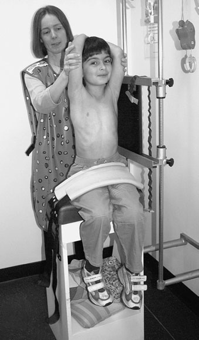
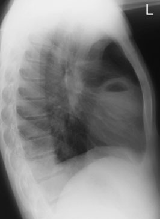
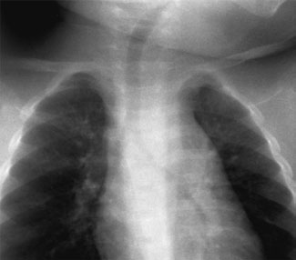
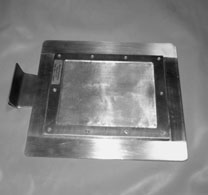

# Rx torace pediatric (post-neonatal) profil (lateral)

  📷 Radiografie Convențională (Rx)
  <strong>Actualizat:</strong> 2026-09-16
  <strong>Autor:</strong> Departamentul de Radiologie / Referință Clark (Ed. 12)

---

-   __1. Rezumat Clinic & Indicații__

    ---

    === "Indicații Clinice"

        - 397 14 Torace – post-neonatal Profil (lateral) Această incidență suplimentară se efectuează pentru localizarea poziției unui corp străin radiopac inhalat sau înghițit, pentru evaluarea unei patologii a lobului mijlociu sau pentru localizarea opacităților evidențiate pe incidența postero-anterioară (PA)/antero-posterioară (AP). Se selectează o casetă de 24 × 30 cm.

    === "Ghid Național IRIS"

        !!! info "Referință Primară: Ghidul Național IRIS (Ordinul MS 1342/2012)"
            - **Capitol Ghid IRIS:** *Pediatrie — Torace, pulmon, cord*
            - **Grad de Recomandare:** **Grad A**
            - **Nivel de Iradiere Estimată:** `Clasa 1 (Minimă < 0.02 mSv)`

            [:octicons-search-16: Deschide Ghidul IRIS](../../iris.md){ .md-button .md-button--primary } [:material-open-in-new: Aplicația Oficială PWA](https://radiologie-pediatrica.ro/iris/){ .md-button target="_blank" rel="noopener" }

-   __2. Poziționare & Centrare Fascicul__

    ---

    - **Poziție Pacient:**
        - Pacientul este întors pentru a aduce partea investigată spre casetă. Planul mediosagital este ajustat paralel cu caseta.
        - Brațele întinse sunt ridicate deasupra capului și sprijinite.
        - Linia medioaxilară coincide cu mijlocul casetei, iar caseta este ajustată pentru a include vârfurile pulmonare (apexurile) și lobii inferiori.
    - **Punct de Centrare Fascicul:**
        - Direcționați raza centrală verticală perpendicular pe mijlocul casetei, în linia medioaxilară.
        - Expunerea se efectuează la inspir maxim.
    - **Distanță Focar-Film (DFF / SID):** 100 cm
    - **Comandă Respiratorie:** Expunerea se efectuează la inspir maxim

-   __3. Parametri Tehnici Expunere__

    ---

    | Parametru Tehnic | Valoare Configurare Generator / Tub |
    |:-----------------|:-------------------------------------|
    | **Tensiune Tub (kV)** | 125-140 kV |
    | **Sarcină / Produs Curent-Timp (mAs)** | Conform AEC / grosimii anatomice |
    | **Distanță Focar-Film (DFF / SID)** | 100 cm |
    | **Grilă Antidifuzoare (Bucky)** | Conform grosimii anatomice (> 10-12 cm cu grilă) |
    | **Dimensiune Focar** | Focar Mic (0.6 mm) |
    | **Camere de Ionizare AEC** | DE CONFIGURAT PE APARAT |
    | **Colimare Fascicul** | Colimare strictă adaptată pe receptor 24 x 30 cm |
    | **Filtrare Tub** | Totală ≥ 2.5 mm Al echivalent (conform Clark: 3.0 mm Al echivalent) |

-   __4. Criterii de Calitate & Reușită Imagine__

    ---

    - Inspir maxim (șase coaste anterioare deasupra cupolelor diafragmatice).
    - Toracele în întregime, de la C7 la L1.
    - Sternul și coloana vertebrală trebuie incluse și trebuie să fie în profil adevărat (lateral).
    - Vizualizarea întregii trahee și a bronhiilor principale.
    - Reproducerea vizuală clară a contururilor ambelor cupole diafragmatice în întregime.
    - Reproducerea vaselor hilare.
    - Reproducerea sternului și a coloanei vertebrale toracice. Dispozitivul cu filtru Cincinnati. Utilizarea acestui dispozitiv cu filtru se face în cazurile de suspiciune de corp străin radiopac inhalat, când imaginea antero-posterioară (AP) a toracelui este obținută cu copilul în decubit dorsal. Filtrul Cincinnati este alcătuit din 2 mm de aluminiu, 0,5 mm de cupru și 0,4 mm de staniu, introduse în cutia colimatorului astfel încât stratul de cupru să fie orientat spre tubul de raze X. Expunerile utilizate sunt în intervalul 125–140 kVp și 10–16 mAs, folosind un sistem cu casetă și grilă. Pe radiografia expusă, detaliul osos este estompat într-o măsură considerabilă, permițând vizualizarea părților moi și a interfețelor aerice din mediastin și din plămânul adiacent. Traheea și anatomia bronșică proximală sunt bine evidențiate. Scanograma de recunoaștere CT poate fi considerată o alternativă. Manipularea atentă este întotdeauna recomandată la copiii suspectați că au inhalat un corp străin radiopac, deoarece dislocarea acestuia poate duce la obstrucția totală a căilor respiratorii. R L Poziția copilului pentru incidența de profil (lateral) a toracelui. Radiografie toracică de profil (lateral) evidențiind abces pulmonar și niveluri hidroaerice. Dispozitiv cu filtru Cincinnati. Imagine conizată antero-posterioară (AP) a toracelui cu filtru Cincinnati, pentru evidențierea traheei și a bronhiilor proximale.

-   __5. Protecție Radiologică (ALARA)__

    ---

    - Ecranare gonadică cu șorț plumbat dacă gonadele sunt în apropierea fasciculului util (regula ALARA).
    - Colimare precisă la dimensiunea anatomică strict necesară pentru reducerea dozei și a radiației difuze.
    - Verificarea posibilității unei sarcini la pacientele de vârstă fertilă înainte de expunere.

!!! note "Observații Clinice & Tehnice"
    Pregătirea pacientului prin îndepărtarea tuturor accesoriilor radio-opace.

### 🖼️ Imagini

<figure class="protocol-image-card" markdown>

<figcaption><strong>Pe radiografia expusă, detaliul osos este estompat într-o măsură considerabilă</strong> — Poziționarea pacientului și centrarea fasciculului conform Clark (Ed. 12)</figcaption>

</figure>

<figure class="protocol-image-card" markdown>

<figcaption><strong>Radiografie toracică de profil (lateral) evidențiind abces pulmonar și niveluri hidroaerice</strong> — Aspect radiografic / ghid de poziționare conform tratatului Clark (Ed. 12)</figcaption>

</figure>

<figure class="protocol-image-card" markdown>

<figcaption><strong>Figura 3: Aspect radiografic / Poziționare (Clark Ed. 12)</strong> — Aspect radiografic / ghid de poziționare conform tratatului Clark (Ed. 12)</figcaption>

</figure>

<figure class="protocol-image-card" markdown>

<figcaption><strong>Figura 4: Aspect radiografic / Poziționare (Clark Ed. 12)</strong> — Aspect radiografic / ghid de poziționare conform tratatului Clark (Ed. 12)</figcaption>

</figure>

=== "Ghid Rapid de Execuție"

    1. **Identificarea și verificarea pacientului:** verificare identitate, zonă de examinat, consimțământ conform procedurii și evaluarea posibilității unei sarcini, când este relevantă.
    2. **Pregătire:** îndepărtarea oricăror obiecte radiopace (bijuterii, agrafe, fermoare, proteze, pansamente dense).
    3. **Poziționare precisă:** alinierea receptorului de imagine și a tubului la distanța prescrisă (100 cm).
    4. **Colimare strictă:** adaptarea fasciculului strict la regiunea de diagnostic pentru scăderea iradierii și reducerea radiației difuze.
    5. **Radioprotecție:** verificarea [politicii RX](../radioprotectie.md), cu măsuri distincte pentru pacient, personal și însoțitor.

## Surse de documentare

- [Clark's Positioning in Radiography (Ed. 12), Pagina 412](https://books.google.com/books/about/Clark_s_Positioning_in_Radiography.html?id=Xxu6MwEACAAJ)
