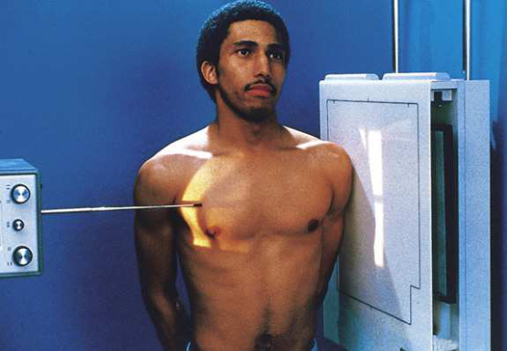
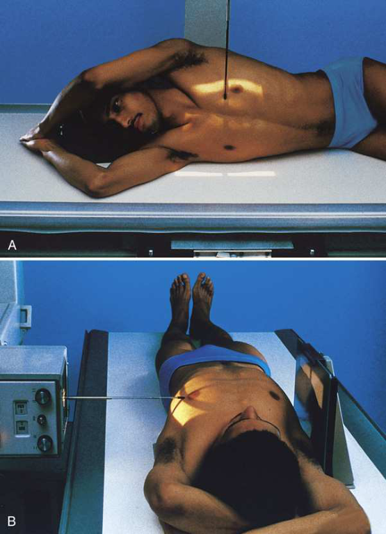

# Rx Grilaj Costal și Stern — Incidență de Profil (Lateral) — Profil (Drept sau Stâng) (Merrill)

  📷 Radiografie Convențională (Rx)
  <strong>Actualizat:</strong> 2026-09-16
  <strong>Autor:</strong> Referință Merrill

---

-   __1. Rezumat Clinic & Indicații__

    ---

    === "Indicații Clinice"

        - Conform reperelor anatomice standard din tratat

    === "Ghid Național IRIS"

        !!! info "Referință Primară: Ghidul Național IRIS (Ordinul MS 1342/2012)"
            - **Capitol Ghid IRIS:** *Ghidul Național IRIS*
            - **Grad de Recomandare:** **De verificat pe indicație; fără grad atribuit automat**
            - **Nivel de Iradiere Estimată:** `De verificat pentru examinarea și populația selectate`

            [:octicons-search-16: Deschide Ghidul IRIS](../../iris.md){ .md-button .md-button--primary } [:material-open-in-new: Aplicația Oficială PWA](https://radiologie-pediatrica.ro/iris/){ .md-button target="_blank" rel="noopener" }
-   __2. Poziționare & Centrare Fascicul__

    ---

    - **Poziție Pacient:** se așază pacientul în Incidență de Profil (lateral), either în ortostatism (Poziție Șezândă sau în ortostatism) sau Decubit. Incidență Decubit dorsal poate fie necessary due la pacientul’s condition.; se centrează Stern la linia mediană grilă. în ortostatism se ajustează pacient în true Incidență de Profil (lateral) astfel încât broad surface de Stern este perpendicular pe plane de receptorul de imagine (Fig. 10.19). se rotește umeri posteriorly, și Se instruiește pacientul să lock mâinile behind back. Being careful la keep MSP de corp vertical, și se poziționează pacientul close enough la grila that Umăr poate fie rested firmly against it. Large breasts pe female pacienți trebuie să fie drawn la sides și held în poziție cu wide bandage so that their shadows do nu obscure lower portion de Stern. Decubit se extinde pacient’s brațe over capul la prevent them de la overlapping Stern (Fig. 10.20). se sprijină pacientul’s cap pe brațele sau pe pillow. Place support under lower thoracic region la poziție axa longitudinală de Stern horizontally. se efectuează ecranarea gonadelor cu șorț plumbat.
    - **Punct de Centrare Fascicul:** perpendicular pe centrul receptorului de imagine și entering lateral margine de midsternum
    - **Distanță Focar-Film (DFF / SID):** 72-inch (183-cm) SID to reduce magnification and distortion of the Stern.
    - **Comandă Respiratorie:** apnee (oprirea respirației) deep inspiration. This provides sharper contrast între posterior surface de Stern și adjacent structures.

-   __3. Parametri Tehnici Expunere__

    ---

    | Parametru Tehnic | Valoare Configurare Generator / Tub |
    |:-----------------|:-------------------------------------|
    | **Tensiune Tub (kV)** | DE CONFIGURAT PE APARAT |
    | **Sarcină / Produs Curent-Timp (mAs)** | DE CONFIGURAT PE APARAT |
    | **Distanță Focar-Film (DFF / SID)** | 72-inch (183-cm) SID to reduce magnification and distortion of the Stern. |
    | **Grilă Antidifuzoare (Bucky)** | DE CONFIGURAT PE APARAT |
    | **Dimensiune Focar** | DE CONFIGURAT PE APARAT |
    | **Camere de Ionizare AEC** | DE CONFIGURAT PE APARAT |
    | **Colimare Fascicul** | Se ajustează câmpul de iradiere la formatul 24 × 30 cm pe colimator. Se plasează markerul de lateralitate în câmpul colimat. |
    | **Filtrare Tub** | DE CONFIGURAT PE APARAT |

-   __4. Criterii de Calitate & Reușită Imagine__

    ---

    - Criterii radiologice de calitate imaginii:
    - Colimare adecvată vizibilă și prezența markerului de lateralitate (D/S) plasat clear de anatomy de interest
    - Stern în its entirety
    - manubriu sternal liber de superimposition prin părți moi de umerii
    - Stern liber de superimposition prin Coaste (Grilaj Costal)
    - Lower portion de Stern unobscured prin breasts de female pacient
    - Bony detalii trabeculare osoase și surrounding soft tissues

-   __5. Protecție Radiologică (ALARA)__

    ---

    - Nespecificat în fragmentul extras; de verificat în sursă

!!! note "Observații Clinice & Tehnice"
    Conform reperelor anatomice standard din tratat

### 🖼️ Imagini

<figure class="protocol-image-card" markdown>

<figcaption><strong>Merrill — pagina PDF 803, imaginea 1</strong> — Imagine din fragmentul sursă; asocierea necesită revizie.</figcaption>

</figure>

<figure class="protocol-image-card" markdown>

<figcaption><strong>Merrill — pagina PDF 804, imaginea 2</strong> — Imagine din fragmentul sursă; asocierea necesită revizie.</figcaption>

</figure>

=== "Ghid Rapid de Execuție"

    1. **Identificarea și verificarea pacientului:** verificare identitate, zonă de examinat, consimțământ conform procedurii și evaluarea posibilității unei sarcini, când este relevantă.
    2. **Pregătire:** îndepărtarea oricăror obiecte radiopace (bijuterii, agrafe, fermoare, proteze, pansamente dense).
    3. **Poziționare precisă:** alinierea receptorului de imagine și a tubului la distanța prescrisă (72-inch (183-cm) SID to reduce magnification and distortion of the Stern.).
    4. **Colimare strictă:** adaptarea fasciculului strict la regiunea de diagnostic pentru scăderea iradierii și reducerea radiației difuze.
    5. **Radioprotecție:** verificarea [politicii RX](../radioprotectie.md), cu măsuri distincte pentru pacient, personal și însoțitor.

## Surse de documentare

- [Merrill’s Atlas, 10. Bony Thorax, pagini PDF 802–804](../../assets/protocols/sources/a56d45c16829_Merrills_Atlas_of_Radiographic_Positioning__Procedures_3Vol_Set.pdf#page=802)

## Fragmente sursă traduse (referință tehnică)

### anatomy

lateral imagine de entire length de sternum shows superimposed articulații sternoclaviculare și medial ends de clavicles (Fig. 10.21).

### collimation

• Se ajustează câmpul de iradiere la formatul 24 × 30 cm pe colimator. Se plasează markerul de lateralitate în câmpul colimat.

### cr

• perpendicular pe centrul receptorului de imagine și entering lateral margine de midsternum

### criteria

Criterii radiologice de calitate imaginii:
• Colimare adecvată vizibilă și prezența markerului de lateralitate (D/S) plasat clear de anatomy de interest
• Sternum în its entirety
• manubriu sternal liber de superimposition prin părți moi de umerii
• Sternum liber de superimposition prin coaste
• Lower portion de sternum unobscured prin breasts de female pacient
• Bony detalii trabeculare osoase și surrounding soft tissues

### part_pos

• se centrează sternum la linia mediană grilă.
în ortostatism
• se ajustează pacient în true poziție de profil (lateral) astfel încât broad surface de sternum este perpendicular pe plane de receptorul de imagine (Fig. 10.19).
• se rotește umeri posteriorly, și Se instruiește pacientul să lock mâinile behind back.
• Being careful la keep MSP de corp vertical, și se poziționează pacientul close enough la grila that umăr poate fie rested firmly
against it.
• Large breasts pe female pacienți trebuie să fie drawn la sides și held în poziție cu wide bandage so that their shadows do nu
obscure lower portion de sternum.
Recumbent
• se extinde pacient’s brațe over capul la prevent them de la overlapping sternum (Fig. 10.20).
• se sprijină pacientul’s cap pe brațele sau pe pillow.
• Place support under lower thoracic region la poziție axa longitudinală de sternum horizontally.
• se efectuează ecranarea gonadelor cu șorț plumbat.

### patient_pos

• se așază pacientul în poziție de profil (lateral), either în ortostatism (așezat pe scaun sau în ortostatism) sau recumbent. dorsal decubit poziție poate fie necessary
due la pacientul’s condition.

### respiration

apnee (oprirea respirației) deep inspiration. This provides sharper contrast între posterior surface de sternum și adjacent
structures.

### sid

72-inch (183-cm) SID la reduce magnification și distortion de sternum.

### tech

poziționat prin manufacturer sau department protocol pentru corect anatomy display orientation; raza centrală plate: 10 × 12 inches (24 ×
30 cm) longitudinal.

