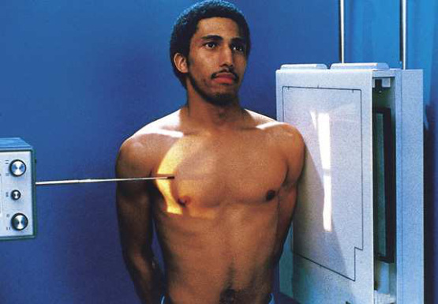
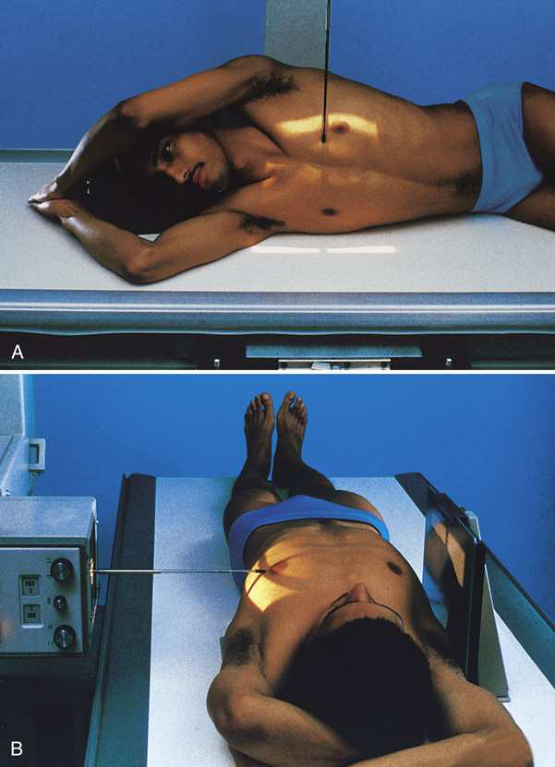

# Rx Grilaj costal și stern — Incidență de profil (lateral) — Profil (drept sau stâng) (Merrill)

  📷 Radiografie Convențională (Rx)
  <strong>Actualizat:</strong> 2026-09-16
  <strong>Autor:</strong> Referință Merrill

---

-   __1. Rezumat Clinic & Indicații__

    ---

    === "Indicații Clinice"

        - Conform reperelor anatomice standard din tratat

    === "Ghid Național IRIS"

        !!! info "Referință Primară: Ghidul Național IRIS (Ordinul MS 1342/2012)"
            - **Capitol Ghid IRIS:** *Torace & Pulmon*
            - **Grad de Recomandare:** **Grad A**
            - **Nivel de Iradiere Estimată:** `Clasa 1 (Minimă < 0.1 mSv)`

            [:octicons-search-16: Deschide Ghidul IRIS](../../iris.md){ .md-button .md-button--primary } [:material-open-in-new: Aplicația Oficială PWA](https://radiologie-pediatrica.ro/iris/){ .md-button target="_blank" rel="noopener" }

-   __2. Poziționare & Centrare Fascicul__

    ---

    - **Poziție Pacient:** se așază pacientul în incidență de profil (lateral), fie în ortostatism (poziție șezândă sau în ortostatism), fie în decubit. Incidența în decubit dorsal poate fi necesară din cauza stării pacientului.; se centrează sternul la linia mediană a grilei. În ortostatism, se ajustează pacientul în adevărată incidență de profil (lateral), astfel încât suprafața largă a sternului să fie perpendiculară pe planul receptorului de imagine (Fig. 10.19). Se rotesc umerii posterior și se instruiește pacientul să-și țină mâinile în spatele spatelui. Având grijă să se mențină MSP al corpului vertical, se poziționează pacientul suficient de aproape de grilă pentru ca umărul să poată fi sprijinit ferm pe aceasta. Sânii voluminoși ai pacientelor trebuie trași lateral și menținuți în poziție cu un bandaj lat, astfel încât umbrele lor să nu ascundă porțiunea inferioară a sternului. În decubit, pacientul își întinde brațele deasupra capului pentru a preveni suprapunerea acestora peste stern (Fig. 10.20). Se sprijină capul pacientului pe brațe sau pe o pernă. Se plasează un suport sub regiunea toracică inferioară pentru a poziționa orizontal axa longitudinală a sternului. Se efectuează ecranarea gonadelor cu șorț plumbat.
    - **Punct de Centrare Fascicul:** Perpendicular pe centrul receptorului de imagine și intrând la marginea laterală a mezosternului
    - **Distanță Focar-Film (DFF / SID):** SID de 72 inci (183 cm), pentru a reduce magnificarea și distorsiunea sternului.
    - **Comandă Respiratorie:** Apnee (oprirea respirației) la inspir profund. Aceasta oferă un contrast mai clar între suprafața posterioară a sternului și structurile adiacente.

-   __3. Parametri Tehnici Expunere__

    ---

    | Parametru Tehnic | Valoare Configurare Generator / Tub |
    |:-----------------|:-------------------------------------|
    | **Tensiune Tub (kV)** | DE CONFIGURAT PE APARAT |
    | **Sarcină / Produs Curent-Timp (mAs)** | DE CONFIGURAT PE APARAT |
    | **Distanță Focar-Film (DFF / SID)** | SID de 72 inci (183 cm), pentru a reduce magnificarea și distorsiunea sternului. |
    | **Grilă Antidifuzoare (Bucky)** | DE CONFIGURAT PE APARAT |
    | **Dimensiune Focar** | DE CONFIGURAT PE APARAT |
    | **Camere de Ionizare AEC** | DE CONFIGURAT PE APARAT |
    | **Colimare Fascicul** | Se ajustează câmpul de iradiere la formatul 24 × 30 cm pe colimator. Se plasează markerul de lateralitate în câmpul colimat. |
    | **Filtrare Tub** | DE CONFIGURAT PE APARAT |

-   __4. Criterii de Calitate & Reușită Imagine__

    ---

    - Criterii radiologice de calitate a imaginii:
    - Colimare adecvată vizibilă și prezența markerului de lateralitate (D/S) plasat în afara structurilor anatomice de interes
    - Sternul în întregime
    - Manubriul sternal liber de suprapunerea părților moi ale umerilor
    - Sternul liber de suprapunerea coastelor (grilajului costal)
    - Porțiunea inferioară a sternului neacoperită de sânii pacientei
    - Detalii trabeculare osoase și țesuturile moi înconjurătoare

-   __5. Protecție Radiologică (ALARA)__

    ---

    - Nespecificat în fragmentul extras; de verificat în sursă

!!! note "Observații Clinice & Tehnice"
    Conform reperelor anatomice standard din tratat

### 🖼️ Imagini

<figure class="protocol-image-card" markdown>

<figcaption><strong>Merrill — pagina 803, imaginea 1</strong> — Imagine din fragmentul sursă; asocierea necesită revizie.</figcaption>

</figure>

<figure class="protocol-image-card" markdown>

<figcaption><strong>Merrill — pagina 804, imaginea 2</strong> — Imagine din fragmentul sursă; asocierea necesită revizie.</figcaption>

</figure>

=== "Ghid Rapid de Execuție"

    1. **Identificarea și verificarea pacientului:** verificare identitate, zonă de examinat, consimțământ conform procedurii și evaluarea posibilității unei sarcini, când este relevantă.
    2. **Pregătire:** îndepărtarea oricăror obiecte radiopace (bijuterii, agrafe, fermoare, proteze, pansamente dense).
    3. **Poziționare precisă:** alinierea receptorului de imagine și a tubului la distanța prescrisă (SID de 72 inci (183 cm), pentru a reduce magnificarea și distorsiunea sternului.).
    4. **Colimare strictă:** adaptarea fasciculului strict la regiunea de diagnostic pentru scăderea iradierii și reducerea radiației difuze.
    5. **Radioprotecție:** verificarea [politicii RX](../radioprotectie.md), cu măsuri distincte pentru pacient, personal și însoțitor.

## Surse de documentare

- [Merrill’s Atlas, 10. Bony Thorax, pagini 802–804](https://books.google.com/books/about/Merrill_s_Atlas_of_Radiographic_Position.html?id=BM0lEQAAQBAJ)
