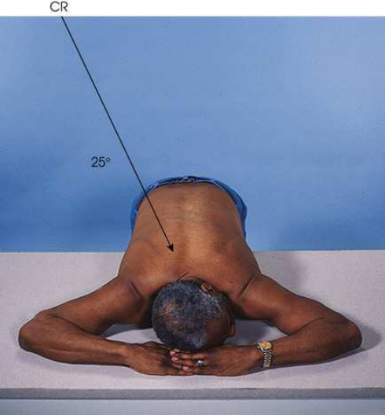
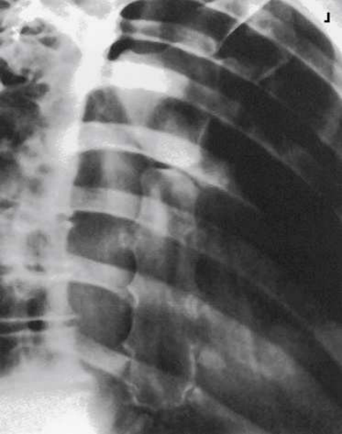

# Rx Grilaj Costal și Stern — Oblică Postero-Anterioară (PA) — Metoda Moore Modificată Decubit Ventral Poziționare (Merrill)

  📷 Radiografie Convențională (Rx)
  <strong>Actualizat:</strong> 2026-09-16
  <strong>Autor:</strong> Referință Merrill

---

-   __1. Rezumat Clinic & Indicații__

    ---

    === "Indicații Clinice"

        - Conform reperelor anatomice standard din tratat

    === "Ghid Național IRIS"

        !!! info "Referință Primară: Ghidul Național IRIS (Ordinul MS 1342/2012)"
            - **Capitol Ghid IRIS:** *Ghidul Național IRIS*
            - **Grad de Recomandare:** **De verificat pe indicație; fără grad atribuit automat**
            - **Nivel de Iradiere Estimată:** `De verificat pentru examinarea și populația selectate`

            [:octicons-search-16: Deschide Ghidul IRIS](../../iris.md){ .md-button .md-button--primary } [:material-open-in-new: Aplicația Oficială PWA](https://radiologie-pediatrica.ro/iris/){ .md-button target="_blank" rel="noopener" }
-   __2. Poziționare & Centrare Fascicul__

    ---

    - **Poziție Pacient:** Before positioning pacientul, place receptorul de imagine transversal în tăvița Bucky. Place x-ray tube la a 30-inch (76-cm) SID, angle it 25 grade, și se orientează raza centrală centrală la center de receptorul de imagine. x-ray tube este poziționat over pacientul’s drept side. Place marker pe tabletop near pacientul’s cap la indicate exact center de receptorul de imagine. Se instruiește pacientul să stand la side de masa radiologică directly în front de tăvița Bucky. Se instruiește pacientul să bend la waist, și place Stern în center de masa de examinare directly over previously poziționat receptorul de imagine.; se poziționează pacientul’s brațe above umerii și palms down pe masa de examinare. brațele act ca support pentru side de capul (Fig. 10.17). Ensure that pacientul este în true Decubit ventral poziție și that midsternal area este la center de masa radiologică. se efectuează ecranarea gonadelor cu șorț plumbat.
    - **Punct de Centrare Fascicul:** raza centrală este already înclinat 25 grade și centrat pe receptorul de imagine. If pacient positioning este precis, raza centrală enters la nivelul T7 și approximately 2 inches (5 cm) la drept de coloană vertebrală. This angulation places Stern over lung la maintain maximum contrast de Stern. x-ray tube angulation poate fie ajustat pentru extremely large sau small pacienți. Large pacienți require less angulation și thin pacienți require more angulation than standard 25-grade angle.
    - **Distanță Focar-Film (DFF / SID):** A 30-inch (76-cm) SID is recommended. This short distance assists in blurring the posterior Coaste (Grilaj Costal). Radiography of the Stern can be diВcult to perform on an Pacient Mobil / Cooperant (Ortostatism) who is having acute pain. The alternative positioning method described by Moore 1 uses a modified Decubit Ventral position, which makes it possible to produce a high-quality Stern image in a more comfortable manner for the patient.
    - **Comandă Respiratorie:** shallow Tehnică de estompare prin respirație superficială (respirație technique) produces best results. Se instruiește pacientul să take slow, shallow breaths during expunere. low mA setting și expunere time de 1 la 3 seconds sunt recommended. When low mA setting și long expunere time cannot fie employed, Se instruiește pacientul să Apnee pe durata expunerii la end de expiration la minimize visibility de pulmonary vasculature.

-   __3. Parametri Tehnici Expunere__

    ---

    | Parametru Tehnic | Valoare Configurare Generator / Tub |
    |:-----------------|:-------------------------------------|
    | **Tensiune Tub (kV)** | DE CONFIGURAT PE APARAT |
    | **Sarcină / Produs Curent-Timp (mAs)** | DE CONFIGURAT PE APARAT |
    | **Distanță Focar-Film (DFF / SID)** | A 30-inch (76-cm) SID is recommended. This short distance assists in blurring the posterior Coaste (Grilaj Costal). Radiography of the Stern can be diВcult to perform on an Pacient Mobil / Cooperant (Ortostatism) who is having acute pain. The alternative positioning method described by Moore 1 uses a modified Decubit Ventral position, which makes it possible to produce a high-quality Stern image in a more comfortable manner for the patient. |
    | **Grilă Antidifuzoare (Bucky)** | DE CONFIGURAT PE APARAT |
    | **Dimensiune Focar** | DE CONFIGURAT PE APARAT |
    | **Camere de Ionizare AEC** | DE CONFIGURAT PE APARAT |
    | **Colimare Fascicul** | Se ajustează câmpul de iradiere la formatul 24 × 30 cm pe colimator. Se plasează markerul de lateralitate în câmpul colimat. |
    | **Filtrare Tub** | DE CONFIGURAT PE APARAT |

-   __4. Criterii de Calitate & Reușită Imagine__

    ---

    - Criterii radiologice de calitate imaginii:
    - Colimare adecvată vizibilă și prezența markerului de lateralitate (D/S) plasat clear de anatomy de interest
    - Entire Stern de la incizură jugulară (furculiță sternală) la tip de apendice xifoid
    - Stern projected liber de superimposition de la Coloană Toracală
    - Blurred pulmonary markings if Tehnică de estompare prin respirație superficială (respirație technique) was used
    - Blurred posterior Coaste (Grilaj Costal) if reduced SID was used
    - Bony detalii trabeculare osoase și surrounding soft tissues

-   __5. Protecție Radiologică (ALARA)__

    ---

    - Nespecificat în fragmentul extras; de verificat în sursă

!!! note "Observații Clinice & Tehnice"
    Conform reperelor anatomice standard din tratat

### 🖼️ Imagini

<figure class="protocol-image-card" markdown>

<figcaption><strong>Merrill — pagina PDF 801, imaginea 1</strong> — Imagine din fragmentul sursă; asocierea necesită revizie.</figcaption>

</figure>

<figure class="protocol-image-card" markdown>

<figcaption><strong>Merrill — pagina PDF 802, imaginea 2</strong> — Imagine din fragmentul sursă; asocierea necesită revizie.</figcaption>

</figure>

=== "Ghid Rapid de Execuție"

    1. **Identificarea și verificarea pacientului:** verificare identitate, zonă de examinat, consimțământ conform procedurii și evaluarea posibilității unei sarcini, când este relevantă.
    2. **Pregătire:** îndepărtarea oricăror obiecte radiopace (bijuterii, agrafe, fermoare, proteze, pansamente dense).
    3. **Poziționare precisă:** alinierea receptorului de imagine și a tubului la distanța prescrisă (A 30-inch (76-cm) SID is recommended. This short distance assists in blurring the posterior Coaste (Grilaj Costal). Radiography of the Stern can be diВcult to perform on an Pacient Mobil / Cooperant (Ortostatism) who is having acute pain. The alternative positioning method described by Moore 1 uses a modified Decubit Ventral position, which makes it possible to produce a high-quality Stern image in a more comfortable manner for the patient.).
    4. **Colimare strictă:** adaptarea fasciculului strict la regiunea de diagnostic pentru scăderea iradierii și reducerea radiației difuze.
    5. **Radioprotecție:** verificarea [politicii RX](../radioprotectie.md), cu măsuri distincte pentru pacient, personal și însoțitor.

## Surse de documentare

- [Merrill’s Atlas, 10. Bony Thorax, pagini PDF 800–802](../../assets/protocols/sources/a56d45c16829_Merrills_Atlas_of_Radiographic_Positioning__Procedures_3Vol_Set.pdf#page=800)

## Fragmente sursă traduse (referință tehnică)

### anatomy

slightly oblic incidență de sternum (Fig. 10.18). grade de detail vizualizat depends largely pe technique used. If respirație
technique este used, pulmonary markings sunt obliterated.

### collimation

• Se ajustează câmpul de iradiere la formatul 24 × 30 cm pe colimator. Se plasează markerul de lateralitate în câmpul colimat.

### cr

• raza centrală este already înclinat 25 grade și centrat pe receptorul de imagine. If pacient positioning este precis, raza centrală enters la nivelul T7 și
approximately 2 inches (5 cm) la drept de coloană vertebrală. This angulation places sternum over lung la maintain maximum
contrast de sternum.
• x-ray tube angulation poate fie ajustat pentru extremely large sau small pacienți. Large pacienți require less angulation și thin pacienți
require more angulation than standard 25-grade angle.

### criteria

Criterii radiologice de calitate imaginii:
• Colimare adecvată vizibilă și prezența markerului de lateralitate (D/S) plasat clear de anatomy de interest
• Entire sternum de la incizură jugulară (furculiță sternală) la tip de apendice xifoid
• Sternum projected liber de superimposition de la thoracic coloană vertebrală
• Blurred pulmonary markings if Tehnică de estompare prin respirație superficială (respirație technique) was used
• Blurred posterior coaste if reduced SID was used
• Bony detalii trabeculare osoase și surrounding soft tissues

### part_pos

• se poziționează pacientul’s brațe above umerii și palms down pe masa de examinare. brațele act ca support pentru side de capul (Fig.
10.17).
• Ensure that pacientul este în true decubit ventral și that midsternal area este la center de masa radiologică.
• se efectuează ecranarea gonadelor cu șorț plumbat.

### patient_pos

• Before positioning pacientul, place receptorul de imagine transversal în tăvița Bucky. Place x-ray tube la a 30-inch (76-cm) SID, angle it 25
grade, și se orientează raza centrală centrală la center de receptorul de imagine. x-ray tube este poziționat over pacientul’s drept side.
• Place marker pe tabletop near pacientul’s cap la indicate exact center de receptorul de imagine.
• Se instruiește pacientul să stand la side de masa radiologică directly în front de tăvița Bucky.
• Se instruiește pacientul să bend la waist, și place sternum în center de masa de examinare directly over previously poziționat receptorul de imagine.

### respiration

shallow Tehnică de estompare prin respirație superficială (respirație technique) produces best results. Se instruiește pacientul să take slow, shallow breaths during expunere. low mA setting și expunere time de 1 la 3 seconds sunt recommended. When low mA setting și long expunere time
cannot fie employed, Se instruiește pacientul să Apnee pe durata expunerii la end de expiration la minimize visibility de pulmonary
vasculature.

### sid

A 30-inch (76-cm) SID este recommended. This short distance assists în blurring posterior coaste.
radiografie de sternum poate fie dificult la perform pe ambulatory pacient who este having acute pain. alternative positioning
method described prin Moore 1 uses modified decubit ventral, which makes it possible la produce high-quality sternum imagine în more
comfortable manner pentru pacientul.

### tech

poziționat prin manufacturer sau department protocol pentru corect anatomy display orientation; raza centrală plate: 10 × 12 inches (24 ×
30 cm) longitudinal.

