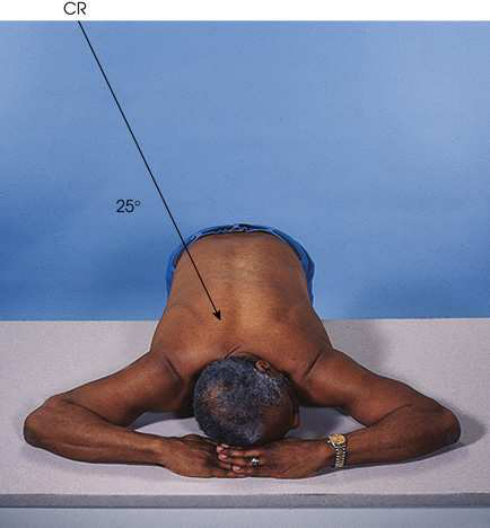
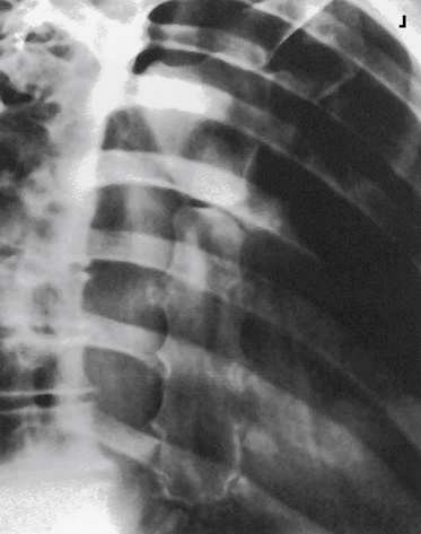

# Rx Grilaj costal și stern — Incidență oblică postero-anterioară (PA) — Metoda Moore modificată, poziționare în decubit ventral (Merrill)

  📷 Radiografie Convențională (Rx)
  <strong>Actualizat:</strong> 2026-09-16
  <strong>Autor:</strong> Referință Merrill

---

-   __1. Rezumat Clinic & Indicații__

    ---

    === "Indicații Clinice"

        - Conform reperelor anatomice standard din tratat

    === "Ghid Național IRIS"

        !!! info "Referință Primară: Ghidul Național IRIS (Ordinul MS 1342/2012)"
            - **Capitol Ghid IRIS:** *Torace & Pulmon*
            - **Grad de Recomandare:** **Grad A**
            - **Nivel de Iradiere Estimată:** `Clasa 1 (Minimă < 0.1 mSv)`

            [:octicons-search-16: Deschide Ghidul IRIS](../../iris.md){ .md-button .md-button--primary } [:material-open-in-new: Aplicația Oficială PWA](https://radiologie-pediatrica.ro/iris/){ .md-button target="_blank" rel="noopener" }

-   __2. Poziționare & Centrare Fascicul__

    ---

    - **Poziție Pacient:** Înainte de poziționarea pacientului, se plasează receptorul de imagine transversal în tăvița Bucky. Se plasează tubul radiogen la un SID de 30 țol (76-cm), se angulează la 25 grade și se orientează raza centrală către centrul receptorului de imagine. Tubul radiogen este poziționat deasupra părții drepte a pacientului. Se plasează markerul pe masa radiologică, lângă capul pacientului, pentru a indica centrul exact al receptorului de imagine. Se instruiește pacientul să stea lângă masa radiologică, direct în fața tăviței Bucky. Se instruiește pacientul să se aplece din talie și să plaseze sternul în centrul mesei de examinare, direct deasupra receptorului de imagine poziționat anterior.; se poziționează brațele pacientului deasupra umerilor, cu palmele în jos pe masa de examinare. Brațele servesc drept sprijin pentru părțile laterale ale capului (Fig. 10.17). Se verifică dacă pacientul se află în adevărat decubit ventral și dacă regiunea midsternală se află în centrul mesei radiologice. Se efectuează ecranarea gonadelor cu șorț plumbat.
    - **Punct de Centrare Fascicul:** Raza centrală este deja înclinată la 25 grade și centrată pe receptorul de imagine. Dacă poziționarea pacientului este precisă, raza centrală intră la nivelul T7 și la aproximativ 2 țoli (5 cm) la dreapta coloanei vertebrale. Această angulație proiectează sternul peste plămân pentru a menține contrastul maxim al sternului. Angulația tubului radiogen poate fi ajustată pentru pacienți extrem de voluminoși sau foarte slabi. Pacienții voluminoși necesită o angulație mai mică, iar pacienții slabi necesită o angulație mai mare decât unghiul standard de 25 grade.
    - **Distanță Focar-Film (DFF / SID):** Se recomandă o SID de 30 inci (76 cm). Această distanță scurtă contribuie la estomparea coastelor posterioare (grilajul costal). Radiografia sternului poate fi dificil de efectuat la un pacient mobil / cooperant (în ortostatism) care prezintă durere acută. Metoda alternativă de poziționare descrisă de Moore 1 utilizează o poziție modificată de decubit ventral, care permite obținerea unei imagini de înaltă calitate a sternului într-un mod mai confortabil pentru pacient.
    - **Comandă Respiratorie:** Tehnica de estompare prin respirație superficială oferă cele mai bune rezultate. Se instruiește pacientul să respire lent și superficial în timpul expunerii. Se recomandă o setare mA redusă și un timp de expunere de 1 la 3 secunde. Când nu pot fi utilizate o setare mA redusă și un timp de expunere lung, se instruiește pacientul să țină apnee pe durata expunerii, la sfârșitul expirului, pentru a minimiza vizibilitatea vascularizației pulmonare.

-   __3. Parametri Tehnici Expunere__

    ---

    | Parametru Tehnic | Valoare Configurare Generator / Tub |
    |:-----------------|:-------------------------------------|
    | **Tensiune Tub (kV)** | DE CONFIGURAT PE APARAT |
    | **Sarcină / Produs Curent-Timp (mAs)** | DE CONFIGURAT PE APARAT |
    | **Distanță Focar-Film (DFF / SID)** | Se recomandă o SID de 30 inci (76 cm). Această distanță scurtă contribuie la estomparea coastelor posterioare (grilajul costal). Radiografia sternului poate fi dificil de efectuat la un pacient mobil / cooperant (în ortostatism) care prezintă durere acută. Metoda alternativă de poziționare descrisă de Moore 1 utilizează o poziție modificată de decubit ventral, care permite obținerea unei imagini de înaltă calitate a sternului într-un mod mai confortabil pentru pacient. |
    | **Grilă Antidifuzoare (Bucky)** | DE CONFIGURAT PE APARAT |
    | **Dimensiune Focar** | DE CONFIGURAT PE APARAT |
    | **Camere de Ionizare AEC** | DE CONFIGURAT PE APARAT |
    | **Colimare Fascicul** | Se ajustează câmpul de iradiere la formatul 24 × 30 cm pe colimator. Se plasează markerul de lateralitate în câmpul colimat. |
    | **Filtrare Tub** | DE CONFIGURAT PE APARAT |

-   __4. Criterii de Calitate & Reușită Imagine__

    ---

    - Criterii radiologice de calitate a imaginii:
    - Colimare adecvată vizibilă și prezența markerului de lateralitate (D/S) plasat în afara structurilor anatomice de interes
    - Sternul în întregime, de la incizura jugulară (furculița sternală) până la vârful apendicelui xifoid
    - Sternul proiectat liber de suprapunerea coloanei toracice
    - Desen pulmonar estompat dacă s-a utilizat tehnica de estompare prin respirație superficială
    - Coaste posterioare estompate dacă s-a utilizat un SID redus
    - Detalii trabeculare osoase și țesuturile moi înconjurătoare

-   __5. Protecție Radiologică (ALARA)__

    ---

    - Nespecificat în fragmentul extras; de verificat în sursă

!!! note "Observații Clinice & Tehnice"
    Conform reperelor anatomice standard din tratat

### 🖼️ Imagini

<figure class="protocol-image-card" markdown>

<figcaption><strong>Merrill — pagina 801, imaginea 1</strong> — Imagine din fragmentul sursă; asocierea necesită revizie.</figcaption>

</figure>

<figure class="protocol-image-card" markdown>

<figcaption><strong>Merrill — pagina 802, imaginea 2</strong> — Imagine din fragmentul sursă; asocierea necesită revizie.</figcaption>

</figure>

=== "Ghid Rapid de Execuție"

    1. **Identificarea și verificarea pacientului:** verificare identitate, zonă de examinat, consimțământ conform procedurii și evaluarea posibilității unei sarcini, când este relevantă.
    2. **Pregătire:** îndepărtarea oricăror obiecte radiopace (bijuterii, agrafe, fermoare, proteze, pansamente dense).
    3. **Poziționare precisă:** alinierea receptorului de imagine și a tubului la distanța prescrisă (Se recomandă o SID de 30 inci (76 cm). Această distanță scurtă contribuie la estomparea coastelor posterioare (grilajul costal). Radiografia sternului poate fi dificil de efectuat la un pacient mobil / cooperant (în ortostatism) care prezintă durere acută. Metoda alternativă de poziționare descrisă de Moore 1 utilizează o poziție modificată de decubit ventral, care permite obținerea unei imagini de înaltă calitate a sternului într-un mod mai confortabil pentru pacient.).
    4. **Colimare strictă:** adaptarea fasciculului strict la regiunea de diagnostic pentru scăderea iradierii și reducerea radiației difuze.
    5. **Radioprotecție:** verificarea [politicii RX](../radioprotectie.md), cu măsuri distincte pentru pacient, personal și însoțitor.

## Surse de documentare

- [Merrill’s Atlas, 10. Bony Thorax, pagini 800–802](https://books.google.com/books/about/Merrill_s_Atlas_of_Radiographic_Position.html?id=BM0lEQAAQBAJ)
