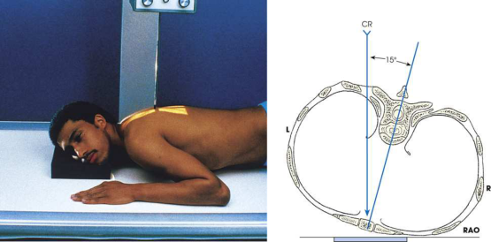
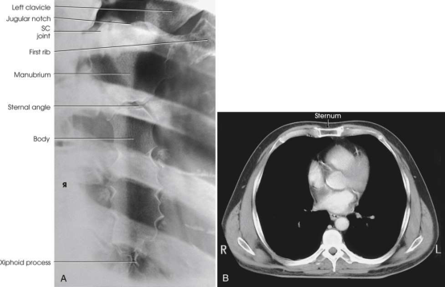

# Rx Grilaj Costal și Stern — Oblică Postero-Anterioară (PA) — Oblică Anterioară Dreaptă (OAD / RAO) (Merrill)

  📷 Radiografie Convențională (Rx)
  <strong>Actualizat:</strong> 2026-09-16
  <strong>Autor:</strong> Referință Merrill

---

-   __1. Rezumat Clinic & Indicații__

    ---

    === "Indicații Clinice"

        - Conform reperelor anatomice standard din tratat

    === "Ghid Național IRIS"

        !!! info "Referință Primară: Ghidul Național IRIS (Ordinul MS 1342/2012)"
            - **Capitol Ghid IRIS:** *Ghidul Național IRIS*
            - **Grad de Recomandare:** **De verificat pe indicație; fără grad atribuit automat**
            - **Nivel de Iradiere Estimată:** `De verificat pentru examinarea și populația selectate`

            [:octicons-search-16: Deschide Ghidul IRIS](../../iris.md){ .md-button .md-button--primary } [:material-open-in-new: Aplicația Oficială PWA](https://radiologie-pediatrica.ro/iris/){ .md-button target="_blank" rel="noopener" }
-   __2. Poziționare & Centrare Fascicul__

    ---

    - **Poziție Pacient:** cu pacientul Decubit ventral sau în ortostatism facing receptorul de imagine, se ajustează corp into poziție oblică anterioară dreaptă (OAD / RAO) la use cordul pentru contrast ca previously described. Se instruiește pacientul să support corp pe Antebraț și flectat Genunchi, if Decubit.; se ajustează elevation de stâng Umăr și Șold astfel încât thorax este rotit just enough la prevent superimposition de vertebre și Stern. Estimate amount de rotație cu suficient accuracy prin placing one Mână pe pacientul’s Stern și other Mână pe coloană toracală la act ca guides while adjusting grade de obliquity. average rotație este approximately 15 la 20 grade (Fig. 10.15). se aliniază pacient’s corp astfel încât axa longitudinală de Stern este centrat pe linia mediană grilă. Place top de receptorul de imagine approximately 1½ inches (3.8 cm) above incizură jugulară (furculiță sternală). se efectuează ecranarea gonadelor cu șorț plumbat.
    - **Punct de Centrare Fascicul:** perpendicular pe receptorul de imagine. raza centrală enters ridicat side de posterior thorax la nivelul T7 și approximately 1 inch (2.5 cm) lateral la MSP.
    - **Distanță Focar-Film (DFF / SID):** A 30-inch (76-cm) SID is recommended to blur the posterior Coaste (Grilaj Costal). See p. 28, Chapter 1, for information on use of a 30-inch (76-cm) SID.
    - **Comandă Respiratorie:** When Tehnică de estompare prin respirație superficială (respirație technique) este la fie used, Se instruiește pacientul să take slow, shallow breaths during expunere. When short expunere time este la fie used, Se instruiește pacientul să apnee (oprirea respirației) respirație la end de expiration la minimize visibility de pulmonary vasculature.

-   __3. Parametri Tehnici Expunere__

    ---

    | Parametru Tehnic | Valoare Configurare Generator / Tub |
    |:-----------------|:-------------------------------------|
    | **Tensiune Tub (kV)** | DE CONFIGURAT PE APARAT |
    | **Sarcină / Produs Curent-Timp (mAs)** | DE CONFIGURAT PE APARAT |
    | **Distanță Focar-Film (DFF / SID)** | A 30-inch (76-cm) SID is recommended to blur the posterior Coaste (Grilaj Costal). See p. 28, Chapter 1, for information on use of a 30-inch (76-cm) SID. |
    | **Grilă Antidifuzoare (Bucky)** | DE CONFIGURAT PE APARAT |
    | **Dimensiune Focar** | DE CONFIGURAT PE APARAT |
    | **Camere de Ionizare AEC** | DE CONFIGURAT PE APARAT |
    | **Colimare Fascicul** | Se ajustează câmpul de iradiere la formatul 24 × 30 cm pe colimator. Se plasează markerul de lateralitate în câmpul colimat. |
    | **Filtrare Tub** | DE CONFIGURAT PE APARAT |

-   __4. Criterii de Calitate & Reușită Imagine__

    ---

    - Criterii radiologice de calitate imaginii:
    - Colimare adecvată vizibilă și prezența markerului de lateralitate (D/S) plasat clear de anatomy de interest
    - Entire Stern de la incizură jugulară (furculiță sternală) la tip de apendice xifoid
    - Stern projected over cordul, but liber de superimposition de la Coloană Toracală
    - Minimally rotit Stern și thorax, ca vizualizat prin following:
    - Stern projected just liber de superimposition de la coloană vertebrală
    - Minimally obliqued vertebre la prevent excessive rotație de Stern
    - lateral portion de manubriu sternal și articulații sternoclaviculare liber de superimposition prin vertebre
    - Blurred pulmonary markings, if Tehnică de estompare prin respirație superficială (respirație technique) was used
    - Bony detalii trabeculare osoase și surrounding soft tissues

-   __5. Protecție Radiologică (ALARA)__

    ---

    - Nespecificat în fragmentul extras; de verificat în sursă

!!! note "Observații Clinice & Tehnice"
    This poziție poate fie dificult la perform pe Traumatism / Regim Urgență pacienți. Use ortostatism if possible. pentru Traumatism / Regim Urgență pacienți who sunt Decubit și unable la lie Decubit ventral, obtain this incidență cu pacientul în stâng posterior oblic (LPO) poziție, resulting în AP Incidență Oblică.

### 🖼️ Imagini

<figure class="protocol-image-card" markdown>

<figcaption><strong>Merrill — pagina PDF 799, imaginea 1</strong> — Imagine din fragmentul sursă; asocierea necesită revizie.</figcaption>

</figure>

<figure class="protocol-image-card" markdown>

<figcaption><strong>Merrill — pagina PDF 800, imaginea 2</strong> — Imagine din fragmentul sursă; asocierea necesită revizie.</figcaption>

</figure>

=== "Ghid Rapid de Execuție"

    1. **Identificarea și verificarea pacientului:** verificare identitate, zonă de examinat, consimțământ conform procedurii și evaluarea posibilității unei sarcini, când este relevantă.
    2. **Pregătire:** îndepărtarea oricăror obiecte radiopace (bijuterii, agrafe, fermoare, proteze, pansamente dense).
    3. **Poziționare precisă:** alinierea receptorului de imagine și a tubului la distanța prescrisă (A 30-inch (76-cm) SID is recommended to blur the posterior Coaste (Grilaj Costal). See p. 28, Chapter 1, for information on use of a 30-inch (76-cm) SID.).
    4. **Colimare strictă:** adaptarea fasciculului strict la regiunea de diagnostic pentru scăderea iradierii și reducerea radiației difuze.
    5. **Radioprotecție:** verificarea [politicii RX](../radioprotectie.md), cu măsuri distincte pentru pacient, personal și însoțitor.

## Surse de documentare

- [Merrill’s Atlas, 10. Bony Thorax, pagini PDF 798–800](../../assets/protocols/sources/a56d45c16829_Merrills_Atlas_of_Radiographic_Positioning__Procedures_3Vol_Set.pdf#page=798)

## Fragmente sursă traduse (referință tehnică)

### anatomy

slightly oblic incidență de sternum (Fig. 10.16). detail depends largely pe technical procedure used. If Tehnică de estompare prin respirație superficială (respirație technique) este
used, pulmonary markings sunt obliterated.

### collimation

• Se ajustează câmpul de iradiere la formatul 24 × 30 cm pe colimator. Se plasează markerul de lateralitate în câmpul colimat.

### cr

• perpendicular pe receptorul de imagine. raza centrală enters ridicat side de posterior thorax la nivelul T7 și approximately 1 inch (2.5 cm) lateral
la MSP.

### criteria

Criterii radiologice de calitate imaginii:
• Colimare adecvată vizibilă și prezența markerului de lateralitate (D/S) plasat clear de anatomy de interest
• Entire sternum de la incizură jugulară (furculiță sternală) la tip de apendice xifoid
• Sternum projected over cordul, but liber de superimposition de la thoracic coloană vertebrală
• Minimally rotit sternum și thorax, ca vizualizat prin following:
• Sternum projected just liber de superimposition de la coloană vertebrală
• Minimally obliqued vertebre la prevent excessive rotație de sternum
• lateral portion de manubriu sternal și articulații sternoclaviculare liber de superimposition prin vertebre
• Blurred pulmonary markings, if Tehnică de estompare prin respirație superficială (respirație technique) was used
• Bony detalii trabeculare osoase și surrounding soft tissues

### notes

This poziție poate fie dificult la perform pe trauma pacienți. Use ortostatism if possible.
pentru trauma pacienți who sunt recumbent și unable la lie în decubit ventral, obtain this incidență cu pacientul în stâng posterior oblic
(LPO) poziție, resulting în AP oblic incidență.

### part_pos

• se ajustează elevation de stâng umăr și hip astfel încât thorax este rotit just enough la prevent superimposition de vertebre
și sternum.
• Estimate amount de rotație cu suficient accuracy prin placing one mână pe pacientul’s sternum și other mână pe coloană toracală la act ca guides while adjusting grade de obliquity. average rotație este approximately 15 la 20 grade (Fig.
10.15).
• se aliniază pacient’s corp astfel încât axa longitudinală de sternum este centrat pe linia mediană grilă.
• Place top de receptorul de imagine approximately 1½ inches (3.8 cm) above incizură jugulară (furculiță sternală).
• se efectuează ecranarea gonadelor cu șorț plumbat.

### patient_pos

• cu pacientul în decubit ventral sau în ortostatism facing receptorul de imagine, se ajustează corp into poziție oblică anterioară dreaptă (OAD / RAO) la use cordul pentru contrast ca previously
described.
• Se instruiește pacientul să support corp pe forearm și flectat genunchi, if recumbent.

### respiration

When Tehnică de estompare prin respirație superficială (respirație technique) este la fie used, Se instruiește pacientul să take slow, shallow breaths during expunere. When short expunere time este la fie used, Se instruiește pacientul să apnee (oprirea respirației) respirație la end de expiration la minimize visibility de pulmonary vasculature.

### sid

A 30-inch (76-cm) SID este recommended la blur posterior coaste. See p. 28, Chapter 1, pentru information pe use de a 30-inch (76-cm) SID.

### tech

poziționat prin manufacturer sau department protocol pentru corect anatomy display orientation; raza centrală plate: 10 × 12 inches (24 ×
30 cm) longitudinal.

