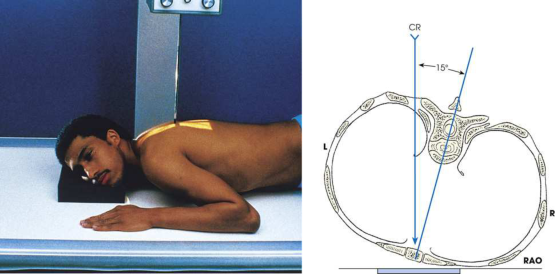
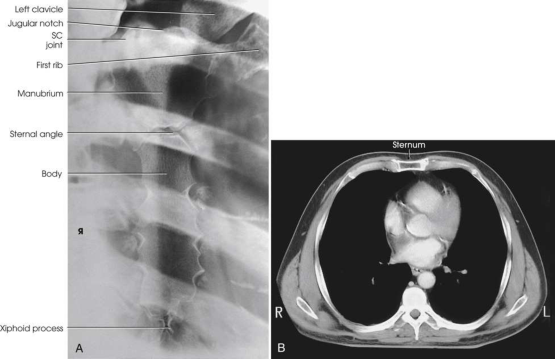

# Rx grilaj costal și stern — oblică postero-anterioară (PA) — oblică anterioară dreaptă (OAD / RAO) (Merrill)

  📷 Radiografie Convențională (Rx)
  <strong>Actualizat:</strong> 2026-09-16
  <strong>Autor:</strong> Referință Merrill

---

-   __1. Rezumat Clinic & Indicații__

    ---

    === "Indicații Clinice"

        - Conform reperelor anatomice standard din tratat

    === "Ghid Național IRIS"

        !!! info "Referință Primară: Ghidul Național IRIS (Ordinul MS 1342/2012)"
            - **Capitol Ghid IRIS:** *Torace & Pulmon*
            - **Grad de Recomandare:** **Grad A**
            - **Nivel de Iradiere Estimată:** `Clasa 1 (Minimă < 0.1 mSv)`

            [:octicons-search-16: Deschide Ghidul IRIS](../../iris.md){ .md-button .md-button--primary } [:material-open-in-new: Aplicația Oficială PWA](https://radiologie-pediatrica.ro/iris/){ .md-button target="_blank" rel="noopener" }

-   __2. Poziționare & Centrare Fascicul__

    ---

    - **Poziție Pacient:** Cu pacientul în decubit ventral sau în ortostatism, cu fața către receptorul de imagine, se ajustează corpul în poziție oblică anterioară dreaptă (OAD / RAO), utilizând cordul pentru contrast, conform descrierii anterioare. Se instruiește pacientul să-și sprijine corpul pe antebraț și genunchiul flectat, dacă se află în decubit.; se ajustează ridicarea umărului și șoldului stâng astfel încât toracele să fie rotit doar atât cât este necesar pentru a preveni suprapunerea vertebrelor și sternului. Se estimează gradul de rotație cu suficientă precizie prin plasarea unei mâini pe sternul pacientului și a celeilalte pe coloana toracică, acestea servind drept repere în timpul ajustării gradului de oblicitate. Rotația medie este de aproximativ 15 la 20 grade (Fig. 10.15). Se aliniază corpul pacientului astfel încât axa longitudinală a sternului să fie centrată pe linia mediană a grilei. Se plasează partea superioară a receptorului de imagine la aproximativ 1½ țoli (3.8 cm) deasupra incizurii jugulare (furculiței sternale). Se efectuează ecranarea gonadelor cu șorț plumbat.
    - **Punct de Centrare Fascicul:** perpendiculară pe receptorul de imagine. Raza centrală intră prin partea ridicată a toracelui posterior la nivelul T7 și la aproximativ 1 țol (2.5 cm) lateral de MSP.
    - **Distanță Focar-Film (DFF / SID):** Se recomandă o SID de 30 inci (76 cm), pentru a estompa coastele posterioare (grilajul costal). Consultați p. 28, capitolul 1, pentru informații privind utilizarea unei SID de 30 inci (76 cm).
    - **Comandă Respiratorie:** Când se utilizează tehnica de estompare prin respirație superficială, se instruiește pacientul să respire lent și superficial în timpul expunerii. Când se utilizează un timp scurt de expunere, se instruiește pacientul să țină apnee la sfârșitul expirului pentru a minimiza vizibilitatea vascularizației pulmonare.

-   __3. Parametri Tehnici Expunere__

    ---

    | Parametru Tehnic | Valoare Configurare Generator / Tub |
    |:-----------------|:-------------------------------------|
    | **Tensiune Tub (kV)** | DE CONFIGURAT PE APARAT |
    | **Sarcină / Produs Curent-Timp (mAs)** | DE CONFIGURAT PE APARAT |
    | **Distanță Focar-Film (DFF / SID)** | Se recomandă o SID de 30 inci (76 cm), pentru a estompa coastele posterioare (grilajul costal). Consultați p. 28, capitolul 1, pentru informații privind utilizarea unei SID de 30 inci (76 cm). |
    | **Grilă Antidifuzoare (Bucky)** | DE CONFIGURAT PE APARAT |
    | **Dimensiune Focar** | DE CONFIGURAT PE APARAT |
    | **Camere de Ionizare AEC** | DE CONFIGURAT PE APARAT |
    | **Colimare Fascicul** | Se ajustează câmpul de iradiere la formatul 24 × 30 cm pe colimator. Se plasează markerul de lateralitate în câmpul colimat. |
    | **Filtrare Tub** | DE CONFIGURAT PE APARAT |

-   __4. Criterii de Calitate & Reușită Imagine__

    ---

    - Criterii radiologice de calitate a imaginii:
    - Colimare adecvată vizibilă și prezența markerului de lateralitate (D/S) plasat în afara structurilor anatomice de interes
    - Sternul în întregime, de la incizura jugulară (furculița sternală) până la vârful apendicelui xifoid
    - Sternul proiectat peste cord, dar liber de suprapunerea coloanei toracice
    - Sternul și toracele rotite minim, după cum se evidențiază prin următoarele:
    - Sternul proiectat aproape liber de suprapunerea coloanei vertebrale
    - Vertebre ușor oblice pentru a preveni rotația excesivă a sternului
    - Porțiunea laterală a manubriului sternal și articulațiile sternoclaviculare libere de suprapunerea vertebrelor
    - Desen pulmonar estompat, dacă s-a utilizat tehnica de estompare prin respirație superficială
    - Detalii trabeculare osoase și țesuturile moi înconjurătoare

-   __5. Protecție Radiologică (ALARA)__

    ---

    - Nespecificat în fragmentul extras; de verificat în sursă

!!! note "Observații Clinice & Tehnice"
    Această poziție poate fi dificil de efectuat la pacienții cu traumatism/în regim de urgență. Se utilizează ortostatismul dacă este posibil. Pentru pacienții cu traumatism/în regim de urgență care se află în decubit și nu pot sta în decubit ventral, se obține această incidență cu pacientul în poziție oblică posterioară stângă (LPO), rezultând o incidență oblică AP.

### 🖼️ Imagini

<figure class="protocol-image-card" markdown>

<figcaption><strong>Merrill — pagina 799, imaginea 1</strong> — Imagine din fragmentul sursă; asocierea necesită revizie.</figcaption>

</figure>

<figure class="protocol-image-card" markdown>

<figcaption><strong>Merrill — pagina 800, imaginea 2</strong> — Imagine din fragmentul sursă; asocierea necesită revizie.</figcaption>

</figure>

=== "Ghid Rapid de Execuție"

    1. **Identificarea și verificarea pacientului:** verificare identitate, zonă de examinat, consimțământ conform procedurii și evaluarea posibilității unei sarcini, când este relevantă.
    2. **Pregătire:** îndepărtarea oricăror obiecte radiopace (bijuterii, agrafe, fermoare, proteze, pansamente dense).
    3. **Poziționare precisă:** alinierea receptorului de imagine și a tubului la distanța prescrisă (Se recomandă o SID de 30 inci (76 cm), pentru a estompa coastele posterioare (grilajul costal). Consultați p. 28, capitolul 1, pentru informații privind utilizarea unei SID de 30 inci (76 cm).).
    4. **Colimare strictă:** adaptarea fasciculului strict la regiunea de diagnostic pentru scăderea iradierii și reducerea radiației difuze.
    5. **Radioprotecție:** verificarea [politicii RX](../radioprotectie.md), cu măsuri distincte pentru pacient, personal și însoțitor.

## Surse de documentare

- [Merrill’s Atlas, 10. Bony Thorax, pagini 798–800](https://books.google.com/books/about/Merrill_s_Atlas_of_Radiographic_Position.html?id=BM0lEQAAQBAJ)
