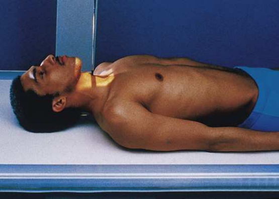
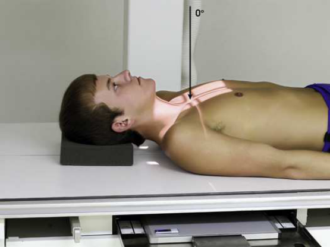
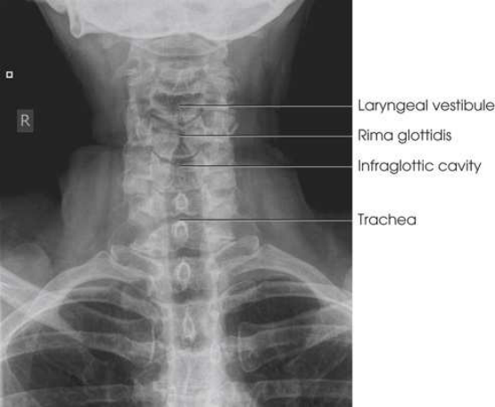
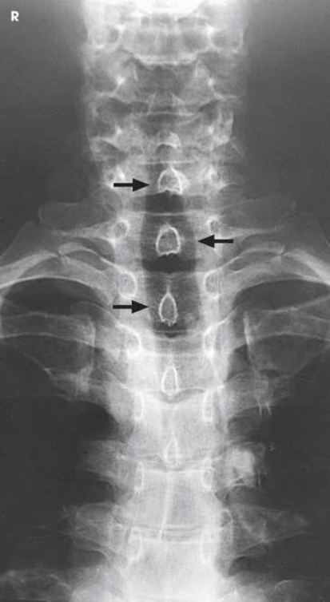

# Rx Torace și Torace and Căi Aeriene Superioare — Incidență Antero-Posterioară (AP) (Merrill)

  📷 Radiografie Convențională (Rx)
  <strong>Actualizat:</strong> 2026-09-16
  <strong>Autor:</strong> Referință Merrill

---

-   __1. Rezumat Clinic & Indicații__

    ---

    === "Indicații Clinice"

        - Conform reperelor anatomice standard din tratat

    === "Ghid Național IRIS"

        !!! info "Referință Primară: Ghidul Național IRIS (Ordinul MS 1342/2012)"
            - **Capitol Ghid IRIS:** *Ghidul Național IRIS*
            - **Grad de Recomandare:** **De verificat pe indicație; fără grad atribuit automat**
            - **Nivel de Iradiere Estimată:** `De verificat pentru examinarea și populația selectate`

            [:octicons-search-16: Deschide Ghidul IRIS](../../iris.md){ .md-button .md-button--primary } [:material-open-in-new: Aplicația Oficială PWA](https://radiologie-pediatrica.ro/iris/){ .md-button target="_blank" rel="noopener" }
-   __2. Poziționare & Centrare Fascicul__

    ---

    - **Poziție Pacient:** Performed în either Decubit dorsal sau ortostatism, depending pe pacient condition; se centrează plan mediosagital de corp la linia mediană grilă. se ajustează pacient’s umeri la lie în same plan transversal. se extinde pacient’s neck slightly și adjust it astfel încât plan mediosagital este perpendicular pe plane de receptorul de imagine (Figs. 3.15 și 3.16). se centrează receptorul de imagine la nivelul laryngeal prominence (pentru Căi Aeriene Superioare) sau manubriu sternal (pentru laringe și superior mediastinum). se efectuează ecranarea gonadelor cu șorț plumbat.
    - **Punct de Centrare Fascicul:** perpendicular through planul mediosagital la nivelul laryngeal prominence (Căi Aeriene Superioare) sau manubriu sternal (laringe și superior mediastinum)
    - **Distanță Focar-Film (DFF / SID):** Nespecificat în fragmentul extras; de verificat în sursă
    - **Comandă Respiratorie:** expunere este made during slow inspiration la ensure that trachea este filled cu air.

-   __3. Parametri Tehnici Expunere__

    ---

    | Parametru Tehnic | Valoare Configurare Generator / Tub |
    |:-----------------|:-------------------------------------|
    | **Tensiune Tub (kV)** | DE CONFIGURAT PE APARAT |
    | **Sarcină / Produs Curent-Timp (mAs)** | DE CONFIGURAT PE APARAT |
    | **Distanță Focar-Film (DFF / SID)** | Nespecificat în fragmentul extras; de verificat în sursă |
    | **Grilă Antidifuzoare (Bucky)** | DE CONFIGURAT PE APARAT |
    | **Dimensiune Focar** | DE CONFIGURAT PE APARAT |
    | **Camere de Ionizare AEC** | DE CONFIGURAT PE APARAT |
    | **Colimare Fascicul** | Adjust câmp de iradiere la 12 inches (30 cm) longitudinal și 1 inch (2.5 cm) beyond skin line pe sides but nu more than 10 inches (24 cm). Place marker de lateralitate (D/S) în collimated expunere field. |
    | **Filtrare Tub** | DE CONFIGURAT PE APARAT |

-   __4. Criterii de Calitate & Reușită Imagine__

    ---

    - Criterii radiologice de calitate imaginii:
    - Evidence de corect collimation și presence de marker de lateralitate (D/S) plasat clear de anatomy de interest
    - Air-filled Căi Aeriene Superioare, de la faringe la proximal trachea (pentru Căi Aeriene Superioare)
    - Air-filled airway, de la midcervical la midthoracic region (pentru trachea și superior mediastinum)
    - Absența rotației anatomice (simetrie bilaterală perfectă), cu procese spinoase echidistant față de pedicles și aliniat cu linia mediană cervical corpuri
    - Bony detalii trabeculare osoase și surrounding soft tissues

-   __5. Protecție Radiologică (ALARA)__

    ---

    - Nespecificat în fragmentul extras; de verificat în sursă

!!! note "Observații Clinice & Tehnice"
    Conform reperelor anatomice standard din tratat

### 🖼️ Imagini

<figure class="protocol-image-card" markdown>

<figcaption><strong>Merrill — pagina PDF 151, imaginea 1</strong> — Imagine din fragmentul sursă; asocierea necesită revizie.</figcaption>

</figure>

<figure class="protocol-image-card" markdown>

<figcaption><strong>Merrill — pagina PDF 151, imaginea 2</strong> — Imagine din fragmentul sursă; asocierea necesită revizie.</figcaption>

</figure>

<figure class="protocol-image-card" markdown>

<figcaption><strong>Merrill — pagina PDF 152, imaginea 3</strong> — Imagine din fragmentul sursă; asocierea necesită revizie.</figcaption>

</figure>

<figure class="protocol-image-card" markdown>

<figcaption><strong>Merrill — pagina PDF 153, imaginea 4</strong> — Imagine din fragmentul sursă; asocierea necesită revizie.</figcaption>

</figure>

=== "Ghid Rapid de Execuție"

    1. **Identificarea și verificarea pacientului:** verificare identitate, zonă de examinat, consimțământ conform procedurii și evaluarea posibilității unei sarcini, când este relevantă.
    2. **Pregătire:** îndepărtarea oricăror obiecte radiopace (bijuterii, agrafe, fermoare, proteze, pansamente dense).
    3. **Poziționare precisă:** alinierea receptorului de imagine și a tubului la distanța prescrisă (Nespecificat în fragmentul extras; de verificat în sursă).
    4. **Colimare strictă:** adaptarea fasciculului strict la regiunea de diagnostic pentru scăderea iradierii și reducerea radiației difuze.
    5. **Radioprotecție:** verificarea [politicii RX](../radioprotectie.md), cu măsuri distincte pentru pacient, personal și însoțitor.

## Surse de documentare

- [Merrill’s Atlas, 3. Thoracic Viscera: Chest and Upper Airway, pagini PDF 150–153](../../assets/protocols/sources/a56d45c16829_Merrills_Atlas_of_Radiographic_Positioning__Procedures_3Vol_Set.pdf#page=150)

## Fragmente sursă traduse (referință tehnică)

### anatomy

resulting imagine shows air-filled upper airway sau trachea și superior mediastinum. Under normal conditions, airway este
superimposed pe shadow de coloană cervicală (Figs. 3.17 și 3.18).

### collimation

• Adjust câmp de iradiere la 12 inches (30 cm) longitudinal și 1 inch (2.5 cm) beyond skin line pe sides but nu more than 10 inches
(24 cm). Place marker de lateralitate (D/S) în collimated expunere field.

### cr

• perpendicular through planul mediosagital la nivelul laryngeal prominence (upper airway) sau manubriu sternal (laringe și
superior mediastinum)

### criteria

Criterii radiologice de calitate imaginii:
• Evidence de corect collimation și presence de marker de lateralitate (D/S) plasat clear de anatomy de interest
• Air-filled upper airway, de la faringe la proximal trachea (pentru upper airway)
• Air-filled airway, de la midcervical la midthoracic region (pentru trachea și superior mediastinum)
• Absența rotației anatomice (simetrie bilaterală perfectă), cu procese spinoase echidistant față de pedicles și aliniat cu linia mediană cervical corpuri
• Bony detalii trabeculare osoase și surrounding soft tissues

### part_pos

• se centrează plan mediosagital de corp la linia mediană grilă.
• se ajustează pacient’s umeri la lie în same plan transversal.
• se extinde pacient’s neck slightly și adjust it astfel încât plan mediosagital este perpendicular pe plane de receptorul de imagine (Figs. 3.15 și 3.16).
• se centrează receptorul de imagine la nivelul laryngeal prominence (pentru upper airway) sau manubriu sternal (pentru laringe și superior mediastinum).
• se efectuează ecranarea gonadelor cu șorț plumbat.

### patient_pos

• Performed în either în decubit dorsal sau ortostatism, depending pe pacient condition

### respiration

expunere este made during slow inspiration la ensure that trachea este filled cu air.

### tech

poziționat prin manufacturer sau department protocol pentru corect anatomy display orientation; raza centrală (raza centrală) plate: 10 × 12
inches (24 × 30 cm) longitudinal.

