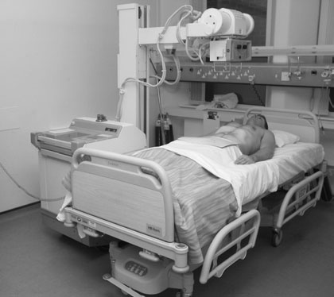
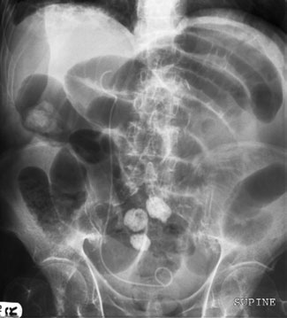
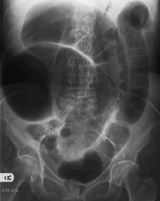

# Rx Abdomen Antero-Posterior (AP) - Decubit Dorsal

  📷 Radiografie Convențională (Rx)
  <strong>Actualizat:</strong> 2026-09-16
  <strong>Autor:</strong> Departamentul de Radiologie / Referință Clark (Ed. 12)

---

-   __1. Rezumat Clinic & Indicații__

    ---

    === "Indicații Clinice"

        - gaseous distension de orice part de gastrointestinal tract;
        - pneumoperitoneu (aer liber subdiafragmatic) sau lichid în peritoneal cavity;
        - nivele hidroaerice în intestines;
        - localization de radio-opaque corp străin radiopac;
        - evidence de aortic aneurysm. Antero-posterior (AP) – Decubit dorsal

    === "Ghid Național IRIS"

        !!! info "Referință Primară: Ghidul Național IRIS (Ordinul MS 1342/2012)"
            - **Capitol Ghid IRIS:** *Ghidul Național IRIS*
            - **Grad de Recomandare:** **De verificat pe indicație; fără grad atribuit automat**
            - **Nivel de Iradiere Estimată:** `De verificat pentru examinarea și populația selectate`

            [:octicons-search-16: Deschide Ghidul IRIS](../../iris.md){ .md-button .md-button--primary } [:material-open-in-new: Aplicația Oficială PWA](https://radiologie-pediatrica.ro/iris/){ .md-button target="_blank" rel="noopener" }
-   __2. Poziționare & Centrare Fascicul__

    ---

    - **Poziție Pacient:** • cu pacientul Decubit dorsal, casetă cu grilă antidifuzoare este carefully poziționat under abdomenul. pacientul poate fie lifted prin using wellrehearsed și safe lifting technique whilst casetă este slipped beneath them. Care trebuie să fie exercised la avoid hurting pacientul prin forcing casetă into poziție, sau using cold casetă, which might shock pacientul.
• casetă cu grilă antidifuzoare trebuie să fie poziționat pentru include simfiză pubiană pe lower edge de imagine. caseta trebuie să also fie în orizontal poziție pe bed și nu culcat la angle. If caseta este nu flat, there poate fie grilă cut-off de radiation fascicul, which poate give appearance de lesion de increased radio-opacity, such ca intra-abdominal mass due la loss de imagine densitate optică.
    - **Punct de Centrare Fascicul:** • se orientează raza centrală centrală la drept-angles la caseta și în linia mediană la nivelul crestele iliace.
• Expunerea se efectuează în apnee la sfârșitul expirului complet.
358 Decubit dorsal portable radiografie de Abdomen evidențiind Ocluzie intestinală pe intestinul subțire (nivele hidroaerice centrale).
Also note drept ureteric pigtail stent ca pacient had transitional cell carcinoma de bladder Decubit dorsal portable radiografie de Abdomen evidențiind distal colonic obstruction Gaseous distension Antero-posterior (AP) Abdomen, pacient Decubit dorsal pneumoperitoneu (aer liber subdiafragmatic) în peritoneal cavity Antero-posterior (AP) chest, pacient Ortostatism Antero-posterior (AP) Abdomen, pacient Decubit dorsal Antero-posterior (AP)/posteroanterior stâng Profil (lateral) decubit nivele hidroaerice Antero-posterior (AP) Abdomen, pacient Ortostatism Radio-opaque corp străin radiopac Antero-posterior (AP) Abdomen, pacient Decubit dorsal Aortic aneurysm Antero-posterior (AP) Abdomen, pacient Decubit dorsal Profil (lateral) (dorsal decubit)
    - **Distanță Focar-Film (DFF / SID):** 100 cm
    - **Comandă Respiratorie:** Expunerea se efectuează în apnee la sfârșitul expirului complet

-   __3. Parametri Tehnici Expunere__

    ---

    | Parametru Tehnic | Valoare Configurare Generator / Tub |
    |:-----------------|:-------------------------------------|
    | **Tensiune Tub (kV)** | DE CONFIGURAT PE APARAT |
    | **Sarcină / Produs Curent-Timp (mAs)** | Conform AEC / grosime anatomică |
    | **Distanță Focar-Film (DFF / SID)** | 100 cm |
    | **Grilă Antidifuzoare (Bucky)** | Conform grosimii anatomice (> 10-12 cm cu grilă) |
    | **Dimensiune Focar** | Focar Mic (0.6 mm) |
    | **Camere de Ionizare AEC** | DE CONFIGURAT PE APARAT |
    | **Colimare Fascicul** | Colimare strictă la aria anatomică de interes diagnostic |
    | **Filtrare Tub** | Totală ≥ 2.5 mm Al echivalent (conform Clark: 3.0 mm Al eq.) |

-   __4. Criterii de Calitate & Reușită Imagine__

    ---

    - Vizualizarea clară întregii arii anatomice (Abdomen).
    - Absența artefactelor de mișcare; trabeculație osoasă și contururi nete.
    - Densitate optică și contrast adecvate pentru diferențierea țesuturilor moi de structurile osoase.

-   __5. Protecție Radiologică (ALARA)__

    ---

    - Ecranare gonadică cu șorț plumbat dacă gonadele sunt în apropierea fasciculului util (regula ALARA).
    - Colimare precisă la dimensiunea anatomică strict necesară pentru reducerea dozei și a radiației difuze.
    - Verificarea posibilității unei sarcini la pacientele de vârstă fertilă înainte de expunere.

!!! note "Observații Clinice & Tehnice"
    • radiografii poate fie taken using high kVp technique la shorten expunere time și reduce movement blur, although increased scatter poate degrade contrast și reduce ability la see organ outlines.
• Foam pads poate fie used la prevent rotație de pacientul.

### 🖼️ Imagini

<figure class="protocol-image-card" markdown>

<figcaption><strong>Mobile radiografie este often required în cases de acute abdomi-</strong> — Poziționare pacient și centrare fascicul conform Clark (Ed. 12)</figcaption>

</figure>

<figure class="protocol-image-card" markdown>

<figcaption><strong>radiation fascicul, which poate give appearance de a</strong> — Aspect radiografic / ghid de poziționare conform tratatului Clark (Ed. 12)</figcaption>

</figure>

<figure class="protocol-image-card" markdown>

<figcaption><strong>Decubit dorsal portable radiografie de Abdomen evidențiind Ocluzie intestinală pe intestinul subțire (nivele hidroaerice centrale).</strong> — Aspect radiografic / ghid de poziționare conform tratatului Clark (Ed. 12)</figcaption>

</figure>

=== "Ghid Rapid de Execuție"

    1. **Identificarea și verificarea pacientului:** verificare identitate, zonă de examinat, consimțământ conform procedurii și evaluarea posibilității unei sarcini, când este relevantă.
    2. **Pregătire:** îndepărtarea oricăror obiecte radiopace (bijuterii, agrafe, fermoare, proteze, pansamente dense).
    3. **Poziționare precisă:** alinierea receptorului de imagine și a tubului la distanța prescrisă (100 cm).
    4. **Colimare strictă:** adaptarea fasciculului strict la regiunea de diagnostic pentru scăderea iradierii și reducerea radiației difuze.
    5. **Radioprotecție:** verificarea [politicii RX](../radioprotectie.md), cu măsuri distincte pentru pacient, personal și însoțitor.

## Surse de documentare

- [Clark's Positioning in Radiography (Ed. 12), Pagina 373](../../assets/protocols/sources/Clark___Positioning_in_Radiography__12th_edition.pdf#page=373)
