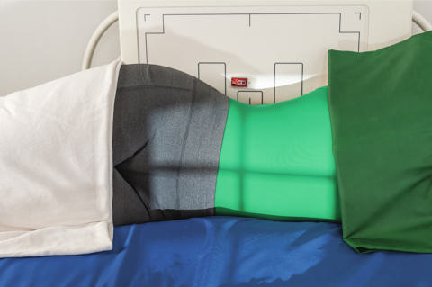
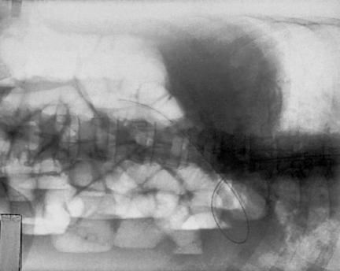

# Rx Abdomen Incidență Decubit Lateral (ANTEROPOSTERIOR PROJECTION)

  📷 Radiografie Convențională (Rx)
  <strong>Actualizat:</strong> 2026-09-15
  <strong>Autor:</strong> Departamentul de Radiologie / Referință Bontrager

---

-   __1. Rezumat Clinic & Indicații__

    ---

    === "Indicații Clinice"

        - Abdominal masses, airfluid levels, and possible accumulations of intraperitoneal air are demonstrated.
        - Small amounts of free intraperitoneal air are best demonstrated with Torace technique on Ortostatism PA Torace. Important: Patient should be on their side a minimum of 5 minutes before exposure (to allow air to rise or abnormal fluids to accumulate); 10 to 20 minutes is preferred, if possible, for best visualization of potentially small amounts of intraperitoneal air. Left Incidență Decubit Lateral best visualizes free intraperitoneal air in the area of the liver in the right upper Abdomen away from the gastric bubble.

    === "Ghid Național IRIS"

        !!! info "Referință Primară: Ghidul Național IRIS (Ordinul MS 1342/2012)"
            - **Capitol Ghid IRIS:** *Ghidul Național IRIS*
            - **Grad de Recomandare:** **De verificat pe indicație; fără grad atribuit automat**
            - **Nivel de Iradiere Estimată:** `De verificat pentru examinarea și populația selectate`

            [:octicons-search-16: Deschide Ghidul IRIS](../../iris.md){ .md-button .md-button--primary } [:material-open-in-new: Aplicația Oficială PWA](https://radiologie-pediatrica.ro/iris/){ .md-button target="_blank" rel="noopener" }
-   __2. Poziționare & Centrare Fascicul__

    ---

    - **Poziție Pacient:** Pacient: Lateral Decubit on radiolucent pad, firmly against table or vertical grid device (with wheels on cart locked so as not to move away from the table) Patient on firm surface, such as a cardiac or backboard, positioned under the sheet to prevent sagging and anatomy cutoff (Fig. 3.36) Knees partially flexed, one on top of the other, to stabilize patient Arms up near head; clean pillow provided; Regiune anatomică: Adjust patient and cart/table so that center of IR and CR are approximately 2 inches (5 cm) above level of creasta iliacă (corespunzător L4-L5)s (to include diaphragm). Upper margin of IR is approximately at level of axilla. Ensure Absența rotației anatomice: clavicule echidistante față de linia apofizelor spinoase of Bazin (Pelvis) or shoulders. Adjust height of IR to center midsagittal plane of patient to center of IR, but ensure that upside of Abdomen is included on the IR.
    - **Punct de Centrare Fascicul:** horizontal, directed to center of IR, at about 2 inches (5 cm) above level of creasta iliacă (corespunzător L4-L5); use of a horizontal beam to demonstrate airfluid levels and free intraperitoneal air Abdomen SPECIAL PA Decubit Ventral Lateral decubitus (AP) AP Ortostatism Dorsal decubitus (lateral) Lateral
    - **Distanță Focar-Film (DFF / SID):** 100 cm
    - **Comandă Respiratorie:** Take exposure at the end of expiration. Absența rotației anatomice: clavicule echidistante față de linia apofizelor spinoase; iliac wings appear symmetric, and outer rib margins are the same distance from spine. No tilt: Spine should be straight (unless scolioză / vicii de postură ale coloanei is present), aligned to center of IR.

-   __3. Parametri Tehnici Expunere__

    ---

    | Parametru Tehnic | Valoare Configurare Generator / Tub |
    |:-----------------|:-------------------------------------|
    | **Tensiune Tub (kV)** | 70 kV |
    | **Sarcină / Produs Curent-Timp (mAs)** | DE CONFIGURAT PE APARAT |
    | **Distanță Focar-Film (DFF / SID)** | 100 cm |
    | **Grilă Antidifuzoare (Bucky)** | Cu grilă antidifuzoare Bucky |
    | **Dimensiune Focar** | Focar Mic (0.6 mm) |
    | **Camere de Ionizare AEC** | Camerele laterale (sau camera centrală funcție de regiune) |
    | **Colimare Fascicul** | to area of interest. no motion; Coaste (Grilaj Costal) and all gas bubble margins sharp. Optimal image receptor exposure to visualize spine and Coaste (Grilaj Costal) and soft tissue but not to overexpose possible intraperitoneal air in upper Abdomen. Fig. 3.37 Left lateral decubitus (AP). (Modified from McQuillen Martensen K: Radiographic image analysis, ed 4, St Louis, 2020, Saunders.) Fig. 3.36 Left Incidență Decubit Lateral (AP). Spinous process Vertebral body Pedicle Intestinal gas Iliac wing Diaphragm dome Fig. 3.38 Left lateral decubitus (AP). (From McQuillen Martensen K: Radiographic image analysis, ed 4, St Louis, 2020, Saunders.) |
    | **Filtrare Tub** | Totală ≥ 2.5 mm Al echivalent |

-   __4. Criterii de Calitate & Reușită Imagine__

    ---

    - Airfilled stomach and loops of bowel and airfluid levels where present.
    - Should include bilateral diaphragm (Figs. 3.37 and 3.38). Position
    - Absența rotației anatomice: clavicule echidistante față de linia apofizelor spinoase; iliac wings appear symmetric, and outer rib margins are the same distance from spine.
    - No tilt: Spine should be straight (unless scolioză / vicii de postură ale coloanei is present), aligned to center of IR.
    - Collimation to area of interest. Exposure
    - no motion; Coaste (Grilaj Costal) and all gas bubble margins sharp.
    - Optimal image receptor exposure to visualize spine and Coaste (Grilaj Costal) and soft tissue but not to overexpose possible intraperitoneal air in upper Abdomen.

-   __5. Protecție Radiologică (ALARA)__

    ---

    - Ecranare gonadică și a organelor radiosensibile conform procedurilor locale de radioprotecție ALARA.
    - Colimare strictă la aria de interes pentru limitarea radiației difuze.
    - Verificarea posibilității unei sarcini la pacientele de vârstă fertilă înainte de expunere.

### 🖼️ Imagini

<figure class="protocol-image-card" markdown>

<figcaption><strong>Fig. 3.37 Left lateral decubitus (AP). (Modified from McQuillen</strong> — Poziționare pacient conform Ghidului Bontrager (Fig. 3.37 Left lateral decubitus (AP). (Modified from McQuillen)</figcaption>

</figure>

<figure class="protocol-image-card" markdown>

<figcaption><strong>Fig. 3.36 Left Incidență Decubit Lateral (AP).</strong> — Aspect radiografic de referință conform Ghidului Bontrager (Fig. 3.36 Left lateral decubitus position (AP).)</figcaption>

</figure>

<figure class="protocol-image-card" markdown>

<figcaption><strong>Fig. 3.38 Left lateral decubitus (AP). (From McQuillen Martensen K:</strong> — Aspect radiografic de referință conform Ghidului Bontrager (Fig. 3.38 Left lateral decubitus (AP). (From McQuillen Martensen K:)</figcaption>

</figure>

=== "Ghid Rapid de Execuție"

    1. **Identificarea și verificarea pacientului:** verificare identitate, zonă de examinat, consimțământ conform procedurii și evaluarea posibilității unei sarcini, când este relevantă.
    2. **Pregătire:** îndepărtarea oricăror obiecte radiopace (bijuterii, agrafe, fermoare, proteze, pansamente dense).
    3. **Poziționare precisă:** alinierea receptorului de imagine și a tubului la distanța prescrisă (100 cm).
    4. **Colimare strictă:** adaptarea fasciculului strict la regiunea de diagnostic pentru scăderea iradierii și reducerea radiației difuze.
    5. **Radioprotecție:** verificarea [politicii RX](../radioprotectie.md), cu măsuri distincte pentru pacient, personal și însoțitor.

## Surse de documentare

- [Bontrager's Textbook of Radiographic Positioning (Ed. 9/10), Pagina 131](https://www.elsevier.com/books/textbook-of-radiographic-positioning-and-related-anatomy/lampignano/978-0-323-65367-1)
