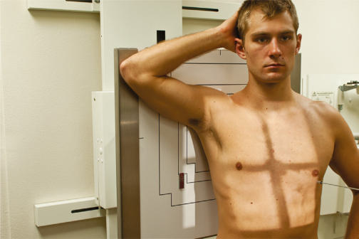
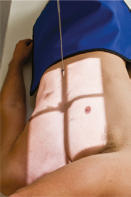

# Rx ABOVE OR BELOW DIAPHRAGM AP OBLIQUE PROJECTIONS AXILLARY Coaste (Grilaj Costal)

  📷 Radiografie Convențională (Rx)
  <strong>Actualizat:</strong> 2026-09-15
  <strong>Autor:</strong> Departamentul de Radiologie / Referință Bontrager

---

-   __1. Rezumat Clinic & Indicații__

    ---

    === "Indicații Clinice"

        - Pathology of the Coaste (Grilaj Costal), including suspiciune de fractură and neoplastic processes Oblique positions will demonstrate the axillary portion of the Coaste (Grilaj Costal) that is not well seen on the APPA projections.

    === "Ghid Național IRIS"

        !!! info "Referință Primară: Ghidul Național IRIS (Ordinul MS 1342/2012)"
            - **Capitol Ghid IRIS:** *Ghidul Național IRIS*
            - **Grad de Recomandare:** **De verificat pe indicație; fără grad atribuit automat**
            - **Nivel de Iradiere Estimată:** `De verificat pentru examinarea și populația selectate`

            [:octicons-search-16: Deschide Ghidul IRIS](../../iris.md){ .md-button .md-button--primary } [:material-open-in-new: Aplicația Oficială PWA](https://radiologie-pediatrica.ro/iris/){ .md-button target="_blank" rel="noopener" }
-   __2. Poziționare & Centrare Fascicul__

    ---

    - **Poziție Pacient:** Pacient: Ortostatism, facing xray tube. May be performed Decubit Dorsal if patient condition requires or if demonstration of the Coaste (Grilaj Costal) below the diaphragm is required.; Regiune anatomică: Rotate patient into 45° posterior oblique, with affected side closest to iR. (Hint: rotate spine away from site of injury.) Raise elevated side arm above head; extend opposite arm down and away from thorax. If Decubit, flex Genunchi of elevated side to help maintain this position and support thorax with positioning sponges if needed. Align thorax the midline of the IR (Ensure that side of interest is not cut off.)
    - **Punct de Centrare Fascicul:** perpendicular to IR Above diaphragm: align CR to the level of T7, located 3 to 4 inches (8 to 10 cm) below incizura jugulară (manubriul sternal) (Fig. 10.39) Below diaphragm: align CR to a level midway between xiphoid process and lower rib margin (bottom of IR at about level of creasta iliacă (corespunzător L4-L5)) (see Fig. 10.39 inset)
    - **Distanță Focar-Film (DFF / SID):** 100 cm
    - **Comandă Respiratorie:** Suspend respiration on inspiration for abovediaphragm Coaste (Grilaj Costal) and on expiration for belowdiaphragm Coaste (Grilaj Costal).

-   __3. Parametri Tehnici Expunere__

    ---

    | Parametru Tehnic | Valoare Configurare Generator / Tub |
    |:-----------------|:-------------------------------------|
    | **Tensiune Tub (kV)** | DE CONFIGURAT PE APARAT |
    | **Sarcină / Produs Curent-Timp (mAs)** | DE CONFIGURAT PE APARAT |
    | **Distanță Focar-Film (DFF / SID)** | 100 cm |
    | **Grilă Antidifuzoare (Bucky)** | Cu grilă antidifuzoare Bucky |
    | **Dimensiune Focar** | Focar Mic (0.6 mm) |
    | **Camere de Ionizare AEC** | Camerele laterale (sau camera centrală funcție de regiune) |
    | **Colimare Fascicul** | Collimate to region of interest. |
    | **Filtrare Tub** | Totală ≥ 2.5 mm Al echivalent |

-   __4. Criterii de Calitate & Reușită Imagine__

    ---

    - Abovediaphragm Coaste (Grilaj Costal): Coaste (Grilaj Costal) 1 through 9 should be included and demonstrated above the diaphragm (Fig. 10.40).
    - Belowdiaphragm Coaste (Grilaj Costal): Coaste (Grilaj Costal) 10 through 12 (minimum) should be included and seen below the diaphragm (Fig. 10.41); the axillary portion of the Coaste (Grilaj Costal) under examination is projected without selfsuperimposition. Position:
    - An accurate 45° Incidență Oblică should demonstrate the axillary Coaste (Grilaj Costal) in profile with the spine shifted away from the area of interest. The width between the thoracic column and the lateral margin of the thorax on the side of interest should be approximately twice that of the opposite side. Exposure:
    - Optimal image receptor exposure and contrast to visualize Coaste (Grilaj Costal) through the lungs and heart shadow or through the dense abdominal organs if below the diaphragm.
    - no motion, as demonstrated by sharp bony markings.

-   __5. Protecție Radiologică (ALARA)__

    ---

    - Ecranare gonadică și a organelor radiosensibile conform procedurilor locale de radioprotecție ALARA.
    - Colimare strictă la aria de interes pentru limitarea radiației difuze.
    - Verificarea posibilității unei sarcini la pacientele de vârstă fertilă înainte de expunere.

!!! note "Observații Clinice & Tehnice"
    Use of a 72inch (180cm) SID and/or narrow Torace dimensions may allow the IR to be positioned portrait. Additional Collimated Projection Some departmental routines include one wellcollimated projection of the region of injury taken on a smaller IR. Coaste (Grilaj Costal) ROUTINE Posterior Coaste (Grilaj Costal) (AP) or anterior Coaste (Grilaj Costal) (PA)— bilateral or unilateral study Axillary Coaste (Grilaj Costal) (anterior or posterior oblique) PA Torace (see Chapter 2) Fig. 10.39 RPO—injury to the right posterior Coaste (Grilaj Costal), above diaphragm. Inset, LPO—injury to left posterior Coaste (Grilaj Costal), below diaphragm.

### 🖼️ Imagini

<figure class="protocol-image-card" markdown>

<figcaption><strong>Fig. 10.39 RPO—injury to the right posterior Coaste (Grilaj Costal), above diaphragm.</strong> — Poziționare pacient conform Ghidului Bontrager (Fig. 10.39 RPO—injury to the right posterior ribs, above diaphragm.)</figcaption>

</figure>

<figure class="protocol-image-card" markdown>

<figcaption><strong>Figura 2</strong> — Aspect radiografic de referință conform Ghidului Bontrager (Figura 2)</figcaption>

</figure>

=== "Ghid Rapid de Execuție"

    1. **Identificarea și verificarea pacientului:** verificare identitate, zonă de examinat, consimțământ conform procedurii și evaluarea posibilității unei sarcini, când este relevantă.
    2. **Pregătire:** îndepărtarea oricăror obiecte radiopace (bijuterii, agrafe, fermoare, proteze, pansamente dense).
    3. **Poziționare precisă:** alinierea receptorului de imagine și a tubului la distanța prescrisă (100 cm).
    4. **Colimare strictă:** adaptarea fasciculului strict la regiunea de diagnostic pentru scăderea iradierii și reducerea radiației difuze.
    5. **Radioprotecție:** verificarea [politicii RX](../radioprotectie.md), cu măsuri distincte pentru pacient, personal și însoțitor.

## Surse de documentare

- [Bontrager's Textbook of Radiographic Positioning (Ed. 9/10), Pagina 394](https://www.elsevier.com/books/textbook-of-radiographic-positioning-and-related-anatomy/lampignano/978-0-323-65367-1)
