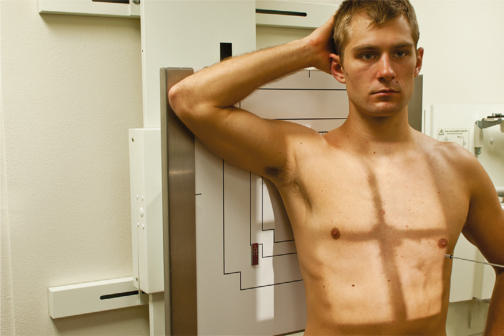
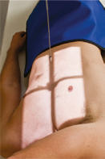

# Rx coaste deasupra sau sub diafragmă, incidență oblică AP, coaste axilare

  📷 Radiografie Convențională (Rx)
  <strong>Actualizat:</strong> 2026-09-15
  <strong>Autor:</strong> Departamentul de Radiologie / Referință Bontrager

---

-   __1. Rezumat Clinic & Indicații__

    ---

    === "Indicații Clinice"

        - Patologia coastelor (grilaj costal), inclusiv suspiciunea de fractură și procesele neoplazice, în poziții oblice va evidenția porțiunea axilară a coastelor (grilaj costal), care nu este vizibilă adecvat în incidențele AP/PA.

    === "Ghid Național IRIS"

        !!! info "Referință Primară: Ghidul Național IRIS (Ordinul MS 1342/2012)"
            - **Capitol Ghid IRIS:** *Torace & Pulmon*
            - **Grad de Recomandare:** **Grad A**
            - **Nivel de Iradiere Estimată:** `Clasa 1 (Minimă < 0.1 mSv)`

            [:octicons-search-16: Deschide Ghidul IRIS](../../iris.md){ .md-button .md-button--primary } [:material-open-in-new: Aplicația Oficială PWA](https://radiologie-pediatrica.ro/iris/){ .md-button target="_blank" rel="noopener" }

-   __2. Poziționare & Centrare Fascicul__

    ---

    - **Poziție Pacient:** Pacient: Ortostatism, cu fața spre tubul de raze X. Poate fi efectuată în decubit dorsal dacă starea pacientului o impune sau dacă este necesară evidențierea coastelor (grilaj costal) de sub cupolele diafragmatice. Regiune anatomică: Se rotește pacientul în oblică posterioară la 45°, cu partea afectată cea mai apropiată de receptorul de imagine. (Indicație: se rotește coloana vertebrală în sens opus locului leziunii.) Se ridică brațul de pe partea ridicată deasupra capului; se extinde brațul opus în jos și în afara toracelui. Dacă pacientul este în decubit, se flectează genunchiul de pe partea ridicată pentru a ajuta la menținerea acestei poziții și se susține toracele cu suporturi de poziționare, dacă este necesar. Se aliniază linia mediană a toracelui cu receptorul de imagine (se asigură că partea de interes nu este tăiată).
    - **Punct de Centrare Fascicul:** Perpendicular pe receptorul de imagine. Deasupra cupolelor diafragmatice: se aliniază raza centrală la nivelul T7, situat la 3 până la 4 țoli (8 până la 10 cm) sub incizura jugulară (manubriul sternal) (Fig. 10.39). Sub cupolele diafragmatice: se aliniază raza centrală la nivelul situat la jumătatea distanței dintre apendicele xifoid și marginea inferioară a coastelor (partea inferioară a receptorului de imagine la aproximativ nivelul crestei iliace (corespunzător L4-L5)) (a se vedea imaginea inserată din Fig. 10.39)
    - **Distanță Focar-Film (DFF / SID):** 100 cm
    - **Comandă Respiratorie:** Apnee pe durata expunerii: în inspirație pentru coastele deasupra diafragmului (grilaj costal) și în expirație pentru coastele de sub diafragm (grilaj costal).

-   __3. Parametri Tehnici Expunere__

    ---

    | Parametru Tehnic | Valoare Configurare Generator / Tub |
    |:-----------------|:-------------------------------------|
    | **Tensiune Tub (kV)** | DE CONFIGURAT PE APARAT |
    | **Sarcină / Produs Curent-Timp (mAs)** | DE CONFIGURAT PE APARAT |
    | **Distanță Focar-Film (DFF / SID)** | 100 cm |
    | **Grilă Antidifuzoare (Bucky)** | Cu grilă antidifuzoare Bucky |
    | **Dimensiune Focar** | Focar Mic (0.6 mm) |
    | **Camere de Ionizare AEC** | Camerele laterale (sau camera centrală, în funcție de regiune) |
    | **Colimare Fascicul** | Se colimează la nivelul regiunii de interes. |
    | **Filtrare Tub** | Totală ≥ 2.5 mm Al echivalent |

-   __4. Criterii de Calitate & Reușită Imagine__

    ---

    - Coaste deasupra diafragmului (grilaj costal): coastele 1 până la 9 trebuie incluse și evidențiate deasupra cupolelor diafragmatice (Fig. 10.40).
    - Coaste sub diafragm (grilaj costal): coastele 10 până la 12 (minimum) trebuie incluse și vizibile sub cupolele diafragmatice (Fig. 10.41); porțiunea axilară a coastelor (grilaj costal) examinată este proiectată fără suprapunere proprie. Poziție:
    - Incidența oblică exactă la 45° trebuie să evidențieze coastele axilare (grilaj costal) în profil, cu coloana vertebrală deplasată în sens opus ariei de interes diagnostic. Lățimea dintre coloana toracală și marginea laterală a toracelui pe partea de interes trebuie să fie de aproximativ două ori mai mare decât cea de pe partea opusă. Expunere:
    - Expunere optimă a receptorului de imagine și contrast adecvat pentru vizualizarea coastelor (grilaj costal) prin plămâni și umbra cordului sau prin organele abdominale dense, dacă sunt sub cupolele diafragmatice.
    - Fără mișcare, evidențiată prin contururi osoase clare.

-   __5. Protecție Radiologică (ALARA)__

    ---

    - Ecranare gonadică și a organelor radiosensibile conform procedurilor locale de radioprotecție ALARA.
    - Colimare strictă la aria de interes pentru limitarea radiației difuze.
    - Verificarea posibilității unei sarcini la pacientele de vârstă fertilă înainte de expunere.

!!! note "Observații Clinice & Tehnice"
    Utilizarea unui SID de 72 țoli (180 cm) și/sau dimensiunile reduse ale toracelui pot permite poziționarea receptorului de imagine în orientare portret. Incidență colimată suplimentară: unele protocoale ale departamentelor includ o incidență bine colimată a regiunii lezate, efectuată pe un receptor de imagine mai mic. Coaste (grilaj costal) DE RUTINĂ: coaste posterioare (grilaj costal) (AP) sau coaste anterioare (grilaj costal) (PA) — examinare bilaterală sau unilaterală. Coaste axilare (grilaj costal) (oblică anterioară sau posterioară). Torace PA (a se vedea Capitolul 2). Fig. 10.39 RPO — leziune la nivelul coastelor posterioare drepte (grilaj costal), deasupra cupolelor diafragmatice. Imagine inserată, LPO — leziune la nivelul coastelor posterioare stângi (grilaj costal), sub cupolele diafragmatice.

### 🖼️ Imagini

<figure class="protocol-image-card" markdown>

<figcaption><strong>Fig. 10.39 RPO — leziune la nivelul coastelor posterioare drepte (grilaj costal), deasupra cupolelor diafragmatice.</strong> — Poziționarea pacientului conform Ghidului Bontrager (Fig. 10.39 RPO — leziune la nivelul coastelor posterioare drepte, deasupra cupolelor diafragmatice.)</figcaption>

</figure>

<figure class="protocol-image-card" markdown>

<figcaption><strong>Figura 2</strong> — Aspect radiografic de referință conform Ghidului Bontrager (Figura 2)</figcaption>

</figure>

=== "Ghid Rapid de Execuție"

    1. **Identificarea și verificarea pacientului:** verificare identitate, zonă de examinat, consimțământ conform procedurii și evaluarea posibilității unei sarcini, când este relevantă.
    2. **Pregătire:** îndepărtarea oricăror obiecte radiopace (bijuterii, agrafe, fermoare, proteze, pansamente dense).
    3. **Poziționare precisă:** alinierea receptorului de imagine și a tubului la distanța prescrisă (100 cm).
    4. **Colimare strictă:** adaptarea fasciculului strict la regiunea de diagnostic pentru scăderea iradierii și reducerea radiației difuze.
    5. **Radioprotecție:** verificarea [politicii RX](../radioprotectie.md), cu măsuri distincte pentru pacient, personal și însoțitor.

## Surse de documentare

- [Bontrager's Textbook of Radiographic Positioning (Ed. 9/10), Pagina 394](https://www.elsevier.com/books/textbook-of-radiographic-positioning-and-related-anatomy/lampignano/978-0-323-65367-1)
