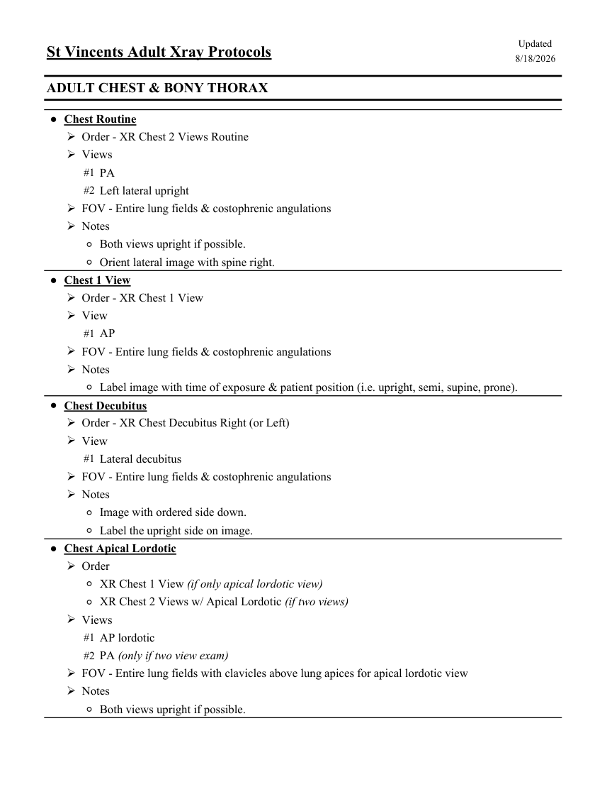
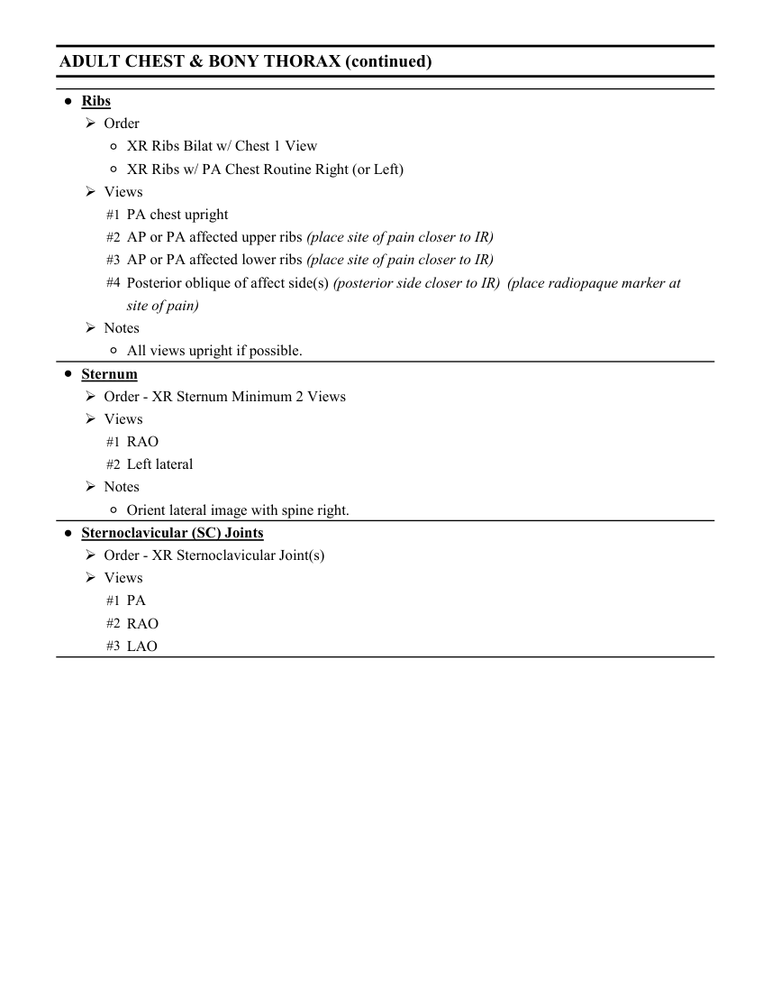

# RX — Adult: torace și grilaj costal (MCB)

## Documentul original MCB — Adult: torace și grilaj costal

**Colecție de protocoale · 2 pagini · consultat la 2026-09-27.**

[Descarcă PDF-ul integral](../../assets/mcb-modalities/rx-adult-torace-si-grilaj-costal-mcb/document.pdf) · [Sursa MCB](https://ref.mcbradiology.com/Protocols,%20Policies,%20Worksheets%20&%20Forms/Xray/Adult%20Protocols/2%20Adult%20Chest.pdf) · [Catalogul MCB pentru această modalitate](../mcb/index.md)

Instrucțiunile, valorile și ilustrațiile din documentul original sunt păstrate în **engleză**. Titlul și navigarea sunt în română.

### Pagina 1

{ loading=lazy }

### Pagina 2

{ loading=lazy }

## Textul documentului original

??? abstract "Pagina 1 — text în engleză"

    
Updated
    St Vincents Adult Xray Protocols
    8/18/2026
    ADULT CHEST &amp; BONY THORAX
    ●Chest Routine
    Order - XR Chest 2 Views Routine
    Views
    #1 PA
    #2 Left lateral upright
    FOV - Entire lung fields &amp; costophrenic angulations
    Notes
    ◦Both views upright if possible.
    ◦Orient lateral image with spine right.
    ●Chest 1 View
    Order - XR Chest 1 View
    View
    #1 AP
    FOV - Entire lung fields &amp; costophrenic angulations
    Notes
    ◦Label image with time of exposure &amp; patient position (i.e. upright, semi, supine, prone).
    ●Chest Decubitus
    Order - XR Chest Decubitus Right (or Left)
    View
    #1 Lateral decubitus
    FOV - Entire lung fields &amp; costophrenic angulations
    Notes
    ◦Image with ordered side down.
    ◦Label the upright side on image.
    ●Chest Apical Lordotic
    Order
    ◦XR Chest 1 View (if only apical lordotic view)
    ◦XR Chest 2 Views w/ Apical Lordotic (if two views)
    Views
    #1 AP lordotic
    #2 PA (only if two view exam)
    FOV - Entire lung fields with clavicles above lung apices for apical lordotic view
    Notes
    ◦Both views upright if possible.
    

??? abstract "Pagina 2 — text în engleză"

    
ADULT CHEST &amp; BONY THORAX (continued)
    ●Ribs
    Order
    ◦XR Ribs Bilat w/ Chest 1 View
    ◦XR Ribs w/ PA Chest Routine Right (or Left)
    Views
    #1 PA chest upright
    #2 AP or PA affected upper ribs (place site of pain closer to IR)
    #3 AP or PA affected lower ribs (place site of pain closer to IR)
    #4 Posterior oblique of affect side(s) (posterior side closer to IR)  (place radiopaque marker at
    site of pain)
    Notes
    ◦All views upright if possible.
    ●Sternum
    Order - XR Sternum Minimum 2 Views
    Views
    #1 RAO
    #2 Left lateral 
    Notes
    ◦Orient lateral image with spine right.
    ●Sternoclavicular (SC) Joints
    Order - XR Sternoclavicular Joint(s)
    Views
    #1 PA
    #2 RAO
    #3 LAO
    

