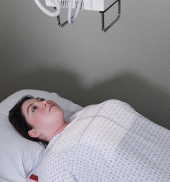
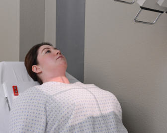

# Rx Torace AP — Radiografie la Pat / Urgență

  📷 Radiografie Convențională (Rx)
  <strong>Actualizat:</strong> 2026-09-15
  <strong>Autor:</strong> Departamentul de Radiologie / Referință Bontrager

---

-   __1. Rezumat Clinic & Indicații__

    ---

    === "Indicații Clinice"

        - According la American College de Radiology (ACR), AP Torace radiografie este standard part de traumatism acuttism / Regim Urgență workup la most level I traumatism acuttism / Regim Urgență centers across United States.3
        - Approximately 25% de deaths de la blunt traumatism acuttism / Regim Urgență arise de la Torace injuries, although up la 50% de deaths sunt la least partially related la thoracic injuries.2
        - Torace injuries include acute aortic injury, pulmonary injury, pneumotorax, hemothorax, extrapleural hematoma, large airway rupture, hemidiaphragmatic rupture, și musculoskeletal injury.3
        - Ensure corect placement de lines și tubes.

    === "Ghid Național IRIS"

        !!! info "Referință Primară: Ghidul Național IRIS (Ordinul MS 1342/2012)"
            - **Capitol Ghid IRIS:** *Ghidul Național IRIS*
            - **Grad de Recomandare:** **De verificat pe indicație; fără grad atribuit automat**
            - **Nivel de Iradiere Estimată:** `De verificat pentru examinarea și populația selectate`

            [:octicons-search-16: Deschide Ghidul IRIS](../../iris.md){ .md-button .md-button--primary } [:material-open-in-new: Aplicația Oficială PWA](https://radiologie-pediatrica.ro/iris/){ .md-button target="_blank" rel="noopener" }
-   __2. Poziționare & Centrare Fascicul__

    ---

    - **Poziție Pacient:** Pacient: AP Torace pacient este Decubit dorsal pe cart; if pacient’s condition allows, capul end de cart trebuie să fie raised into Ortostatism sau semierect poziție. Rotate brațe internally, if pacient’s condition allows, la move scapulae out de câmpuri pulmonare.; Regiune anatomică: AP Torace Enclose receptorul de imagine în plastic cover și place under sau behind pacient; place top de receptorul de imagine about 2 inches (4 la 5 cm) above umerii, aligning raza centrală la receptorul de imagine. Ensure Absența rotației anatomice: clavicule echidistante față de linia apofizelor spinoase (plan coronal paralel cu receptorul de imagine). (Place supports under parts de receptorul de imagine ca needed.)
    - **Punct de Centrare Fascicul:** AP Torace Direct raza centrală 3 la 4 inches (8 la 10 cm) below incizura jugulară (manubriul sternal), level de T7. Angle raza centrală 3 la 5 grade caudal, sau raise cap end de bed slightly, la place Raza centrală perpendiculară la axa longitudinală de Stern (unless grilă prevents this). This simulates Incidență Postero-Anterioară (PA) și prevents clavicles de la obscuring apexuri (vârfuri pulmonare) de plămânii (Fig. 15.30). If pacient este able la attain only semierect poziție, raza centrală trebuie să fie înclinat la maintain perpendicular relationship cu receptorul de imagine (Fig. 15.31). Radiation Safety expunere factor selection trebuie să fie optimized în accordance cu ALARA. Collimate pe four sides la anatomy de interest when feasible. Follow local regulations, department policy, și protocol în use de shielding.
    - **Distanță Focar-Film (DFF / SID):** 100 cm
    - **Comandă Respiratorie:** Expose la end de second Inspir profund adecvat: minim 9-10 arcuri costale posterioare vizibile. optional lateral Torace (nu evidențiat here): lateral imagine poate fie obtained cu orizontal fascicul raza centrală if pacient poate raise brațe la least 90 grade de la corp. Place receptorul de imagine paralel la plan mediosagital (MSP), cu top de receptorul de imagine 2 inches (5 cm) above level de umeri. Support pacient pe radiolucent pad la center Torace la receptorul de imagine și center orizontal raza centrală la level de T7. lateral decubit Incidență Antero-Posterioară (AP) la determine airfluid levels when pacientul cannot fie ridicat sufficiently pentru Ortostatism poziție, lateral decubit poate fie taken în bed cu receptorul de imagine plasat behind pacientul sau pe stretcher în front de receptorul de imagine holder, ca vizualizat în Fig. 15.32. Place radiolucent pads under thorax și umeri, și raise brațele above capul. raza centrală/part/receptorul de imagine alignment Torace traumatism acuttism / Regim Urgență AP OPTIONAL lateral lateral decubit (AP) Fig. 15.30 AP Decubit dorsal Torace, bedside (receptorul de imagine landscape), raza centrală 3 la 5 grade caudal, perpendicular la Stern. Fig. 15.31 AP semierect Torace, bedside.

-   __3. Parametri Tehnici Expunere__

    ---

    | Parametru Tehnic | Valoare Configurare Generator / Tub |
    |:-----------------|:-------------------------------------|
    | **Tensiune Tub (kV)** | 90-125 kV |
    | **Sarcină / Produs Curent-Timp (mAs)** | DE CONFIGURAT PE APARAT |
    | **Distanță Focar-Film (DFF / SID)** | 100 cm |
    | **Grilă Antidifuzoare (Bucky)** | Cu grilă antidifuzoare Bucky |
    | **Dimensiune Focar** | Focar Mare (1.0 - 1.2 mm) |
    | **Camere de Ionizare AEC** | Camerele laterale (sau camera centrală funcție de regiune) |
    | **Colimare Fascicul** | Colimare strictă pe regiunea anatomică de interes diagnostic anatomic |
    | **Filtrare Tub** | Totală ≥ 2.5 mm Al echivalent |

-   __4. Criterii de Calitate & Reușită Imagine__

    ---

    - Vizualizarea completă regiunii anatomice explorate
    - Absența artefactelor de mișcare sau suprapunerilor neadecvate
    - Contrast și penetrare optime pentru decelarea structurilor osoase și părților moi

-   __5. Protecție Radiologică (ALARA)__

    ---

    - Ecranare gonadică și a organelor radiosensibile conform procedurilor locale de radioprotecție ALARA.
    - Colimare strictă la aria de interes pentru limitarea radiației difuze.
    - Verificarea posibilității unei sarcini la pacientele de vârstă fertilă înainte de expunere.

### 🖼️ Imagini

<figure class="protocol-image-card" markdown>

<figcaption><strong>Fig. 15.30 AP Decubit dorsal Torace, bedside (receptorul de imagine landscape), raza centrală 3 la 5</strong> — Poziționare pacient conform Ghidului Bontrager (Fig. 15.30 AP în decubit dorsal chest, bedside (receptorul de imagine landscape), raza centrală 3 la 5)</figcaption>

</figure>

<figure class="protocol-image-card" markdown>

<figcaption><strong>Fig. 15.31 AP semierect Torace, bedside.</strong> — Aspect radiografic de referință conform Ghidului Bontrager (Fig. 15.31 AP semierect chest, bedside.)</figcaption>

</figure>

=== "Ghid Rapid de Execuție"

    1. **Identificarea și verificarea pacientului:** verificare identitate, zonă de examinat, consimțământ conform procedurii și evaluarea posibilității unei sarcini, când este relevantă.
    2. **Pregătire:** îndepărtarea oricăror obiecte radiopace (bijuterii, agrafe, fermoare, proteze, pansamente dense).
    3. **Poziționare precisă:** alinierea receptorului de imagine și a tubului la distanța prescrisă (100 cm).
    4. **Colimare strictă:** adaptarea fasciculului strict la regiunea de diagnostic pentru scăderea iradierii și reducerea radiației difuze.
    5. **Radioprotecție:** verificarea [politicii RX](../radioprotectie.md), cu măsuri distincte pentru pacient, personal și însoțitor.

## Surse de documentare

- [Bontrager's Textbook of Radiographic Positioning (Ed. 9/10), Pagina 599](https://www.elsevier.com/books/textbook-of-radiographic-positioning-and-related-anatomy/lampignano/978-0-323-65367-1)
