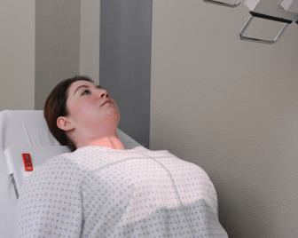

# Radiografie toracică AP — radiografie la pat / urgență

  📷 Radiografie Convențională (Rx)
  <strong>Actualizat:</strong> 2026-09-15
  <strong>Autor:</strong> Departamentul de Radiologie / Referință Bontrager

---

-   __1. Rezumat Clinic & Indicații__

    ---

    === "Indicații Clinice"

        - Conform American College of Radiology (ACR), radiografia toracică AP reprezintă o parte standard a evaluării pentru traumatisme acute/regim de urgență în majoritatea centrelor de traumă de nivel I din Statele Unite.3
        - Aproximativ 25% dintre decesele cauzate de traumatisme contuzive acute/regim de urgență provin din leziuni toracice, deși până la 50% dintre decese sunt cel puțin parțial asociate cu leziuni toracice.2
        - Leziunile toracice includ leziunea aortică acută, leziunea pulmonară, pneumotoraxul, hemotoraxul, hematomul extrapleural, ruptura căilor aeriene mari, ruptura hemidiafragmului și leziunea musculoscheletală.3
        - Se asigură poziționarea corectă a liniilor și tuburilor.

    === "Ghid Național IRIS"

        !!! info "Referință Primară: Ghidul Național IRIS (Ordinul MS 1342/2012)"
            - **Capitol Ghid IRIS:** *Torace & Pulmon*
            - **Grad de Recomandare:** **Grad A**
            - **Nivel de Iradiere Estimată:** `Clasa 1 (Minimă < 0.1 mSv)`

            [:octicons-search-16: Deschide Ghidul IRIS](../../iris.md){ .md-button .md-button--primary } [:material-open-in-new: Aplicația Oficială PWA](https://radiologie-pediatrica.ro/iris/){ .md-button target="_blank" rel="noopener" }

-   __2. Poziționare & Centrare Fascicul__

    ---

    - **Poziție Pacient:** Pacient: AP torace: pacientul este în decubit dorsal pe targă; dacă starea pacientului permite, capătul cefalic al tărgii trebuie ridicat în ortostatism sau în poziție semierectă. Rotiți brațele în rotație internă, dacă starea pacientului permite, pentru a deplasa omoplații în afara câmpurilor pulmonare.; Regiune anatomică: AP torace: înveliți receptorul de imagine într-o folie de plastic și plasați-l sub sau în spatele pacientului; plasați partea superioară a receptorului de imagine la aproximativ 2 țoli (4 la 5 cm) deasupra umerilor, aliniind raza centrală cu receptorul de imagine. Asigurați absența rotației anatomice: claviculele sunt echidistante față de linia apofizelor spinoase (planul coronal paralel cu receptorul de imagine). (Plasați suporturi sub părțile receptorului de imagine după cum este necesar.)
    - **Punct de Centrare Fascicul:** Torace AP direct. Raza centrală la 3 până la 4 țoli (8 până la 10 cm) sub incizura jugulară (manubriul sternal), la nivelul T7. Se angulează raza centrală la 3 până la 5 grade caudal sau se ridică ușor capătul cefalic al patului, pentru a plasa raza centrală perpendicular pe axa longitudinală a sternului (cu excepția cazului în care grila împiedică acest lucru). Aceasta simulează incidența postero-anterioară (PA) și împiedică claviculele să obstrucționeze vârfurile pulmonare (Fig. 15.30). Dacă pacientul poate adopta doar poziția semierectă, raza centrală trebuie înclinată pentru a menține relația perpendiculară cu receptorul de imagine (Fig. 15.31). Selectarea factorilor de expunere pentru siguranța radiologică trebuie optimizată în conformitate cu ALARA. Se colimează pe toate cele patru laturi la nivelul anatomiei de interes, atunci când este posibil. Se respectă reglementările locale, politica departamentului și protocolul privind utilizarea ecranării.
    - **Distanță Focar-Film (DFF / SID):** 100 cm
    - **Comandă Respiratorie:** Se efectuează expunerea la sfârșitul celei de-a doua inspirații profunde adecvate: minimum 9-10 arcuri costale posterioare vizibile. Incidență laterală opțională a toracelui (neilustrată aici): imaginea laterală poate fi obținută cu o rază centrală orizontală dacă pacientul își poate ridica brațele la cel puțin 90 de grade față de corp. Se plasează receptorul de imagine paralel cu planul mediosagital (MSP), cu partea superioară a receptorului de imagine la 2 țoli (5 cm) deasupra nivelului umerilor. Se susține pacientul pe un suport radiotransparent pentru a centra toracele la receptorul de imagine și se centrează raza centrală orizontală la nivelul T7. Incidența laterală în decubit pentru a determina nivelurile aer-lichid atunci când pacientul nu poate fi ridicat suficient pentru poziția în ortostatism; incidența laterală în decubit poate fi efectuată în pat, cu receptorul de imagine plasat în spatele pacientului, sau pe targă, în fața suportului receptorului de imagine, după cum se observă în Fig. 15.32. Se plasează suporturi radiotransparente sub torace și umeri și se ridică brațele deasupra capului. Alinierea razei centrale/părții/receptorului de imagine. Torace, traumatism acut/regim de urgență, AP opțională, laterală în decubit. Fig. 15.30 Torace AP în decubit dorsal, la pat (receptorul de imagine în orientare peisaj), raza centrală la 3 până la 5 grade caudal, perpendiculară pe stern. Fig. 15.31 Torace AP semierect, la pat.

-   __3. Parametri Tehnici Expunere__

    ---

    | Parametru Tehnic | Valoare Configurare Generator / Tub |
    |:-----------------|:-------------------------------------|
    | **Tensiune Tub (kV)** | 90-125 kV |
    | **Sarcină / Produs Curent-Timp (mAs)** | DE CONFIGURAT PE APARAT |
    | **Distanță Focar-Film (DFF / SID)** | 100 cm |
    | **Grilă Antidifuzoare (Bucky)** | Cu grilă antidifuzoare Bucky |
    | **Dimensiune Focar** | Focar Mare (1.0 - 1.2 mm) |
    | **Camere de Ionizare AEC** | Camerele laterale (sau camera centrală, în funcție de regiune) |
    | **Colimare Fascicul** | Colimare strictă pe regiunea anatomică de interes diagnostic |
    | **Filtrare Tub** | Totală ≥ 2.5 mm Al echivalent |

-   __4. Criterii de Calitate & Reușită Imagine__

    ---

    - Vizualizarea completă a regiunii anatomice explorate
    - Absența artefactelor de mișcare sau a suprapunerilor neadecvate
    - Contrast și penetrare optime pentru decelarea structurilor osoase și a părților moi

-   __5. Protecție Radiologică (ALARA)__

    ---

    - Ecranare gonadică și a organelor radiosensibile conform procedurilor locale de radioprotecție ALARA.
    - Colimare strictă la aria de interes pentru limitarea radiației difuze.
    - Verificarea posibilității unei sarcini la pacientele de vârstă fertilă înainte de expunere.

### 🖼️ Imagini

<figure class="protocol-image-card" markdown>

![Fig. 15.30 Torace AP în decubit dorsal, la pat (receptorul de imagine orientat transversal), raza centrală 3 la 5 [fragment incomplet în sursă].](../../assets/images/protocols/bontrager/rx-ap-torace-traumatism-acuttism-regim-urgenta-and-mobile-positioning-bontrager/fig_1.jpeg)

<figcaption><strong>Fig. 15.30 Torace AP în decubit dorsal, la pat (receptorul de imagine orientat transversal), raza centrală 3 la 5 [fragment incomplet în sursă].</strong> — Poziționarea pacientului conform Ghidului Bontrager (Fig. 15.30 AP în decubit dorsal pentru torace, la pat (receptorul de imagine în orientare peisaj), raza centrală 3 la 5)</figcaption>

</figure>

<figure class="protocol-image-card" markdown>

<figcaption><strong>Fig. 15.31 AP, torace semiortostatic, la pat.</strong> — Aspect radiografic de referință conform Ghidului Bontrager (Fig. 15.31, torace AP semiortostatic, la pat.)</figcaption>

</figure>

=== "Ghid Rapid de Execuție"

    1. **Identificarea și verificarea pacientului:** verificare identitate, zonă de examinat, consimțământ conform procedurii și evaluarea posibilității unei sarcini, când este relevantă.
    2. **Pregătire:** îndepărtarea oricăror obiecte radiopace (bijuterii, agrafe, fermoare, proteze, pansamente dense).
    3. **Poziționare precisă:** alinierea receptorului de imagine și a tubului la distanța prescrisă (100 cm).
    4. **Colimare strictă:** adaptarea fasciculului strict la regiunea de diagnostic pentru scăderea iradierii și reducerea radiației difuze.
    5. **Radioprotecție:** verificarea [politicii RX](../radioprotectie.md), cu măsuri distincte pentru pacient, personal și însoțitor.

## Surse de documentare

- [Bontrager's Textbook of Radiographic Positioning (Ed. 9/10), Pagina 599](https://www.elsevier.com/books/textbook-of-radiographic-positioning-and-related-anatomy/lampignano/978-0-323-65367-1)
