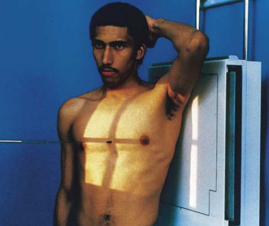
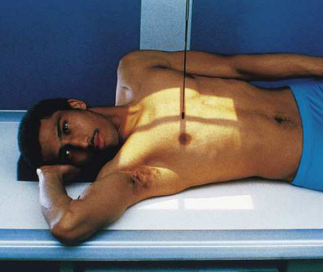
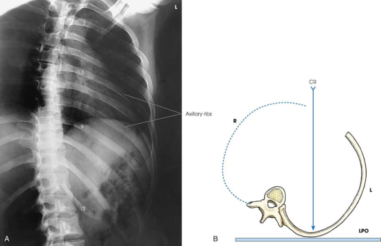

# Rx Grilaj Costal Axilar — Oblică Antero-Posterioară (AP) — RPO or Oblică Posterioară Stângă (OPS / LPO) (Merrill)

  📷 Radiografie Convențională (Rx)
  <strong>Actualizat:</strong> 2026-09-16
  <strong>Autor:</strong> Referință Merrill

---

-   __1. Rezumat Clinic & Indicații__

    ---

    === "Indicații Clinice"

        - Conform reperelor anatomice standard din tratat

    === "Ghid Național IRIS"

        !!! info "Referință Primară: Ghidul Național IRIS (Ordinul MS 1342/2012)"
            - **Capitol Ghid IRIS:** *Ghidul Național IRIS*
            - **Grad de Recomandare:** **De verificat pe indicație; fără grad atribuit automat**
            - **Nivel de Iradiere Estimată:** `De verificat pentru examinarea și populația selectate`

            [:octicons-search-16: Deschide Ghidul IRIS](../../iris.md){ .md-button .md-button--primary } [:material-open-in-new: Aplicația Oficială PWA](https://radiologie-pediatrica.ro/iris/){ .md-button target="_blank" rel="noopener" }
-   __2. Poziționare & Centrare Fascicul__

    ---

    - **Poziție Pacient:** Examine pacientul în ortostatism sau Decubit poziție. Unless contraindicated prin pacientul’s condition, use ortostatism la imagine Coaste (Grilaj Costal) above cupole diafragmatice, și use Decubit poziție la imagine Coaste (Grilaj Costal) below cupole diafragmatice. Gravity assists prin moving cupole diafragmatice.; se poziționează pacientul’s corp pentru a 45-grade AP Incidență Oblică using RPO sau poziție oblică posterioară stângă (OPS / LPO). Place affected side cel mai apropiat de receptorul de imagine. se centrează afected side pe longitudinal plane drawn midway între MSP și lateral surface de corp. poziție this plane la linia mediană grilă. If pacientul este în Decubit poziție, support ridicat Șold. Abduct braț de afected side, și elevate it la carry Omoplat (Scapulă) away de la rib cage. se sprijină pacientul’s Mână pe capul if ortostatism este used (Fig. 10.37), sau place Mână under sau above capul if Decubit poziție este used (Fig. 10.38). Abduct opposite limb cu Mână pe Șold. se centrează receptorul de imagine cu top 1½ inches (3.8 cm) above upper margine de relaxat Umăr la imagine Coaste (Grilaj Costal) above cupole diafragmatice sau la point halfway între apendice xifoid și lower rib margin la imagine Coaste (Grilaj Costal) below cupole diafragmatice. se efectuează ecranarea gonadelor cu șorț plumbat.
    - **Punct de Centrare Fascicul:** perpendicular pe center de receptorul de imagine Closest la receptorul de imagine
    - **Distanță Focar-Film (DFF / SID):** Nespecificat în fragmentul extras; de verificat în sursă
    - **Comandă Respiratorie:** Apnee la sfârșitul inspirului profund complet pentru Coaste (Grilaj Costal) above cupole diafragmatice și la end de deep expiration pentru Coaste (Grilaj Costal) below cupole diafragmatice.

-   __3. Parametri Tehnici Expunere__

    ---

    | Parametru Tehnic | Valoare Configurare Generator / Tub |
    |:-----------------|:-------------------------------------|
    | **Tensiune Tub (kV)** | DE CONFIGURAT PE APARAT |
    | **Sarcină / Produs Curent-Timp (mAs)** | DE CONFIGURAT PE APARAT |
    | **Distanță Focar-Film (DFF / SID)** | Nespecificat în fragmentul extras; de verificat în sursă |
    | **Grilă Antidifuzoare (Bucky)** | DE CONFIGURAT PE APARAT |
    | **Dimensiune Focar** | DE CONFIGURAT PE APARAT |
    | **Camere de Ionizare AEC** | DE CONFIGURAT PE APARAT |
    | **Colimare Fascicul** | Se ajustează câmpul de iradiere la formatul 35 × 43 cm pe colimator. Se plasează markerul de lateralitate în câmpul colimat. |
    | **Filtrare Tub** | DE CONFIGURAT PE APARAT |

-   __4. Criterii de Calitate & Reușită Imagine__

    ---

    - Criterii radiologice de calitate imaginii:
    - Colimare adecvată vizibilă și prezența markerului de lateralitate (D/S) plasat clear de anatomy de interest
    - Approximately twice ca much distance între coloană vertebrală și lateral margine de Coaste (Grilaj Costal) pe afected side ca este present pe unafected side
    - Axillary portion de Coaste (Grilaj Costal) liber de superimposition cu Coloană Toracală
    - First through tenth Coaste (Grilaj Costal) vizibil above cupole diafragmatice pentru upper Coaste (Grilaj Costal)
    - Eighth through twelfth Coaste (Grilaj Costal) vizibil below cupole diafragmatice pentru lower Coaste (Grilaj Costal)
    - Coaste (Grilaj Costal) vizibil through plămânii sau Abdomen according la region examined
    - Bony detalii trabeculare osoase și surrounding soft tissues

-   __5. Protecție Radiologică (ALARA)__

    ---

    - Nespecificat în fragmentul extras; de verificat în sursă

!!! note "Observații Clinice & Tehnice"
    Conform reperelor anatomice standard din tratat

### 🖼️ Imagini

<figure class="protocol-image-card" markdown>

<figcaption><strong>Merrill — pagina PDF 820, imaginea 1</strong> — Imagine din fragmentul sursă; asocierea necesită revizie.</figcaption>

</figure>

<figure class="protocol-image-card" markdown>

<figcaption><strong>Merrill — pagina PDF 820, imaginea 2</strong> — Imagine din fragmentul sursă; asocierea necesită revizie.</figcaption>

</figure>

<figure class="protocol-image-card" markdown>

<figcaption><strong>Merrill — pagina PDF 821, imaginea 3</strong> — Imagine din fragmentul sursă; asocierea necesită revizie.</figcaption>

</figure>

=== "Ghid Rapid de Execuție"

    1. **Identificarea și verificarea pacientului:** verificare identitate, zonă de examinat, consimțământ conform procedurii și evaluarea posibilității unei sarcini, când este relevantă.
    2. **Pregătire:** îndepărtarea oricăror obiecte radiopace (bijuterii, agrafe, fermoare, proteze, pansamente dense).
    3. **Poziționare precisă:** alinierea receptorului de imagine și a tubului la distanța prescrisă (Nespecificat în fragmentul extras; de verificat în sursă).
    4. **Colimare strictă:** adaptarea fasciculului strict la regiunea de diagnostic pentru scăderea iradierii și reducerea radiației difuze.
    5. **Radioprotecție:** verificarea [politicii RX](../radioprotectie.md), cu măsuri distincte pentru pacient, personal și însoțitor.

## Surse de documentare

- [Merrill’s Atlas, 10. Bony Thorax, pagini PDF 819–821](../../assets/protocols/sources/a56d45c16829_Merrills_Atlas_of_Radiographic_Positioning__Procedures_3Vol_Set.pdf#page=819)

## Fragmente sursă traduse (referință tehnică)

### anatomy

axillary portion de coaste cel mai apropiat de receptorul de imagine este projected liber de superimposition cu thoracic coloană vertebrală (Fig. 10.39). posterior coaste closest
la receptorul de imagine sunt also well vizualizat.

### collimation

• Se ajustează câmpul de iradiere la formatul 35 × 43 cm pe colimator. Se plasează markerul de lateralitate în câmpul colimat.

### cr

• perpendicular pe center de receptorul de imagine
• Closest la receptorul de imagine

### criteria

Criterii radiologice de calitate imaginii:
• Colimare adecvată vizibilă și prezența markerului de lateralitate (D/S) plasat clear de anatomy de interest
• Approximately twice ca much distance între coloană vertebrală și lateral margine de coaste pe afected side ca este present
pe unafected side
• Axillary portion de coaste liber de superimposition cu thoracic coloană vertebrală
• First through tenth coaste vizibil above cupole diafragmatice pentru coaste superioare
• Eighth through twelfth coaste vizibil below cupole diafragmatice pentru coaste inferioare
• coaste vizibil through plămânii sau abdomen according la region examined
• Bony detalii trabeculare osoase și surrounding soft tissues

### part_pos

• se poziționează pacientul’s corp pentru a 45-grade AP oblic incidență using RPO sau poziție oblică posterioară stângă (OPS / LPO). Place affected side cel mai apropiat de
receptorul de imagine.
• se centrează afected side pe longitudinal plane drawn midway între MSP și lateral surface de corp.
• poziție this plane la linia mediană grilă.
• If pacientul este în recumbent poziție, support ridicat hip.
• Abduct braț de afected side, și elevate it la carry scapula away de la rib cage.
• se sprijină pacientul’s mână pe capul if ortostatism este used (Fig. 10.37), sau place mână under sau above capul if recumbent poziție este used (Fig. 10.38).
• Abduct opposite limb cu mână pe hip.
• se centrează receptorul de imagine cu top 1½ inches (3.8 cm) above upper margine de relaxat umăr la imagine coaste above cupole diafragmatice sau la point halfway între apendice xifoid și lower rib margin la imagine coaste below cupole diafragmatice.
• se efectuează ecranarea gonadelor cu șorț plumbat.

### patient_pos

• Examine pacientul în ortostatism sau recumbent poziție.
• Unless contraindicated prin pacientul’s condition, use ortostatism la imagine coaste above cupole diafragmatice, și use recumbent
poziție la imagine coaste below cupole diafragmatice. Gravity assists prin moving cupole diafragmatice.

### respiration

Apnee la sfârșitul inspirului profund complet pentru coaste above cupole diafragmatice și la end de deep expiration pentru coaste below cupole diafragmatice.

### tech

poziționat prin manufacturer sau department protocol pentru corect anatomy display orientation; raza centrală plate: 14 × 17 inches (35 ×
43 cm) longitudinal.

