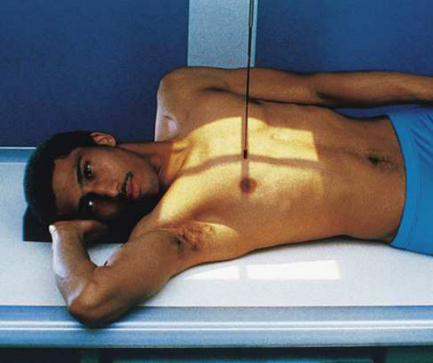
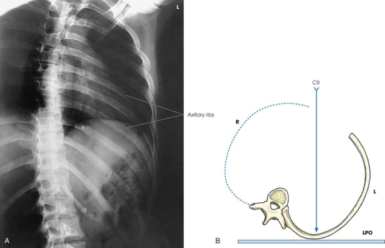

# Radiografie a grilajului costal axilar — incidență oblică antero-posterioară (AP) — RPO sau oblică posterioară stângă (OPS / LPO) (Merrill)

  📷 Radiografie Convențională (Rx)
  <strong>Actualizat:</strong> 2026-09-16
  <strong>Autor:</strong> Referință Merrill

---

-   __1. Rezumat Clinic & Indicații__

    ---

    === "Indicații Clinice"

        - Conform reperelor anatomice standard din tratat

    === "Ghid Național IRIS"

        !!! info "Referință Primară: Ghidul Național IRIS (Ordinul MS 1342/2012)"
            - **Capitol Ghid IRIS:** *Torace & Pulmon*
            - **Grad de Recomandare:** **Grad A**
            - **Nivel de Iradiere Estimată:** `Clasa 1 (Minimă < 0.1 mSv)`

            [:octicons-search-16: Deschide Ghidul IRIS](../../iris.md){ .md-button .md-button--primary } [:material-open-in-new: Aplicația Oficială PWA](https://radiologie-pediatrica.ro/iris/){ .md-button target="_blank" rel="noopener" }

-   __2. Poziționare & Centrare Fascicul__

    ---

    - **Poziție Pacient:** Examinați pacientul în ortostatism sau în decubit. Dacă nu este contraindicat de starea pacientului, utilizați ortostatismul pentru imaginea coastelor (grilajului costal) deasupra cupolelor diafragmatice și decubitul pentru imaginea coastelor (grilajului costal) sub cupolele diafragmatice. Gravitația ajută la deplasarea cupolelor diafragmatice.; poziționați corpul pacientului pentru o incidență oblică AP la 45 de grade, utilizând RPO sau poziția oblică posterioară stângă (OPS / LPO). Plasați partea afectată cel mai aproape de receptorul de imagine. Centrați partea afectată pe planul longitudinal trasat la jumătatea distanței dintre MSP și suprafața laterală a corpului. Poziționați acest plan pe linia mediană a grilei. Dacă pacientul este în decubit, susțineți șoldul ridicat. Abduceți brațul de partea afectată și ridicați-l pentru a îndepărta omoplatul (scapula) de cutia toracică. Sprijiniți mâna pacientului pe cap dacă se utilizează ortostatismul (Fig. 10.37) sau plasați mâna sub sau deasupra capului dacă se utilizează decubitul (Fig. 10.38). Abduceți membrul opus, cu mâna pe șold. Centrați receptorul de imagine cu partea superioară la 1½ țoli (3.8 cm) deasupra marginii superioare a umărului relaxat pentru imaginea coastelor (grilajului costal) deasupra cupolelor diafragmatice sau la punctul situat la jumătatea distanței dintre apendicele xifoid și marginea inferioară a coastelor pentru imaginea coastelor (grilajului costal) sub cupolele diafragmatice. Efectuați ecranarea gonadelor cu șorț plumbat.
    - **Punct de Centrare Fascicul:** Perpendicular pe centrul receptorului de imagine. Cel mai apropiat de receptorul de imagine [fragment incomplet în sursă].
    - **Distanță Focar-Film (DFF / SID):** Nespecificat în fragmentul extras; de verificat în sursă
    - **Comandă Respiratorie:** Apnee la sfârșitul inspirului profund complet pentru coaste (grilaj costal) deasupra cupolelor diafragmatice și la sfârșitul expirului profund pentru coaste (grilaj costal) sub cupolele diafragmatice.

-   __3. Parametri Tehnici Expunere__

    ---

    | Parametru Tehnic | Valoare Configurare Generator / Tub |
    |:-----------------|:-------------------------------------|
    | **Tensiune Tub (kV)** | DE CONFIGURAT PE APARAT |
    | **Sarcină / Produs Curent-Timp (mAs)** | DE CONFIGURAT PE APARAT |
    | **Distanță Focar-Film (DFF / SID)** | Nespecificat în fragmentul extras; de verificat în sursă |
    | **Grilă Antidifuzoare (Bucky)** | DE CONFIGURAT PE APARAT |
    | **Dimensiune Focar** | DE CONFIGURAT PE APARAT |
    | **Camere de Ionizare AEC** | DE CONFIGURAT PE APARAT |
    | **Colimare Fascicul** | Se ajustează câmpul de iradiere la formatul 35 × 43 cm pe colimator. Se plasează markerul de lateralitate în câmpul colimat. |
    | **Filtrare Tub** | DE CONFIGURAT PE APARAT |

-   __4. Criterii de Calitate & Reușită Imagine__

    ---

    - Criterii radiologice de calitate a imaginii:
    - Colimare adecvată vizibilă și prezența markerului de lateralitate (D/S) plasat în afara structurilor anatomice de interes
    - Distanța dintre coloana vertebrală și marginea laterală a coastelor de pe partea afectată este de aproximativ două ori mai mare decât cea prezentă pe partea neafectată.
    - Porțiunea axilară a coastelor (grilajului costal) liberă de suprapunerea cu coloana toracală
    - Coastele de la prima până la a zecea vizibile deasupra cupolelor diafragmatice pentru coastele superioare
    - Coastele de la a opta până la a douăsprezecea vizibile sub cupolele diafragmatice pentru coastele inferioare
    - Coastele (grilajul costal) vizibile prin plămâni sau abdomen, în funcție de regiunea examinată.
    - Detalii trabeculare osoase și țesuturile moi înconjurătoare

-   __5. Protecție Radiologică (ALARA)__

    ---

    - Nespecificat în fragmentul extras; de verificat în sursă

!!! note "Observații Clinice & Tehnice"
    Conform reperelor anatomice standard din tratat

### 🖼️ Imagini

<figure class="protocol-image-card" markdown>

<figcaption><strong>Merrill — pagina 820, imaginea 1</strong> — Imagine din fragmentul sursă; asocierea necesită revizie.</figcaption>

</figure>

<figure class="protocol-image-card" markdown>

<figcaption><strong>Merrill — pagina 820, imaginea 2</strong> — Imagine din fragmentul sursă; asocierea necesită revizie.</figcaption>

</figure>

<figure class="protocol-image-card" markdown>

<figcaption><strong>Merrill — pagina 821, imaginea 3</strong> — Imagine din fragmentul sursă; asocierea necesită revizie.</figcaption>

</figure>

=== "Ghid Rapid de Execuție"

    1. **Identificarea și verificarea pacientului:** verificare identitate, zonă de examinat, consimțământ conform procedurii și evaluarea posibilității unei sarcini, când este relevantă.
    2. **Pregătire:** îndepărtarea oricăror obiecte radiopace (bijuterii, agrafe, fermoare, proteze, pansamente dense).
    3. **Poziționare precisă:** alinierea receptorului de imagine și a tubului la distanța prescrisă (Nespecificat în fragmentul extras; de verificat în sursă).
    4. **Colimare strictă:** adaptarea fasciculului strict la regiunea de diagnostic pentru scăderea iradierii și reducerea radiației difuze.
    5. **Radioprotecție:** verificarea [politicii RX](../radioprotectie.md), cu măsuri distincte pentru pacient, personal și însoțitor.

## Surse de documentare

- [Merrill’s Atlas, 10. Bony Thorax, pagini 819–821](https://books.google.com/books/about/Merrill_s_Atlas_of_Radiographic_Position.html?id=BM0lEQAAQBAJ)
