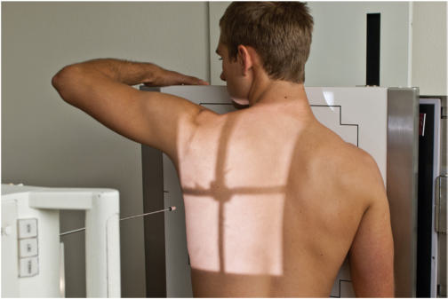
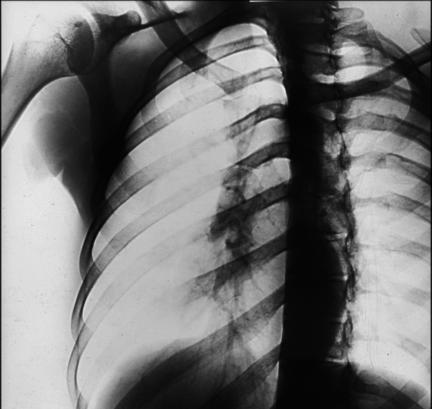
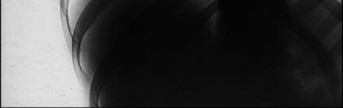

# Rx grilaj costal axilar — incidență oblică PA (deasupra diafragmei)

  📷 Radiografie Convențională (Rx)
  <strong>Actualizat:</strong> 2026-09-15
  <strong>Autor:</strong> Departamentul de Radiologie / Referință Bontrager

---

-   __1. Rezumat Clinic & Indicații__

    ---

    === "Indicații Clinice"

        - Patologia coastelor (grilaj costal), inclusiv suspiciunea de fractură și procesele neoplazice, în poziții oblice va evidenția porțiunea axilară a coastelor (grilaj costal), care nu este vizibilă adecvat în incidențele AP/PA.

    === "Ghid Național IRIS"

        !!! info "Referință Primară: Ghidul Național IRIS (Ordinul MS 1342/2012)"
            - **Capitol Ghid IRIS:** *Torace & Pulmon*
            - **Grad de Recomandare:** **Grad A**
            - **Nivel de Iradiere Estimată:** `Clasa 1 (Minimă < 0.1 mSv)`

            [:octicons-search-16: Deschide Ghidul IRIS](../../iris.md){ .md-button .md-button--primary } [:material-open-in-new: Aplicația Oficială PWA](https://radiologie-pediatrica.ro/iris/){ .md-button target="_blank" rel="noopener" }

-   __2. Poziționare & Centrare Fascicul__

    ---

    - **Poziție Pacient:** Pacient: în ortostatism, cu fața spre stativul Bucky vertical, sau în decubit ventral, dacă starea pacientului o impune. Regiune anatomică: rotiți pacientul într-o poziție oblică anterioară la 45°, cu partea afectată îndepărtată de receptorul de imagine (Fig. 10.42). Ridicați brațul de pe partea ridicată deasupra capului; întindeți brațul opus în jos și în spatele pacientului, îndepărtându-l de torace. În decubit, flectați genunchiul de pe partea ridicată pentru a ajuta la menținerea poziției și sprijiniți toracele cu bureți de poziționare, dacă este necesar. Aliniați toracele la linia mediană a receptorului de imagine. Asigurați-vă că partea de interes nu este exclusă din imagine.
    - **Punct de Centrare Fascicul:** Perpendiculară pe receptorul de imagine, centrată la nivelul T7, situat la 7 până la 8 inci sub vertebra proeminentă (apofiza spinoasă C7).
    - **Distanță Focar-Film (DFF / SID):** 100 cm
    - **Comandă Respiratorie:** Apnee pe durata expunerii, în inspir.

-   __3. Parametri Tehnici Expunere__

    ---

    | Parametru Tehnic | Valoare Configurare Generator / Tub |
    |:-----------------|:-------------------------------------|
    | **Tensiune Tub (kV)** | 75-85 kV |
    | **Sarcină / Produs Curent-Timp (mAs)** | DE CONFIGURAT PE APARAT |
    | **Distanță Focar-Film (DFF / SID)** | 100 cm |
    | **Grilă Antidifuzoare (Bucky)** | Cu grilă antidifuzoare Bucky |
    | **Dimensiune Focar** | Focar Mic (0.6 mm) |
    | **Camere de Ionizare AEC** | Camerele laterale (sau camera centrală, în funcție de regiune) |
    | **Colimare Fascicul** | Se colimează la nivelul regiunii de interes. |
    | **Filtrare Tub** | Totală ≥ 2.5 mm Al echivalent |

-   __4. Criterii de Calitate & Reușită Imagine__

    ---

    - Coastele (grilajul costal) 1 până la 9 trebuie incluse și evidențiate deasupra cupolelor diafragmatice, iar porțiunea axilară a coastelor examinate trebuie proiectată fără suprapunerea acestora (Fig. 10.43). Poziție:
    - O incidență oblică realizată exact la 45° trebuie să evidențieze coastele axilare în profil, cu coloana vertebrală deplasată în afara ariei de interes diagnostic. Distanța dintre coloana toracală și marginea laterală a toracelui de pe partea de interes trebuie să fie aproximativ dublă față de cea de pe partea opusă.
    - Colimare la aria de interes diagnostic. Expunere:
    - Expunere optimă a receptorului de imagine și contrast adecvat pentru vizualizarea coastelor (grilaj costal) prin plămâni și umbra cordului sau prin organele abdominale dense, dacă sunt sub cupolele diafragmatice.
    - Fără mișcare, demonstrat prin contururi osoase nete. L Coaste axilare (grilaj costal). Fig. 10.43 Incidență oblică PA. (Adaptat după Rollins J, Long B, și colab.: Atlasul Merrill de poziționare și proceduri radiografice, ed. 15, St Louis, 2023, Elsevier.)

-   __5. Protecție Radiologică (ALARA)__

    ---

    - Ecranare gonadică și a organelor radiosensibile conform procedurilor locale de radioprotecție ALARA.
    - Colimare strictă la aria de interes pentru limitarea radiației difuze.
    - Verificarea posibilității unei sarcini la pacientele de vârstă fertilă înainte de expunere.

!!! note "Observații Clinice & Tehnice"
    Utilizarea unei distanțe SID de 72 inci (180 cm) și/sau dimensiunile reduse ale toracelui pot permite orientarea longitudinală a receptorului de imagine. Incidență suplimentară cu colimare: unele protocoale ale departamentelor includ o incidență cu colimare strânsă a regiunii traumatizate, realizată pe un receptor de imagine mai mic. Protocol de rutină pentru coaste (grilaj costal): coaste posterioare (AP) sau anterioare (PA) — examinare bilaterală sau unilaterală; coaste axilare (oblică anterioară sau posterioară); torace PA (vezi capitolul 2). Fig. 10.42 RAO — traumatism al coastelor anterioare stângi, deasupra cupolelor diafragmatice.

### 🖼️ Imagini

<figure class="protocol-image-card" markdown>

<figcaption><strong>Fig. 10.42 RAO — traumatism al coastelor anterioare stângi (grilaj costal), deasupra cupolelor diafragmatice.</strong> — Poziționarea pacientului conform Ghidului Bontrager (Fig. 10.42 RAO — traumatism al coastelor anterioare stângi, deasupra cupolelor diafragmatice.)</figcaption>

</figure>

<figure class="protocol-image-card" markdown>

<figcaption><strong>Fig. 10.43 Incidență oblică PA. (Adaptat după Rollins J, Long B,</strong> — Aspect radiografic de referință conform Ghidului Bontrager (Fig. 10.43 Incidență oblică PA. (Adaptat după Rollins J, Long B,)</figcaption>

</figure>

<figure class="protocol-image-card" markdown>

<figcaption><strong>Figura 3</strong> — Aspect radiografic de referință conform Ghidului Bontrager (Figura 3)</figcaption>

</figure>

=== "Ghid Rapid de Execuție"

    1. **Identificarea și verificarea pacientului:** verificare identitate, zonă de examinat, consimțământ conform procedurii și evaluarea posibilității unei sarcini, când este relevantă.
    2. **Pregătire:** îndepărtarea oricăror obiecte radiopace (bijuterii, agrafe, fermoare, proteze, pansamente dense).
    3. **Poziționare precisă:** alinierea receptorului de imagine și a tubului la distanța prescrisă (100 cm).
    4. **Colimare strictă:** adaptarea fasciculului strict la regiunea de diagnostic pentru scăderea iradierii și reducerea radiației difuze.
    5. **Radioprotecție:** verificarea [politicii RX](../radioprotectie.md), cu măsuri distincte pentru pacient, personal și însoțitor.

## Surse de documentare

- [Bontrager's Textbook of Radiographic Positioning (Ed. 9/10), Pagina 396](https://www.elsevier.com/books/textbook-of-radiographic-positioning-and-related-anatomy/lampignano/978-0-323-65367-1)
