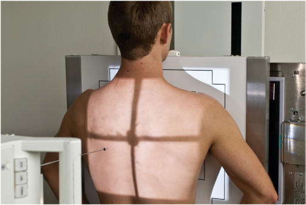
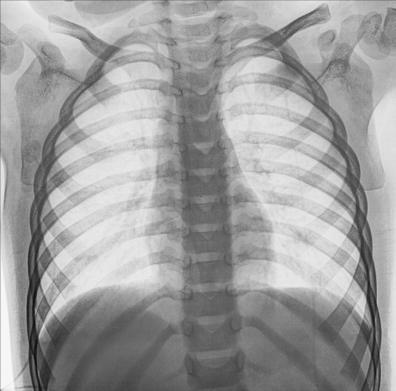
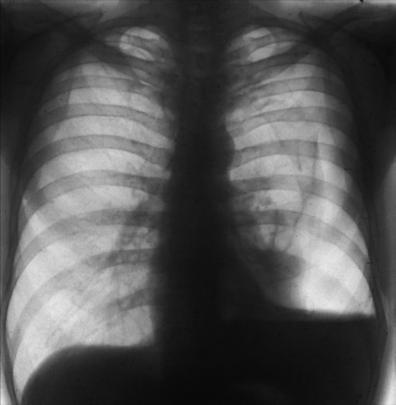

# Rx BILATERAL OR UNILATERAL Grilaj Costal Anterior PA (Postero-Anterior) (ABOVE DIAPHRAGM)

  📷 Radiografie Convențională (Rx)
  <strong>Actualizat:</strong> 2026-09-15
  <strong>Autor:</strong> Departamentul de Radiologie / Referință Bontrager

---

-   __1. Rezumat Clinic & Indicații__

    ---

    === "Indicații Clinice"

        - Pathology de anterior Coaste (Grilaj Costal), including suspiciune de fractură sau neoplastic processes Injuries la Coaste (Grilaj Costal) below cupole diafragmatice sunt generally la posterior Coaste (Grilaj Costal). pentru injuries la those Coaste (Grilaj Costal), only AP incidențe sunt indicated.

    === "Ghid Național IRIS"

        !!! info "Referință Primară: Ghidul Național IRIS (Ordinul MS 1342/2012)"
            - **Capitol Ghid IRIS:** *Ghidul Național IRIS*
            - **Grad de Recomandare:** **De verificat pe indicație; fără grad atribuit automat**
            - **Nivel de Iradiere Estimată:** `De verificat pentru examinarea și populația selectate`

            [:octicons-search-16: Deschide Ghidul IRIS](../../iris.md){ .md-button .md-button--primary } [:material-open-in-new: Aplicația Oficială PWA](https://radiologie-pediatrica.ro/iris/){ .md-button target="_blank" rel="noopener" }
-   __2. Poziționare & Centrare Fascicul__

    ---

    - **Poziție Pacient:** Pacient: Ortostatism, facing receptorul de imagine (Fig. 10.36). Exam poate fie performed Decubit ventral, if necessary, cu brațe slightly în abducție de la side.; Regiune anatomică: Align plan mediosagital la midline de receptorul de imagine, Rotate umeri anteriorly la remove scapulae de la câmpuri pulmonare. Allow Absența rotației anatomice: clavicule echidistante față de linia apofizelor spinoase de thorax sau Bazin (bazin (pelvis)).
    - **Punct de Centrare Fascicul:** perpendicular pe receptorul de imagine, centrat pe plan mediosagital, la nivelul T7 (7 la 8 inches [18 la 20 cm] below vertebra proeminentă (apofiza spinoasă C7) ca pentru PA Torace). See NOTE 2 pentru unilateral incidențe.
    - **Distanță Focar-Film (DFF / SID):** 100 cm
    - **Comandă Respiratorie:** Apnee pe durata expunerii pe inspiration.

-   __3. Parametri Tehnici Expunere__

    ---

    | Parametru Tehnic | Valoare Configurare Generator / Tub |
    |:-----------------|:-------------------------------------|
    | **Tensiune Tub (kV)** | 75-85 kV |
    | **Sarcină / Produs Curent-Timp (mAs)** | DE CONFIGURAT PE APARAT |
    | **Distanță Focar-Film (DFF / SID)** | 100 cm |
    | **Grilă Antidifuzoare (Bucky)** | Cu grilă antidifuzoare Bucky |
    | **Dimensiune Focar** | Focar Mic (0.6 mm) |
    | **Camere de Ionizare AEC** | Camerele laterale (sau camera centrală funcție de regiune) |
    | **Colimare Fascicul** | Collimate la region de interest. |
    | **Filtrare Tub** | Totală ≥ 2.5 mm Al echivalent |

-   __4. Criterii de Calitate & Reușită Imagine__

    ---

    - Optimally, Coaste (Grilaj Costal) 1 through 9 visualized above cupole diafragmatice (Fig. 10.38). poziție:
    - Absența rotației anatomice: clavicule echidistante față de linia apofizelor spinoase: width de Coaste (Grilaj Costal) este equidistant pe ambele părți (bilateral) de Coloană Toracală. expunere:
    - optim receptorul de imagine expunere și contrast la visualize Coaste (Grilaj Costal) through plămânii și heart.
    - fără mișcare, ca evidențiat prin net bony markings. Fig. 10.36 bilateral PA Coaste (Grilaj Costal)—above cupole diafragmatice. L Fig. 10.37 bilateral PA Coaste (Grilaj Costal)—above cupole diafragmatice. L Fig. 10.38 PA Ortostatism Torace (Torace technique). This evidențiază combination hemothorax (black arrows) și pneumotorax (white arrows) pe stâng side.

-   __5. Protecție Radiologică (ALARA)__

    ---

    - Ecranare gonadică și a organelor radiosensibile conform procedurilor locale de radioprotecție ALARA.
    - Colimare strictă la aria de interes pentru limitarea radiației difuze.
    - Verificarea posibilității unei sarcini la pacientele de vârstă fertilă înainte de expunere.

!!! note "Observații Clinice & Tehnice"
    la evidențiază specific traumatism acuttism / Regim Urgență la anterior Coaste (Grilaj Costal) along one side de thoracic cavity, perform unilateral rib study. Instead de aligning planul mediosagital la receptorul de imagine, se centrează side de interest la center de receptorul de imagine midway între plan mediosagital și lateral margin de thorax. raza centrală este perpendicular pe receptorul de imagine (RI) la level 3 la 4 inches (8 la 10 cm) below incizura jugulară (manubriul sternal). Collimate la Coaste (Grilaj Costal) de side de interest, și include Coloană Toracală. PA Ortostatism și lateral Torace Study common rib routine series typically includes Ortostatism PA și (sometimes) lateral Torace incidențe cu lung expunere techniques la rule out respiratory traumatism acuttism / Regim Urgență sau dysfunctions such ca pneumotorax (white arrows) sau hemothorax (black arrows), which poate accompany rib injuries (Fig. 10.37). Coaste (Grilaj Costal) ROUTINE posterior Coaste (Grilaj Costal) (AP) sau anterior Coaste (Grilaj Costal) (PA)—bilateral sau unilateral study Axillary Coaste (Grilaj Costal) (anterior sau posterior oblic) PA Torace (see Chapter 2)

### 🖼️ Imagini

<figure class="protocol-image-card" markdown>

<figcaption><strong>Fig. 10.36 bilateral PA Coaste (Grilaj Costal)—above cupole diafragmatice.</strong> — Poziționare pacient conform Ghidului Bontrager (Fig. 10.36 bilateral PA coaste—above cupole diafragmatice.)</figcaption>

</figure>

<figure class="protocol-image-card" markdown>

<figcaption><strong>Fig. 10.37 bilateral PA Coaste (Grilaj Costal)—above cupole diafragmatice.</strong> — Aspect radiografic de referință conform Ghidului Bontrager (Fig. 10.37 bilateral PA coaste—above cupole diafragmatice.)</figcaption>

</figure>

<figure class="protocol-image-card" markdown>

<figcaption><strong>Fig. 10.38 PA Ortostatism Torace (Torace technique). This evidențiază a</strong> — Aspect radiografic de referință conform Ghidului Bontrager (Fig. 10.38 PA în ortostatism chest (chest technique). This evidențiază a)</figcaption>

</figure>

=== "Ghid Rapid de Execuție"

    1. **Identificarea și verificarea pacientului:** verificare identitate, zonă de examinat, consimțământ conform procedurii și evaluarea posibilității unei sarcini, când este relevantă.
    2. **Pregătire:** îndepărtarea oricăror obiecte radiopace (bijuterii, agrafe, fermoare, proteze, pansamente dense).
    3. **Poziționare precisă:** alinierea receptorului de imagine și a tubului la distanța prescrisă (100 cm).
    4. **Colimare strictă:** adaptarea fasciculului strict la regiunea de diagnostic pentru scăderea iradierii și reducerea radiației difuze.
    5. **Radioprotecție:** verificarea [politicii RX](../radioprotectie.md), cu măsuri distincte pentru pacient, personal și însoțitor.

## Surse de documentare

- [Bontrager's Textbook of Radiographic Positioning (Ed. 9/10), Pagina 393](https://www.elsevier.com/books/textbook-of-radiographic-positioning-and-related-anatomy/lampignano/978-0-323-65367-1)
