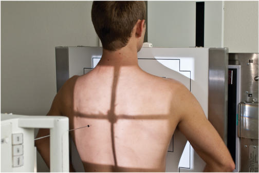
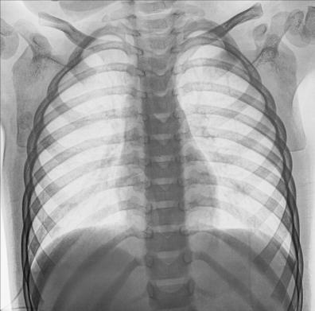
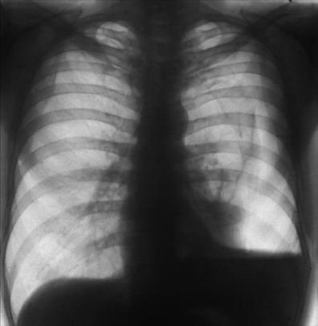

# Rx grilaj costal anterior bilateral sau unilateral PA (postero-anterior) (deasupra diafragmei)

  📷 Radiografie Convențională (Rx)
  <strong>Actualizat:</strong> 2026-09-15
  <strong>Autor:</strong> Departamentul de Radiologie / Referință Bontrager

---

-   __1. Rezumat Clinic & Indicații__

    ---

    === "Indicații Clinice"

        - Patologia coastelor anterioare (grilaj costal), inclusiv suspiciunea de fractură sau procesele neoplazice. Traumatismele coastelor de sub cupolele diafragmatice afectează în general coastele posterioare. Pentru traumatismele acestor coaste sunt indicate doar incidențe AP.

    === "Ghid Național IRIS"

        !!! info "Referință Primară: Ghidul Național IRIS (Ordinul MS 1342/2012)"
            - **Capitol Ghid IRIS:** *Torace & Pulmon*
            - **Grad de Recomandare:** **Grad A**
            - **Nivel de Iradiere Estimată:** `Clasa 1 (Minimă < 0.1 mSv)`

            [:octicons-search-16: Deschide Ghidul IRIS](../../iris.md){ .md-button .md-button--primary } [:material-open-in-new: Aplicația Oficială PWA](https://radiologie-pediatrica.ro/iris/){ .md-button target="_blank" rel="noopener" }

-   __2. Poziționare & Centrare Fascicul__

    ---

    - **Poziție Pacient:** Pacient: în ortostatism, cu fața spre receptorul de imagine (Fig. 10.36). Examinarea poate fi efectuată în decubit ventral, dacă este necesar, cu brațele ușor îndepărtate de corp. Regiune anatomică: aliniați planul mediosagital la linia mediană a receptorului de imagine. Rotiți umerii anterior pentru a îndepărta scapulele din câmpurile pulmonare. Asigurați absența rotației toracelui sau a bazinului (pelvisului): claviculele trebuie să fie echidistante față de linia apofizelor spinoase.
    - **Punct de Centrare Fascicul:** Perpendiculară pe receptorul de imagine, centrată în planul mediosagital, la nivelul T7 (la 7 până la 8 inci [18 până la 20 cm] sub vertebra proeminentă [apofiza spinoasă C7], ca pentru torace PA). Vezi NOTA 2 pentru incidențele unilaterale.
    - **Distanță Focar-Film (DFF / SID):** 100 cm
    - **Comandă Respiratorie:** Apnee pe durata expunerii, în inspir.

-   __3. Parametri Tehnici Expunere__

    ---

    | Parametru Tehnic | Valoare Configurare Generator / Tub |
    |:-----------------|:-------------------------------------|
    | **Tensiune Tub (kV)** | 75-85 kV |
    | **Sarcină / Produs Curent-Timp (mAs)** | DE CONFIGURAT PE APARAT |
    | **Distanță Focar-Film (DFF / SID)** | 100 cm |
    | **Grilă Antidifuzoare (Bucky)** | Cu grilă antidifuzoare Bucky |
    | **Dimensiune Focar** | Focar Mic (0.6 mm) |
    | **Camere de Ionizare AEC** | Camerele laterale (sau camera centrală, în funcție de regiune) |
    | **Colimare Fascicul** | Se colimează la nivelul regiunii de interes. |
    | **Filtrare Tub** | Totală ≥ 2.5 mm Al echivalent |

-   __4. Criterii de Calitate & Reușită Imagine__

    ---

    - În condiții optime, coastele (grilajul costal) 1 până la 9 sunt vizibile deasupra cupolelor diafragmatice (Fig. 10.38). Poziție:
    - Absența rotației anatomice: clavicule echidistante față de linia apofizelor spinoase; lățimea grilajului costal este egală de ambele părți ale coloanei toracale. Expunere:
    - Expunere optimă a receptorului de imagine și contrast adecvat pentru vizualizarea coastelor (grilajului costal) prin plămâni și cord.
    - Fără mișcare, demonstrat prin contururi osoase nete. Fig. 10.36 Coaste (grilaj costal) PA bilateral — deasupra cupolelor diafragmatice. L Fig. 10.37 Coaste (grilaj costal) PA bilateral — deasupra cupolelor diafragmatice. L Fig. 10.38 Torace PA în ortostatism (tehnică de expunere pentru torace). Imaginea evidențiază asocierea unui hemotorax (săgeți negre) cu un pneumotorax (săgeți albe) pe partea stângă.

-   __5. Protecție Radiologică (ALARA)__

    ---

    - Ecranare gonadică și a organelor radiosensibile conform procedurilor locale de radioprotecție ALARA.
    - Colimare strictă la aria de interes pentru limitarea radiației difuze.
    - Verificarea posibilității unei sarcini la pacientele de vârstă fertilă înainte de expunere.

!!! note "Observații Clinice & Tehnice"
    Pentru evidențierea unui traumatism acut specific al coastelor anterioare de pe o parte a cavității toracice, efectuați o examinare unilaterală a coastelor. În loc să aliniați planul mediosagital la receptorul de imagine, centrați partea de interes la centrul receptorului, la jumătatea distanței dintre planul mediosagital și marginea laterală a toracelui. Raza centrală este perpendiculară pe receptorul de imagine (RI), la 3 până la 4 inci (8 până la 10 cm) sub incizura jugulară (manubriul sternal). Colimați la coastele de pe partea de interes și includeți coloana toracală. Examinarea toracelui PA în ortostatism și de profil: seria obișnuită de rutină pentru coaste include, de regulă, incidențe toracice PA în ortostatism și, uneori, de profil, cu parametri de expunere pentru plămâni, pentru a exclude traumatisme sau disfuncții respiratorii precum pneumotoraxul (săgeți albe) sau hemotoraxul (săgeți negre), care pot însoți traumatismele costale (Fig. 10.37). Protocol de rutină pentru coaste (grilaj costal): coaste posterioare (AP) sau anterioare (PA) — examinare bilaterală sau unilaterală; coaste axilare (oblică anterioară sau posterioară); torace PA (vezi capitolul 2).

### 🖼️ Imagini

<figure class="protocol-image-card" markdown>

<figcaption><strong>Fig. 10.36 Coaste (grilaj costal) PA bilateral — deasupra cupolelor diafragmatice.</strong> — Poziționarea pacientului conform Ghidului Bontrager (Fig. 10.36 Coaste PA bilateral — deasupra cupolelor diafragmatice.)</figcaption>

</figure>

<figure class="protocol-image-card" markdown>

<figcaption><strong>Fig. 10.37 Coaste (grilaj costal) PA bilateral — deasupra cupolelor diafragmatice.</strong> — Aspect radiografic de referință conform Ghidului Bontrager (Fig. 10.37 Coaste PA bilateral — deasupra cupolelor diafragmatice.)</figcaption>

</figure>

<figure class="protocol-image-card" markdown>

<figcaption><strong>Fig. 10.38 Torace PA în ortostatism (tehnică de expunere pentru torace). Aceasta evidențiază o</strong> — Aspect radiografic de referință conform Ghidului Bontrager (Fig. 10.38 Torace PA în ortostatism [tehnică de expunere pentru torace]. Aceasta evidențiază o)</figcaption>

</figure>

=== "Ghid Rapid de Execuție"

    1. **Identificarea și verificarea pacientului:** verificare identitate, zonă de examinat, consimțământ conform procedurii și evaluarea posibilității unei sarcini, când este relevantă.
    2. **Pregătire:** îndepărtarea oricăror obiecte radiopace (bijuterii, agrafe, fermoare, proteze, pansamente dense).
    3. **Poziționare precisă:** alinierea receptorului de imagine și a tubului la distanța prescrisă (100 cm).
    4. **Colimare strictă:** adaptarea fasciculului strict la regiunea de diagnostic pentru scăderea iradierii și reducerea radiației difuze.
    5. **Radioprotecție:** verificarea [politicii RX](../radioprotectie.md), cu măsuri distincte pentru pacient, personal și însoțitor.

## Surse de documentare

- [Bontrager's Textbook of Radiographic Positioning (Ed. 9/10), Pagina 393](https://www.elsevier.com/books/textbook-of-radiographic-positioning-and-related-anatomy/lampignano/978-0-323-65367-1)
