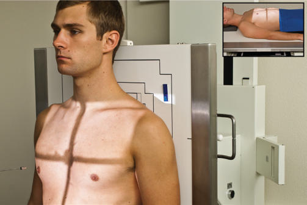
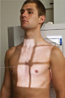
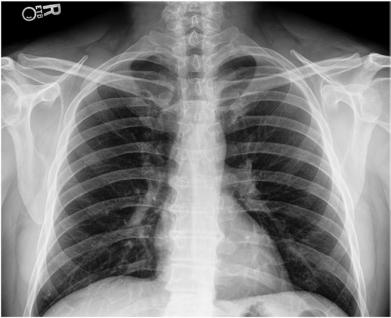
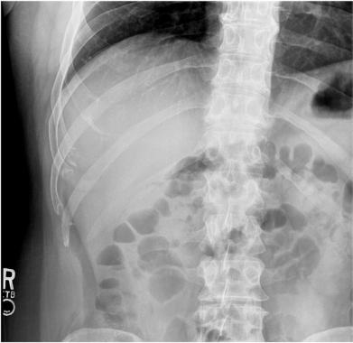

# Rx BILATERAL OR UNILATERAL POSTERIOR Coaste (Grilaj Costal) AP (Antero-Posterior) (ABOVE OR BELOW DIAPHRAGM)

  📷 Radiografie Convențională (Rx)
  <strong>Actualizat:</strong> 2026-09-15
  <strong>Autor:</strong> Departamentul de Radiologie / Referință Bontrager

---

-   __1. Rezumat Clinic & Indicații__

    ---

    === "Indicații Clinice"

        - Pathology of the posterior Coaste (Grilaj Costal), including suspiciune de fractură and neoplastic processes

    === "Ghid Național IRIS"

        !!! info "Referință Primară: Ghidul Național IRIS (Ordinul MS 1342/2012)"
            - **Capitol Ghid IRIS:** *Ghidul Național IRIS*
            - **Grad de Recomandare:** **De verificat pe indicație; fără grad atribuit automat**
            - **Nivel de Iradiere Estimată:** `De verificat pentru examinarea și populația selectate`

            [:octicons-search-16: Deschide Ghidul IRIS](../../iris.md){ .md-button .md-button--primary } [:material-open-in-new: Aplicația Oficială PWA](https://radiologie-pediatrica.ro/iris/){ .md-button target="_blank" rel="noopener" }
-   __2. Poziționare & Centrare Fascicul__

    ---

    - **Poziție Pacient:** Pacient: Above diaphragm: Ortostatism facing x-ray tube. May be performed as bilateral or unilateral study (Fig. 10.33A and C). Below diaphragm: Decubit Dorsal (Fig. 10.33B).; Regiune anatomică: Align midsagittal plane to center of IR. Raise chin to prevent it from superimposing the upper Coaste (Grilaj Costal); look straight ahead. Rotate shoulders anteriorly to remove scapulae from lung fields. Allow Absența rotației anatomice: clavicule echidistante față de linia apofizelor spinoase of thorax or Bazin (Pelvis).
    - **Punct de Centrare Fascicul:** Above diaphragm: Raza centrală (RC) perpendiculară pe receptorul de imagine, centered to the midsagittal plane, at the level of T7, located 3 or 4 inches (8 to 10 cm) below incizura jugulară (manubriul sternal) Below diaphragm: Raza centrală (RC) perpendiculară pe receptorul de imagine, centered to the midsagittal plane, at a level midway between the xiphoid process and the lower rib margin (see NOTE for unilateral projections)
    - **Distanță Focar-Film (DFF / SID):** 100 cm
    - **Comandă Respiratorie:** Suspend respiration on deep inspiration for Coaste (Grilaj Costal) above the diaphragm to depress the diaphragm and on full expiration for Coaste (Grilaj Costal) below the diaphragm to elevate the diaphragm.

-   __3. Parametri Tehnici Expunere__

    ---

    | Parametru Tehnic | Valoare Configurare Generator / Tub |
    |:-----------------|:-------------------------------------|
    | **Tensiune Tub (kV)** | 75-85 kV |
    | **Sarcină / Produs Curent-Timp (mAs)** | DE CONFIGURAT PE APARAT |
    | **Distanță Focar-Film (DFF / SID)** | 100 cm |
    | **Grilă Antidifuzoare (Bucky)** | Cu grilă antidifuzoare Bucky |
    | **Dimensiune Focar** | Focar Mic (0.6 mm) |
    | **Camere de Ionizare AEC** | Camerele laterale (sau camera centrală funcție de regiune) |
    | **Colimare Fascicul** | Collimate to region of interest. Belowdiaphragm rib images allow for increased collimation. |
    | **Filtrare Tub** | Totală ≥ 2.5 mm Al echivalent |

-   __4. Criterii de Calitate & Reușită Imagine__

    ---

    - Above diaphragm: Optimally, Coaste (Grilaj Costal) 1 through 9 should be visualized (Fig. 10.34). May only visualize Coaste (Grilaj Costal) 1 to 8 if patient is unable to take in a deep breath.
    - Below diaphragm: Minimally, Coaste (Grilaj Costal) 10 through 12 (minimum) should be visualized. If the ninth rib is not clearly visualized above the diaphragm, ensure it is fully included in the diaphragm radiograph (Fig. 10.35). Position:
    - Absența rotației anatomice: clavicule echidistante față de linia apofizelor spinoase: Width of Coaste (Grilaj Costal) is equidistant on both sides of the Coloană Toracală. Exposure:
    - Optimal image receptor exposure and contrast to visualize Coaste (Grilaj Costal) through the lungs and heart shadow above diaphragm or through the dense abdominal organs if below the diaphragm.
    - no motion, as demonstrated by sharp bony markings. Fig. 10.34 AP Coaste (Grilaj Costal)—above diaphragm. Fig. 10.35 AP below diaphragm, centered for right Coaste (Grilaj Costal).

-   __5. Protecție Radiologică (ALARA)__

    ---

    - Ecranare gonadică și a organelor radiosensibile conform procedurilor locale de radioprotecție ALARA.
    - Colimare strictă la aria de interes pentru limitarea radiației difuze.
    - Verificarea posibilității unei sarcini la pacientele de vârstă fertilă înainte de expunere.

!!! note "Observații Clinice & Tehnice"
    To demonstrate specific traumatism acuttism / Regim Urgență to posterior Coaste (Grilaj Costal) along one side of the thoracic cavity, perform a unilateral rib study. Instead of aligning the midsagittal plane to the IR, center the side of interest to the center of the IR midway between the midsagittal plane and the lateral margin of the thorax. The CR is perpendicular to the IR at a level 3 to 4 inches below the incizura jugulară (manubriul sternal) for Coaste (Grilaj Costal) above the diaphragm or at a level midway between the xiphoid process and the lower rib margin for Coaste (Grilaj Costal) below the diaphragm. Collimate to the Coaste (Grilaj Costal) of side of interest and include the Coloană Toracală. Coaste (Grilaj Costal) ROUTINE Posterior Coaste (Grilaj Costal) (AP) or anterior Coaste (Grilaj Costal) (PA)— bilateral or unilateral study Axillary Coaste (Grilaj Costal) (anterior or posterior oblique) PA Torace (see Chapter 2) A C B Fig. 10.33 (A) AP bilateral Ortostatism—above diaphragm. (B) AP bilateral Decubit Dorsal—below diaphragm. (C) AP unilateral Ortostatism—above diaphragm.

### 🖼️ Imagini

<figure class="protocol-image-card" markdown>

<figcaption><strong>Fig. 10.33 (A) AP bilateral Ortostatism—above diaphragm. (B) AP bilateral</strong> — Poziționare pacient conform Ghidului Bontrager (Fig. 10.33 (A) AP bilateral erect—above diaphragm. (B) AP bilateral)</figcaption>

</figure>

<figure class="protocol-image-card" markdown>

<figcaption><strong>Fig. 10.34 AP Coaste (Grilaj Costal)—above diaphragm.</strong> — Aspect radiografic de referință conform Ghidului Bontrager (Fig. 10.34 AP ribs—above diaphragm.)</figcaption>

</figure>

<figure class="protocol-image-card" markdown>

<figcaption><strong>Fig. 10.35 AP below diaphragm, centered for right Coaste (Grilaj Costal).</strong> — Aspect radiografic de referință conform Ghidului Bontrager (Fig. 10.35 AP below diaphragm, centered for right ribs.)</figcaption>

</figure>

<figure class="protocol-image-card" markdown>

<figcaption><strong>Figura 4</strong> — Aspect radiografic de referință conform Ghidului Bontrager (Figura 4)</figcaption>

</figure>

=== "Ghid Rapid de Execuție"

    1. **Identificarea și verificarea pacientului:** verificare identitate, zonă de examinat, consimțământ conform procedurii și evaluarea posibilității unei sarcini, când este relevantă.
    2. **Pregătire:** îndepărtarea oricăror obiecte radiopace (bijuterii, agrafe, fermoare, proteze, pansamente dense).
    3. **Poziționare precisă:** alinierea receptorului de imagine și a tubului la distanța prescrisă (100 cm).
    4. **Colimare strictă:** adaptarea fasciculului strict la regiunea de diagnostic pentru scăderea iradierii și reducerea radiației difuze.
    5. **Radioprotecție:** verificarea [politicii RX](../radioprotectie.md), cu măsuri distincte pentru pacient, personal și însoțitor.

## Surse de documentare

- [Bontrager's Textbook of Radiographic Positioning (Ed. 9/10), Pagina 392](https://www.elsevier.com/books/textbook-of-radiographic-positioning-and-related-anatomy/lampignano/978-0-323-65367-1)
