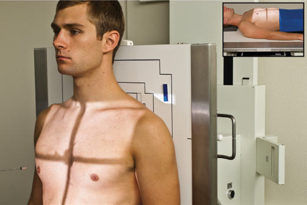
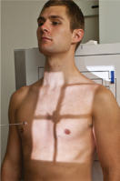
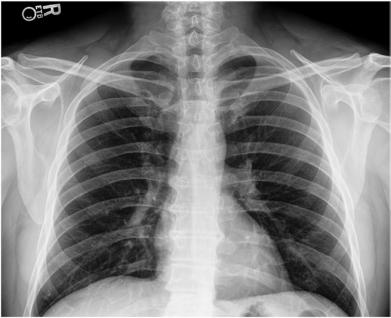
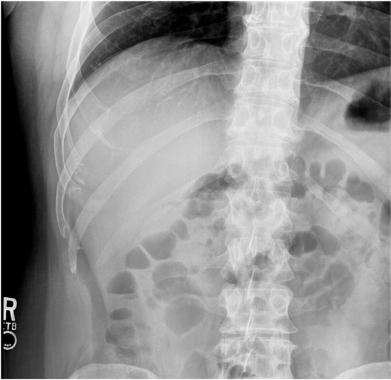

# Rx grilaj costal posterior bilateral sau unilateral AP (antero-posterior) (deasupra sau sub diafragmă)

  📷 Radiografie Convențională (Rx)
  <strong>Actualizat:</strong> 2026-09-15
  <strong>Autor:</strong> Departamentul de Radiologie / Referință Bontrager

---

-   __1. Rezumat Clinic & Indicații__

    ---

    === "Indicații Clinice"

        - Patologia coastelor posterioare (grilaj costal), inclusiv suspiciunea de fractură și procesele neoplazice.

    === "Ghid Național IRIS"

        !!! info "Referință Primară: Ghidul Național IRIS (Ordinul MS 1342/2012)"
            - **Capitol Ghid IRIS:** *Ghidul Național IRIS*
            - **Grad de Recomandare:** **De verificat pe indicație; fără grad atribuit automat**
            - **Nivel de Iradiere Estimată:** `De verificat pentru examinarea și populația selectate`

            [:octicons-search-16: Deschide Ghidul IRIS](../../iris.md){ .md-button .md-button--primary } [:material-open-in-new: Aplicația Oficială PWA](https://radiologie-pediatrica.ro/iris/){ .md-button target="_blank" rel="noopener" }
-   __2. Poziționare & Centrare Fascicul__

    ---

    - **Poziție Pacient:** Pacient: deasupra cupolelor diafragmatice: în ortostatism, cu fața spre tubul radiogen. Se poate efectua o examinare bilaterală sau unilaterală (Fig. 10.33A și C). Sub cupolele diafragmatice: în decubit dorsal (Fig. 10.33B). Regiune anatomică: aliniați planul mediosagital la centrul receptorului de imagine. Ridicați bărbia pentru a preveni suprapunerea acesteia peste coastele superioare; pacientul privește drept înainte. Rotiți umerii anterior pentru a îndepărta scapulele din câmpurile pulmonare. Asigurați absența rotației toracelui sau a bazinului (pelvisului): claviculele trebuie să fie echidistante față de linia apofizelor spinoase.
    - **Punct de Centrare Fascicul:** Deasupra cupolelor diafragmatice: raza centrală (RC) perpendiculară pe receptorul de imagine, centrată în planul mediosagital, la nivelul T7, situat la 3 sau 4 inci (8 până la 10 cm) sub incizura jugulară (manubriul sternal). Sub cupolele diafragmatice: raza centrală (RC) perpendiculară pe receptorul de imagine, centrată în planul mediosagital, la jumătatea distanței dintre apendicele xifoid și marginea costală inferioară (vezi NOTA pentru incidențele unilaterale).
    - **Distanță Focar-Film (DFF / SID):** 100 cm
    - **Comandă Respiratorie:** Apnee pe durata expunerii, în inspir profund pentru coastele (grilajul costal) deasupra cupolelor diafragmatice, pentru a coborî cupolele, și în expir complet pentru coastele de sub cupolele diafragmatice, pentru a ridica cupolele.

-   __3. Parametri Tehnici Expunere__

    ---

    | Parametru Tehnic | Valoare Configurare Generator / Tub |
    |:-----------------|:-------------------------------------|
    | **Tensiune Tub (kV)** | 75-85 kV |
    | **Sarcină / Produs Curent-Timp (mAs)** | DE CONFIGURAT PE APARAT |
    | **Distanță Focar-Film (DFF / SID)** | 100 cm |
    | **Grilă Antidifuzoare (Bucky)** | Cu grilă antidifuzoare Bucky |
    | **Dimensiune Focar** | Focar Mic (0.6 mm) |
    | **Camere de Ionizare AEC** | Camerele laterale (sau camera centrală, în funcție de regiune) |
    | **Colimare Fascicul** | Colimați la regiunea de interes. Imaginile costale subdiafragmatice permit o colimare mai strânsă. |
    | **Filtrare Tub** | Totală ≥ 2.5 mm Al echivalent |

-   __4. Criterii de Calitate & Reușită Imagine__

    ---

    - Deasupra cupolelor diafragmatice: în condiții optime, coastele (grilajul costal) 1 până la 9 trebuie să fie vizibile (Fig. 10.34). Este posibil să fie vizibile doar coastele 1 până la 8 dacă pacientul nu poate inspira profund.
    - Sub cupolele diafragmatice: trebuie să fie vizibile cel puțin coastele (grilajul costal) 10 până la 12. Dacă a noua coastă nu este vizibilă clar deasupra cupolelor diafragmatice, asigurați-vă că este inclusă integral pe radiografia cupolelor diafragmatice (Fig. 10.35). Poziție:
    - Absența rotației anatomice: clavicule echidistante față de linia apofizelor spinoase; lățimea grilajului costal este egală de ambele părți ale coloanei toracale. Expunere:
    - Expunere optimă a receptorului de imagine și contrast adecvat pentru vizualizarea coastelor (grilajului costal) prin plămâni și umbra cardiacă deasupra cupolelor diafragmatice sau prin organele abdominale dense, dacă sunt sub cupolele diafragmatice.
    - Fără mișcare, demonstrat prin contururi osoase nete. Fig. 10.34 Coaste (grilaj costal) AP — deasupra cupolelor diafragmatice. Fig. 10.35 AP sub cupolele diafragmatice, centrată pentru coastele drepte (grilaj costal).

-   __5. Protecție Radiologică (ALARA)__

    ---

    - Ecranare gonadică și a organelor radiosensibile conform procedurilor locale de radioprotecție ALARA.
    - Colimare strictă la aria de interes pentru limitarea radiației difuze.
    - Verificarea posibilității unei sarcini la pacientele de vârstă fertilă înainte de expunere.

!!! note "Observații Clinice & Tehnice"
    Pentru evidențierea unui traumatism acut specific al coastelor posterioare de pe o parte a cavității toracice, efectuați o examinare unilaterală a coastelor. În loc să aliniați planul mediosagital la receptorul de imagine, centrați partea de interes la centrul receptorului, la jumătatea distanței dintre planul mediosagital și marginea laterală a toracelui. Raza centrală este perpendiculară pe receptorul de imagine (RI), la 3 până la 4 inci sub incizura jugulară (manubriul sternal) pentru coastele deasupra cupolelor diafragmatice sau la jumătatea distanței dintre apendicele xifoid și marginea costală inferioară pentru coastele de sub cupolele diafragmatice. Colimați la coastele de pe partea de interes și includeți coloana toracală. Protocol de rutină pentru coaste (grilaj costal): coaste posterioare (AP) sau anterioare (PA) — examinare bilaterală sau unilaterală; coaste axilare (oblică anterioară sau posterioară); torace PA (vezi capitolul 2). C B Fig. 10.33 (A) AP bilateral în ortostatism — deasupra cupolelor diafragmatice. (B) AP bilateral în decubit dorsal — sub cupolele diafragmatice. (C) AP unilateral în ortostatism — deasupra cupolelor diafragmatice.

### 🖼️ Imagini

<figure class="protocol-image-card" markdown>

<figcaption><strong>Fig. 10.33 (A) AP bilateral în ortostatism — deasupra cupolelor diafragmatice. (B) AP bilateral</strong> — Poziționarea pacientului conform Ghidului Bontrager (Fig. 10.33 (A) AP bilateral în ortostatism — deasupra cupolelor diafragmatice. (B) AP bilateral)</figcaption>

</figure>

<figure class="protocol-image-card" markdown>

<figcaption><strong>Fig. 10.34 Coaste (grilaj costal) AP — deasupra cupolelor diafragmatice.</strong> — Aspect radiografic de referință conform Ghidului Bontrager (Fig. 10.34 Coaste AP — deasupra cupolelor diafragmatice.)</figcaption>

</figure>

<figure class="protocol-image-card" markdown>

<figcaption><strong>Fig. 10.35 AP sub cupolele diafragmatice, centrată pentru coastele drepte (grilaj costal).</strong> — Aspect radiografic de referință conform Ghidului Bontrager (Fig. 10.35 AP sub cupolele diafragmatice, centrată pentru coastele drepte.)</figcaption>

</figure>

<figure class="protocol-image-card" markdown>

<figcaption><strong>Figura 4</strong> — Aspect radiografic de referință conform Ghidului Bontrager (Figura 4)</figcaption>

</figure>

=== "Ghid Rapid de Execuție"

    1. **Identificarea și verificarea pacientului:** verificare identitate, zonă de examinat, consimțământ conform procedurii și evaluarea posibilității unei sarcini, când este relevantă.
    2. **Pregătire:** îndepărtarea oricăror obiecte radiopace (bijuterii, agrafe, fermoare, proteze, pansamente dense).
    3. **Poziționare precisă:** alinierea receptorului de imagine și a tubului la distanța prescrisă (100 cm).
    4. **Colimare strictă:** adaptarea fasciculului strict la regiunea de diagnostic pentru scăderea iradierii și reducerea radiației difuze.
    5. **Radioprotecție:** verificarea [politicii RX](../radioprotectie.md), cu măsuri distincte pentru pacient, personal și însoțitor.

## Surse de documentare

- [Bontrager's Textbook of Radiographic Positioning (Ed. 9/10), Pagina 392](https://www.elsevier.com/books/textbook-of-radiographic-positioning-and-related-anatomy/lampignano/978-0-323-65367-1)
