# Rx ▪ Bony trabecular detail and surrounding soft tissues — Incidență de Profil (Lateral) — Profil Drept sau Stâng (Merrill)

  📷 Radiografie Convențională (Rx)
  <strong>Actualizat:</strong> 2026-09-16
  <strong>Autor:</strong> Referință Merrill

---

-   __1. Rezumat Clinic & Indicații__

    ---

    === "Indicații Clinice"

        - Conform reperelor anatomice standard din tratat

    === "Ghid Național IRIS"

        !!! info "Referință Primară: Ghidul Național IRIS (Ordinul MS 1342/2012)"
            - **Capitol Ghid IRIS:** *Ghidul Național IRIS*
            - **Grad de Recomandare:** **De verificat pe indicație; fără grad atribuit automat**
            - **Nivel de Iradiere Estimată:** `De verificat pentru examinarea și populația selectate`

            [:octicons-search-16: Deschide Ghidul IRIS](../../iris.md){ .md-button .md-button--primary } [:material-open-in-new: Aplicația Oficială PWA](https://radiologie-pediatrica.ro/iris/){ .md-button target="_blank" rel="noopener" }
-   __2. Poziționare & Centrare Fascicul__

    ---

    - **Poziție Pacient:** se așază pacientul în Incidență de Profil (lateral), either Poziție Șezândă sau în ortostatism, before stativ vertical Bucky. If în ortostatism poziție este used, weight de pacientul’s corp trebuie să fie equally distributed pe picioarele.; Se instruiește pacientul să clasp mâinile behind corp și se rotește umeri posteriorly ca far ca possible (see Figs. 3.19 și 3.20). This poziție keeps superimposed shadows de brațele de la obscuring structures de superior mediastinum. se ajustează pacient’s poziție la se centrează airway la linia mediană receptorul de imagine. trachea lies în plan coronal that passes approximately midway între incizură jugulară (furculiță sternală) și planul mediocoronal. se centrează receptorul de imagine la nivelul laryngeal prominence (pentru Căi Aeriene Superioare) sau manubriu sternal (pentru laringe și superior mediastinum). Readjust poziție de corp, being careful la have planul mediosagital vertical și paralel cu plane de receptorul de imagine. se extinde neck slightly. se efectuează ecranarea gonadelor cu șorț plumbat.
    - **Punct de Centrare Fascicul:** orizontal through planul mediocoronal la nivelul laryngeal prominence (pentru Căi Aeriene Superioare [Fig. 3.21]) sau la nivelul incizură jugulară (furculiță sternală) through point midway între incizură jugulară (furculiță sternală) și planul mediocoronal (pentru trachea și superior mediastinum [Fig. 3.22])
    - **Distanță Focar-Film (DFF / SID):** Nespecificat în fragmentul extras; de verificat în sursă
    - **Comandă Respiratorie:** expunere este made during slow inspiration la ensure that trachea este filled cu air.

-   __3. Parametri Tehnici Expunere__

    ---

    | Parametru Tehnic | Valoare Configurare Generator / Tub |
    |:-----------------|:-------------------------------------|
    | **Tensiune Tub (kV)** | DE CONFIGURAT PE APARAT |
    | **Sarcină / Produs Curent-Timp (mAs)** | DE CONFIGURAT PE APARAT |
    | **Distanță Focar-Film (DFF / SID)** | Nespecificat în fragmentul extras; de verificat în sursă |
    | **Grilă Antidifuzoare (Bucky)** | DE CONFIGURAT PE APARAT |
    | **Dimensiune Focar** | DE CONFIGURAT PE APARAT |
    | **Camere de Ionizare AEC** | DE CONFIGURAT PE APARAT |
    | **Colimare Fascicul** | Adjust câmp de iradiere la 12 inches (30 cm) longitudinal și 1 inch (2.5 cm) beyond skin line de anterior și posterior surfaces but nu greater than 10 inches (24 cm). Place marker de lateralitate (D/S) în collimated expunere field. |
    | **Filtrare Tub** | DE CONFIGURAT PE APARAT |

-   __4. Criterii de Calitate & Reușită Imagine__

    ---

    - Criterii radiologice de calitate imaginii:
    - Evidence de corect collimation și presence de marker de lateralitate (D/S) plasat clear de anatomy de interest
    - Air-filled Căi Aeriene Superioare, de la faringe la proximal trachea (pentru Căi Aeriene Superioare)
    - Air-filled airway, de la midcervical la midthoracic region (pentru trachea și superior mediastinum)
    - Absența rotației anatomice (simetrie bilaterală perfectă) sau tilt de Coloană Cervicală
    - Superimposed zygapophyseal articulații și open intervertebral articulații
    - Superimposed sau nearly superimposed ramuri mandibulare
    - Bony detalii trabeculare osoase și surrounding soft tissues
    - Se instruiește pacientul să sit sau stand în ortostatism. If în ortostatism poziție este used, weight de corp trebuie să fie equally distributed pe picioarele.
    - se poziționează pacientul’s cap în ortostatism, facing directly forward.
    - Se instruiește pacientul să depress umerii și hold them în contact cu grila device la carry clavicles below lung apexuri (vârfuri pulmonare). Except în presence de upper thoracic scoliosis, faulty corp poziție poate fie detected prin asimetric appearance de articulații sternoclaviculare. Compare clavicular margins în Figs. 3.27 și 3.28. lateral Criteria pentru lateral incidențe, procedures sunt ca follows:
    - Place side de interest pe / sprijinit de receptorul de imagine holder.
    - Se instruiește pacientul să stand astfel încât weight este equally distributed pe picioarele. pacientul trebuie să nu lean spre sau away de la receptorul de imagine holder.
    - Raise pacientul’s brațe la prevent părți moi de brațele de la superimposing câmpuri pulmonare.
    - Se instruiește pacientul să face straight ahead și raise bărbia.
    - la determine rotație, examine posterior aspects de Coaste (Grilaj Costal). radiografii fără rotație show superimposed posterior Coaste (Grilaj Costal) (see Figs. 3.25 și 3.26). oblic Criteria în oblic incidențe, pacientul rotates șoldurile cu thorax și points picioarele directly forward. umerii trebuie să lie în same plan transversal pe toate radiografii.

-   __5. Protecție Radiologică (ALARA)__

    ---

    - Nespecificat în fragmentul extras; de verificat în sursă

!!! note "Observații Clinice & Tehnice"
    Conform reperelor anatomice standard din tratat

### 🖼️ Imagini

<figure class="protocol-image-card" markdown>

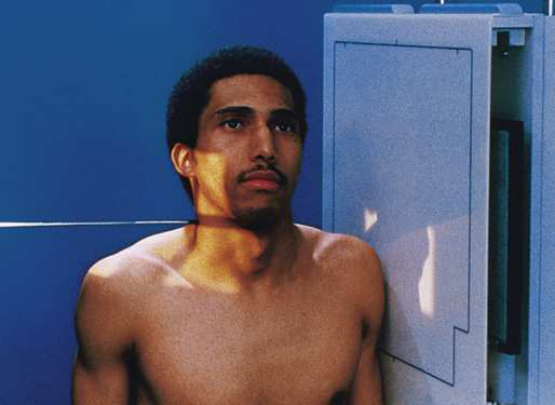

<figcaption><strong>Merrill — pagina PDF 154, imaginea 1</strong> — Imagine din fragmentul sursă; asocierea necesită revizie.</figcaption>

</figure>

<figure class="protocol-image-card" markdown>

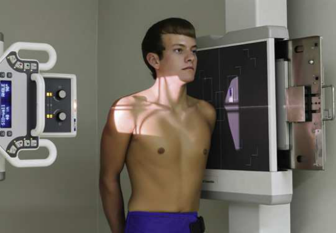

<figcaption><strong>Merrill — pagina PDF 155, imaginea 2</strong> — Imagine din fragmentul sursă; asocierea necesită revizie.</figcaption>

</figure>

<figure class="protocol-image-card" markdown>

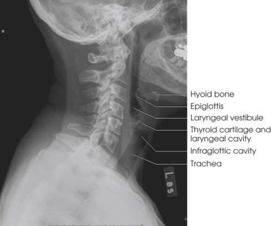

<figcaption><strong>Merrill — pagina PDF 156, imaginea 3</strong> — Imagine din fragmentul sursă; asocierea necesită revizie.</figcaption>

</figure>

<figure class="protocol-image-card" markdown>

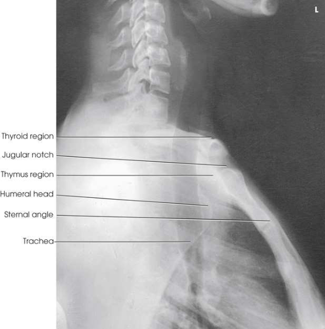

<figcaption><strong>Merrill — pagina PDF 157, imaginea 4</strong> — Imagine din fragmentul sursă; asocierea necesită revizie.</figcaption>

</figure>

<figure class="protocol-image-card" markdown>

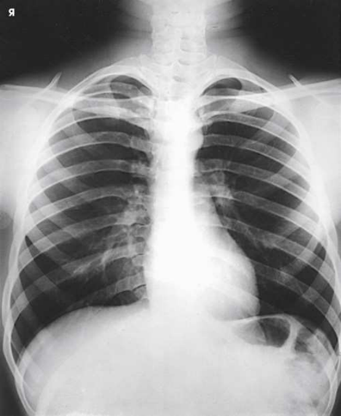

<figcaption><strong>Merrill — pagina PDF 158, imaginea 5</strong> — Imagine din fragmentul sursă; asocierea necesită revizie.</figcaption>

</figure>

<figure class="protocol-image-card" markdown>

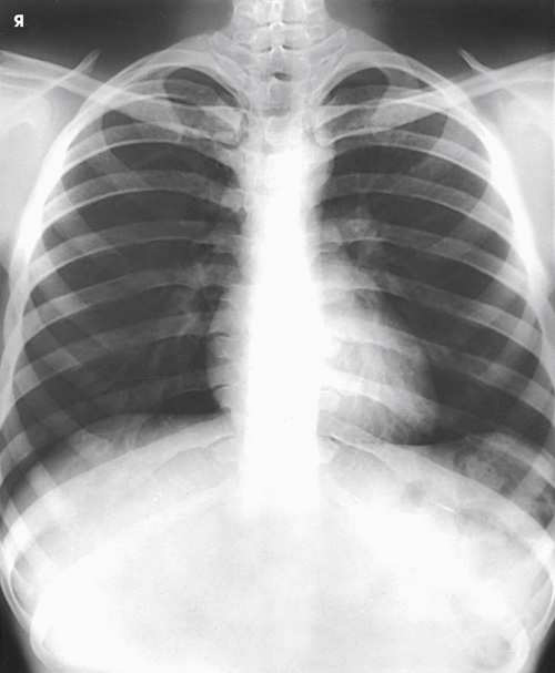

<figcaption><strong>Merrill — pagina PDF 159, imaginea 6</strong> — Imagine din fragmentul sursă; asocierea necesită revizie.</figcaption>

</figure>

<figure class="protocol-image-card" markdown>

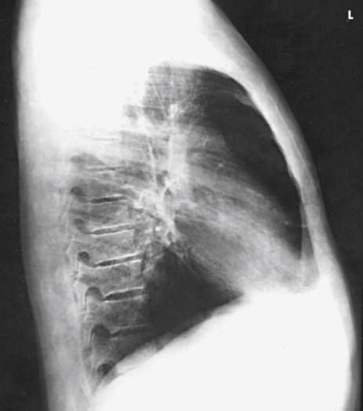

<figcaption><strong>Merrill — pagina PDF 160, imaginea 7</strong> — Imagine din fragmentul sursă; asocierea necesită revizie.</figcaption>

</figure>

<figure class="protocol-image-card" markdown>

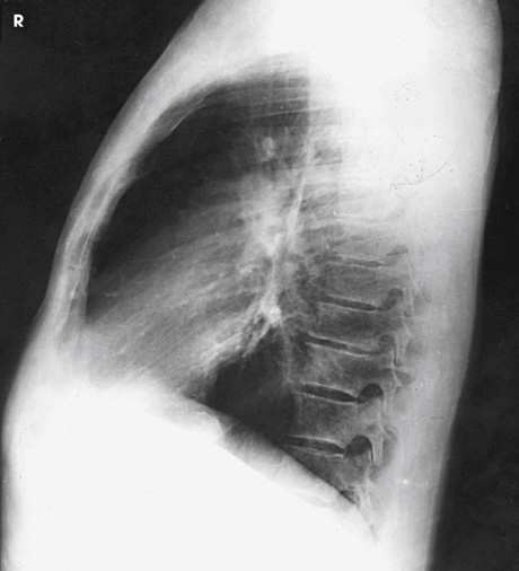

<figcaption><strong>Merrill — pagina PDF 161, imaginea 8</strong> — Imagine din fragmentul sursă; asocierea necesită revizie.</figcaption>

</figure>

<figure class="protocol-image-card" markdown>

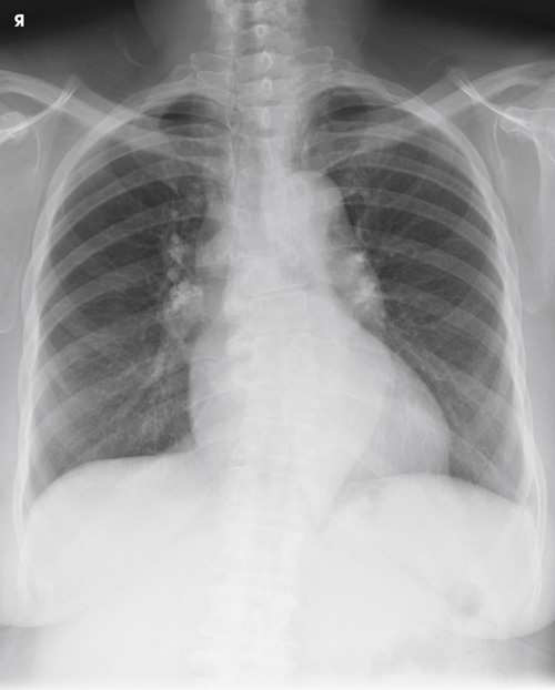

<figcaption><strong>Merrill — pagina PDF 162, imaginea 9</strong> — Imagine din fragmentul sursă; asocierea necesită revizie.</figcaption>

</figure>

<figure class="protocol-image-card" markdown>

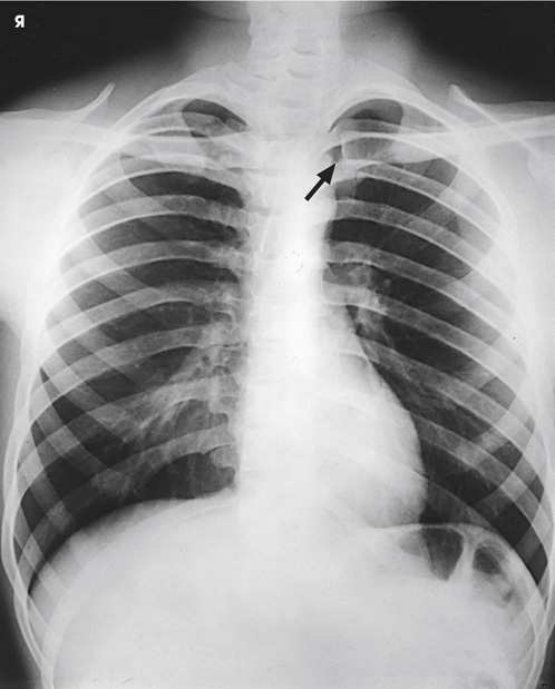

<figcaption><strong>Merrill — pagina PDF 163, imaginea 10</strong> — Imagine din fragmentul sursă; asocierea necesită revizie.</figcaption>

</figure>

<figure class="protocol-image-card" markdown>

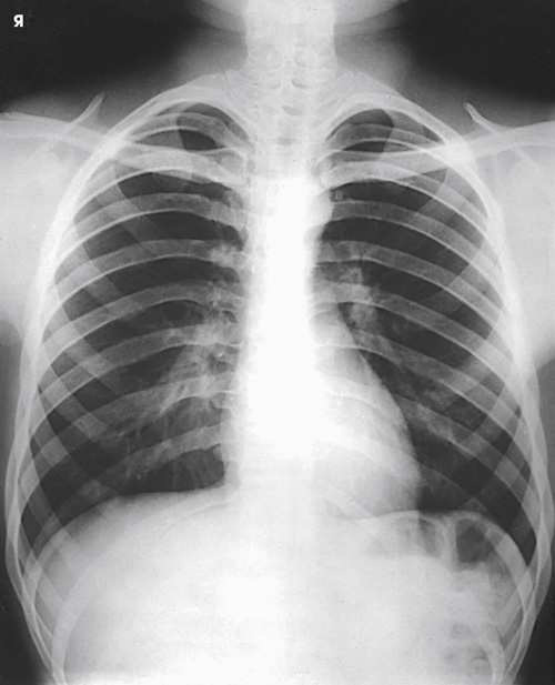

<figcaption><strong>Merrill — pagina PDF 164, imaginea 11</strong> — Imagine din fragmentul sursă; asocierea necesită revizie.</figcaption>

</figure>

<figure class="protocol-image-card" markdown>

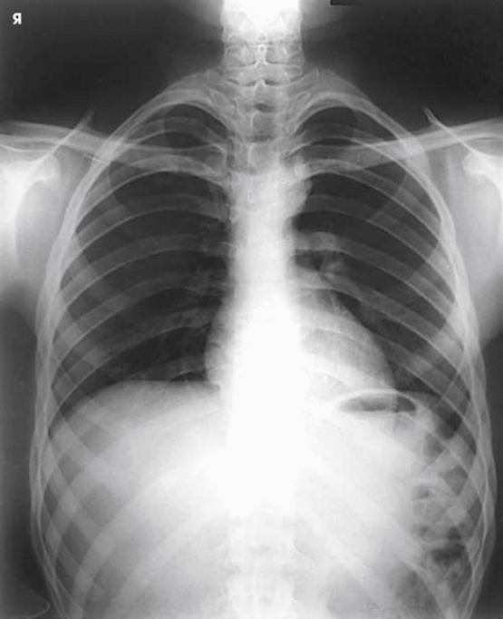

<figcaption><strong>Merrill — pagina PDF 165, imaginea 12</strong> — Imagine din fragmentul sursă; asocierea necesită revizie.</figcaption>

</figure>

<figure class="protocol-image-card" markdown>

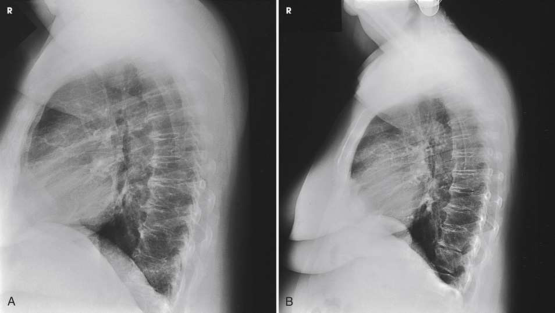

<figcaption><strong>Merrill — pagina PDF 166, imaginea 13</strong> — Imagine din fragmentul sursă; asocierea necesită revizie.</figcaption>

</figure>

<figure class="protocol-image-card" markdown>

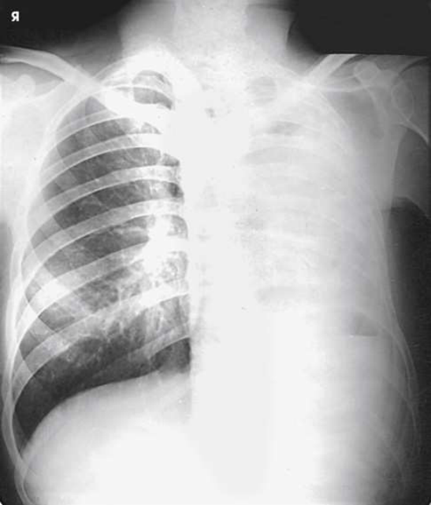

<figcaption><strong>Merrill — pagina PDF 166, imaginea 14</strong> — Imagine din fragmentul sursă; asocierea necesită revizie.</figcaption>

</figure>

=== "Ghid Rapid de Execuție"

    1. **Identificarea și verificarea pacientului:** verificare identitate, zonă de examinat, consimțământ conform procedurii și evaluarea posibilității unei sarcini, când este relevantă.
    2. **Pregătire:** îndepărtarea oricăror obiecte radiopace (bijuterii, agrafe, fermoare, proteze, pansamente dense).
    3. **Poziționare precisă:** alinierea receptorului de imagine și a tubului la distanța prescrisă (Nespecificat în fragmentul extras; de verificat în sursă).
    4. **Colimare strictă:** adaptarea fasciculului strict la regiunea de diagnostic pentru scăderea iradierii și reducerea radiației difuze.
    5. **Radioprotecție:** verificarea [politicii RX](../radioprotectie.md), cu măsuri distincte pentru pacient, personal și însoțitor.

## Surse de documentare

- [Merrill’s Atlas, 3. Thoracic Viscera: Chest and Upper Airway, pagini PDF 153–166](../../assets/protocols/sources/a56d45c16829_Merrills_Atlas_of_Radiographic_Positioning__Procedures_3Vol_Set.pdf#page=153)

## Fragmente sursă traduse (referință tehnică)

### anatomy

resulting imagine shows air-filled upper airway sau trachea și superior mediastinum. incidență pentru trachea și superior
mediastinum, first described prin Eiselberg și Sgalitzer, 1 este used la show retrosternal extensions de thyroid gland, thymic enlargement în
infants (în recumbent poziție), opacified faringe și upper esophagus, și outline de trachea și bronchi. It este also used la
locate Corp străin / corpuri străine radio-opace.

### collimation

• Adjust câmp de iradiere la 12 inches (30 cm) longitudinal și 1 inch (2.5 cm) beyond skin line de anterior și posterior surfaces but
nu greater than 10 inches (24 cm). Place marker de lateralitate (D/S) în collimated expunere field.

### cr

• orizontal through planul mediocoronal la nivelul laryngeal prominence (pentru upper airway [Fig. 3.21]) sau la nivelul incizură jugulară (furculiță sternală) through point midway între incizură jugulară (furculiță sternală) și planul mediocoronal (pentru trachea și superior mediastinum
[Fig. 3.22])

### criteria

Criterii radiologice de calitate imaginii:
• Evidence de corect collimation și presence de marker de lateralitate (D/S) plasat clear de anatomy de interest
• Air-filled upper airway, de la faringe la proximal trachea (pentru upper airway)
• Air-filled airway, de la midcervical la midthoracic region (pentru trachea și superior mediastinum)
• Absența rotației anatomice (simetrie bilaterală perfectă) sau tilt de cervical coloană vertebrală
• Superimposed zygapophyseal articulații și open intervertebral articulații
• Superimposed sau nearly superimposed ramuri mandibulare
• Bony detalii trabeculare osoase și surrounding soft tissues
• Se instruiește pacientul să sit sau stand în ortostatism. If în ortostatism poziție este used, weight de corp trebuie să fie equally distributed pe picioare.
• se poziționează pacientul’s cap în ortostatism, facing directly forward.
• Se instruiește pacientul să depress umerii și hold them în contact cu grila device la carry clavicles below lung apexuri (vârfuri pulmonare).
Except în presence de upper thoracic scoliosis, faulty corp poziție poate fie detected prin asimetric appearance de articulații sternoclaviculare. Compare clavicular margins în Figs. 3.27 și 3.28.
lateral Criteria
pentru lateral incidențe, procedures sunt ca follows:
• Place side de interest pe / sprijinit de receptorul de imagine holder.
• Se instruiește pacientul să stand astfel încât weight este equally distributed pe picioarele. pacientul trebuie să nu lean spre sau away de la receptorul de imagine
holder.
• Raise pacientul’s brațe la prevent părți moi de brațele de la superimposing câmpuri pulmonare.
• Se instruiește pacientul să face straight ahead și raise bărbia.
• la determine rotație, examine posterior aspects de coaste. radiografii fără rotație show superimposed posterior coaste (see
Figs. 3.25 și 3.26).
oblic Criteria
în oblic incidențe, pacientul rotates șoldurile cu thorax și points picioarele directly forward. umerii trebuie să lie în same
plan transversal pe toate radiografii.

### part_pos

• Se instruiește pacientul să clasp mâinile behind corp și se rotește umeri posteriorly ca far ca possible (see Figs. 3.19 și 3.20).
This poziție keeps superimposed shadows de brațele de la obscuring structures de superior mediastinum.
• se ajustează pacient’s poziție la se centrează airway la linia mediană receptorul de imagine. trachea lies în plan coronal that passes
approximately midway între incizură jugulară (furculiță sternală) și planul mediocoronal.
• se centrează receptorul de imagine la nivelul laryngeal prominence (pentru upper airway) sau manubriu sternal (pentru laringe și superior mediastinum).
• Readjust poziție de corp, being careful la have planul mediosagital vertical și paralel cu plane de receptorul de imagine.
• se extinde neck slightly.
• se efectuează ecranarea gonadelor cu șorț plumbat.

### patient_pos

• se așază pacientul în poziție de profil (lateral), either așezat pe scaun sau în ortostatism, before stativ vertical Bucky. If în ortostatism poziție este used, weight
de pacientul’s corp trebuie să fie equally distributed pe picioarele.

### respiration

expunere este made during slow inspiration la ensure that trachea este filled cu air.

### tech

poziționat prin manufacturer sau department protocol pentru corect anatomy display orientation; raza centrală plate: 10 × 12 inches (24 ×
30 cm) longitudinal.

