# Rx ▪ Detaliile trabeculare osoase și țesuturile moi înconjurătoare — Incidență de profil — Profil drept sau stâng (Merrill)

  📷 Radiografie Convențională (Rx)
  <strong>Actualizat:</strong> 2026-09-16
  <strong>Autor:</strong> Referință Merrill

---

-   __1. Rezumat Clinic & Indicații__

    ---

    === "Indicații Clinice"

        - Conform reperelor anatomice standard din tratat

    === "Ghid Național IRIS"

        !!! info "Referință Primară: Ghidul Național IRIS (Ordinul MS 1342/2012)"
            - **Capitol Ghid IRIS:** *Torace & Pulmon*
            - **Grad de Recomandare:** **Grad A**
            - **Nivel de Iradiere Estimată:** `Clasa 1 (Minimă < 0.1 mSv)`

            [:octicons-search-16: Deschide Ghidul IRIS](../../iris.md){ .md-button .md-button--primary } [:material-open-in-new: Aplicația Oficială PWA](https://radiologie-pediatrica.ro/iris/){ .md-button target="_blank" rel="noopener" }

-   __2. Poziționare & Centrare Fascicul__

    ---

    - **Poziție Pacient:** Așezați pacientul în poziție de profil (laterală), șezând sau în ortostatism, în fața stativului Bucky vertical. Dacă se folosește ortostatismul, greutatea corpului trebuie distribuită egal pe picioare. Instruiți pacientul să își împreuneze mâinile în spatele corpului și să rotească umerii posterior cât mai mult posibil (vezi Fig. 3.19 și 3.20). Această poziție împiedică umbrele suprapuse ale brațelor să mascheze structurile mediastinului superior. Ajustați poziția pacientului pentru a centra calea aeriană la linia mediană a receptorului de imagine. Traheea se află într-un plan coronal care trece aproximativ la jumătatea distanței dintre incizura jugulară (furculița sternală) și planul mediocoronal. Centrați receptorul la nivelul proeminenței laringiene (pentru căile aeriene superioare) sau al manubriului sternal (pentru laringe și mediastinul superior). Reajustați poziția corpului, având grijă ca planul mediosagital să fie vertical și paralel cu planul receptorului. Extindeți ușor gâtul. Ecranați gonadele cu șorț plumbat.
    - **Punct de Centrare Fascicul:** Orizontală, prin planul mediocoronal, la nivelul proeminenței laringiene (pentru căile aeriene superioare [Fig. 3.21]) sau la nivelul incizurii jugulare (furculița sternală), prin punctul situat la jumătatea distanței dintre incizura jugulară și planul mediocoronal (pentru trahee și mediastinul superior [Fig. 3.22]).
    - **Distanță Focar-Film (DFF / SID):** Nespecificat în fragmentul extras; de verificat în sursă
    - **Comandă Respiratorie:** Expunerea se efectuează în timpul unei inspirații lente pentru a asigura umplerea traheei cu aer.

-   __3. Parametri Tehnici Expunere__

    ---

    | Parametru Tehnic | Valoare Configurare Generator / Tub |
    |:-----------------|:-------------------------------------|
    | **Tensiune Tub (kV)** | DE CONFIGURAT PE APARAT |
    | **Sarcină / Produs Curent-Timp (mAs)** | DE CONFIGURAT PE APARAT |
    | **Distanță Focar-Film (DFF / SID)** | Nespecificat în fragmentul extras; de verificat în sursă |
    | **Grilă Antidifuzoare (Bucky)** | DE CONFIGURAT PE APARAT |
    | **Dimensiune Focar** | DE CONFIGURAT PE APARAT |
    | **Camere de Ionizare AEC** | DE CONFIGURAT PE APARAT |
    | **Colimare Fascicul** | Ajustați câmpul de iradiere la 12 inci (30 cm) longitudinal și la 1 țol (2.5 cm) dincolo de conturul cutanat al suprafețelor anterioară și posterioară, fără a depăși însă 10 inci (24 cm). Plasați markerul de lateralitate (D/S) în câmpul de expunere colimat. |
    | **Filtrare Tub** | DE CONFIGURAT PE APARAT |

-   __4. Criterii de Calitate & Reușită Imagine__

    ---

    - Criterii radiologice de calitate a imaginii:
    - Evidențierea colimării corecte și prezența markerului de lateralitate (D/S), plasat fără a se suprapune peste anatomia de interes
    - Căi aeriene superioare umplute cu aer, de la faringe până la traheea proximală (pentru căile aeriene superioare)
    - Căi aeriene umplute cu aer, de la regiunea cervicală medie până la regiunea toracală medie (pentru trahee și mediastinul superior)
    - Absența rotației anatomice (simetrie bilaterală perfectă) sau a înclinării coloanei cervicale
    - Articulații zigapofizare suprapuse și spații articulare intervertebrale deschise.
    - Ramuri mandibulare suprapuse sau aproape suprapuse.
    - Detalii trabeculare osoase și țesuturile moi înconjurătoare
    - Instruiți pacientul să stea în șezut sau în ortostatism. În ortostatism, greutatea corpului trebuie distribuită egal pe picioare.
    - Poziționați capul pacientului vertical, cu fața orientată drept înainte.
    - Instruiți pacientul să coboare umerii și să îi mențină în contact cu dispozitivul grilei, pentru a coborî claviculele sub apexurile pulmonare (vârfurile pulmonare). Cu excepția prezenței unei scolioze toracale superioare, poziția incorectă a corpului poate fi identificată prin aspectul asimetric al articulațiilor sternoclaviculare. Comparați marginile claviculelor în Fig. 3.27 și 3.28. Criterii pentru incidența de profil: pentru incidențele de profil, procedurile sunt următoarele:
    - Așezați partea de interes în contact cu suportul receptorului de imagine.
    - Instruiți pacientul să stea în ortostatism, cu greutatea distribuită egal pe picioare. Pacientul nu trebuie să se încline spre suportul receptorului de imagine sau în direcția opusă acestuia.
    - Ridicați brațele pacientului pentru a preveni suprapunerea părților moi ale brațelor peste câmpurile pulmonare.
    - Instruiți pacientul să privească drept înainte și să ridice bărbia.
    - Pentru a evalua rotația, examinați porțiunile posterioare ale coastelor (grilajului costal). Radiografiile fără rotație prezintă coastele posterioare suprapuse (vezi Fig. 3.25 și 3.26). Criterii pentru incidențele oblice: în incidențele oblice, pacientul rotește șoldurile împreună cu toracele și orientează picioarele drept înainte. Umerii trebuie să se afle în același plan transversal pe toate radiografiile.

-   __5. Protecție Radiologică (ALARA)__

    ---

    - Nespecificat în fragmentul extras; de verificat în sursă

!!! note "Observații Clinice & Tehnice"
    Conform reperelor anatomice standard din tratat

### 🖼️ Imagini

<figure class="protocol-image-card" markdown>

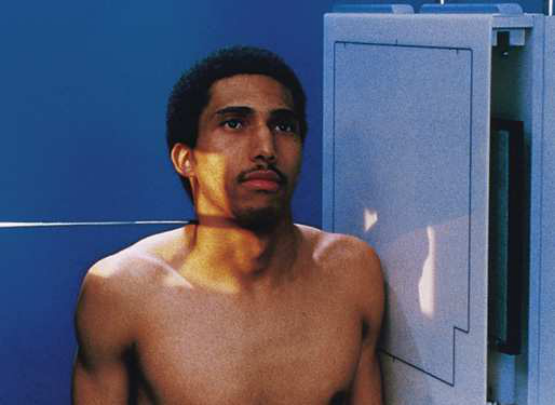

<figcaption><strong>Merrill — pagina 154, imaginea 1</strong> — Imagine din fragmentul sursă; asocierea necesită revizie.</figcaption>

</figure>

<figure class="protocol-image-card" markdown>

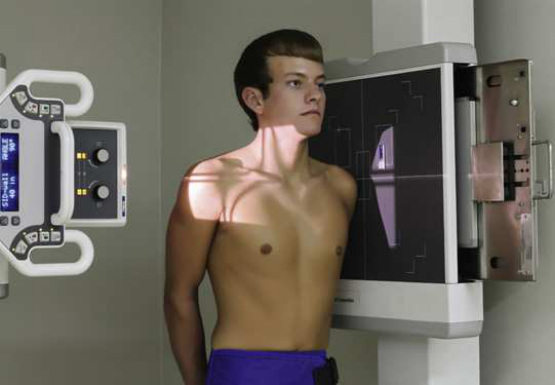

<figcaption><strong>Merrill — pagina 155, imaginea 2</strong> — Imagine din fragmentul sursă; asocierea necesită revizie.</figcaption>

</figure>

<figure class="protocol-image-card" markdown>

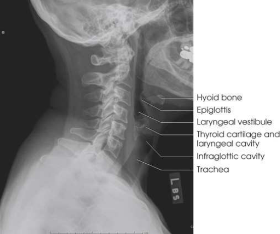

<figcaption><strong>Merrill — pagina 156, imaginea 3</strong> — Imagine din fragmentul sursă; asocierea necesită revizie.</figcaption>

</figure>

<figure class="protocol-image-card" markdown>

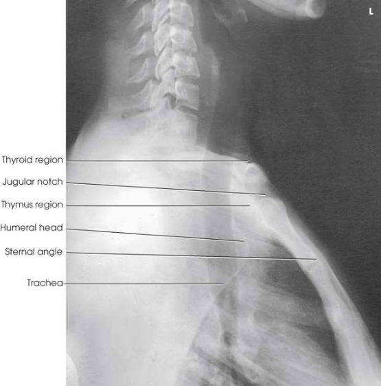

<figcaption><strong>Merrill — pagina 157, imaginea 4</strong> — Imagine din fragmentul sursă; asocierea necesită revizie.</figcaption>

</figure>

<figure class="protocol-image-card" markdown>

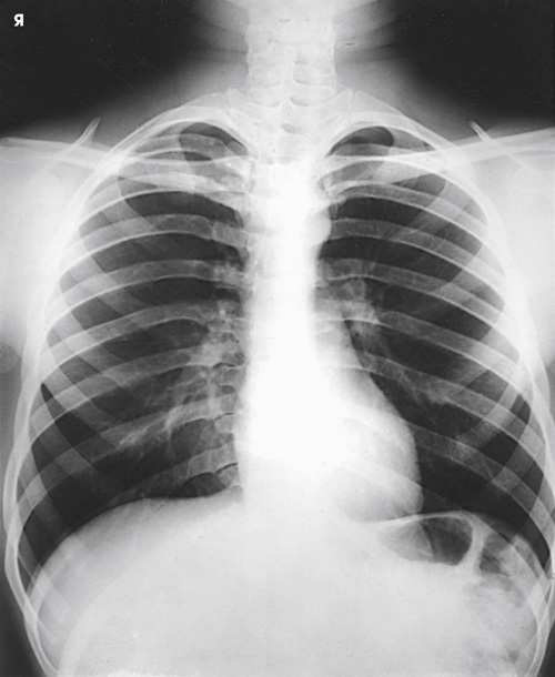

<figcaption><strong>Merrill — pagina 158, imaginea 5</strong> — Imagine din fragmentul sursă; asocierea necesită revizie.</figcaption>

</figure>

<figure class="protocol-image-card" markdown>

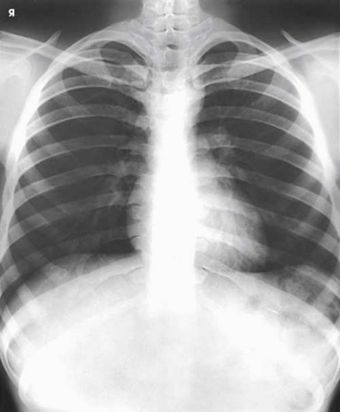

<figcaption><strong>Merrill — pagina 159, imaginea 6</strong> — Imagine din fragmentul sursă; asocierea necesită revizie.</figcaption>

</figure>

<figure class="protocol-image-card" markdown>

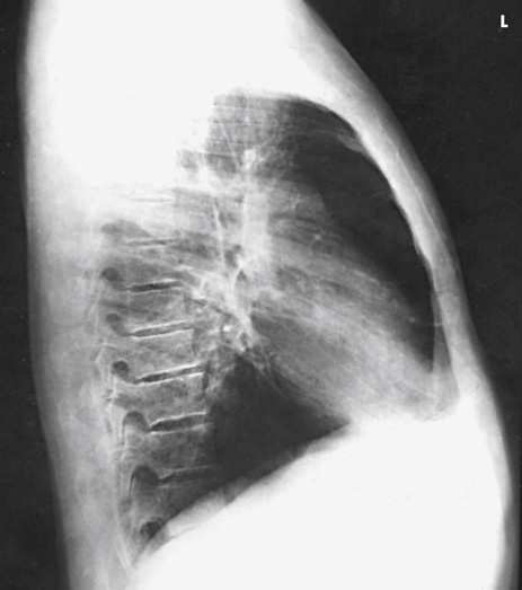

<figcaption><strong>Merrill — pagina 160, imaginea 7</strong> — Imagine din fragmentul sursă; asocierea necesită revizie.</figcaption>

</figure>

<figure class="protocol-image-card" markdown>

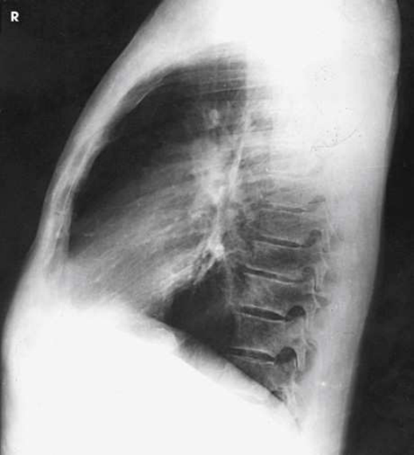

<figcaption><strong>Merrill — pagina 161, imaginea 8</strong> — Imagine din fragmentul sursă; asocierea necesită revizie.</figcaption>

</figure>

<figure class="protocol-image-card" markdown>

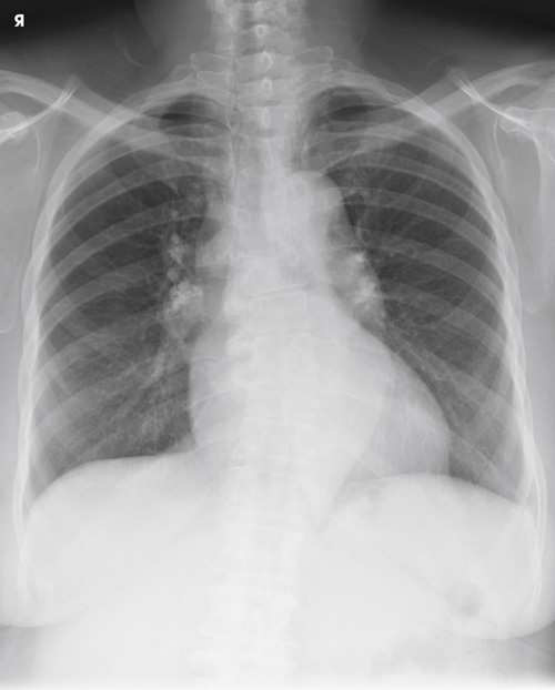

<figcaption><strong>Merrill — pagina 162, imaginea 9</strong> — Imagine din fragmentul sursă; asocierea necesită revizie.</figcaption>

</figure>

<figure class="protocol-image-card" markdown>

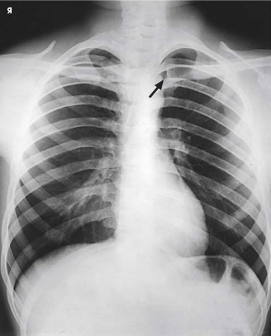

<figcaption><strong>Merrill — pagina 163, imaginea 10</strong> — Imagine din fragmentul sursă; asocierea necesită revizie.</figcaption>

</figure>

<figure class="protocol-image-card" markdown>

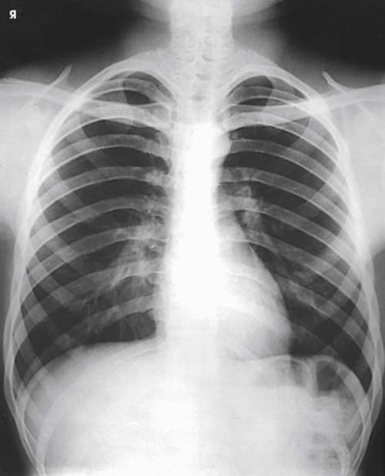

<figcaption><strong>Merrill — pagina 164, imaginea 11</strong> — Imagine din fragmentul sursă; asocierea necesită revizie.</figcaption>

</figure>

<figure class="protocol-image-card" markdown>

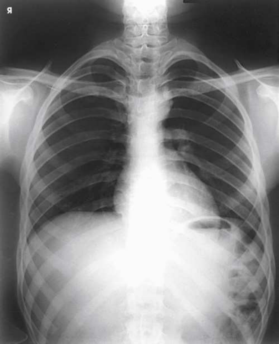

<figcaption><strong>Merrill — pagina 165, imaginea 12</strong> — Imagine din fragmentul sursă; asocierea necesită revizie.</figcaption>

</figure>

<figure class="protocol-image-card" markdown>

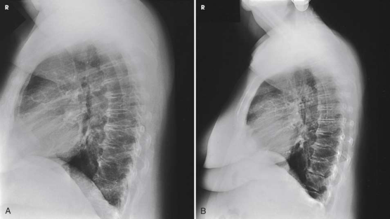

<figcaption><strong>Merrill — pagina 166, imaginea 13</strong> — Imagine din fragmentul sursă; asocierea necesită revizie.</figcaption>

</figure>

<figure class="protocol-image-card" markdown>

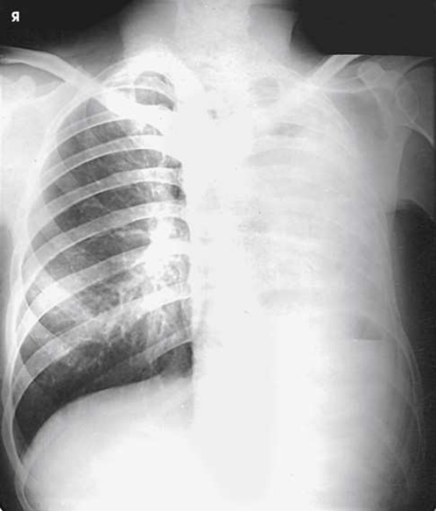

<figcaption><strong>Merrill — pagina 166, imaginea 14</strong> — Imagine din fragmentul sursă; asocierea necesită revizie.</figcaption>

</figure>

=== "Ghid Rapid de Execuție"

    1. **Identificarea și verificarea pacientului:** verificare identitate, zonă de examinat, consimțământ conform procedurii și evaluarea posibilității unei sarcini, când este relevantă.
    2. **Pregătire:** îndepărtarea oricăror obiecte radiopace (bijuterii, agrafe, fermoare, proteze, pansamente dense).
    3. **Poziționare precisă:** alinierea receptorului de imagine și a tubului la distanța prescrisă (Nespecificat în fragmentul extras; de verificat în sursă).
    4. **Colimare strictă:** adaptarea fasciculului strict la regiunea de diagnostic pentru scăderea iradierii și reducerea radiației difuze.
    5. **Radioprotecție:** verificarea [politicii RX](../radioprotectie.md), cu măsuri distincte pentru pacient, personal și însoțitor.

## Surse de documentare

- [Merrill’s Atlas, 3. Thoracic Viscera: Chest and Upper Airway, pagini 153–166](https://books.google.com/books/about/Merrill_s_Atlas_of_Radiographic_Position.html?id=BM0lEQAAQBAJ)
