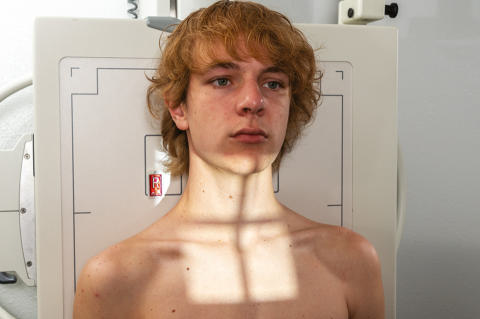
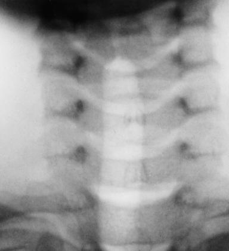
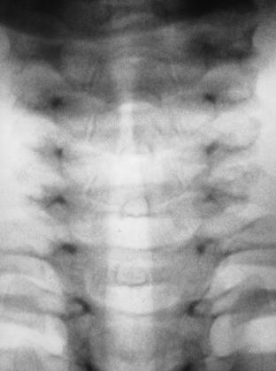

# Rx Căi Aeriene Superioare AP (Antero-Posterior)

  📷 Radiografie Convențională (Rx)
  <strong>Actualizat:</strong> 2026-09-15
  <strong>Autor:</strong> Departamentul de Radiologie / Referință Bontrager

---

-   __1. Rezumat Clinic & Indicații__

    ---

    === "Indicații Clinice"

        - Investigate pathology of the airfilled larynx and trachea, including the region of the thyroid and thymus glands and upper esophagus for opaque foreign object or if contrast medium is present

    === "Ghid Național IRIS"

        !!! info "Referință Primară: Ghidul Național IRIS (Ordinul MS 1342/2012)"
            - **Capitol Ghid IRIS:** *Ghidul Național IRIS*
            - **Grad de Recomandare:** **De verificat pe indicație; fără grad atribuit automat**
            - **Nivel de Iradiere Estimată:** `De verificat pentru examinarea și populația selectate`

            [:octicons-search-16: Deschide Ghidul IRIS](../../iris.md){ .md-button .md-button--primary } [:material-open-in-new: Aplicația Oficială PWA](https://radiologie-pediatrica.ro/iris/){ .md-button target="_blank" rel="noopener" }
-   __2. Poziționare & Centrare Fascicul__

    ---

    - **Poziție Pacient:** Pacient: Patient should be upright if possible, Poziție Șezândă or standing with back of head and shoulders against IR (may be taken Decubit tabletop if necessary).; Regiune anatomică: Alinierea planului medio-sagital cu raza centrală and with midline of grid or table. Raise chin so that acanthiomeatal line is perpendicular to the IR (line from the acanthion or area directly under the nose and the meatus or EAM); have patient look directly ahead (Fig. 2.89). Adjust the IR height to place top of IR about 1 or 1½ inches (3 to 4 cm) below EAM (see NOTE for explanation of centering).
    - **Punct de Centrare Fascicul:** perpendicular to center of IR at level of T1–T2, about 1 inch (2.5 cm) above the incizura jugulară (manubriul sternal)
    - **Distanță Focar-Film (DFF / SID):** 100 cm
    - **Comandă Respiratorie:** Make exposure during a slow, deep inspiration to ensure filling of trachea and Căi Aeriene Superioare with air.

-   __3. Parametri Tehnici Expunere__

    ---

    | Parametru Tehnic | Valoare Configurare Generator / Tub |
    |:-----------------|:-------------------------------------|
    | **Tensiune Tub (kV)** | 75-85 kV |
    | **Sarcină / Produs Curent-Timp (mAs)** | DE CONFIGURAT PE APARAT |
    | **Distanță Focar-Film (DFF / SID)** | 100 cm |
    | **Grilă Antidifuzoare (Bucky)** | Cu grilă antidifuzoare Bucky |
    | **Dimensiune Focar** | Focar Mic (0.6 mm) |
    | **Camere de Ionizare AEC** | Camerele laterale (sau camera centrală funcție de regiune) |
    | **Colimare Fascicul** | Collimate to region of soft tissue of the neck. |
    | **Filtrare Tub** | Totală ≥ 2.5 mm Al echivalent |

-   __4. Criterii de Calitate & Reușită Imagine__

    ---

    - The larynx and trachea from C3 to T4 should be filled with air and visualized through the spine.
    - The area of the proximal cervical vertebrae (the lower margin of the shadow of the superimposed Mandibulă and base of Craniu) to the midthoracic region should be included (Fig. 2.90). Position (see previous notes)
    - Absența rotației anatomice: clavicule echidistante față de linia apofizelor spinoase should occur, as evidenced by the symmetric appearance of the sternoclavicular joints.
    - The Mandibulă should superimpose the base of the Craniu with the spine aligned with the center of the film.
    - Collimation borders should appear on both sides with ideally only minimal (≤¼ inch) borders on top and bottom.
    - The collimation field (CR) should be centered to the area of T1–T2. Exposure
    - Optimal exposure and processing algorithm should allow visualization of the airfilled trachea through the cervical and thoracic vertebrae.

-   __5. Protecție Radiologică (ALARA)__

    ---

    - Ecranare gonadică și a organelor radiosensibile conform procedurilor locale de radioprotecție ALARA.
    - Colimare strictă la aria de interes pentru limitarea radiației difuze.
    - Verificarea posibilității unei sarcini la pacientele de vârstă fertilă înainte de expunere.

!!! note "Observații Clinice & Tehnice"
    (centering for Căi Aeriene Superioare and trachea): Centering for this Incidență Antero-Posterioară (AP) is similar to that of the lateral distal larynx and upper trachea position described on the previous page because the most proximal area of the larynx is not visualized on the AP as a result of the superimposed base of the Craniu and Mandibulă. Therefore, more of the trachea can be visualized. Căi Aeriene Superioare ROUTINE Lateral AP A B Fig. 2.90 Croup. (A) Arrow indicates smooth, tapered narrowing of subglottic portion of trachea (Gothic arch sign). (B) Normal trachea with broad shouldering in subglottic region. (From Eisenberg R, Johnson N: Comprehensive radiographic pathology, ed 7, St Louis, 2021, Elsevier.) Fig. 2.89 AP—Căi Aeriene Superioare.

### 🖼️ Imagini

<figure class="protocol-image-card" markdown>

<figcaption><strong>Fig. 2.90 Croup. (A) Arrow indicates smooth, tapered narrowing of subglottic portion of trachea (Gothic arch sign). (B) Normal trachea with broad</strong> — Poziționare pacient conform Ghidului Bontrager (Fig. 2.90 Croup. (A) Arrow indicates smooth, tapered narrowing of subglottic portion of trachea (Gothic arch sign). (B) Normal trachea with broad)</figcaption>

</figure>

<figure class="protocol-image-card" markdown>

<figcaption><strong>Fig. 2.89 AP—Căi Aeriene Superioare.</strong> — Aspect radiografic de referință conform Ghidului Bontrager (Fig. 2.89 AP—upper airway.)</figcaption>

</figure>

<figure class="protocol-image-card" markdown>

<figcaption><strong>Figura 3</strong> — Aspect radiografic de referință conform Ghidului Bontrager (Figura 3)</figcaption>

</figure>

=== "Ghid Rapid de Execuție"

    1. **Identificarea și verificarea pacientului:** verificare identitate, zonă de examinat, consimțământ conform procedurii și evaluarea posibilității unei sarcini, când este relevantă.
    2. **Pregătire:** îndepărtarea oricăror obiecte radiopace (bijuterii, agrafe, fermoare, proteze, pansamente dense).
    3. **Poziționare precisă:** alinierea receptorului de imagine și a tubului la distanța prescrisă (100 cm).
    4. **Colimare strictă:** adaptarea fasciculului strict la regiunea de diagnostic pentru scăderea iradierii și reducerea radiației difuze.
    5. **Radioprotecție:** verificarea [politicii RX](../radioprotectie.md), cu măsuri distincte pentru pacient, personal și însoțitor.

## Surse de documentare

- [Bontrager's Textbook of Radiographic Positioning (Ed. 9/10), Pagina 113](https://www.elsevier.com/books/textbook-of-radiographic-positioning-and-related-anatomy/lampignano/978-0-323-65367-1)
