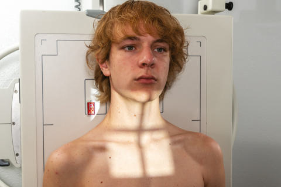
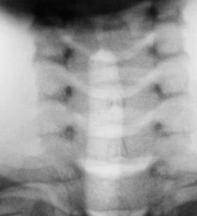
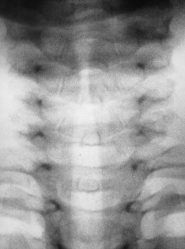

# Rx căi aeriene superioare AP (antero-posterior)

  📷 Radiografie Convențională (Rx)
  <strong>Actualizat:</strong> 2026-09-15
  <strong>Autor:</strong> Departamentul de Radiologie / Referință Bontrager

---

-   __1. Rezumat Clinic & Indicații__

    ---

    === "Indicații Clinice"

        - Investigarea patologiei laringelui și traheei umplute cu aer, inclusiv regiunea glandelor tiroidă și timus și porțiunea superioară a esofagului, pentru identificarea unui corp străin radiopac sau dacă este prezentă substanță de contrast.

    === "Ghid Național IRIS"

        !!! info "Referință Primară: Ghidul Național IRIS (Ordinul MS 1342/2012)"
            - **Capitol Ghid IRIS:** *Ghidul Național IRIS*
            - **Grad de Recomandare:** **De verificat pe indicație; fără grad atribuit automat**
            - **Nivel de Iradiere Estimată:** `De verificat pentru examinarea și populația selectate`

            [:octicons-search-16: Deschide Ghidul IRIS](../../iris.md){ .md-button .md-button--primary } [:material-open-in-new: Aplicația Oficială PWA](https://radiologie-pediatrica.ro/iris/){ .md-button target="_blank" rel="noopener" }
-   __2. Poziționare & Centrare Fascicul__

    ---

    - **Poziție Pacient:** Pacient: Dacă este posibil, pacientul trebuie să fie în poziție verticală, șezând sau în ortostatism, cu partea posterioară a capului și umerii sprijiniți de receptorul de imagine (dacă este necesar, examinarea se poate efectua în decubit pe masa de examinare).; Regiune anatomică: Aliniați planul medio-sagital cu raza centrală și cu linia mediană a grilei sau a mesei. Ridicați bărbia astfel încât linia acantiomeatală (LAM) să fie perpendiculară pe receptorul de imagine (RI) (linia dintre acantion, adică zona imediat sub nas, și meat sau conductul auditiv extern (CAE)); pacientul privește drept înainte (Fig. 2.89). Ajustați înălțimea receptorului de imagine pentru a-i plasa marginea superioară la aproximativ 1 sau 1½ inci (3 la 4 cm) sub conductul auditiv extern (CAE) (consultați NOTA pentru explicația centrării).
    - **Punct de Centrare Fascicul:** Perpendicular pe centrul receptorului de imagine, la nivelul T1–T2, la aproximativ 1 inch (2.5 cm) deasupra incizurii jugulare (manubriul sternal).
    - **Distanță Focar-Film (DFF / SID):** 100 cm
    - **Comandă Respiratorie:** Efectuați expunerea în timpul unui inspir lent și profund, pentru a asigura umplerea cu aer a traheei și a căilor aeriene superioare.

-   __3. Parametri Tehnici Expunere__

    ---

    | Parametru Tehnic | Valoare Configurare Generator / Tub |
    |:-----------------|:-------------------------------------|
    | **Tensiune Tub (kV)** | 75-85 kV |
    | **Sarcină / Produs Curent-Timp (mAs)** | DE CONFIGURAT PE APARAT |
    | **Distanță Focar-Film (DFF / SID)** | 100 cm |
    | **Grilă Antidifuzoare (Bucky)** | Cu grilă antidifuzoare Bucky |
    | **Dimensiune Focar** | Focar Mic (0.6 mm) |
    | **Camere de Ionizare AEC** | Camerele laterale (sau camera centrală, în funcție de regiune) |
    | **Colimare Fascicul** | Colimați la regiunea părților moi ale gâtului. |
    | **Filtrare Tub** | Totală ≥ 2.5 mm Al echivalent |

-   __4. Criterii de Calitate & Reușită Imagine__

    ---

    - Laringele și traheea, de la C3 la T4, trebuie să fie umplute cu aer și vizualizate prin suprapunerea coloanei vertebrale.
    - Trebuie inclusă zona de la porțiunea proximală a coloanei cervicale (marginea inferioară a umbrei mandibulei și bazei craniului suprapuse) până la regiunea toracică mijlocie (Fig. 2.90). Poziție (consultați notele anterioare).
    - Absența rotației anatomice: claviculele trebuie să fie echidistante față de linia apofizelor spinoase, evidențiată prin aspectul simetric al articulațiilor sternoclaviculare.
    - Mandibula trebuie să se suprapună peste baza craniului, cu coloana vertebrală aliniată cu centrul filmului radiologic.
    - Marginile colimării trebuie să fie vizibile bilateral, ideal cu margini minime (≤¼ inch) la partea superioară și inferioară.
    - Câmpul de colimare (raza centrală) trebuie să fie centrat pe regiunea T1–T2. Expunere.
    - Expunerea și algoritmul de procesare optime trebuie să permită vizualizarea traheei umplute cu aer prin suprapunerea coloanei cervicale și toracale.

-   __5. Protecție Radiologică (ALARA)__

    ---

    - Ecranare gonadică și a organelor radiosensibile conform procedurilor locale de radioprotecție ALARA.
    - Colimare strictă la aria de interes pentru limitarea radiației difuze.
    - Verificarea posibilității unei sarcini la pacientele de vârstă fertilă înainte de expunere.

!!! note "Observații Clinice & Tehnice"
    (Centrarea pentru căile aeriene superioare și trahee): Centrarea pentru această incidență antero-posterioară (AP) este similară celei pentru poziția de profil a laringelui distal și a traheei superioare descrise pe pagina anterioară, deoarece porțiunea cea mai proximală a laringelui nu se vizualizează în AP din cauza suprapunerii bazei craniului și mandibulei. Prin urmare, poate fi vizualizată o porțiune mai mare a traheei. CĂI AERIENE SUPERIOARE — INCIDENȚE DE RUTINĂ: profil, AP. B Fig. 2.90 Crup. (A) Săgeata indică îngustarea netedă, conică a porțiunii subglotice a traheei (semnul arcului gotic). (B) Trahee normală cu umeri largi în regiunea subglotică. (Din Eisenberg R, Johnson N: Patologie radiografică cuprinzătoare, ediția 7, St Louis, 2021, Elsevier.) Fig. 2.89 AP—căi aeriene superioare.

### 🖼️ Imagini

<figure class="protocol-image-card" markdown>

<figcaption><strong>Fig. 2.90 Crup. (A) Săgeata indică îngustarea netedă, conică a porțiunii subglotice a traheei (semnul arcului gotic). (B) Trahee normală cu porțiune largă</strong> — Poziționarea pacientului conform Ghidului Bontrager (Fig. 2.90 Crup. (A) Săgeata indică îngustarea netedă, conică a porțiunii subglotice a traheei (semnul arcului gotic). (B) Trahee normală cu porțiune largă)</figcaption>

</figure>

<figure class="protocol-image-card" markdown>

<figcaption><strong>Fig. 2.89 AP—căi aeriene superioare.</strong> — Aspect radiografic de referință conform Ghidului Bontrager (Fig. 2.89 AP—căi aeriene superioare.)</figcaption>

</figure>

<figure class="protocol-image-card" markdown>

<figcaption><strong>Figura 3</strong> — Aspect radiografic de referință conform Ghidului Bontrager (Figura 3)</figcaption>

</figure>

=== "Ghid Rapid de Execuție"

    1. **Identificarea și verificarea pacientului:** verificare identitate, zonă de examinat, consimțământ conform procedurii și evaluarea posibilității unei sarcini, când este relevantă.
    2. **Pregătire:** îndepărtarea oricăror obiecte radiopace (bijuterii, agrafe, fermoare, proteze, pansamente dense).
    3. **Poziționare precisă:** alinierea receptorului de imagine și a tubului la distanța prescrisă (100 cm).
    4. **Colimare strictă:** adaptarea fasciculului strict la regiunea de diagnostic pentru scăderea iradierii și reducerea radiației difuze.
    5. **Radioprotecție:** verificarea [politicii RX](../radioprotectie.md), cu măsuri distincte pentru pacient, personal și însoțitor.

## Surse de documentare

- [Bontrager's Textbook of Radiographic Positioning (Ed. 9/10), Pagina 113](https://www.elsevier.com/books/textbook-of-radiographic-positioning-and-related-anatomy/lampignano/978-0-323-65367-1)
