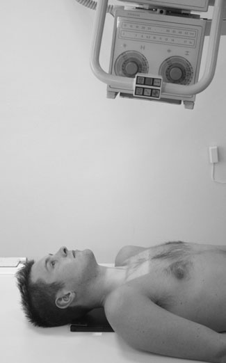
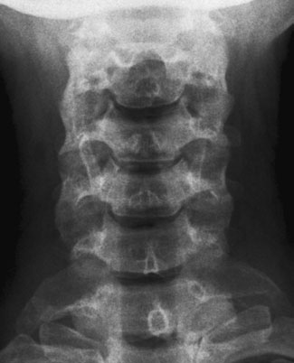
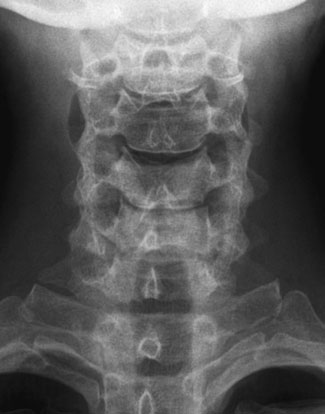
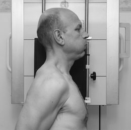
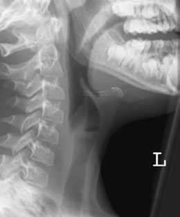
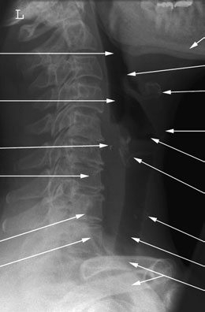
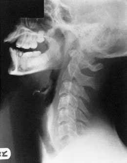

# Rx Căi Aeriene Superioare (Faringe și Laringe) Antero-Posterior (AP)

  📷 Radiografie Convențională (Rx)
  <strong>Actualizat:</strong> 2026-09-16
  <strong>Autor:</strong> Departamentul de Radiologie / Referință Clark (Ed. 12)

---

-   __1. Rezumat Clinic & Indicații__

    ---

    === "Indicații Clinice"

        - If prevertebral soft tissues la nivelul C4–C6 sunt wider than corresponding vertebral corp, then edem / tumefiere de părți moi poate fie diagnosed (this poate fie only sign de lucent corp străin radiopac). This sign poate fie mimicked if gâtul este flectat sau poate fie masked if incidență este Oblică. true Profil (lateral) este therefore essential.
        - cartilages de Laringe typically calcify în patchy fashion și poate mimic corp străin radiopac. Profil (lateral) radiografie evidențiind normal air-filled Laringe Mandibulă Oropharynx Laryngopharynx Arytenoid cartilage 7th cervical vertebra anterior margine de neck de first rib Tip de epiglottis os hioid anterior margine de cartilaj tiroid (mărul lui Adam) Laryngeal ventricle cartilaj cricoid Benign thyroid calcificări patologice Tracheal air shadow Clavicles Profil (lateral) radiografie evidențiind suspiciune de fractură de os hioid

    === "Ghid Național IRIS"

        !!! info "Referință Primară: Ghidul Național IRIS (Ordinul MS 1342/2012)"
            - **Capitol Ghid IRIS:** *Ghidul Național IRIS*
            - **Grad de Recomandare:** **De verificat pe indicație; fără grad atribuit automat**
            - **Nivel de Iradiere Estimată:** `De verificat pentru examinarea și populația selectate`

            [:octicons-search-16: Deschide Ghidul IRIS](../../iris.md){ .md-button .md-button--primary } [:material-open-in-new: Aplicația Oficială PWA](https://radiologie-pediatrica.ro/iris/){ .md-button target="_blank" rel="noopener" }
-   __2. Poziționare & Centrare Fascicul__

    ---

    - **Poziție Pacient:** • pacientul este culcat Decubit dorsal, cu planul mediosagital ajustat la coincide cu central axa longitudinală de couch.
• bărbia este raised la show soft tissues below Mandibulă și la bring radiographic baseline la angle de 20 grade de la vertical.
• caseta este centred la nivelul fourth cervical vertebra.

• pacientul stă în ortostatism sau sits cu either Umăr against vertical casetă. Two 45-grade pads poate fie plasat între pacient’s cap și caseta la aid imobilizare.
• planul mediosagital de trunk și cap sunt paralel cu casetă.
• jaw este raised slightly astfel încât angles de Mandibulă sunt separated de la corpuri de upper Coloană Cervicală.
• point 2.5 cm posterior la angle de Mandibulă trebuie să fie coincident cu vertical central line de caseta.
• caseta este centred la nivelul prominence de cartilaj tiroid (mărul lui Adam) opposite fourth cervical vertebra.
• Immediately before expunere, pacientul este asked la depress umerii forcibly so that their structures sunt projected sub nivelul seventh cervical vertebra.
• When carrying out this manoeuvre, capul și trunk trebuie să fie maintained în poziție.
• expunere este made pe forced expiration.
    - **Punct de Centrare Fascicul:** • se orientează raza centrală centrală 10 grade cranial și în linia mediană la nivelul fourth cervical vertebra.
• expunere este made pe forced expiration.

• raza centrală orizontală centrală este orientat la point vertically below proces mastoidian la nivelul prominence de cartilaj tiroid (mărul lui Adam) through fourth cervical vertebra.
    - **Distanță Focar-Film (DFF / SID):** 100 cm
    - **Comandă Respiratorie:** expunere este made pe forced expiration

-   __3. Parametri Tehnici Expunere__

    ---

    | Parametru Tehnic | Valoare Configurare Generator / Tub |
    |:-----------------|:-------------------------------------|
    | **Tensiune Tub (kV)** | DE CONFIGURAT PE APARAT |
    | **Sarcină / Produs Curent-Timp (mAs)** | Conform AEC / grosime anatomică |
    | **Distanță Focar-Film (DFF / SID)** | 100 cm |
    | **Grilă Antidifuzoare (Bucky)** | Cu grilă antidifuzoare Bucky |
    | **Dimensiune Focar** | Focar Mic (0.6 mm) |
    | **Camere de Ionizare AEC** | Camerele laterale (sau camera centrală funcție de regiune) |
    | **Colimare Fascicul** | Colimare strictă adaptată pe receptor 24 x 30 cm |
    | **Filtrare Tub** | Totală ≥ 2.5 mm Al echivalent (conform Clark: 3.0 mm Al eq.) |

-   __4. Criterii de Calitate & Reușită Imagine__

    ---

    - fascicul trebuie să fie collimated la include area de la occipital bone la seventh cervical vertebra.
    - soft tissues trebuie să fie evidențiat de la Craniu base la root de gâtul (C7).
    - expunere trebuie să allow clear visualization de laryngeal cartilages și orice possible corp străin radiopac.

-   __5. Protecție Radiologică (ALARA)__

    ---

    - Ecranare gonadică cu șorț plumbat dacă gonadele sunt în apropierea fasciculului util (regula ALARA).
    - Colimare precisă la dimensiunea anatomică strict necesară pentru reducerea dozei și a radiației difuze.
    - Verificarea posibilității unei sarcini la pacientele de vârstă fertilă înainte de expunere.

!!! note "Observații Clinice & Tehnice"
    • imagine acquisition poate fie made either cu sau fără Bucky grilă.
• Assessment de possible small corp străin radiopac poate nu require Antero-posterior (AP) incidență, ca such corp străin radiopac sunt likely la fie obscured prin virtue de overlying cervical coloană vertebrală.
• Air în faringe și Laringe will result în increase în subject contrast în gâtul region. This poate fie reduced using high-kilovoltage technique.
194 Antero-posterior (AP) radiografie evidențiind normal Laringe Antero-posterior (AP) radiografie de Laringe evidențiind laryngocoele

### 🖼️ Imagini

<figure class="protocol-image-card" markdown>

<figcaption><strong>Plain radiografie este requested la investigate presence de</strong> — Poziționare pacient și centrare fascicul conform Clark (Ed. 12)</figcaption>

</figure>

<figure class="protocol-image-card" markdown>

<figcaption><strong>și la bring radiographic baseline la angle de 20</strong> — Aspect radiografic / ghid de poziționare conform tratatului Clark (Ed. 12)</figcaption>

</figure>

<figure class="protocol-image-card" markdown>

<figcaption><strong>Antero-posterior (AP) radiografie evidențiind normal Laringe</strong> — Aspect radiografic / ghid de poziționare conform tratatului Clark (Ed. 12)</figcaption>

</figure>

<figure class="protocol-image-card" markdown>

<figcaption><strong>Profil (lateral) radiografie evidențiind normal air-filled Laringe</strong> — Aspect radiografic / ghid de poziționare conform tratatului Clark (Ed. 12)</figcaption>

</figure>

<figure class="protocol-image-card" markdown>

<figcaption><strong>Profil (lateral) radiografie evidențiind suspiciune de fractură de os hioid</strong> — Aspect radiografic / ghid de poziționare conform tratatului Clark (Ed. 12)</figcaption>

</figure>

<figure class="protocol-image-card" markdown>

<figcaption><strong>Figura 6: Aspect radiografic / Poziționare (Clark Ed. 12)</strong> — Aspect radiografic / ghid de poziționare conform tratatului Clark (Ed. 12)</figcaption>

</figure>

<figure class="protocol-image-card" markdown>

<figcaption><strong>Figura 7: Aspect radiografic / Poziționare (Clark Ed. 12)</strong> — Aspect radiografic / ghid de poziționare conform tratatului Clark (Ed. 12)</figcaption>

</figure>

=== "Ghid Rapid de Execuție"

    1. **Identificarea și verificarea pacientului:** verificare identitate, zonă de examinat, consimțământ conform procedurii și evaluarea posibilității unei sarcini, când este relevantă.
    2. **Pregătire:** îndepărtarea oricăror obiecte radiopace (bijuterii, agrafe, fermoare, proteze, pansamente dense).
    3. **Poziționare precisă:** alinierea receptorului de imagine și a tubului la distanța prescrisă (100 cm).
    4. **Colimare strictă:** adaptarea fasciculului strict la regiunea de diagnostic pentru scăderea iradierii și reducerea radiației difuze.
    5. **Radioprotecție:** verificarea [politicii RX](../radioprotectie.md), cu măsuri distincte pentru pacient, personal și însoțitor.

## Surse de documentare

- [Clark's Positioning in Radiography (Ed. 12), Pagina 209](../../assets/protocols/sources/Clark___Positioning_in_Radiography__12th_edition.pdf#page=209)
