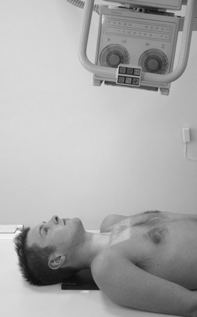
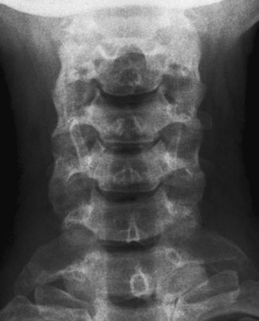
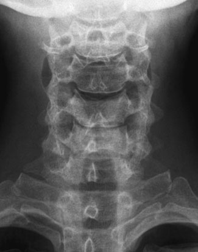
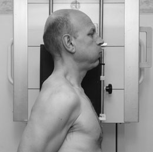
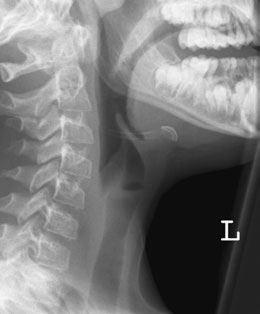
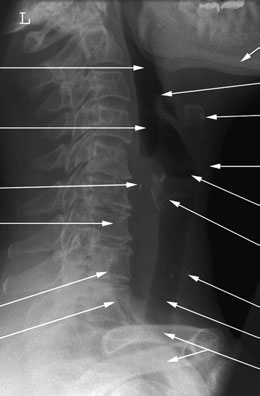
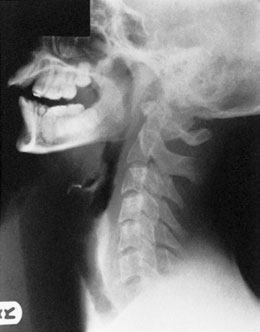

# Rx căi aeriene superioare (faringe și laringe) antero-posterior (AP)

  📷 Radiografie Convențională (Rx)
  <strong>Actualizat:</strong> 2026-09-16
  <strong>Autor:</strong> Departamentul de Radiologie / Referință Clark (Ed. 12)

---

-   __1. Rezumat Clinic & Indicații__

    ---

    === "Indicații Clinice"

        - Dacă țesuturile moi prevertebrale de la nivelul C4–C6 sunt mai late decât corpul vertebral corespunzător, se poate diagnostica edem / tumefiere a părților moi (acesta poate fi singurul semn al unui corp străin descris drept radiotransparent și radiopac). Acest semn poate fi mimat dacă gâtul este flectat sau poate fi mascat dacă incidența este oblică. Prin urmare, profilul strict este esențial.
        - Cartilajele laringelui se calcifică de obicei neuniform și pot mima un corp străin radiopac. Radiografie de profil care evidențiază laringele normal, umplut cu aer. Mandibulă. Orofaringe. Laringofaringe. Cartilaj aritenoid. A 7-a vertebră cervicală. Marginea anterioară a colului primei coaste. Vârful epiglotei. Os hioid. Marginea anterioară a cartilajului tiroid (mărul lui Adam). Ventricul laringian. Cartilaj cricoid. Calcificări patologice benigne tiroidiene. Umbra aerică traheală. Clavicule. Radiografie de profil care evidențiază suspiciune de fractură a osului hioid.

    === "Ghid Național IRIS"

        !!! info "Referință Primară: Ghidul Național IRIS (Ordinul MS 1342/2012)"
            - **Capitol Ghid IRIS:** *Torace & Pulmon*
            - **Grad de Recomandare:** **Grad A**
            - **Nivel de Iradiere Estimată:** `Clasa 1 (Minimă < 0.1 mSv)`

            [:octicons-search-16: Deschide Ghidul IRIS](../../iris.md){ .md-button .md-button--primary } [:material-open-in-new: Aplicația Oficială PWA](https://radiologie-pediatrica.ro/iris/){ .md-button target="_blank" rel="noopener" }

-   __2. Poziționare & Centrare Fascicul__

    ---

    - **Poziție Pacient:**
        - Pacientul este culcat în decubit dorsal, cu planul mediosagital ajustat astfel încât să coincidă cu axa longitudinală centrală a mesei.
        - Bărbia este ridicată pentru a evidenția părțile moi de sub mandibulă și a aduce linia de bază radiografică la un unghi de 20 grade față de verticală.
        - Caseta este centrată la nivelul celei de-a patra vertebre cervicale.
        - Pacientul stă în ortostatism sau șezând, cu unul dintre umeri sprijinit de caseta verticală. Două suporturi de 45 grade pot fi plasate între capul pacientului și casetă pentru a ajuta la imobilizare.
        - Planurile mediosagitale ale trunchiului și capului sunt paralele cu caseta.
        - Mandibula este ridicată ușor, astfel încât unghiurile sale să fie separate de corpurile vertebrelor cervicale superioare.
        - Punctul situat la 2.5 cm posterior de unghiul mandibulei trebuie să coincidă cu linia centrală verticală a casetei.
        - Caseta este centrată la nivelul proeminenței cartilajului tiroid (mărul lui Adam), în dreptul celei de-a patra vertebre cervicale.
        - Imediat înaintea expunerii, pacientului i se cere să coboare forțat umerii, astfel încât structurile acestora să se proiecteze sub nivelul celei de-a șaptea vertebre cervicale.
        - În timpul acestei manevre, capul și trunchiul trebuie menținute în poziție.
        - Expunerea se efectuează în expir forțat.
    - **Punct de Centrare Fascicul:**
        - Orientați raza centrală cu 10 grade cranial, pe linia mediană, la nivelul celei de-a patra vertebre cervicale.
        - Expunerea se efectuează în expir forțat.
        - Raza centrală orizontală este orientată spre punctul situat vertical sub apofiza mastoidă, la nivelul proeminenței cartilajului tiroid (mărul lui Adam), prin cea de-a patra vertebră cervicală.
    - **Distanță Focar-Film (DFF / SID):** 100 cm
    - **Comandă Respiratorie:** Expunerea se efectuează în expir forțat.

-   __3. Parametri Tehnici Expunere__

    ---

    | Parametru Tehnic | Valoare Configurare Generator / Tub |
    |:-----------------|:-------------------------------------|
    | **Tensiune Tub (kV)** | DE CONFIGURAT PE APARAT |
    | **Sarcină / Produs Curent-Timp (mAs)** | Conform AEC / grosimii anatomice |
    | **Distanță Focar-Film (DFF / SID)** | 100 cm |
    | **Grilă Antidifuzoare (Bucky)** | Cu grilă antidifuzoare Bucky |
    | **Dimensiune Focar** | Focar Mic (0.6 mm) |
    | **Camere de Ionizare AEC** | Camerele laterale (sau camera centrală, în funcție de regiune) |
    | **Colimare Fascicul** | Colimare strictă adaptată pe receptor 24 x 30 cm |
    | **Filtrare Tub** | Totală ≥ 2.5 mm Al echivalent (conform Clark: 3.0 mm Al echivalent) |

-   __4. Criterii de Calitate & Reușită Imagine__

    ---

    - Fasciculul trebuie colimat pentru a include zona de la osul occipital până la cea de-a șaptea vertebră cervicală.
    - Părțile moi trebuie evidențiate de la baza craniului până la rădăcina gâtului (C7).
    - Expunerea trebuie să permită vizualizarea clară a cartilajelor laringiene și a oricărui posibil corp străin radiopac.

-   __5. Protecție Radiologică (ALARA)__

    ---

    - Ecranare gonadică cu șorț plumbat dacă gonadele sunt în apropierea fasciculului util (regula ALARA).
    - Colimare precisă la dimensiunea anatomică strict necesară pentru reducerea dozei și a radiației difuze.
    - Verificarea posibilității unei sarcini la pacientele de vârstă fertilă înainte de expunere.

!!! note "Observații Clinice & Tehnice"
    - Achiziția imaginii se poate efectua cu sau fără grila Bucky.
    - Evaluarea unui posibil corp străin radiopac mic poate să nu necesite o incidență antero-posterioară (AP), deoarece asemenea corpi străini radiopaci sunt probabil mascați de suprapunerea coloanei cervicale.
    - Aerul din faringe și laringe produce o creștere a contrastului subiectului în regiunea gâtului. Acesta poate fi redus folosind o tehnică cu kilovoltaj ridicat. 194 Radiografie antero-posterioară (AP) care evidențiază laringele normal. Radiografie antero-posterioară (AP) a laringelui care evidențiază un laringocel.

### 🖼️ Imagini

<figure class="protocol-image-card" markdown>

<figcaption><strong>Radiografia simplă este solicitată pentru investigarea prezenței</strong> — Poziționarea pacientului și centrarea fasciculului conform Clark (Ed. 12)</figcaption>

</figure>

<figure class="protocol-image-card" markdown>

<figcaption><strong>și pentru a aduce linia de bază radiografică la un unghi de 20</strong> — Aspect radiografic / ghid de poziționare conform tratatului Clark (Ed. 12)</figcaption>

</figure>

<figure class="protocol-image-card" markdown>

<figcaption><strong>Radiografie antero-posterioară (AP) care evidențiază laringele normal.</strong> — Aspect radiografic / ghid de poziționare conform tratatului Clark (Ed. 12)</figcaption>

</figure>

<figure class="protocol-image-card" markdown>

<figcaption><strong>Radiografie de profil care evidențiază laringele normal, umplut cu aer.</strong> — Aspect radiografic / ghid de poziționare conform tratatului Clark (Ed. 12)</figcaption>

</figure>

<figure class="protocol-image-card" markdown>

<figcaption><strong>Radiografie de profil care evidențiază suspiciune de fractură a osului hioid.</strong> — Aspect radiografic / ghid de poziționare conform tratatului Clark (Ed. 12)</figcaption>

</figure>

<figure class="protocol-image-card" markdown>

<figcaption><strong>Figura 6: Aspect radiografic / Poziționare (Clark Ed. 12)</strong> — Aspect radiografic / ghid de poziționare conform tratatului Clark (Ed. 12)</figcaption>

</figure>

<figure class="protocol-image-card" markdown>

<figcaption><strong>Figura 7: Aspect radiografic / Poziționare (Clark Ed. 12)</strong> — Aspect radiografic / ghid de poziționare conform tratatului Clark (Ed. 12)</figcaption>

</figure>

=== "Ghid Rapid de Execuție"

    1. **Identificarea și verificarea pacientului:** verificare identitate, zonă de examinat, consimțământ conform procedurii și evaluarea posibilității unei sarcini, când este relevantă.
    2. **Pregătire:** îndepărtarea oricăror obiecte radiopace (bijuterii, agrafe, fermoare, proteze, pansamente dense).
    3. **Poziționare precisă:** alinierea receptorului de imagine și a tubului la distanța prescrisă (100 cm).
    4. **Colimare strictă:** adaptarea fasciculului strict la regiunea de diagnostic pentru scăderea iradierii și reducerea radiației difuze.
    5. **Radioprotecție:** verificarea [politicii RX](../radioprotectie.md), cu măsuri distincte pentru pacient, personal și însoțitor.

## Surse de documentare

- [Clark's Positioning in Radiography (Ed. 12), Pagina 209](https://books.google.com/books/about/Clark_s_Positioning_in_Radiography.html?id=Xxu6MwEACAAJ)
