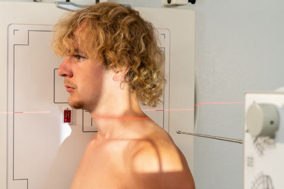
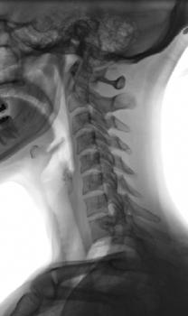

# Rx Căi Aeriene Superioare Profil (Lateral)

  📷 Radiografie Convențională (Rx)
  <strong>Actualizat:</strong> 2026-09-15
  <strong>Autor:</strong> Departamentul de Radiologie / Referință Bontrager

---

-   __1. Rezumat Clinic & Indicații__

    ---

    === "Indicații Clinice"

        - Investigate pathology of the airfilled larynx and trachea, including the region of thyroid and thymus glands and upper esophagus, for opaque foreign object or if contrast medium is present.
        - Rule out epiglottitis, which may be lifethreatening for a young child.

    === "Ghid Național IRIS"

        !!! info "Referință Primară: Ghidul Național IRIS (Ordinul MS 1342/2012)"
            - **Capitol Ghid IRIS:** *Ghidul Național IRIS*
            - **Grad de Recomandare:** **De verificat pe indicație; fără grad atribuit automat**
            - **Nivel de Iradiere Estimată:** `De verificat pentru examinarea și populația selectate`

            [:octicons-search-16: Deschide Ghidul IRIS](../../iris.md){ .md-button .md-button--primary } [:material-open-in-new: Aplicația Oficială PWA](https://radiologie-pediatrica.ro/iris/){ .md-button target="_blank" rel="noopener" }
-   __2. Poziționare & Centrare Fascicul__

    ---

    - **Poziție Pacient:** Pacient: Patient should be upright if possible, Poziție Șezândă, or standing in a Incidență de Profil (Lateral) (may be taken in R or L lateral and may be taken Decubit tabletop if necessary).; Regiune anatomică: Position patient to center Căi Aeriene Superioare to CR and to center of IR (larynx and trachea lie anterior to cervical and thoracic vertebrae). Rotate shoulders posteriorly with arms hanging down and hands clasped behind back. Raise chin slightly and have patient look directly ahead (Fig. 2.86). Adjust IR height to place top of IR at level of external auditory meatus (EAM), which is the opening of the external ear canal (see Respiration if area of primary interest is the trachea rather than the larynx).
    - **Punct de Centrare Fascicul:** perpendicular to center of IR at level of C6 or C7, midway between the laryngeal prominence of the thyroid cartilage and the incizura jugulară (manubriul sternal)
    - **Distanță Focar-Film (DFF / SID):** 180 cm
    - **Comandă Respiratorie:** Make exposure during a slow, deep inspiration to ensure filling trachea and Căi Aeriene Superioare with air.

-   __3. Parametri Tehnici Expunere__

    ---

    | Parametru Tehnic | Valoare Configurare Generator / Tub |
    |:-----------------|:-------------------------------------|
    | **Tensiune Tub (kV)** | 75-85 kV |
    | **Sarcină / Produs Curent-Timp (mAs)** | DE CONFIGURAT PE APARAT |
    | **Distanță Focar-Film (DFF / SID)** | 180 cm |
    | **Grilă Antidifuzoare (Bucky)** | Cu grilă antidifuzoare Bucky |
    | **Dimensiune Focar** | Focar Mare (1.0 - 1.2 mm) |
    | **Camere de Ionizare AEC** | Camerele laterale (sau camera centrală funcție de regiune) |
    | **Colimare Fascicul** | Collimate to region of soft tissue of the neck. |
    | **Filtrare Tub** | Totală ≥ 2.5 mm Al echivalent |

-   __4. Criterii de Calitate & Reușită Imagine__

    ---

    - The larynx and trachea should be filled with air and well visualized (Figs. 2.87 and 2.88). Position
    - Centering for the neck region (larynx and proximal trachea) should include the EAM at the upper border of the image and T2 or T3 on the lower border. If the distal larynx and trachea is the primary area of interest, centering should be lower to include the area from C3 to T4 or T5 on the image.
    - The shadows of the shoulders should be primarily posterior to and should not superimpose the area of the trachea.
    - Collimation borders should appear on both sides with ideally only minimal (≤¼ inch) borders on top and bottom. Exposure
    - Optimal exposure includes a soft tissue technique and processing algorithm wherein the airfilled larynx and upper trachea are not overexposed, but well visualized.
    - Cervical vertebrae appear underexposed. R Fig. 2.87 Lateral—Căi Aeriene Superioare (for distal larynx and trachea region). R Larynx Trachea Epiglottis Fig. 2.88 Lateral—Căi Aeriene Superioare.

-   __5. Protecție Radiologică (ALARA)__

    ---

    - Ecranare gonadică și a organelor radiosensibile conform procedurilor locale de radioprotecție ALARA.
    - Colimare strictă la aria de interes pentru limitarea radiației difuze.
    - Verificarea posibilității unei sarcini la pacientele de vârstă fertilă înainte de expunere.

!!! note "Observații Clinice & Tehnice"
    (centering and exposure for distal larynx and trachea region): If the distal larynx and upper trachea and midtrachea are the primary areas of interest, the IR and CR should be lowered to place the CR at the upper incizura jugulară (manubriul sternal) (T1–T2) with exposure factors approximately those for a lateral Torace. Căi Aeriene Superioare ROUTINE Lateral AP Fig. 2.86 Right Incidență de Profil (Lateral)—Căi Aeriene Superioare.

### 🖼️ Imagini

<figure class="protocol-image-card" markdown>

<figcaption><strong>Fig. 2.86 Right Incidență de Profil (Lateral)—Căi Aeriene Superioare.</strong> — Poziționare pacient conform Ghidului Bontrager (Fig. 2.86 Right lateral position—upper airway.)</figcaption>

</figure>

<figure class="protocol-image-card" markdown>

<figcaption><strong>Fig. 2.87 Lateral—upper</strong> — Aspect radiografic de referință conform Ghidului Bontrager (Fig. 2.87 Lateral—upper)</figcaption>

</figure>

<figure class="protocol-image-card" markdown>

<figcaption><strong>Fig. 2.88 Lateral—Căi Aeriene Superioare.</strong> — Aspect radiografic de referință conform Ghidului Bontrager (Fig. 2.88 Lateral—upper airway.)</figcaption>

</figure>

=== "Ghid Rapid de Execuție"

    1. **Identificarea și verificarea pacientului:** verificare identitate, zonă de examinat, consimțământ conform procedurii și evaluarea posibilității unei sarcini, când este relevantă.
    2. **Pregătire:** îndepărtarea oricăror obiecte radiopace (bijuterii, agrafe, fermoare, proteze, pansamente dense).
    3. **Poziționare precisă:** alinierea receptorului de imagine și a tubului la distanța prescrisă (180 cm).
    4. **Colimare strictă:** adaptarea fasciculului strict la regiunea de diagnostic pentru scăderea iradierii și reducerea radiației difuze.
    5. **Radioprotecție:** verificarea [politicii RX](../radioprotectie.md), cu măsuri distincte pentru pacient, personal și însoțitor.

## Surse de documentare

- [Bontrager's Textbook of Radiographic Positioning (Ed. 9/10), Pagina 112](https://www.elsevier.com/books/textbook-of-radiographic-positioning-and-related-anatomy/lampignano/978-0-323-65367-1)
