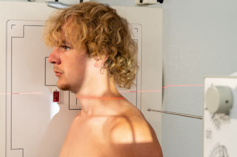
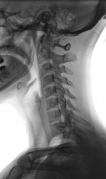

# Rx căi aeriene superioare de profil

  📷 Radiografie Convențională (Rx)
  <strong>Actualizat:</strong> 2026-09-15
  <strong>Autor:</strong> Departamentul de Radiologie / Referință Bontrager

---

-   __1. Rezumat Clinic & Indicații__

    ---

    === "Indicații Clinice"

        - Investigarea patologiei laringelui și traheei umplute cu aer, inclusiv regiunea glandelor tiroidă și timus și porțiunea superioară a esofagului, pentru identificarea unui corp străin radiopac sau dacă este prezentă substanță de contrast.
        - Excluderea epiglotitei, care poate pune în pericol viața copilului mic.

    === "Ghid Național IRIS"

        !!! info "Referință Primară: Ghidul Național IRIS (Ordinul MS 1342/2012)"
            - **Capitol Ghid IRIS:** *Ghidul Național IRIS*
            - **Grad de Recomandare:** **De verificat pe indicație; fără grad atribuit automat**
            - **Nivel de Iradiere Estimată:** `De verificat pentru examinarea și populația selectate`

            [:octicons-search-16: Deschide Ghidul IRIS](../../iris.md){ .md-button .md-button--primary } [:material-open-in-new: Aplicația Oficială PWA](https://radiologie-pediatrica.ro/iris/){ .md-button target="_blank" rel="noopener" }
-   __2. Poziționare & Centrare Fascicul__

    ---

    - **Poziție Pacient:** Pacient: Dacă este posibil, pacientul trebuie să fie în poziție verticală, șezând sau în ortostatism, pentru incidența de profil (poate fi realizată în profil R sau L și, dacă este necesar, în decubit pe masa de examinare).; Regiune anatomică: Poziționați pacientul pentru a centra căile aeriene superioare pe raza centrală și pe centrul receptorului de imagine (laringele și traheea se află anterior de coloana cervicală și toracală). Rotiți umerii posterior, cu brațele lăsate în jos și mâinile împreunate la spate. Ridicați ușor bărbia și cereți pacientului să privească drept înainte (Fig. 2.86). Ajustați înălțimea receptorului de imagine pentru a-i plasa marginea superioară la nivelul meatului auditiv extern (conduct auditiv extern (CAE)), care reprezintă orificiul canalului urechii externe (consultați indicațiile de respirație dacă zona principală de interes este traheea, mai degrabă decât laringele).
    - **Punct de Centrare Fascicul:** Perpendicular pe centrul receptorului de imagine, la nivelul C6 sau C7, la jumătatea distanței dintre proeminența laringiană a cartilajului tiroid (mărul lui Adam) și incizura jugulară (manubriul sternal).
    - **Distanță Focar-Film (DFF / SID):** 180 cm
    - **Comandă Respiratorie:** Efectuați expunerea în timpul unui inspir lent și profund pentru a asigura umplerea cu aer a traheei și căilor aeriene superioare.

-   __3. Parametri Tehnici Expunere__

    ---

    | Parametru Tehnic | Valoare Configurare Generator / Tub |
    |:-----------------|:-------------------------------------|
    | **Tensiune Tub (kV)** | 75-85 kV |
    | **Sarcină / Produs Curent-Timp (mAs)** | DE CONFIGURAT PE APARAT |
    | **Distanță Focar-Film (DFF / SID)** | 180 cm |
    | **Grilă Antidifuzoare (Bucky)** | Cu grilă antidifuzoare Bucky |
    | **Dimensiune Focar** | Focar Mare (1.0 - 1.2 mm) |
    | **Camere de Ionizare AEC** | Camerele laterale (sau camera centrală, în funcție de regiune) |
    | **Colimare Fascicul** | Colimați la regiunea părților moi ale gâtului. |
    | **Filtrare Tub** | Totală ≥ 2.5 mm Al echivalent |

-   __4. Criterii de Calitate & Reușită Imagine__

    ---

    - Laringele și traheea trebuie să fie umplute cu aer și bine vizualizate (Fig. 2.87 și 2.88). Poziție.
    - Centrarea pentru regiunea gâtului (laringe și trahee proximală) trebuie să includă conductul auditiv extern (CAE) la marginea superioară a imaginii și T2 sau T3 la marginea inferioară. Dacă laringele distal și traheea reprezintă principala arie de interes diagnostic, centrarea trebuie coborâtă pentru a include pe imagine zona de la C3 până la T4 sau T5.
    - Umbrele umerilor trebuie să fie situate în principal posterior de regiunea traheei și să nu se suprapună peste aceasta.
    - Marginile colimării trebuie să fie vizibile bilateral, ideal cu margini minime (≤¼ inch) la partea superioară și inferioară. Expunere.
    - Expunerea optimă include o tehnică pentru părți moi și un algoritm de procesare prin care laringele umplut cu aer și traheea superioară să fie bine vizualizate, fără supraexpunere.
    - Coloana cervicală apare subexpusă. R Fig. 2.87 Profil—căi aeriene superioare (pentru regiunea laringelui distal și a traheei). R Laringe. Trahee. Epiglotă. Fig. 2.88 Profil—căi aeriene superioare.

-   __5. Protecție Radiologică (ALARA)__

    ---

    - Ecranare gonadică și a organelor radiosensibile conform procedurilor locale de radioprotecție ALARA.
    - Colimare strictă la aria de interes pentru limitarea radiației difuze.
    - Verificarea posibilității unei sarcini la pacientele de vârstă fertilă înainte de expunere.

!!! note "Observații Clinice & Tehnice"
    (Centrarea și expunerea pentru regiunea laringelui distal și a traheei): Dacă laringele distal și porțiunile superioară și mijlocie ale traheei constituie principalele zone de interes, receptorul de imagine și raza centrală trebuie coborâte pentru a plasa raza centrală la partea superioară a incizurii jugulare (manubriul sternal) (T1–T2), cu parametri de expunere aproximativ ca pentru toracele de profil. CĂI AERIENE SUPERIOARE — INCIDENȚE DE RUTINĂ: profil, AP. Fig. 2.86 Incidență de profil drept—căi aeriene superioare.

### 🖼️ Imagini

<figure class="protocol-image-card" markdown>

<figcaption><strong>Fig. 2.86 Incidență de profil drept—căi aeriene superioare.</strong> — Poziționarea pacientului conform Ghidului Bontrager (Fig. 2.86 Poziție de profil drept—căi aeriene superioare.)</figcaption>

</figure>

<figure class="protocol-image-card" markdown>

<figcaption><strong>Fig. 2.87 Profil—superior</strong> — Aspect radiografic de referință conform Ghidului Bontrager (Fig. 2.87 Profil—superior)</figcaption>

</figure>

<figure class="protocol-image-card" markdown>

<figcaption><strong>Fig. 2.88 Profil—căi aeriene superioare.</strong> — Aspect radiografic de referință conform Ghidului Bontrager (Fig. 2.88 Profil—căi aeriene superioare.)</figcaption>

</figure>

=== "Ghid Rapid de Execuție"

    1. **Identificarea și verificarea pacientului:** verificare identitate, zonă de examinat, consimțământ conform procedurii și evaluarea posibilității unei sarcini, când este relevantă.
    2. **Pregătire:** îndepărtarea oricăror obiecte radiopace (bijuterii, agrafe, fermoare, proteze, pansamente dense).
    3. **Poziționare precisă:** alinierea receptorului de imagine și a tubului la distanța prescrisă (180 cm).
    4. **Colimare strictă:** adaptarea fasciculului strict la regiunea de diagnostic pentru scăderea iradierii și reducerea radiației difuze.
    5. **Radioprotecție:** verificarea [politicii RX](../radioprotectie.md), cu măsuri distincte pentru pacient, personal și însoțitor.

## Surse de documentare

- [Bontrager's Textbook of Radiographic Positioning (Ed. 9/10), Pagina 112](https://www.elsevier.com/books/textbook-of-radiographic-positioning-and-related-anatomy/lampignano/978-0-323-65367-1)
