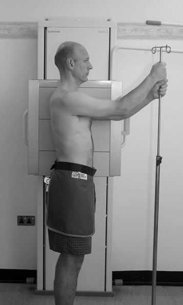
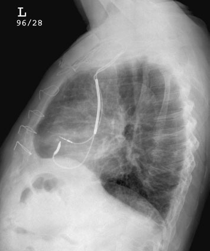
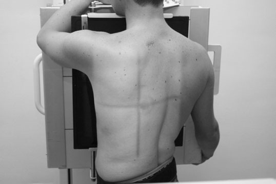
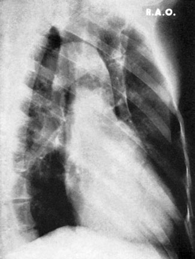
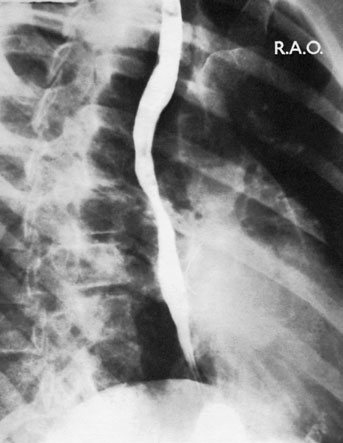

# Rx Cord și Siluetă Cardiovasculară and aorta Left Profil (Lateral)

  📷 Radiografie Convențională (Rx)
  <strong>Actualizat:</strong> 2026-09-16
  <strong>Autor:</strong> Departamentul de Radiologie / Referință Clark (Ed. 12)

---

-   __1. Rezumat Clinic & Indicații__

    ---

    === "Indicații Clinice"

        - Profil (lateral) radiografie poate help la locate cardiac sau pericardial masses, e.g. stâng ventricular aneurysm și pericardial cyst. These sunt assessed better prin echocardiography sau CT/MRI.
        - Cardiac și pericardial calcificări patologice poate fie confirmed și its extent assessed more fully pe Profil (lateral) chest radiografie.
        - After pacemaker insertion, Profil (lateral) imagine confirms that ventricular electrode lies anteriorly la drept ventricular apex.
        - This incidență poate fie useful adjunct la Profil (lateral) în cases de doubt about dilatation sau tortuosity de aorta.
        - This incidență poate fie used în conjunction cu bariumswallow study la evidențiază enlargement de Cord și Siluetă Cardiovasculară sau aorta, sau abnormal vessels și vascular rings, which poate produce abnormal impressions pe oesophagus și cause dysphagia.
        - CT, MRI sau angiography assess vascular rings more accurately.

    === "Ghid Național IRIS"

        !!! info "Referință Primară: Ghidul Național IRIS (Ordinul MS 1342/2012)"
            - **Capitol Ghid IRIS:** *Ghidul Național IRIS*
            - **Grad de Recomandare:** **De verificat pe indicație; fără grad atribuit automat**
            - **Nivel de Iradiere Estimată:** `De verificat pentru examinarea și populația selectate`

            [:octicons-search-16: Deschide Ghidul IRIS](../../iris.md){ .md-button .md-button--primary } [:material-open-in-new: Aplicația Oficială PWA](https://radiologie-pediatrica.ro/iris/){ .md-button target="_blank" rel="noopener" }
-   __2. Poziționare & Centrare Fascicul__

    ---

    - **Poziție Pacient:** • pacientul este întors la bring stâng side în contact cu caseta.
• planul mediosagital este ajustat paralel cu casetă.
• brațele sunt folded over capul sau raised above capul la rest pe orizontal bar.
• mid-axillary line este coincident cu middle de film radiologic, și caseta este ajustat pentru include Vârfuri Pulmonare (Apexuri) și inferior lobes la level de first lumbar vertebra.

• pacientul este initially poziționat facing caseta, which este sprijinit vertically în caseta holder cu upper edge above lung Vârfuri Pulmonare (Apexuri).
• cu drept side de trunk kept în contact cu caseta, pacientul este rotit la bring stâng side away de la caseta, astfel încât plan coronal forms angle de 60 grade la caseta.
    - **Punct de Centrare Fascicul:** • se orientează raza centrală centrală la drept-angles la middle de caseta în mid-axillary line.
• expunere este made pe arrested inspir profund complet.

• Direct raza centrală orizontală centrală la drept-angles la middle de caseta la nivelul sixth Coloană Toracală, la show Cord și Siluetă Cardiovasculară, aortic arch și descending aorta.
    - **Distanță Focar-Film (DFF / SID):** 180 cm
    - **Comandă Respiratorie:** expunere este made pe arrested inspir profund complet

-   __3. Parametri Tehnici Expunere__

    ---

    | Parametru Tehnic | Valoare Configurare Generator / Tub |
    |:-----------------|:-------------------------------------|
    | **Tensiune Tub (kV)** | DE CONFIGURAT PE APARAT |
    | **Sarcină / Produs Curent-Timp (mAs)** | Conform AEC / grosime anatomică |
    | **Distanță Focar-Film (DFF / SID)** | 180 cm |
    | **Grilă Antidifuzoare (Bucky)** | Cu grilă antidifuzoare Bucky |
    | **Dimensiune Focar** | Focar Mare (1.0 - 1.2 mm) |
    | **Camere de Ionizare AEC** | Camerele laterale (sau camera centrală funcție de regiune) |
    | **Colimare Fascicul** | Colimare strictă adaptată pe receptor 35 x 43 cm |
    | **Filtrare Tub** | Totală ≥ 2.5 mm Al echivalent (conform Clark: 3.0 mm Al eq.) |

-   __4. Criterii de Calitate & Reușită Imagine__

    ---

    - Coloană Toracală și Stern trebuie să fie Profil (lateral) și clar evidențiat(e).
    - brațele trebuie să nu obscure Cord și Siluetă Cardiovasculară și câmpuri pulmonare.
    - anterior și posterior mediastinum și Cord și Siluetă Cardiovasculară sunt defined sharply și câmpuri pulmonare sunt seen clearly.
    - costo-phrenic angles și cupole diafragmatice trebuie să fie outlined clearly.

-   __5. Protecție Radiologică (ALARA)__

    ---

    - Ecranare gonadică cu șorț plumbat dacă gonadele sunt în apropierea fasciculului util (regula ALARA).
    - Colimare precisă la dimensiunea anatomică strict necesară pentru reducerea dozei și a radiației difuze.
    - Verificarea posibilității unei sarcini la pacientele de vârstă fertilă înainte de expunere.

!!! note "Observații Clinice & Tehnice"
    • FFD de 150 sau 180 cm este selected.
• pacienți who have recently had permanent pacemaker implant trebuie să nu raise their brațe above their cap. It este sufficient la raise brațele clear de Torace, otherwise there este risk de damage la recently sutured tissues și possible dislodging de pacemaker electrodes.
• pacienți pe trolleys poate find it difficult la remain în vertical poziție. large wedge foam pad poate fie required la assist pacientul la remain în ortostatism.
218 stâng Profil (lateral) radiografie de Cord și Siluetă Cardiovasculară evidențiind poziție de permanent pacing system
• Either stationary sau grilă mobilă Bucky poate fie employed. kilovoltage selected este ajustat la give adecvat penetration, cu corpuri de Coloană Toracală, costo-phrenic și apical regions defined well.

FFD poate fie reduced la 150 cm.
5th 6th 7th 8th drept Oblică stâng lung drept lung Stern Cord și Siluetă Cardiovasculară Costal cartilage 60° poziție pentru radiographic incidență 8th thoracic vertebra Spinous process de 7th thoracic vertebra drept Oblică Anterioară radiografie drept Oblică Anterioară radiografie cu barium outlining oesophagus

### 🖼️ Imagini

<figure class="protocol-image-card" markdown>

<figcaption><strong>• Profil (lateral) radiografie poate help la locate cardiac sau pericardial</strong> — Poziționare pacient și centrare fascicul conform Clark (Ed. 12)</figcaption>

</figure>

<figure class="protocol-image-card" markdown>

<figcaption><strong>• Cardiac și pericardial calcificări patologice poate fie confirmed și</strong> — Aspect radiografic / ghid de poziționare conform tratatului Clark (Ed. 12)</figcaption>

</figure>

<figure class="protocol-image-card" markdown>

<figcaption><strong>sau abnormal vessels și vascular rings, which poate produce</strong> — Aspect radiografic / ghid de poziționare conform tratatului Clark (Ed. 12)</figcaption>

</figure>

<figure class="protocol-image-card" markdown>

<figcaption><strong>abnormal impressions pe oesophagus și cause dysphagia.</strong> — Aspect radiografic / ghid de poziționare conform tratatului Clark (Ed. 12)</figcaption>

</figure>

<figure class="protocol-image-card" markdown>

<figcaption><strong>poziție pentru radiographic incidență</strong> — Aspect radiografic / ghid de poziționare conform tratatului Clark (Ed. 12)</figcaption>

</figure>

=== "Ghid Rapid de Execuție"

    1. **Identificarea și verificarea pacientului:** verificare identitate, zonă de examinat, consimțământ conform procedurii și evaluarea posibilității unei sarcini, când este relevantă.
    2. **Pregătire:** îndepărtarea oricăror obiecte radiopace (bijuterii, agrafe, fermoare, proteze, pansamente dense).
    3. **Poziționare precisă:** alinierea receptorului de imagine și a tubului la distanța prescrisă (180 cm).
    4. **Colimare strictă:** adaptarea fasciculului strict la regiunea de diagnostic pentru scăderea iradierii și reducerea radiației difuze.
    5. **Radioprotecție:** verificarea [politicii RX](../radioprotectie.md), cu măsuri distincte pentru pacient, personal și însoțitor.

## Surse de documentare

- [Clark's Positioning in Radiography (Ed. 12), Pagina 233](../../assets/protocols/sources/Clark___Positioning_in_Radiography__12th_edition.pdf#page=233)
