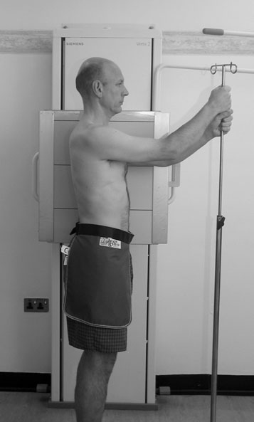
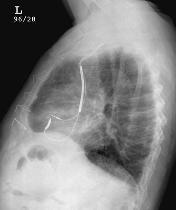
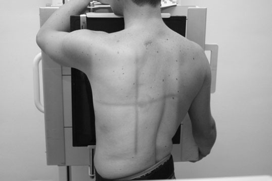
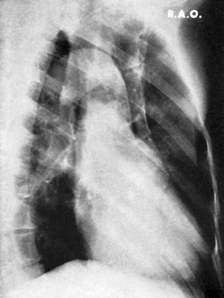
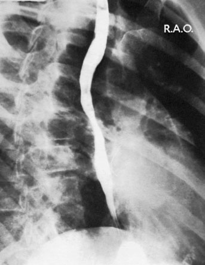

# Rx cord, siluetă cardiovasculară și aortă — profil stâng

  📷 Radiografie Convențională (Rx)
  <strong>Actualizat:</strong> 2026-09-16
  <strong>Autor:</strong> Departamentul de Radiologie / Referință Clark (Ed. 12)

---

-   __1. Rezumat Clinic & Indicații__

    ---

    === "Indicații Clinice"

        - Radiografia de profil poate ajuta la localizarea maselor cardiace sau pericardice, de exemplu anevrismul ventricular stâng și chistul pericardic. Acestea sunt evaluate mai bine prin ecocardiografie sau CT/MRI.
        - Calcificările patologice cardiace și pericardice pot fi confirmate, iar extinderea lor poate fi evaluată mai complet pe radiografia toracică de profil.
        - După implantarea stimulatorului cardiac, imaginea de profil confirmă că electrodul ventricular se află anterior, la apexul ventriculului drept.
        - Această incidență poate fi utilă ca examinare complementară celei de profil în cazurile de incertitudine privind dilatarea sau tortuozitatea aortei.
        - Această incidență poate fi utilizată împreună cu examinarea deglutiției cu bariu pentru a evidenția mărirea cordului și a siluetei cardiovasculare sau a aortei, ori vase anormale și inele vasculare, care pot produce amprente anormale asupra esofagului și pot cauza disfagie.
        - CT, MRI sau angiografia evaluează mai precis inelele vasculare.

    === "Ghid Național IRIS"

        !!! info "Referință Primară: Ghidul Național IRIS (Ordinul MS 1342/2012)"
            - **Capitol Ghid IRIS:** *Ghidul Național IRIS*
            - **Grad de Recomandare:** **De verificat pe indicație; fără grad atribuit automat**
            - **Nivel de Iradiere Estimată:** `De verificat pentru examinarea și populația selectate`

            [:octicons-search-16: Deschide Ghidul IRIS](../../iris.md){ .md-button .md-button--primary } [:material-open-in-new: Aplicația Oficială PWA](https://radiologie-pediatrica.ro/iris/){ .md-button target="_blank" rel="noopener" }
-   __2. Poziționare & Centrare Fascicul__

    ---

    - **Poziție Pacient:** • Pacientul este rotit pentru a aduce partea stângă în contact cu caseta.
• Planul mediosagital este ajustat paralel cu caseta.
• Brațele sunt îndoite deasupra capului sau ridicate deasupra capului, sprijinite pe o bară orizontală.
• Linia medioaxilară coincide cu mijlocul filmului radiologic, iar caseta este ajustată pentru a include vârfurile pulmonare (apexurile) și lobii inferiori la nivelul primei vertebre lombare.

• Pacientul este poziționat inițial cu fața spre casetă, care este susținută vertical în suportul casetei, cu marginea superioară deasupra vârfurilor pulmonare (apexurilor).
• Menținând partea dreaptă a trunchiului în contact cu caseta, pacientul este rotit astfel încât partea stângă să se îndepărteze de casetă, iar planul coronal să formeze un unghi de 60 grade cu aceasta.
    - **Punct de Centrare Fascicul:** • Orientați raza centrală perpendicular pe mijlocul casetei, pe linia medioaxilară.
• Expunerea se efectuează în apnee după un inspir profund complet.

• Orientați raza centrală orizontală perpendicular pe mijlocul casetei, la nivelul celei de-a șasea vertebre toracale, pentru a evidenția cordul și silueta cardiovasculară, arcul aortic și aorta descendentă.
    - **Distanță Focar-Film (DFF / SID):** 180 cm
    - **Comandă Respiratorie:** Expunerea se efectuează în apnee după un inspir profund complet.

-   __3. Parametri Tehnici Expunere__

    ---

    | Parametru Tehnic | Valoare Configurare Generator / Tub |
    |:-----------------|:-------------------------------------|
    | **Tensiune Tub (kV)** | DE CONFIGURAT PE APARAT |
    | **Sarcină / Produs Curent-Timp (mAs)** | Conform AEC / grosimii anatomice |
    | **Distanță Focar-Film (DFF / SID)** | 180 cm |
    | **Grilă Antidifuzoare (Bucky)** | Cu grilă antidifuzoare Bucky |
    | **Dimensiune Focar** | Focar Mare (1.0 - 1.2 mm) |
    | **Camere de Ionizare AEC** | Camerele laterale (sau camera centrală, în funcție de regiune) |
    | **Colimare Fascicul** | Colimare strictă adaptată pe receptor 35 x 43 cm |
    | **Filtrare Tub** | Totală ≥ 2.5 mm Al echivalent (conform Clark: 3.0 mm Al echivalent) |

-   __4. Criterii de Calitate & Reușită Imagine__

    ---

    - Coloana toracală și sternul trebuie să fie de profil și clar evidențiate.
    - Brațele nu trebuie să mascheze cordul, silueta cardiovasculară și câmpurile pulmonare.
    - Mediastinul anterior și posterior, cordul și silueta cardiovasculară sunt bine delimitate, iar câmpurile pulmonare sunt clar vizibile.
    - Unghiurile costofrenice și cupolele diafragmatice trebuie să fie clar conturate.

-   __5. Protecție Radiologică (ALARA)__

    ---

    - Ecranare gonadică cu șorț plumbat dacă gonadele sunt în apropierea fasciculului util (regula ALARA).
    - Colimare precisă la dimensiunea anatomică strict necesară pentru reducerea dozei și a radiației difuze.
    - Verificarea posibilității unei sarcini la pacientele de vârstă fertilă înainte de expunere.

!!! note "Observații Clinice & Tehnice"
    • Se selectează o FFD de 150 sau 180 cm.
• Pacienții cărora li s-a implantat recent un stimulator cardiac permanent nu trebuie să ridice brațele deasupra capului. Este suficient să ridice brațele în afara câmpului toracic; altfel există riscul lezării țesuturilor recent suturate și al deplasării electrozilor stimulatorului cardiac.
• Pacienților aflați pe tărgi le poate fi dificil să mențină poziția verticală. Poate fi necesar un suport mare din spumă, în formă de pană, pentru a ajuta pacientul să rămână în poziție verticală.
218 Radiografie de profil stâng a cordului și siluetei cardiovasculare care evidențiază poziția sistemului de stimulare cardiacă permanentă.
• Se poate utiliza o grilă fixă sau o grilă mobilă Bucky. Kilovoltajul selectat este ajustat pentru a asigura o penetrare adecvată, cu corpurile vertebrelor toracale și regiunile costofrenice și apicale bine definite.

FFD poate fi redusă la 150 cm.
A 5-a, a 6-a, a 7-a, a 8-a. Oblică dreaptă. Plămân stâng. Plămân drept. Stern. Cord și siluetă cardiovasculară. Cartilaj costal. Poziție la 60° pentru incidența radiografică. A 8-a vertebră toracală. Apofiza spinoasă a celei de-a 7-a vertebre toracale. Radiografie oblică anterioară dreaptă. Radiografie oblică anterioară dreaptă cu esofagul conturat de bariu.

### 🖼️ Imagini

<figure class="protocol-image-card" markdown>

<figcaption><strong>• Radiografia de profil poate ajuta la localizarea celor cardiace sau pericardice</strong> — Poziționarea pacientului și centrarea fasciculului conform Clark (Ed. 12)</figcaption>

</figure>

<figure class="protocol-image-card" markdown>

<figcaption><strong>• Calcificările patologice cardiace și pericardice pot fi confirmate și</strong> — Aspect radiografic / ghid de poziționare conform tratatului Clark (Ed. 12)</figcaption>

</figure>

<figure class="protocol-image-card" markdown>

<figcaption><strong>sau vase anormale și inele vasculare, care pot produce</strong> — Aspect radiografic / ghid de poziționare conform tratatului Clark (Ed. 12)</figcaption>

</figure>

<figure class="protocol-image-card" markdown>

<figcaption><strong>amprente anormale asupra esofagului și pot cauza disfagie.</strong> — Aspect radiografic / ghid de poziționare conform tratatului Clark (Ed. 12)</figcaption>

</figure>

<figure class="protocol-image-card" markdown>

<figcaption><strong>Poziție pentru incidența radiografică.</strong> — Aspect radiografic / ghid de poziționare conform tratatului Clark (Ed. 12)</figcaption>

</figure>

=== "Ghid Rapid de Execuție"

    1. **Identificarea și verificarea pacientului:** verificare identitate, zonă de examinat, consimțământ conform procedurii și evaluarea posibilității unei sarcini, când este relevantă.
    2. **Pregătire:** îndepărtarea oricăror obiecte radiopace (bijuterii, agrafe, fermoare, proteze, pansamente dense).
    3. **Poziționare precisă:** alinierea receptorului de imagine și a tubului la distanța prescrisă (180 cm).
    4. **Colimare strictă:** adaptarea fasciculului strict la regiunea de diagnostic pentru scăderea iradierii și reducerea radiației difuze.
    5. **Radioprotecție:** verificarea [politicii RX](../radioprotectie.md), cu măsuri distincte pentru pacient, personal și însoțitor.

## Surse de documentare

- [Clark's Positioning in Radiography (Ed. 12), Pagina 233](https://books.google.com/books/about/Clark_s_Positioning_in_Radiography.html?id=Xxu6MwEACAAJ)
