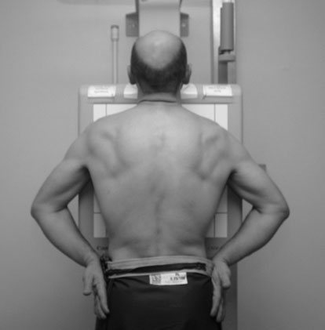
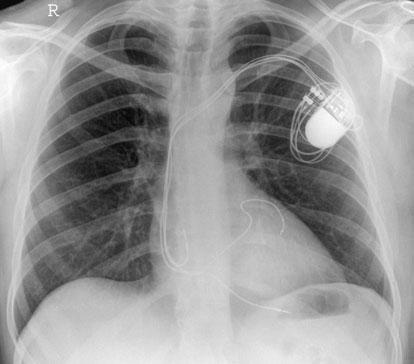
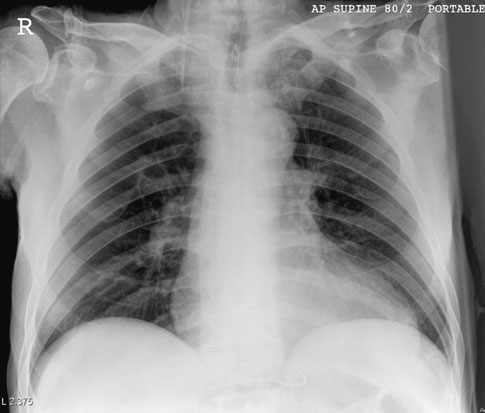
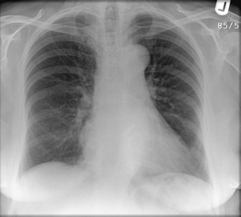
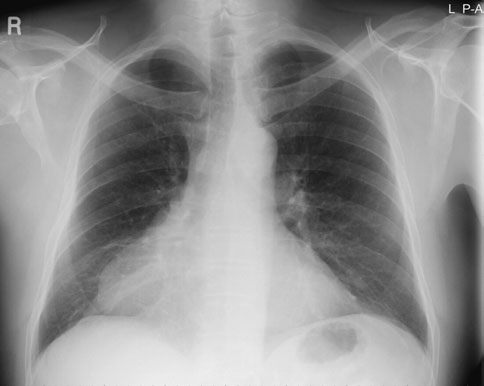

# Rx Cord și Siluetă Cardiovasculară and aorta Postero-Anterior (PA)

  📷 Radiografie Convențională (Rx)
  <strong>Actualizat:</strong> 2026-09-16
  <strong>Autor:</strong> Departamentul de Radiologie / Referință Clark (Ed. 12)

---

-   __1. Rezumat Clinic & Indicații__

    ---

    === "Indicații Clinice"

        - artefactual increase în apparent size de Cord și Siluetă Cardiovasculară poate fie produced prin number de factors, including: – poor inspiration, ca Cord și Siluetă Cardiovasculară rotates up into more orizontal orientation; – short FFD due la geometric magnification; – Decubit dorsal posture due la more orizontal cardiac orientation și reduced FFD. la prevent clinician making erroneous diagnosis de cardiomegaly sau Cord și Siluetă Cardiovasculară failure, these factors trebuie să fie avoided if possible.
        - If pacientul este nu truly Ortostatism, there poate fie diversion de blood flow la upper lobe vessels, mimicking upperlobe blood diversion seen în Cord și Siluetă Cardiovasculară failure.
        - Following pacemaker insertion, clinician poate wish la check that wire este located properly și la exclude complications such ca pneumotorax și revărsat pleural (pleurezie).
        - Pacemaker wires și prosthetic valves sunt visualized less readily pe low-kVp și underexposed filme radiologice. penetrated radiografie poate help la evidențiază these fully. Profil (lateral) incidență este also acquired la help în localization.
        - Native valve și coronary artery calcificări patologice will fie seen less well pe inadequately penetrated radiografie. Antero-posterior (AP) Decubit dorsal radiografie evidențiind artefactual enlargement de Cord și Siluetă Cardiovasculară due la Decubit dorsal posture Postero-anterior (PA) radiografie evidențiind prosthetic aortic și mitral valves Postero-anterior (PA) radiografie în pacient cu drept pericardial cyst

    === "Ghid Național IRIS"

        !!! info "Referință Primară: Ghidul Național IRIS (Ordinul MS 1342/2012)"
            - **Capitol Ghid IRIS:** *Ghidul Național IRIS*
            - **Grad de Recomandare:** **De verificat pe indicație; fără grad atribuit automat**
            - **Nivel de Iradiere Estimată:** `De verificat pentru examinarea și populația selectate`

            [:octicons-search-16: Deschide Ghidul IRIS](../../iris.md){ .md-button .md-button--primary } [:material-open-in-new: Aplicația Oficială PWA](https://radiologie-pediatrica.ro/iris/){ .md-button target="_blank" rel="noopener" }
-   __2. Poziționare & Centrare Fascicul__

    ---

    - **Poziție Pacient:** • pacientul este poziționat Ortostatism, facing caseta și cu bărbia extins și resting pe top de caseta.
• planul mediosagital este ajustat perpendicular pe middle de caseta, cu pacientul’s brațe encircling caseta. Alternatively, dorsal aspects de mâinile sunt plasat behind și below șoldurile la allow umerii la fie rotit forward și pressed downward în contact cu caseta.
• Torace trebuie să fie poziționat symmetrically relative la film radiologic.
    - **Punct de Centrare Fascicul:** • orizontal central fascicul este orientat la drept-angles la caseta la nivelul eighth Coloană Toracală (i.e. spinous process de T7).
• surface markings de T7 spinous process poate fie assessed prin using inferior angle de Omoplat (Scapulă) before umerii sunt pushed forward.
• expunere este made pe arrested inspir profund complet.
    - **Distanță Focar-Film (DFF / SID):** 100 cm
    - **Comandă Respiratorie:** expunere este made pe arrested inspir profund complet

-   __3. Parametri Tehnici Expunere__

    ---

    | Parametru Tehnic | Valoare Configurare Generator / Tub |
    |:-----------------|:-------------------------------------|
    | **Tensiune Tub (kV)** | DE CONFIGURAT PE APARAT |
    | **Sarcină / Produs Curent-Timp (mAs)** | Conform AEC / grosime anatomică |
    | **Distanță Focar-Film (DFF / SID)** | 100 cm |
    | **Grilă Antidifuzoare (Bucky)** | Conform grosimii anatomice (> 10-12 cm cu grilă) |
    | **Dimensiune Focar** | Focar Mic (0.6 mm) |
    | **Camere de Ionizare AEC** | DE CONFIGURAT PE APARAT |
    | **Colimare Fascicul** | Colimare strictă adaptată pe receptor 35 x 43 cm |
    | **Filtrare Tub** | Totală ≥ 2.5 mm Al echivalent (conform Clark: 3.0 mm Al eq.) |

-   __4. Criterii de Calitate & Reușită Imagine__

    ---

    - ideal Postero-anterior (PA) chest radiografie pentru Cord și Siluetă Cardiovasculară și aorta trebuie să evidențiază following:
    - clavicles simetric și echidistant față de procese spinoase.
    - mediastinum și Cord și Siluetă Cardiovasculară central și defined sharply.
    - costo-phrenic angles și cupole diafragmatice outlined clearly.
    - Full câmpuri pulmonare, cu Omoplat (Scapulă) projected laterally away de la câmpuri pulmonare.

-   __5. Protecție Radiologică (ALARA)__

    ---

    - Ecranare gonadică cu șorț plumbat dacă gonadele sunt în apropierea fasciculului util (regula ALARA).
    - Colimare precisă la dimensiunea anatomică strict necesară pentru reducerea dozei și a radiației difuze.
    - Verificarea posibilității unei sarcini la pacientele de vârstă fertilă înainte de expunere.

!!! note "Observații Clinice & Tehnice"
    • Postero-anterior (PA) marker este normally used la identify drept sau stâng side de pacientul. Care trebuie să fie made la select correct marker so ca nu la misdiagnose case de dextrocardia.
• kilovoltage selected este ajustat la give adecvat penetration, cu corpuri de Coloană Toracală just vizibil through Cord și Siluetă Cardiovasculară (see p. 201).
• pentru comparison purposes, records de parametri de expunere used, including FFD, trebuie să fie kept pentru follow-up examinations.
• Care trebuie să fie taken cu postoperative pacienți cu underwater seals și cu intravenous drips. These trebuie să nu fie dislodged, și examination time trebuie să fie kept la minimum.
• Underwater-seal drain bottles trebuie să fie kept below lowest point de pacientul’s chest la toate times la prevent contents de bottle being siphoned back into toracele.
216 Normal Postero-anterior (PA) radiografie în pacient cu permanent pacemaker în situ

### 🖼️ Imagini

<figure class="protocol-image-card" markdown>

<figcaption><strong>ideal Postero-anterior (PA) chest radiografie pentru Cord și Siluetă Cardiovasculară și</strong> — Poziționare pacient și centrare fascicul conform Clark (Ed. 12)</figcaption>

</figure>

<figure class="protocol-image-card" markdown>

<figcaption><strong>• Postero-anterior (PA) marker este normally used la identify drept</strong> — Aspect radiografic / ghid de poziționare conform tratatului Clark (Ed. 12)</figcaption>

</figure>

<figure class="protocol-image-card" markdown>

<figcaption><strong>plications such ca pneumotorax și revărsat pleural (pleurezie).</strong> — Aspect radiografic / ghid de poziționare conform tratatului Clark (Ed. 12)</figcaption>

</figure>

<figure class="protocol-image-card" markdown>

<figcaption><strong>radiografie poate help la evidențiază these fully. Profil (lateral)</strong> — Aspect radiografic / ghid de poziționare conform tratatului Clark (Ed. 12)</figcaption>

</figure>

<figure class="protocol-image-card" markdown>

<figcaption><strong>• Native valve și coronary artery calcificări patologice will fie seen</strong> — Aspect radiografic / ghid de poziționare conform tratatului Clark (Ed. 12)</figcaption>

</figure>

=== "Ghid Rapid de Execuție"

    1. **Identificarea și verificarea pacientului:** verificare identitate, zonă de examinat, consimțământ conform procedurii și evaluarea posibilității unei sarcini, când este relevantă.
    2. **Pregătire:** îndepărtarea oricăror obiecte radiopace (bijuterii, agrafe, fermoare, proteze, pansamente dense).
    3. **Poziționare precisă:** alinierea receptorului de imagine și a tubului la distanța prescrisă (100 cm).
    4. **Colimare strictă:** adaptarea fasciculului strict la regiunea de diagnostic pentru scăderea iradierii și reducerea radiației difuze.
    5. **Radioprotecție:** verificarea [politicii RX](../radioprotectie.md), cu măsuri distincte pentru pacient, personal și însoțitor.

## Surse de documentare

- [Clark's Positioning in Radiography (Ed. 12), Pagina 231](../../assets/protocols/sources/Clark___Positioning_in_Radiography__12th_edition.pdf#page=231)
