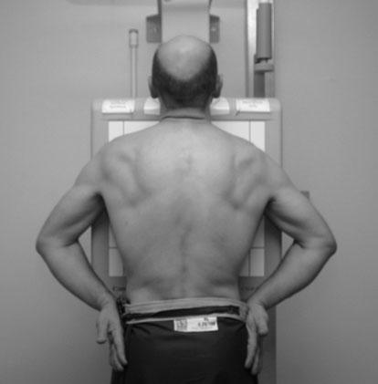
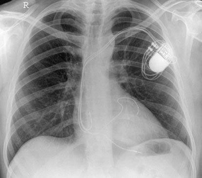
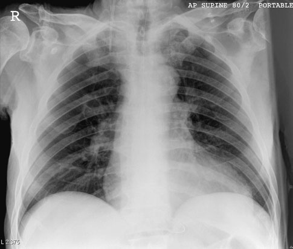
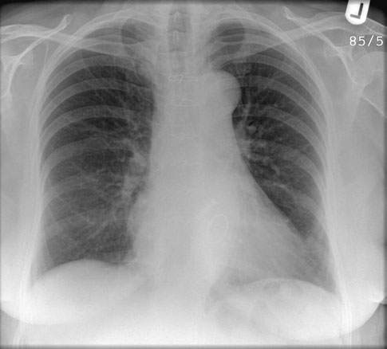
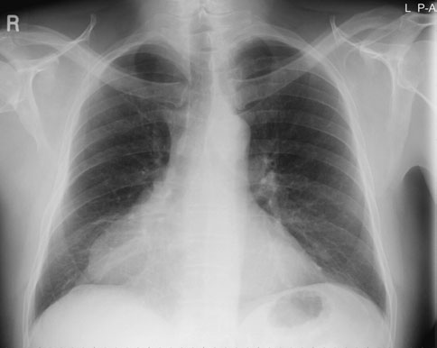

# Rx cord, siluetă cardiovasculară și aortă postero-anterior (PA)

  📷 Radiografie Convențională (Rx)
  <strong>Actualizat:</strong> 2026-09-16
  <strong>Autor:</strong> Departamentul de Radiologie / Referință Clark (Ed. 12)

---

-   __1. Rezumat Clinic & Indicații__

    ---

    === "Indicații Clinice"

        - O creștere artefactuală a dimensiunii aparente a cordului și siluetei cardiovasculare poate fi produsă de mai mulți factori, inclusiv: – inspir insuficient, deoarece cordul și silueta cardiovasculară se rotesc în sus, într-o orientare mai orizontală; – FFD scurtă, din cauza măririi geometrice; – poziția în decubit dorsal, din cauza orientării mai orizontale a cordului și a FFD reduse. Pentru a împiedica clinicianul să stabilească un diagnostic eronat de cardiomegalie sau insuficiență cardiacă, acești factori trebuie evitați, dacă este posibil.
        - Dacă pacientul nu este în ortostatism real, poate apărea redistribuirea fluxului sanguin spre vasele lobului superior, mimând redistribuirea sanguină spre lobul superior observată în insuficiența cardiacă.
        - După implantarea stimulatorului cardiac, clinicianul poate dori să verifice poziționarea corectă a sondei și să excludă complicații precum pneumotoraxul și revărsatul pleural (pleurezia).
        - Sondele stimulatorului cardiac și protezele valvulare sunt mai greu vizualizate pe filmele radiologice realizate cu kVp scăzut și pe cele subexpuse. O radiografie cu penetrare adecvată poate ajuta la evidențierea lor completă. Se realizează și o incidență de profil pentru a ajuta la localizare.
        - Calcificările patologice ale valvelor native și arterelor coronare vor fi mai puțin vizibile pe o radiografie cu penetrare insuficientă. Radiografie antero-posterioară (AP) în decubit dorsal care evidențiază mărirea artefactuală a cordului și siluetei cardiovasculare din cauza poziției în decubit dorsal. Radiografie postero-anterioară (PA) care evidențiază proteze valvulare aortică și mitrală. Radiografie postero-anterioară (PA) la un pacient cu chist pericardic drept.

    === "Ghid Național IRIS"

        !!! info "Referință Primară: Ghidul Național IRIS (Ordinul MS 1342/2012)"
            - **Capitol Ghid IRIS:** *Ghidul Național IRIS*
            - **Grad de Recomandare:** **De verificat pe indicație; fără grad atribuit automat**
            - **Nivel de Iradiere Estimată:** `De verificat pentru examinarea și populația selectate`

            [:octicons-search-16: Deschide Ghidul IRIS](../../iris.md){ .md-button .md-button--primary } [:material-open-in-new: Aplicația Oficială PWA](https://radiologie-pediatrica.ro/iris/){ .md-button target="_blank" rel="noopener" }
-   __2. Poziționare & Centrare Fascicul__

    ---

    - **Poziție Pacient:** • Pacientul este poziționat în ortostatism, cu fața spre casetă și bărbia în extensie, sprijinită pe marginea superioară a casetei.
• Planul mediosagital este ajustat perpendicular pe mijlocul casetei, cu brațele pacientului cuprinzând caseta. Alternativ, fețele dorsale ale mâinilor sunt plasate posterior și inferior de șolduri, pentru a permite rotirea umerilor înainte și apăsarea lor în jos, în contact cu caseta.
• Toracele trebuie poziționat simetric față de filmul radiologic.
    - **Punct de Centrare Fascicul:** • Fasciculul central orizontal este orientat perpendicular pe casetă, la nivelul celei de-a opta vertebre toracale (adică apofiza spinoasă a T7).
• Reperele de suprafață ale apofizei spinoase T7 pot fi evaluate folosind unghiul inferior al omoplatului (scapulei), înainte de deplasarea umerilor înainte.
• Expunerea se efectuează în apnee după un inspir profund complet.
    - **Distanță Focar-Film (DFF / SID):** 100 cm
    - **Comandă Respiratorie:** Expunerea se efectuează în apnee după un inspir profund complet.

-   __3. Parametri Tehnici Expunere__

    ---

    | Parametru Tehnic | Valoare Configurare Generator / Tub |
    |:-----------------|:-------------------------------------|
    | **Tensiune Tub (kV)** | DE CONFIGURAT PE APARAT |
    | **Sarcină / Produs Curent-Timp (mAs)** | Conform AEC / grosimii anatomice |
    | **Distanță Focar-Film (DFF / SID)** | 100 cm |
    | **Grilă Antidifuzoare (Bucky)** | Conform grosimii anatomice (> 10-12 cm cu grilă) |
    | **Dimensiune Focar** | Focar Mic (0.6 mm) |
    | **Camere de Ionizare AEC** | DE CONFIGURAT PE APARAT |
    | **Colimare Fascicul** | Colimare strictă adaptată pe receptor 35 x 43 cm |
    | **Filtrare Tub** | Totală ≥ 2.5 mm Al echivalent (conform Clark: 3.0 mm Al echivalent) |

-   __4. Criterii de Calitate & Reușită Imagine__

    ---

    - Radiografia toracică postero-anterioară (PA) ideală pentru cord, siluetă cardiovasculară și aortă trebuie să evidențieze următoarele:
    - Clavicule simetrice și echidistante față de apofizele spinoase.
    - Mediastinul, cordul și silueta cardiovasculară situate central și bine delimitate.
    - Unghiuri costofrenice și cupole diafragmatice clar conturate.
    - Câmpuri pulmonare incluse complet, cu omoplatul (scapula) proiectat lateral, în afara câmpurilor pulmonare.

-   __5. Protecție Radiologică (ALARA)__

    ---

    - Ecranare gonadică cu șorț plumbat dacă gonadele sunt în apropierea fasciculului util (regula ALARA).
    - Colimare precisă la dimensiunea anatomică strict necesară pentru reducerea dozei și a radiației difuze.
    - Verificarea posibilității unei sarcini la pacientele de vârstă fertilă înainte de expunere.

!!! note "Observații Clinice & Tehnice"
    • În mod normal, se utilizează un marker postero-anterior (PA) pentru a identifica partea dreaptă sau stângă a pacientului. Markerul corect trebuie selectat cu atenție, pentru a evita diagnosticarea eronată a dextrocardiei.
• Kilovoltajul selectat este ajustat pentru a asigura o penetrare adecvată, cu corpurile vertebrelor toracale abia vizibile prin cord și silueta cardiovasculară (consultați p. 201).
• În scop comparativ, parametrii de expunere utilizați, inclusiv FFD, trebuie consemnați pentru examinările de urmărire.
• Este necesară atenție la pacienții postoperatori cu drenaje cu sigiliu sub apă și perfuzii intravenoase. Acestea nu trebuie dislocate, iar durata examinării trebuie menținută la minimum.
• Recipientele drenajelor cu sigiliu sub apă trebuie menținute permanent sub punctul cel mai decliv al toracelui pacientului, pentru a preveni revenirea conținutului recipientului în torace prin sifonare.
216 Radiografie postero-anterioară (PA) normală la un pacient cu stimulator cardiac permanent in situ.

### 🖼️ Imagini

<figure class="protocol-image-card" markdown>

<figcaption><strong>Radiografia toracică postero-anterioară (PA) ideală pentru cord și siluetă cardiovasculară și</strong> — Poziționarea pacientului și centrarea fasciculului conform Clark (Ed. 12)</figcaption>

</figure>

<figure class="protocol-image-card" markdown>

<figcaption><strong>• În mod normal, se utilizează un marker postero-anterior (PA) pentru a identifica partea dreaptă</strong> — Aspect radiografic / ghid de poziționare conform tratatului Clark (Ed. 12)</figcaption>

</figure>

<figure class="protocol-image-card" markdown>

<figcaption><strong>complicații precum pneumotoraxul și revărsatul pleural (pleurezia).</strong> — Aspect radiografic / ghid de poziționare conform tratatului Clark (Ed. 12)</figcaption>

</figure>

<figure class="protocol-image-card" markdown>

<figcaption><strong>Radiografia poate ajuta la evidențierea completă a acestora. Profil</strong> — Aspect radiografic / ghid de poziționare conform tratatului Clark (Ed. 12)</figcaption>

</figure>

<figure class="protocol-image-card" markdown>

<figcaption><strong>• Calcificările patologice ale valvelor native și arterelor coronare vor fi vizibile</strong> — Aspect radiografic / ghid de poziționare conform tratatului Clark (Ed. 12)</figcaption>

</figure>

=== "Ghid Rapid de Execuție"

    1. **Identificarea și verificarea pacientului:** verificare identitate, zonă de examinat, consimțământ conform procedurii și evaluarea posibilității unei sarcini, când este relevantă.
    2. **Pregătire:** îndepărtarea oricăror obiecte radiopace (bijuterii, agrafe, fermoare, proteze, pansamente dense).
    3. **Poziționare precisă:** alinierea receptorului de imagine și a tubului la distanța prescrisă (100 cm).
    4. **Colimare strictă:** adaptarea fasciculului strict la regiunea de diagnostic pentru scăderea iradierii și reducerea radiației difuze.
    5. **Radioprotecție:** verificarea [politicii RX](../radioprotectie.md), cu măsuri distincte pentru pacient, personal și însoțitor.

## Surse de documentare

- [Clark's Positioning in Radiography (Ed. 12), Pagina 231](https://books.google.com/books/about/Clark_s_Positioning_in_Radiography.html?id=Xxu6MwEACAAJ)
