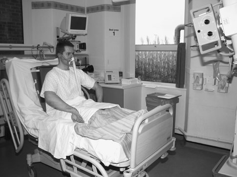
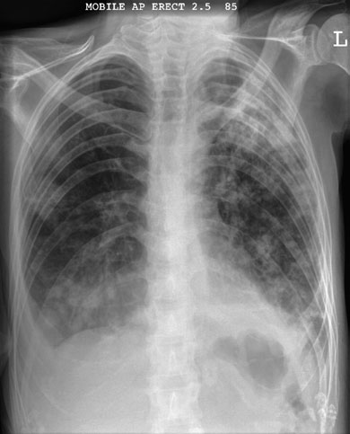
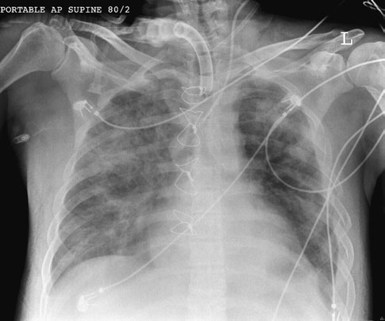

# Rx Cord și Siluetă Cardiovasculară and Torace (Câmpuri Pulmonare) Antero-Posterior (AP)

  📷 Radiografie Convențională (Rx)
  <strong>Actualizat:</strong> 2026-09-16
  <strong>Autor:</strong> Departamentul de Radiologie / Referință Clark (Ed. 12)

---

-   __1. Rezumat Clinic & Indicații__

    ---

    === "Indicații Clinice"

        - ca general rule, ward radiografie trebuie să fie performed only when it este nu possible la move pacientul la X-ray department și when medical intervention este dependent pe diagnosis confirmed pe radiografie. Antero-posterior (AP)

    === "Ghid Național IRIS"

        !!! info "Referință Primară: Ghidul Național IRIS (Ordinul MS 1342/2012)"
            - **Capitol Ghid IRIS:** *Ghidul Național IRIS*
            - **Grad de Recomandare:** **De verificat pe indicație; fără grad atribuit automat**
            - **Nivel de Iradiere Estimată:** `De verificat pentru examinarea și populația selectate`

            [:octicons-search-16: Deschide Ghidul IRIS](../../iris.md){ .md-button .md-button--primary } [:material-open-in-new: Aplicația Oficială PWA](https://radiologie-pediatrica.ro/iris/){ .md-button target="_blank" rel="noopener" }
-   __2. Poziționare & Centrare Fascicul__

    ---

    - **Poziție Pacient:** • Where possible, pacientul trebuie să fie X-rayed Poziție Șezândă Ortostatism și facing X-ray tube. caseta este sprijinit pe / sprijinit de back, using pillows sau large wedge-shaped foam pad, cu its upper edge above câmpuri pulmonare.
• If this este nu possible, pacientul poate fie poziționat Decubit dorsal.
Semi-Șezând poziție este nu favoured ca grade de recumbence este nu reproducible across series de imagini.
• planul mediosagital este ajustat la drept-angles la, și în linia mediană de, caseta.
• rotație de pacientul este prevented prin use de foam pads.
rotație produces range de artefacts (see p. 205) și trebuie să fie avoided sau minimized. If possible, brațele sunt rotit medially, cu umerii brought forward la bring scapulae clear de câmpuri pulmonare.
    - **Punct de Centrare Fascicul:** • Assuming pacientul poate sit fully Ortostatism, raza centrală este orientat first la drept-angles la caseta și spre sternal angle.
• raza centrală este then înclinat until it este coincident cu middle de film radiologic, thus avoiding unnecessary expunere la eyes.
• use de orizontal raza centrală, however, este essential la evidențiază lichid, e.g. revărsat pleural (pleurezie) sau orice air under cupole diafragmatice. If pacientul este able la sit Ortostatism, se orientează raza centrală centrală la drept-angles la middle de caseta. clavicles în resultant radiografie, however, will fie projected above Vârfuri Pulmonare (Apexuri).
• If pacientul este unable la sit Ortostatism, nivele hidroaerice sunt evidențiat using orizontal ray cu pacientul culcat down în poziții (described pe p. 355 opposite).
    - **Distanță Focar-Film (DFF / SID):** 100 cm
    - **Comandă Respiratorie:** Apnee pe durata expunerii (apnee în inspir pentru torace; expir pentru Abdomen/bazin).

-   __3. Parametri Tehnici Expunere__

    ---

    | Parametru Tehnic | Valoare Configurare Generator / Tub |
    |:-----------------|:-------------------------------------|
    | **Tensiune Tub (kV)** | DE CONFIGURAT PE APARAT |
    | **Sarcină / Produs Curent-Timp (mAs)** | Conform AEC / grosime anatomică |
    | **Distanță Focar-Film (DFF / SID)** | 100 cm |
    | **Grilă Antidifuzoare (Bucky)** | Conform grosimii anatomice (> 10-12 cm cu grilă) |
    | **Dimensiune Focar** | Focar Mic (0.6 mm) |
    | **Camere de Ionizare AEC** | DE CONFIGURAT PE APARAT |
    | **Colimare Fascicul** | Colimare strictă la aria anatomică de interes diagnostic |
    | **Filtrare Tub** | Totală ≥ 2.5 mm Al echivalent (conform Clark: 3.0 mm Al eq.) |

-   __4. Criterii de Calitate & Reușită Imagine__

    ---

    - Vizualizarea clară întregii arii anatomice (Cord și Siluetă Cardiovasculară și Torace (Câmpuri Pulmonare)).
    - Absența artefactelor de mișcare; trabeculație osoasă și contururi nete.
    - Densitate optică și contrast adecvate pentru diferențierea țesuturilor moi de structurile osoase.

-   __5. Protecție Radiologică (ALARA)__

    ---

    - Ecranare gonadică cu șorț plumbat dacă gonadele sunt în apropierea fasciculului util (regula ALARA).
    - Colimare precisă la dimensiunea anatomică strict necesară pentru reducerea dozei și a radiației difuze.
    - Verificarea posibilității unei sarcini la pacientele de vârstă fertilă înainte de expunere.

!!! note "Observații Clinice & Tehnice"
    • Where possible, high-powered mobile este used la enable a 180-cm focus-la-film radiologic distance (FFD) pentru Ortostatism positioning de pacientul.
• pentru Decubit dorsal imagini, FFD poate fie restricted due la height de bed și height limitations de X-ray tube column. FFD trebuie să fie higher than 120 cm, otherwise imagine magnification will increase disproportionately.
354 Antero-posterior (AP) Ortostatism radiografie evidențiind bilateral consolidation cu drept revărsat pleural (pleurezie) (în this case due la tuberculosis) Antero-posterior (AP) Decubit dorsal radiografie evidențiind extensive pulmonary oedema și haemorrhage after trauma, cu multiple stâng-sided rib suspiciune de fractură. Sternal wires indicate previous cardiac surgery. Note stâng jugular central line și tracheostomy. It este nu possible la exclude revărsat pleural (pleurezie) sau pneumotorax pe Antero-posterior (AP) Decubit dorsal imagine

### 🖼️ Imagini

<figure class="protocol-image-card" markdown>

<figcaption><strong>assessed pe ward. radiografii sunt requested la aid în diagno-</strong> — Poziționare pacient și centrare fascicul conform Clark (Ed. 12)</figcaption>

</figure>

<figure class="protocol-image-card" markdown>

<figcaption><strong>monary embolus, pneumotorax și revărsat pleural (pleurezie) și pneu-</strong> — Aspect radiografic / ghid de poziționare conform tratatului Clark (Ed. 12)</figcaption>

</figure>

<figure class="protocol-image-card" markdown>

<figcaption><strong>monia. Postoperative chest radiografie este also often required.</strong> — Aspect radiografic / ghid de poziționare conform tratatului Clark (Ed. 12)</figcaption>

</figure>

=== "Ghid Rapid de Execuție"

    1. **Identificarea și verificarea pacientului:** verificare identitate, zonă de examinat, consimțământ conform procedurii și evaluarea posibilității unei sarcini, când este relevantă.
    2. **Pregătire:** îndepărtarea oricăror obiecte radiopace (bijuterii, agrafe, fermoare, proteze, pansamente dense).
    3. **Poziționare precisă:** alinierea receptorului de imagine și a tubului la distanța prescrisă (100 cm).
    4. **Colimare strictă:** adaptarea fasciculului strict la regiunea de diagnostic pentru scăderea iradierii și reducerea radiației difuze.
    5. **Radioprotecție:** verificarea [politicii RX](../radioprotectie.md), cu măsuri distincte pentru pacient, personal și însoțitor.

## Surse de documentare

- [Clark's Positioning in Radiography (Ed. 12), Pagina 369](../../assets/protocols/sources/Clark___Positioning_in_Radiography__12th_edition.pdf#page=369)
