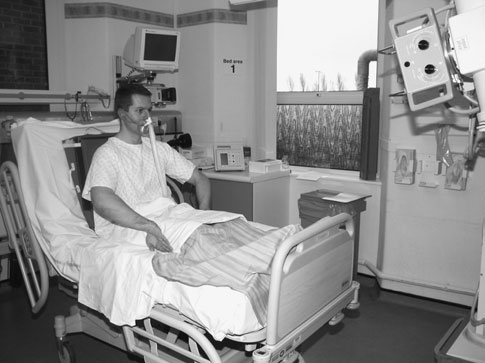
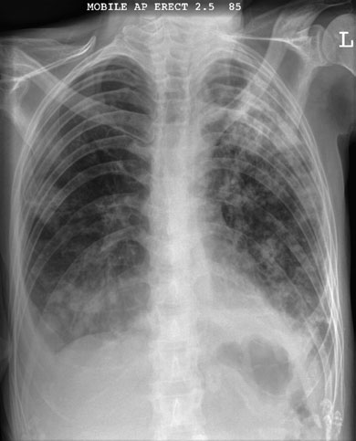
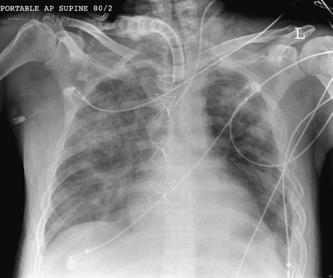

# Rx cord, siluetă cardiovasculară și torace (câmpuri pulmonare) antero-posterior (AP)

  📷 Radiografie Convențională (Rx)
  <strong>Actualizat:</strong> 2026-09-16
  <strong>Autor:</strong> Departamentul de Radiologie / Referință Clark (Ed. 12)

---

-   __1. Rezumat Clinic & Indicații__

    ---

    === "Indicații Clinice"

        - Ca regulă generală, radiografia în salon trebuie efectuată numai atunci când pacientul nu poate fi transportat în serviciul de radiologie și când intervenția medicală depinde de un diagnostic confirmat radiografic. Antero-posterior (AP)

    === "Ghid Național IRIS"

        !!! info "Referință Primară: Ghidul Național IRIS (Ordinul MS 1342/2012)"
            - **Capitol Ghid IRIS:** *Torace & Pulmon*
            - **Grad de Recomandare:** **Grad A**
            - **Nivel de Iradiere Estimată:** `Clasa 1 (Minimă < 0.1 mSv)`

            [:octicons-search-16: Deschide Ghidul IRIS](../../iris.md){ .md-button .md-button--primary } [:material-open-in-new: Aplicația Oficială PWA](https://radiologie-pediatrica.ro/iris/){ .md-button target="_blank" rel="noopener" }

-   __2. Poziționare & Centrare Fascicul__

    ---

    - **Poziție Pacient:**
        - Dacă este posibil, radiografia trebuie efectuată cu pacientul șezând, cu trunchiul vertical și fața spre tubul de raze X. Caseta este sprijinită de spate, folosind perne sau un suport mare din spumă, în formă de pană, cu marginea sa superioară deasupra câmpurilor pulmonare.
        - Dacă acest lucru nu este posibil, pacientul poate fi poziționat în decubit dorsal. Poziția semișezândă nu este preferată, deoarece gradul de înclinare nu este reproductibil într-o serie de imagini.
        - Planul mediosagital este ajustat perpendicular pe casetă și pe linia mediană a acesteia.
        - Rotația pacientului este prevenită prin utilizarea suporturilor din spumă. Rotația produce diverse artefacte (consultați p. 205) și trebuie evitată sau redusă la minimum. Dacă este posibil, brațele sunt rotite medial, cu umerii aduși înainte pentru a scoate scapulele din câmpurile pulmonare.
    - **Punct de Centrare Fascicul:**
        - Presupunând că pacientul poate sta șezând cu trunchiul complet vertical, raza centrală este orientată inițial perpendicular pe casetă și spre unghiul sternal.
        - Raza centrală este apoi înclinată până când coincide cu mijlocul filmului radiologic, evitând astfel expunerea inutilă a ochilor.
        - Utilizarea unei raze centrale orizontale este însă esențială pentru a evidenția lichidul, de exemplu revărsatul pleural (pleurezia), sau orice aer de sub cupolele diafragmatice. Dacă pacientul poate sta șezând cu trunchiul vertical, orientați raza centrală perpendicular pe mijlocul casetei. Totuși, pe radiografia rezultată, claviculele se vor proiecta deasupra vârfurilor pulmonare (apexurilor).
        - Dacă pacientul nu poate sta șezând cu trunchiul vertical, nivelurile hidroaerice sunt evidențiate cu o rază orizontală, cu pacientul culcat în pozițiile descrise pe pagina alăturată, p. 355.
    - **Distanță Focar-Film (DFF / SID):** 100 cm
    - **Comandă Respiratorie:** Apnee pe durata expunerii (apnee în inspir pentru torace; expir pentru Abdomen/bazin).

-   __3. Parametri Tehnici Expunere__

    ---

    | Parametru Tehnic | Valoare Configurare Generator / Tub |
    |:-----------------|:-------------------------------------|
    | **Tensiune Tub (kV)** | DE CONFIGURAT PE APARAT |
    | **Sarcină / Produs Curent-Timp (mAs)** | Conform AEC / grosimii anatomice |
    | **Distanță Focar-Film (DFF / SID)** | 100 cm |
    | **Grilă Antidifuzoare (Bucky)** | Conform grosimii anatomice (> 10-12 cm cu grilă) |
    | **Dimensiune Focar** | Focar Mic (0.6 mm) |
    | **Camere de Ionizare AEC** | DE CONFIGURAT PE APARAT |
    | **Colimare Fascicul** | Colimare strictă la aria anatomică de interes diagnostic |
    | **Filtrare Tub** | Totală ≥ 2.5 mm Al echivalent (conform Clark: 3.0 mm Al echivalent) |

-   __4. Criterii de Calitate & Reușită Imagine__

    ---

    - Vizualizarea clară a întregii arii anatomice (cord și siluetă cardiovasculară și torace (câmpuri pulmonare)).
    - Absența artefactelor de mișcare; trabeculație osoasă și contururi nete.
    - Densitate optică și contrast adecvate pentru diferențierea țesuturilor moi de structurile osoase.

-   __5. Protecție Radiologică (ALARA)__

    ---

    - Ecranare gonadică cu șorț plumbat dacă gonadele sunt în apropierea fasciculului util (regula ALARA).
    - Colimare precisă la dimensiunea anatomică strict necesară pentru reducerea dozei și a radiației difuze.
    - Verificarea posibilității unei sarcini la pacientele de vârstă fertilă înainte de expunere.

!!! note "Observații Clinice & Tehnice"
    - Dacă este posibil, se utilizează un aparat mobil de putere mare, pentru a permite o distanță focar–film radiologic (FFD) de 180 cm, cu pacientul poziționat în ortostatism.
    - Pentru imaginile în decubit dorsal, FFD poate fi limitată de înălțimea patului și de limitele de înălțime ale coloanei tubului de raze X. FFD trebuie să fie mai mare de 120 cm; altfel, mărirea imaginii va crește disproporționat. 354 Radiografie antero-posterioară (AP) în ortostatism care evidențiază condensare bilaterală cu revărsat pleural (pleurezie) drept (în acest caz, din cauza tuberculozei). Radiografie antero-posterioară (AP) în decubit dorsal care evidențiază edem pulmonar extins și hemoragie după traumatism, cu suspiciune de fracturi costale multiple pe partea stângă. Firele sternale indică intervenție chirurgicală cardiacă anterioară. Observați cateterul venos central jugular stâng și traheostomia. Nu este posibilă excluderea revărsatului pleural (pleureziei) sau a pneumotoraxului pe imaginea antero-posterioară (AP) în decubit dorsal.

### 🖼️ Imagini

<figure class="protocol-image-card" markdown>

<figcaption><strong>evaluat în salon. Radiografiile sunt solicitate pentru a ajuta la diagnostic-</strong> — Poziționarea pacientului și centrarea fasciculului conform Clark (Ed. 12)</figcaption>

</figure>

<figure class="protocol-image-card" markdown>

<figcaption><strong>embolie pulmonară, pneumotorax și revărsat pleural (pleurezie) și pneu-</strong> — Aspect radiografic / ghid de poziționare conform tratatului Clark (Ed. 12)</figcaption>

</figure>

<figure class="protocol-image-card" markdown>

<figcaption><strong>monie. Radiografia toracică postoperatorie este, de asemenea, frecvent necesară.</strong> — Aspect radiografic / ghid de poziționare conform tratatului Clark (Ed. 12)</figcaption>

</figure>

=== "Ghid Rapid de Execuție"

    1. **Identificarea și verificarea pacientului:** verificare identitate, zonă de examinat, consimțământ conform procedurii și evaluarea posibilității unei sarcini, când este relevantă.
    2. **Pregătire:** îndepărtarea oricăror obiecte radiopace (bijuterii, agrafe, fermoare, proteze, pansamente dense).
    3. **Poziționare precisă:** alinierea receptorului de imagine și a tubului la distanța prescrisă (100 cm).
    4. **Colimare strictă:** adaptarea fasciculului strict la regiunea de diagnostic pentru scăderea iradierii și reducerea radiației difuze.
    5. **Radioprotecție:** verificarea [politicii RX](../radioprotectie.md), cu măsuri distincte pentru pacient, personal și însoțitor.

## Surse de documentare

- [Clark's Positioning in Radiography (Ed. 12), Pagina 369](https://books.google.com/books/about/Clark_s_Positioning_in_Radiography.html?id=Xxu6MwEACAAJ)
