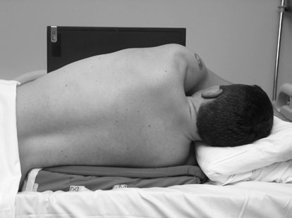
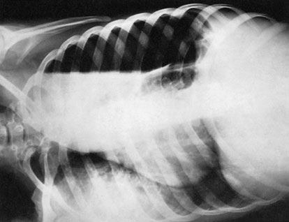
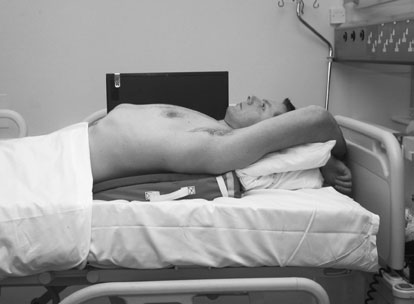
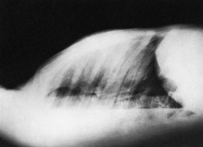

# Rx Cord și Siluetă Cardiovasculară and Torace (Câmpuri Pulmonare) Profil (Lateral) decubitus (Nivele Hidroaerice)

  📷 Radiografie Convențională (Rx)
  <strong>Actualizat:</strong> 2026-09-16
  <strong>Autor:</strong> Departamentul de Radiologie / Referință Clark (Ed. 12)

---

-   __1. Rezumat Clinic & Indicații__

    ---

    === "Indicații Clinice"

        - 355 12 Cord și Siluetă Cardiovasculară și Torace (Câmpuri Pulmonare) – nivele hidroaerice pacienți who sunt too ill la sit Ortostatism poate fie examined whilst culcat down. use de orizontal raza centrală este essential la evidențiază nivele hidroaerice, e.g. hydropneumotorax. Postero-anterior (PA) sau Antero-posterior (AP) (Profil (lateral) decubit) This incidență este used la confirm presence de lichid. Moving pacientul into different poziție causes movement de liber lichid, so that loculation este also detected. It poate also fie used la evidențiază Profil (lateral) chest perete de partea afectată clear de lichid, și la unmask orice underlying lung pathology.

    === "Ghid Național IRIS"

        !!! info "Referință Primară: Ghidul Național IRIS (Ordinul MS 1342/2012)"
            - **Capitol Ghid IRIS:** *Ghidul Național IRIS*
            - **Grad de Recomandare:** **De verificat pe indicație; fără grad atribuit automat**
            - **Nivel de Iradiere Estimată:** `De verificat pentru examinarea și populația selectate`

            [:octicons-search-16: Deschide Ghidul IRIS](../../iris.md){ .md-button .md-button--primary } [:material-open-in-new: Aplicația Oficială PWA](https://radiologie-pediatrica.ro/iris/){ .md-button target="_blank" rel="noopener" }
-   __2. Poziționare & Centrare Fascicul__

    ---

    - **Poziție Pacient:** • pacientul este culcat Decubit dorsal și, if possible, este raised off bed pe supporting foam pad.
• brațele sunt extins și sprijinit above capul.
• casetă este sprijinit vertically pe / sprijinit de Profil (lateral) aspect de toracele de partea afectată și ajustat paralel cu plan mediosagital.
    - **Punct de Centrare Fascicul:** • Centre la axilla, cu raza centrală centrală orizontal și orientat la drept-angles la caseta.
    - **Distanță Focar-Film (DFF / SID):** 100 cm
    - **Comandă Respiratorie:** Apnee pe durata expunerii (apnee în inspir pentru torace; expir pentru Abdomen/bazin).

-   __3. Parametri Tehnici Expunere__

    ---

    | Parametru Tehnic | Valoare Configurare Generator / Tub |
    |:-----------------|:-------------------------------------|
    | **Tensiune Tub (kV)** | DE CONFIGURAT PE APARAT |
    | **Sarcină / Produs Curent-Timp (mAs)** | Conform AEC / grosime anatomică |
    | **Distanță Focar-Film (DFF / SID)** | 100 cm |
    | **Grilă Antidifuzoare (Bucky)** | Conform grosimii anatomice (> 10-12 cm cu grilă) |
    | **Dimensiune Focar** | Focar Mic (0.6 mm) |
    | **Camere de Ionizare AEC** | DE CONFIGURAT PE APARAT |
    | **Colimare Fascicul** | Colimare strictă la aria anatomică de interes diagnostic |
    | **Filtrare Tub** | Totală ≥ 2.5 mm Al echivalent (conform Clark: 3.0 mm Al eq.) |

-   __4. Criterii de Calitate & Reușită Imagine__

    ---

    - Vizualizarea clară întregii arii anatomice (Cord și Siluetă Cardiovasculară și Torace (Câmpuri Pulmonare)).
    - Absența artefactelor de mișcare; trabeculație osoasă și contururi nete.
    - Densitate optică și contrast adecvate pentru diferențierea țesuturilor moi de structurile osoase.

-   __5. Protecție Radiologică (ALARA)__

    ---

    - Ecranare gonadică cu șorț plumbat dacă gonadele sunt în apropierea fasciculului util (regula ALARA).
    - Colimare precisă la dimensiunea anatomică strict necesară pentru reducerea dozei și a radiației difuze.
    - Verificarea posibilității unei sarcini la pacientele de vârstă fertilă înainte de expunere.

!!! note "Observații Clinice & Tehnice"
    • Further incidențe poate fie taken cu pacientul culcat pe partea afectată sau în Decubit ventral poziție la disclose further aspects de câmpuri pulmonare nu obscured prin lichid.
• casetă cu grilă antidifuzoare poate have la fie used if width de Torace este likely la produce unacceptable amount de secondary radiation.
pacient poziționat pentru Postero-anterior (PA) chest (Profil (lateral) decubit) incidență Postero-anterior (PA) radiografie în Profil (lateral) decubit poziție evidențiind revărsat pleural (pleurezie) cu pneumotorax pacient poziționat pentru Profil (lateral) chest (dorsal decubit) incidență Profil (lateral) radiografie în dorsal decubit poziție evidențiind revărsat pleural (pleurezie) cu pneumotorax

### 🖼️ Imagini

<figure class="protocol-image-card" markdown>

<figcaption><strong>strate nivele hidroaerice, e.g. hydropneumotorax.</strong> — Poziționare pacient și centrare fascicul conform Clark (Ed. 12)</figcaption>

</figure>

<figure class="protocol-image-card" markdown>

<figcaption><strong>Postero-anterior (PA) radiografie în Profil (lateral) decubit poziție evidențiind pleural</strong> — Aspect radiografic / ghid de poziționare conform tratatului Clark (Ed. 12)</figcaption>

</figure>

<figure class="protocol-image-card" markdown>

<figcaption><strong>effusion cu pneumotorax</strong> — Aspect radiografic / ghid de poziționare conform tratatului Clark (Ed. 12)</figcaption>

</figure>

<figure class="protocol-image-card" markdown>

<figcaption><strong>Profil (lateral) radiografie în dorsal decubit poziție evidențiind revărsat pleural (pleurezie)</strong> — Aspect radiografic / ghid de poziționare conform tratatului Clark (Ed. 12)</figcaption>

</figure>

=== "Ghid Rapid de Execuție"

    1. **Identificarea și verificarea pacientului:** verificare identitate, zonă de examinat, consimțământ conform procedurii și evaluarea posibilității unei sarcini, când este relevantă.
    2. **Pregătire:** îndepărtarea oricăror obiecte radiopace (bijuterii, agrafe, fermoare, proteze, pansamente dense).
    3. **Poziționare precisă:** alinierea receptorului de imagine și a tubului la distanța prescrisă (100 cm).
    4. **Colimare strictă:** adaptarea fasciculului strict la regiunea de diagnostic pentru scăderea iradierii și reducerea radiației difuze.
    5. **Radioprotecție:** verificarea [politicii RX](../radioprotectie.md), cu măsuri distincte pentru pacient, personal și însoțitor.

## Surse de documentare

- [Clark's Positioning in Radiography (Ed. 12), Pagina 370](../../assets/protocols/sources/Clark___Positioning_in_Radiography__12th_edition.pdf#page=370)
