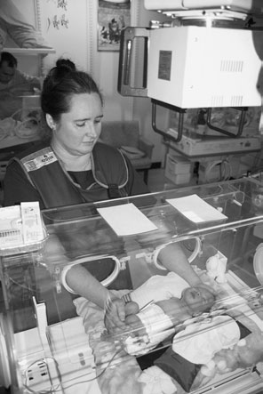
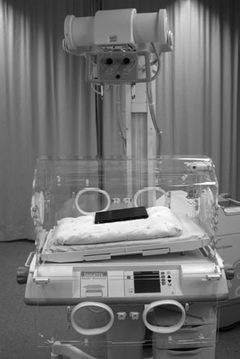
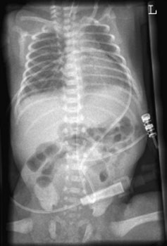
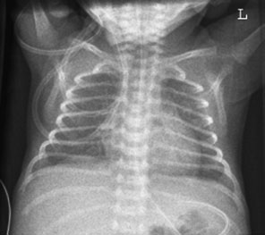

# Rx Torace Neonatal (Cord și Câmpuri Pulmonare) — Terapie Intensivă (ATI/SCBU)

  📷 Radiografie Convențională (Rx)
  <strong>Actualizat:</strong> 2026-09-16
  <strong>Autor:</strong> Departamentul de Radiologie / Referință Clark (Ed. 12)

---

-   __1. Rezumat Clinic & Indicații__

    ---

    === "Indicații Clinice"

        - 365 12 Cord și Siluetă Cardiovasculară și Torace (Câmpuri Pulmonare) – special care baby unit Neonates suffering de la respiratory distress syndrome sunt examined soon after birth la evidențiază Torace (Câmpuri Pulmonare), which sunt immature și unable la perform normal respirație. baby will fie nursed în incubator și poate fie attached la ventilator. primary fascicul este orientat through incubator top, cu care being taken la avoid orice opacity sau cut-outs în incubator top falling within radiation fascicul. Many designs de incubators sunt available, cu many requiring caseta la fie plasat within incubator. However, number sunt designed la facilitate positioning de caseta pe special tray immediately below și outside incubator housing. Antero-posterior (AP)
        - An 18  24-cm casetă that este la corp temperature este selected. Disposable sheets trebuie să fie used între baby și caseta.

    === "Ghid Național IRIS"

        !!! info "Referință Primară: Ghidul Național IRIS (Ordinul MS 1342/2012)"
            - **Capitol Ghid IRIS:** *Ghidul Național IRIS*
            - **Grad de Recomandare:** **De verificat pe indicație; fără grad atribuit automat**
            - **Nivel de Iradiere Estimată:** `De verificat pentru examinarea și populația selectate`

            [:octicons-search-16: Deschide Ghidul IRIS](../../iris.md){ .md-button .md-button--primary } [:material-open-in-new: Aplicația Oficială PWA](https://radiologie-pediatrica.ro/iris/){ .md-button target="_blank" rel="noopener" }
-   __2. Poziționare & Centrare Fascicul__

    ---

    - **Poziție Pacient:** • baby este poziționat Decubit dorsal pe casetă, cu planul mediosagital ajustat perpendicular pe middle de caseta, ensuring that capul și chest sunt straight și umerii și hips sunt level. When using caseta tray incubator cap end este raised five la ten grade la avoid a ‘Lordotică’ chest sau alternatively wedge pad este used la raise umerii.
• capul poate need menținerea cu bărbia raised up la avoid bărbia obscuring lung Vârfuri Pulmonare (Apexuri), sau sprijinit using small covered săculeți cu nisip. brațe trebuie să fie pe either side, slightly separated de la trunk la avoid being included în câmp de iradiere și la avoid skin crease artefacts, which poate mimic pneumothoraces. brațele poate fie imobilizat cu Velcro bands și/sau săculeți cu nisip.
    - **Punct de Centrare Fascicul:** • fără single centring point este advised.
• Centre fascicul la correct size de toracele.
• raza centrală este Orientat vertical, sau înclinat five la 10 grade caudally if baby este completely flat, but if doing so, care trebuie să fie exercised nu la cause bărbia la fie projected over Vârfuri Pulmonare (Apexuri).
• Constant maximum FFD trebuie să fie used.
    - **Distanță Focar-Film (DFF / SID):** 100 cm
    - **Comandă Respiratorie:** Apnee pe durata expunerii (apnee în inspir pentru torace; expir pentru Abdomen/bazin).

-   __3. Parametri Tehnici Expunere__

    ---

    | Parametru Tehnic | Valoare Configurare Generator / Tub |
    |:-----------------|:-------------------------------------|
    | **Tensiune Tub (kV)** | DE CONFIGURAT PE APARAT |
    | **Sarcină / Produs Curent-Timp (mAs)** | Conform AEC / grosime anatomică |
    | **Distanță Focar-Film (DFF / SID)** | 100 cm |
    | **Grilă Antidifuzoare (Bucky)** | Conform grosimii anatomice (> 10-12 cm cu grilă) |
    | **Dimensiune Focar** | Focar Mic (0.6 mm) |
    | **Camere de Ionizare AEC** | DE CONFIGURAT PE APARAT |
    | **Colimare Fascicul** | Colimare strictă adaptată pe receptor 18 x 24 cm |
    | **Filtrare Tub** | Totală ≥ 2.5 mm Al echivalent (conform Clark: 3.0 mm Al eq.) |

-   __4. Criterii de Calitate & Reușită Imagine__

    ---

    - Vizualizarea clară întregii arii anatomice (Cord și Siluetă Cardiovasculară și Torace (Câmpuri Pulmonare)).
    - Absența artefactelor de mișcare; trabeculație osoasă și contururi nete.
    - Densitate optică și contrast adecvate pentru diferențierea țesuturilor moi de structurile osoase.

-   __5. Protecție Radiologică (ALARA)__

    ---

    - Ecranare gonadică cu șorț plumbat dacă gonadele sunt în apropierea fasciculului util (regula ALARA).
    - Colimare precisă la dimensiunea anatomică strict necesară pentru reducerea dozei și a radiației difuze.
    - Verificarea posibilității unei sarcini la pacientele de vârstă fertilă înainte de expunere.

!!! note "Observații Clinice & Tehnice"
    • Very short expunere times sunt required pentru these procedures.
high-frequency generator will give very low mAs și extremely short expunere în millisecond range.
• Lead-rubber shapes trebuie să fie plasat pe incubator top la protect gonads și thyroid gland.
• expunere factor details trebuie să fie recorded pentru subsequent imaging, și imagine comparisons cu positioning legends trebuie să fie recorded pe imagine.
Baby poziționat pentru Antero-posterior (AP) chest și Abdomen Antero-posterior (AP) Decubit dorsal imagine de toracele în neonate de 28 weeks gestation Antero-posterior (AP) Decubit dorsal imagine de toracele și Abdomen evidențiind poziție de arterial line which has been enhanced using contrast media

### 🖼️ Imagini

<figure class="protocol-image-card" markdown>

<figcaption><strong>immature și unable la perform normal respirație. baby</strong> — Poziționare pacient și centrare fascicul conform Clark (Ed. 12)</figcaption>

</figure>

<figure class="protocol-image-card" markdown>

<figcaption><strong>full account de neonatal radiografie este given în Section 14.</strong> — Aspect radiografic / ghid de poziționare conform tratatului Clark (Ed. 12)</figcaption>

</figure>

<figure class="protocol-image-card" markdown>

<figcaption><strong>toracele și Abdomen evidențiind</strong> — Aspect radiografic / ghid de poziționare conform tratatului Clark (Ed. 12)</figcaption>

</figure>

<figure class="protocol-image-card" markdown>

<figcaption><strong>Figura 4: Aspect radiografic / Poziționare (Clark Ed. 12)</strong> — Aspect radiografic / ghid de poziționare conform tratatului Clark (Ed. 12)</figcaption>

</figure>

=== "Ghid Rapid de Execuție"

    1. **Identificarea și verificarea pacientului:** verificare identitate, zonă de examinat, consimțământ conform procedurii și evaluarea posibilității unei sarcini, când este relevantă.
    2. **Pregătire:** îndepărtarea oricăror obiecte radiopace (bijuterii, agrafe, fermoare, proteze, pansamente dense).
    3. **Poziționare precisă:** alinierea receptorului de imagine și a tubului la distanța prescrisă (100 cm).
    4. **Colimare strictă:** adaptarea fasciculului strict la regiunea de diagnostic pentru scăderea iradierii și reducerea radiației difuze.
    5. **Radioprotecție:** verificarea [politicii RX](../radioprotectie.md), cu măsuri distincte pentru pacient, personal și însoțitor.

## Surse de documentare

- [Clark's Positioning in Radiography (Ed. 12), Pagina 380](../../assets/protocols/sources/Clark___Positioning_in_Radiography__12th_edition.pdf#page=380)
