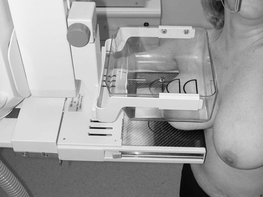
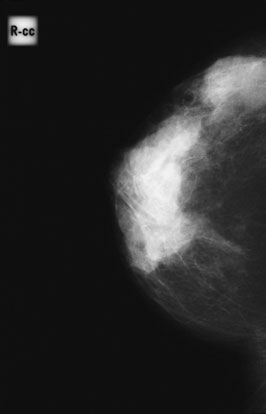
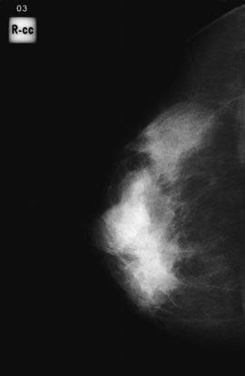
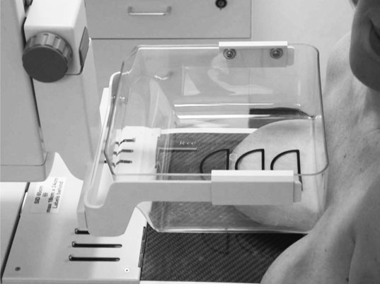
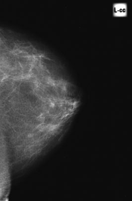

# Rx Cranio-Caudală Extinsă (Mamografie) Rotație Externă (Laterală)

  📷 Radiografie Convențională (Rx)
  <strong>Actualizat:</strong> 2026-09-16
  <strong>Autor:</strong> Departamentul de Radiologie / Referință Clark (Ed. 12)

---

-   __1. Rezumat Clinic & Indicații__

    ---

    === "Indicații Clinice"

        - ca toate lesions trebuie să fie evidențiat pe two incidențe, this extins cranio-caudal incidență este useful pentru evidențiind outer quadrant, axillary tail și axilla. 453 15 extins cranio-caudal – medially rotit This este useful pentru evidențiind lesions în medial portion de Sân (Mamografie).

    === "Ghid Național IRIS"

        !!! info "Referință Primară: Ghidul Național IRIS (Ordinul MS 1342/2012)"
            - **Capitol Ghid IRIS:** *Ghidul Național IRIS*
            - **Grad de Recomandare:** **De verificat pe indicație; fără grad atribuit automat**
            - **Nivel de Iradiere Estimată:** `De verificat pentru examinarea și populația selectate`

            [:octicons-search-16: Deschide Ghidul IRIS](../../iris.md){ .md-button .md-button--primary } [:material-open-in-new: Aplicația Oficială PWA](https://radiologie-pediatrica.ro/iris/){ .md-button target="_blank" rel="noopener" }
-   __2. Poziționare & Centrare Fascicul__

    ---

    - **Poziție Pacient:** • woman faces equipment și side under examination este rotit about 45 grade la equipment.
• Sân (Mamografie) este ridicat în radiographer’s Mână la form drept-angle cu corp și la poziție nipple în profile.
Sân (Mamografie)-support table este raised la contact inferior part de Sân (Mamografie) cel mai apropiat de chest perete.
• Mână este removed gently, leaving Sân (Mamografie) cu nipple area pe extreme medial edge de Sân (Mamografie)-support table.
• woman’s braț este plasat pe side de Sân (Mamografie)-support table menținerea equipment.
• radiographer stands behind woman și lifts up Sân (Mamografie), extending it ca far ca possible la show ca much Sân (Mamografie) tissue ca possible.
• woman leans back about 45 grade if possible, depressing her Umăr la enable outer quadrant și axilla la contact Sân (Mamografie)-support table.
• woman’s braț este extins. She holds pe la equipment cu her other Mână pentru stability și la maintain her poziție.
• Whilst Sân (Mamografie) este held în poziție pe Sân (Mamografie)-support table, woman este asked la lean spre equipment și este gently pushed în. If she cannot lean ca far back ca 45 grade, then satisfactory incidență de upper outer quadrant will still fie possible provided that she este rotit adequately.
452
• nipple trebuie să fie kept în profile. nu toate de medial aspect de Sân (Mamografie) will fie evidențiat.
• Sân (Mamografie) este sprijinit manually while compression este initiated. Mână este removed forwards but nu until compression este almost complete, astfel încât Sân (Mamografie) does nu move.
• compression plate fits into angle între cap humeral și rib cage.

• woman faces equipment. Her Stern este about 8 cm de la medial edge de Sân (Mamografie)-support table.
• ambele breasts sunt lifted pe la Sân (Mamografie)-support table, which este lowered pentru this purpose. It este then raised la correct height, enabling nipple pe side under examination la fie în profile.
• woman este pushed gently spre equipment.
• Sân (Mamografie) la fie evidențiat este stretched în și rotit la enable medial posterior area la fie visualized. Sân (Mamografie) este held while initial compression este applied. Then radiographer’s Mână este removed so final compression poate fie achieved.
    - **Punct de Centrare Fascicul:** Raza centrală perpendiculară pe centrul receptorului de imagine.
    - **Distanță Focar-Film (DFF / SID):** 100 cm
    - **Comandă Respiratorie:** Apnee pe durata expunerii (apnee în inspir pentru torace; expir pentru Abdomen/bazin).

-   __3. Parametri Tehnici Expunere__

    ---

    | Parametru Tehnic | Valoare Configurare Generator / Tub |
    |:-----------------|:-------------------------------------|
    | **Tensiune Tub (kV)** | DE CONFIGURAT PE APARAT |
    | **Sarcină / Produs Curent-Timp (mAs)** | Conform AEC / grosime anatomică |
    | **Distanță Focar-Film (DFF / SID)** | 100 cm |
    | **Grilă Antidifuzoare (Bucky)** | Conform grosimii anatomice (> 10-12 cm cu grilă) |
    | **Dimensiune Focar** | Focar Mic (0.6 mm) |
    | **Camere de Ionizare AEC** | DE CONFIGURAT PE APARAT |
    | **Colimare Fascicul** | Colimare strictă la aria anatomică de interes diagnostic |
    | **Filtrare Tub** | Totală ≥ 2.5 mm Al echivalent (conform Clark: 3.0 mm Al eq.) |

-   __4. Criterii de Calitate & Reușită Imagine__

    ---

    - Sân (Mamografie) trebuie să fie poziționat astfel încât axillary tail este present pe film radiologic, cu ca much de Sân (Mamografie) tissue ca possible vizualizat.
    - maximum inclusion de medio-posterior part de Sân (Mamografie) este evidențiat.
    - Erori de evitat / remedii: If Sân (Mamografie) imagine shows insufficient axillary tail și axilla, then nipple was nu la far medial edge de film radiologic support before woman leant back.
    - Erori de evitat / remedii: If nipple was nu în profile, then woman did nu lean în enough la allow medial part de Sân (Mamografie) la fie rotit inwards.
    - Erori de evitat / remedii: If compression este inadequate, then Sân (Mamografie) was nu checked pentru firmness și compression poate have been too close la cap humeral.

-   __5. Protecție Radiologică (ALARA)__

    ---

    - Ecranare gonadică cu șorț plumbat dacă gonadele sunt în apropierea fasciculului util (regula ALARA).
    - Colimare precisă la dimensiunea anatomică strict necesară pentru reducerea dozei și a radiației difuze.
    - Verificarea posibilității unei sarcini la pacientele de vârstă fertilă înainte de expunere.

!!! note "Observații Clinice & Tehnice"
    Pregătirea pacientului prin îndepărtarea tuturor accesoriilor radio-opace.

### 🖼️ Imagini

<figure class="protocol-image-card" markdown>

<figcaption><strong>• Sân (Mamografie) este ridicat în radiographer’s Mână la form a</strong> — Poziționare pacient și centrare fascicul conform Clark (Ed. 12)</figcaption>

</figure>

<figure class="protocol-image-card" markdown>

<figcaption><strong>• radiographer stands behind woman și lifts up the</strong> — Aspect radiografic / ghid de poziționare conform tratatului Clark (Ed. 12)</figcaption>

</figure>

<figure class="protocol-image-card" markdown>

<figcaption><strong>detail, e.g. micro-calcificări patologice, great care trebuie să fie taken la</strong> — Aspect radiografic / ghid de poziționare conform tratatului Clark (Ed. 12)</figcaption>

</figure>

<figure class="protocol-image-card" markdown>

<figcaption><strong>radiographer’s Mână este removed so final compression poate</strong> — Aspect radiografic / ghid de poziționare conform tratatului Clark (Ed. 12)</figcaption>

</figure>

<figure class="protocol-image-card" markdown>

<figcaption><strong>e.g. micro-calcificări patologice, great care trebuie să fie taken la ensure</strong> — Aspect radiografic / ghid de poziționare conform tratatului Clark (Ed. 12)</figcaption>

</figure>

=== "Ghid Rapid de Execuție"

    1. **Identificarea și verificarea pacientului:** verificare identitate, zonă de examinat, consimțământ conform procedurii și evaluarea posibilității unei sarcini, când este relevantă.
    2. **Pregătire:** îndepărtarea oricăror obiecte radiopace (bijuterii, agrafe, fermoare, proteze, pansamente dense).
    3. **Poziționare precisă:** alinierea receptorului de imagine și a tubului la distanța prescrisă (100 cm).
    4. **Colimare strictă:** adaptarea fasciculului strict la regiunea de diagnostic pentru scăderea iradierii și reducerea radiației difuze.
    5. **Radioprotecție:** verificarea [politicii RX](../radioprotectie.md), cu măsuri distincte pentru pacient, personal și însoțitor.

## Surse de documentare

- [Clark's Positioning in Radiography (Ed. 12), Pagina 467](../../assets/protocols/sources/Clark___Positioning_in_Radiography__12th_edition.pdf#page=467)
