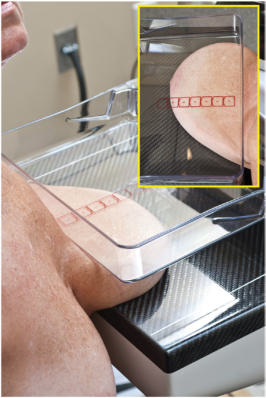
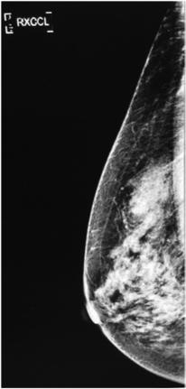
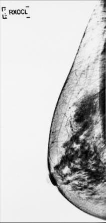

# Rx EXAGGERATED CRANIOCAUDAL (LATERALLY) (XCCL) Incidență

  📷 Radiografie Convențională (Rx)
  <strong>Actualizat:</strong> 2026-09-15
  <strong>Autor:</strong> Departamentul de Radiologie / Referință Bontrager

---

-   __1. Rezumat Clinic & Indicații__

    ---

    === "Indicații Clinice"

        - Potential Mamografie (Sân) pathologic condition sau change în Mamografie (Sân) tissue; also emphasizes axillary tissue
        - Most frequently requested optional incidență when CC incidență does nu show toate axillary tissue sau when lesion este seen pe MLO but nu pe CC

    === "Ghid Național IRIS"

        !!! info "Referință Primară: Ghidul Național IRIS (Ordinul MS 1342/2012)"
            - **Capitol Ghid IRIS:** *Ghidul Național IRIS*
            - **Grad de Recomandare:** **De verificat pe indicație; fără grad atribuit automat**
            - **Nivel de Iradiere Estimată:** `De verificat pentru examinarea și populația selectate`

            [:octicons-search-16: Deschide Ghidul IRIS](../../iris.md){ .md-button .md-button--primary } [:material-open-in-new: Aplicația Oficială PWA](https://radiologie-pediatrica.ro/iris/){ .md-button target="_blank" rel="noopener" }
-   __2. Poziționare & Centrare Fascicul__

    ---

    - **Poziție Pacient:** Pacient: Ortostatism, if possible; Regiune anatomică: Begin ca if la do CC incidență, then se rotește corp away de la receptorul de imagine slightly ca needed la include more de axillary aspect de Mamografie (Sân) onto receptorul de imagine (Fig. 20.73). Put pacientul’s Mână pe bar spre front și relax Umăr (some recommend angling unit 5° lateromedially). capul este turned away de la side that este being imaged (facing technologist). Mamografie (Sân) este pulled forward onto receptorul de imagine, wrinkles și folds trebuie să fie smoothed out, și compression este applied until taut. nipple trebuie să fie în profile (Fig. 20.74). R sau L incidență marker este always plasat pe axillary side.
    - **Punct de Centrare Fascicul:** perpendicular, centrat pe base de Mamografie (Sân), Torace perete edge de receptorul de imagine; raza centrală nu movable
    - **Distanță Focar-Film (DFF / SID):** 60 cm
    - **Comandă Respiratorie:** apnee (oprirea respirației) respirație.

-   __3. Parametri Tehnici Expunere__

    ---

    | Parametru Tehnic | Valoare Configurare Generator / Tub |
    |:-----------------|:-------------------------------------|
    | **Tensiune Tub (kV)** | DE CONFIGURAT PE APARAT |
    | **Sarcină / Produs Curent-Timp (mAs)** | DE CONFIGURAT PE APARAT |
    | **Distanță Focar-Film (DFF / SID)** | 60 cm |
    | **Grilă Antidifuzoare (Bucky)** | Cu grilă antidifuzoare Bucky |
    | **Dimensiune Focar** | Focar Mic (0.6 mm) |
    | **Camere de Ionizare AEC** | Camerele laterale (sau camera centrală funcție de regiune) |
    | **Colimare Fascicul** | și raza centrală raza centrală și collimation sunt fixed și sunt centrat correctly if Mamografie (Sân) tissue este correctly centrat și visualized pe receptorul de imagine. expunere Dense areas sunt adequately penetrated, resulting în optim contrast. net tissue markings indicate fără mișcare. R și L markeri și pacient information sunt correctly plasat la axillary side de receptorul de imagine. fără artifacts sunt vizibil. Nipple Glandular tissue Fatty tissue Pectoral muscle Fig. 20.75 XCCL incidență. |
    | **Filtrare Tub** | Totală ≥ 2.5 mm Al echivalent |

-   __4. Criterii de Calitate & Reușită Imagine__

    ---

    - Axillary Mamografie (Sân) tissue, pectoral muscle, și central și subareolar tissues sunt included (Figs. 20.74 și 20.75). poziție și Compression
    - Nipple este seen în profile.
    - Tissue thickness este evenly distributed, indicating optim compression.
    - Axillary tissues, including pectoral muscle, sunt visualized, indicating correct positioning cu sufficient corp rotație.

-   __5. Protecție Radiologică (ALARA)__

    ---

    - Ecranare gonadică și a organelor radiosensibile conform procedurilor locale de radioprotecție ALARA.
    - Colimare strictă la aria de interes pentru limitarea radiației difuze.
    - Verificarea posibilității unei sarcini la pacientele de vârstă fertilă înainte de expunere.

!!! note "Observații Clinice & Tehnice"
    S: If lesion este deeper sau superior, la incidență este required. If lesion este nu found pe lateral aspect de Mamografie (Sân), medially exaggerated craniocaudal incidență trebuie să fie performed. poziție AEC chamber la appropriate poziție la ensure adecvat expunere de various tissue densities. Fig. 20.73 XCCL incidență. NOTE: pacient este turned so that axillary tissue este included pe imagine. braț și Mână sunt forward pentru ease în turning corp. Fig. 20.74 XCCL incidență.

### 🖼️ Imagini

<figure class="protocol-image-card" markdown>

<figcaption><strong>Fig. 20.73 XCCL incidență. NOTE: pacient este turned so that axillary</strong> — Poziționare pacient conform Ghidului Bontrager (Fig. 20.73 XCCL incidență. NOTE: pacient este turned so that axillary)</figcaption>

</figure>

<figure class="protocol-image-card" markdown>

<figcaption><strong>Fig. 20.74 XCCL incidență.</strong> — Aspect radiografic de referință conform Ghidului Bontrager (Fig. 20.74 XCCL incidență.)</figcaption>

</figure>

<figure class="protocol-image-card" markdown>

<figcaption><strong>Fig. 20.75 XCCL incidență.</strong> — Aspect radiografic de referință conform Ghidului Bontrager (Fig. 20.75 XCCL incidență.)</figcaption>

</figure>

=== "Ghid Rapid de Execuție"

    1. **Identificarea și verificarea pacientului:** verificare identitate, zonă de examinat, consimțământ conform procedurii și evaluarea posibilității unei sarcini, când este relevantă.
    2. **Pregătire:** îndepărtarea oricăror obiecte radiopace (bijuterii, agrafe, fermoare, proteze, pansamente dense).
    3. **Poziționare precisă:** alinierea receptorului de imagine și a tubului la distanța prescrisă (60 cm).
    4. **Colimare strictă:** adaptarea fasciculului strict la regiunea de diagnostic pentru scăderea iradierii și reducerea radiației difuze.
    5. **Radioprotecție:** verificarea [politicii RX](../radioprotectie.md), cu măsuri distincte pentru pacient, personal și însoțitor.

## Surse de documentare

- [Bontrager's Textbook of Radiographic Positioning (Ed. 9/10), Pagina 793](https://www.elsevier.com/books/textbook-of-radiographic-positioning-and-related-anatomy/lampignano/978-0-323-65367-1)
