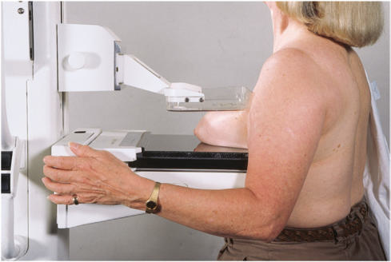

# Rx Mamografie Cranio-Caudală (CC)

  📷 Radiografie Convențională (Rx)
  <strong>Actualizat:</strong> 2026-09-15
  <strong>Autor:</strong> Departamentul de Radiologie / Referință Bontrager

---

-   __1. Rezumat Clinic & Indicații__

    ---

    === "Indicații Clinice"

        - Detection sau evaluation de calcifications, cysts, carcinomas, sau other abnormalities sau changes în Mamografie (Sân) tissue indicating possible pathologic condition
        - Breasts sunt imaged separately pentru comparison.

    === "Ghid Național IRIS"

        !!! info "Referință Primară: Ghidul Național IRIS (Ordinul MS 1342/2012)"
            - **Capitol Ghid IRIS:** *Ghidul Național IRIS*
            - **Grad de Recomandare:** **De verificat pe indicație; fără grad atribuit automat**
            - **Nivel de Iradiere Estimată:** `De verificat pentru examinarea și populația selectate`

            [:octicons-search-16: Deschide Ghidul IRIS](../../iris.md){ .md-button .md-button--primary } [:material-open-in-new: Aplicația Oficială PWA](https://radiologie-pediatrica.ro/iris/){ .md-button target="_blank" rel="noopener" }
-   __2. Poziționare & Centrare Fascicul__

    ---

    - **Poziție Pacient:** Pacient: Ortostatism, if possible; Regiune anatomică: receptorul de imagine height este determined prin lifting Mamografie (Sân) la achieve a 90° angle la Torace perete. receptorul de imagine este la nivelul iMF la its upper limits. (mammographer trebuie să always poziție de la pacient’s medial side la ensure that Mamografie (Sân) tissue este paralel cu receptorul de imagine (RI). Positioning de la lateral aspect de Mamografie (Sân) makes tasks more difficult. Mamografie (Sân) este pulled forward onto receptorul de imagine centrally cu nipple în profile whenever possible (Figs. 20.64 și 20.65). braț pe side that este being imaged este relaxat la side, și Umăr este back out de way. capul este turned away de la side being imaged (facing technologist). medial tissue de opposite Mamografie (Sân) este draped pe corner de receptorul de imagine. Wrinkles și folds pe Mamografie (Sân) trebuie să fie smoothed out și compression applied until taut. marker și pacient identification information sunt always plasat pe axillary side. Positioning Tips pentru pacienți cu large, protruding Abdomen—After placing pacientul la bucky, Se instruiește pacientul să take step backward, keep picioarele planted, și then lean forward și place Mamografie (Sân) pe receptorul de imagine. This allows toate de Mamografie (Sân) la reach receptorul de imagine fără blockage de la abdomenul. Young, smallbreasted pacienți often have tissue that este difficult la imagine pe one incidență. la avoid having la do three imagini (extra dose la pacientul), take first CC imagine și concentrate pe getting medial tissue; pe second imagine, make sure lateral tissue este emphasized. Neither incidență trebuie să fie exaggerated incidență. This technique avoids need la do straighton CC și then also having la do ambele exaggerated incidențe (medial și lateral). Fig. 20.64 CC incidență. (de la Long BW, Rollins JH, Smith BJ: Merrill’s atlas de radiographic positioning și procedures, ed 13, St. Louis, 2016, Mosby.)
    - **Punct de Centrare Fascicul:** perpendicular pe centrul ariei de interes
    - **Distanță Focar-Film (DFF / SID):** 60 cm
    - **Comandă Respiratorie:** Apnee pe durata expunerii (sau conform cooperării pacientului)

-   __3. Parametri Tehnici Expunere__

    ---

    | Parametru Tehnic | Valoare Configurare Generator / Tub |
    |:-----------------|:-------------------------------------|
    | **Tensiune Tub (kV)** | DE CONFIGURAT PE APARAT |
    | **Sarcină / Produs Curent-Timp (mAs)** | DE CONFIGURAT PE APARAT |
    | **Distanță Focar-Film (DFF / SID)** | 60 cm |
    | **Grilă Antidifuzoare (Bucky)** | Cu grilă antidifuzoare Bucky |
    | **Dimensiune Focar** | Focar Mic (0.6 mm) |
    | **Camere de Ionizare AEC** | Camerele laterale (sau camera centrală funcție de regiune) |
    | **Colimare Fascicul** | Colimare strictă pe regiunea anatomică de interes diagnostic anatomic |
    | **Filtrare Tub** | Totală ≥ 2.5 mm Al echivalent |

-   __4. Criterii de Calitate & Reușită Imagine__

    ---

    - Vizualizarea completă regiunii anatomice explorate
    - Absența artefactelor de mișcare sau suprapunerilor neadecvate
    - Contrast și penetrare optime pentru decelarea structurilor osoase și părților moi

-   __5. Protecție Radiologică (ALARA)__

    ---

    - Ecranare gonadică și a organelor radiosensibile conform procedurilor locale de radioprotecție ALARA.
    - Colimare strictă la aria de interes pentru limitarea radiației difuze.
    - Verificarea posibilității unei sarcini la pacientele de vârstă fertilă înainte de expunere.

### 🖼️ Imagini

<figure class="protocol-image-card" markdown>

<figcaption><strong>Fig. 20.64 CC incidență. (de la Long BW, Rollins JH, Smith BJ:</strong> — Poziționare pacient conform Ghidului Bontrager (Fig. 20.64 CC incidență. (de la Long BW, Rollins JH, Smith BJ:)</figcaption>

</figure>

=== "Ghid Rapid de Execuție"

    1. **Identificarea și verificarea pacientului:** verificare identitate, zonă de examinat, consimțământ conform procedurii și evaluarea posibilității unei sarcini, când este relevantă.
    2. **Pregătire:** îndepărtarea oricăror obiecte radiopace (bijuterii, agrafe, fermoare, proteze, pansamente dense).
    3. **Poziționare precisă:** alinierea receptorului de imagine și a tubului la distanța prescrisă (60 cm).
    4. **Colimare strictă:** adaptarea fasciculului strict la regiunea de diagnostic pentru scăderea iradierii și reducerea radiației difuze.
    5. **Radioprotecție:** verificarea [politicii RX](../radioprotectie.md), cu măsuri distincte pentru pacient, personal și însoțitor.

## Surse de documentare

- [Bontrager's Textbook of Radiographic Positioning (Ed. 9/10), Pagina 789](https://www.elsevier.com/books/textbook-of-radiographic-positioning-and-related-anatomy/lampignano/978-0-323-65367-1)
