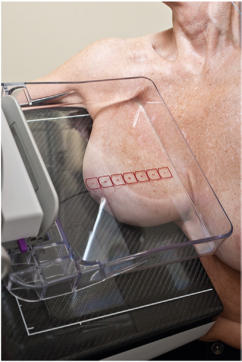
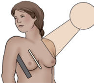
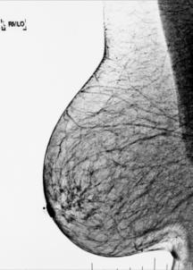
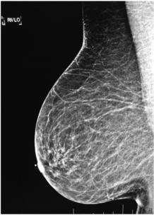

# Rx Mamografie Oblică Medio-Laterală (MLO) (SUPEROMEDIAL)

  📷 Radiografie Convențională (Rx)
  <strong>Actualizat:</strong> 2026-09-15
  <strong>Autor:</strong> Departamentul de Radiologie / Referință Bontrager

---

-   __1. Rezumat Clinic & Indicații__

    ---

    === "Indicații Clinice"

        - Detection sau evaluation de calcifications, cysts, carcinomas, și other abnormalities sau changes în deep lateral aspect de Mamografie (Sân) tissue
        - Breasts sunt imaged separately pentru comparison.

    === "Ghid Național IRIS"

        !!! info "Referință Primară: Ghidul Național IRIS (Ordinul MS 1342/2012)"
            - **Capitol Ghid IRIS:** *Ghidul Național IRIS*
            - **Grad de Recomandare:** **De verificat pe indicație; fără grad atribuit automat**
            - **Nivel de Iradiere Estimată:** `De verificat pentru examinarea și populația selectate`

            [:octicons-search-16: Deschide Ghidul IRIS](../../iris.md){ .md-button .md-button--primary } [:material-open-in-new: Aplicația Oficială PWA](https://radiologie-pediatrica.ro/iris/){ .md-button target="_blank" rel="noopener" }
-   __2. Poziționare & Centrare Fascicul__

    ---

    - **Poziție Pacient:** Pacient: Ortostatism, if possible; Regiune anatomică: Tube și receptorul de imagine remain la drept angles la fiecare other; raza centrală enters Mamografie (Sân) medially, perpendicular pe pacient’s pectoral muscle. corect assessment ca la angle de pectoral muscle pe pacientul’s Torace perete este trebuie să if imagine este going la evidențiază maximum amount de Mamografie (Sân) tissue. This angle poate fie properly determined prin technologist using extins palm along lateral aspect de Mamografie (Sân) și lifting it slightly away de la corp și matching angle de palm (Fig. 20.67). Adjust receptorul de imagine height astfel încât top de receptorul de imagine este la nivelul axilla. cu pacientul facing unit și picioarele forward exactly ca în CC incidență, place braț de side being imaged along top de receptorul de imagine, în relaxat state. Pull Mamografie (Sân) tissue și pectoral muscle anteriorly și medially away de la Torace perete. Assess angle de pectoral muscle și se ajustează unit accordingly. Push pacientul slightly spre înclinat receptorul de imagine until inferolateral aspect de Mamografie (Sân) este touching receptorul de imagine. nipple trebuie să fie în profile. Apply compression slowly cu Mamografie (Sân) held away de la Torace perete și up la prevent sagging și present region de IMF (Fig. 20.68). upper edge de compression device rests under Claviculă, și lower edge includes IMF. Wrinkles și folds pe Mamografie (Sân) trebuie să fie smoothed out și compression applied until taut. If necessary, Se instruiește pacientul să gently retract opposite Mamografie (Sân) cu other Mână la prevent superimposition. R sau L incidență marker (RMLO, LMLO) trebuie să fie plasat high near axilla.
    - **Punct de Centrare Fascicul:** perpendicular, centrat pe base de Mamografie (Sân), Torace perete edge de receptorul de imagine; raza centrală nu movable
    - **Distanță Focar-Film (DFF / SID):** 60 cm
    - **Comandă Respiratorie:** instructions will vary depending pe whether conventional sau 3D units sunt used.

-   __3. Parametri Tehnici Expunere__

    ---

    | Parametru Tehnic | Valoare Configurare Generator / Tub |
    |:-----------------|:-------------------------------------|
    | **Tensiune Tub (kV)** | DE CONFIGURAT PE APARAT |
    | **Sarcină / Produs Curent-Timp (mAs)** | DE CONFIGURAT PE APARAT |
    | **Distanță Focar-Film (DFF / SID)** | 60 cm |
    | **Grilă Antidifuzoare (Bucky)** | Cu grilă antidifuzoare Bucky |
    | **Dimensiune Focar** | Focar Mic (0.6 mm) |
    | **Camere de Ionizare AEC** | Camerele laterale (sau camera centrală funcție de regiune) |
    | **Colimare Fascicul** | și raza centrală raza centrală și collimation sunt fixed și sunt centrat correctly if Mamografie (Sân) tissue este correctly centrat și visualized pe receptorul de imagine. expunere Dense areas sunt adequately penetrated, resulting în optim contrast. net tissue markings indicate fără mișcare. R sau L incidență marker și pacient information sunt correctly plasat la axillary side. fără artifacts sunt vizibil. |
    | **Filtrare Tub** | Totală ≥ 2.5 mm Al echivalent |

-   __4. Criterii de Calitate & Reușită Imagine__

    ---

    - Entire Mamografie (Sân) tissue este vizibil, de la pectoral muscle la level de nipple (Figs. 20.69 și 20.70).
    - IMF trebuie să fie seen, și Mamografie (Sân) trebuie să nu fie drooping. poziție și Compression
    - Nipple este seen în profile.
    - Mamografie (Sân) este seen la fie pulled out și away de la Torace cu even thickness indicating optim compression.

-   __5. Protecție Radiologică (ALARA)__

    ---

    - Ecranare gonadică și a organelor radiosensibile conform procedurilor locale de radioprotecție ALARA.
    - Colimare strictă la aria de interes pentru limitarea radiației difuze.
    - Verificarea posibilității unei sarcini la pacientele de vârstă fertilă înainte de expunere.

!!! note "Observații Clinice & Tehnice"
    la show toate Mamografie (Sân) tissue pe this incidență cu Mamografie (Sân) de increased size two imagini poate fie needed, one poziționat higher la get toate de axillary region și second poziționat lower pentru include main part de Mamografie (Sân). If applicable, place AEC chamber la appropriate poziție la ensure adecvat expunere de various tissue densities. Nipple Glandular tissue Fatty tissue PNL Pectoral muscle Fig. 20.70 MLO incidență. PNL trebuie să fie within 1 cm de PNL de CC incidență. 40°-70° 45° receptorul de imagine (end incidență) Compression paddle Fig. 20.67 MLO incidență. Fig. 20.68 MLO incidență. (Note xray tube/film radiologic unit este înclinat about 45°; see Fig. 20.70.) Fig. 20.69 MLO incidență.

### 🖼️ Imagini

<figure class="protocol-image-card" markdown>

<figcaption><strong>Fig. 20.70 MLO incidență. PNL trebuie să</strong> — Poziționare pacient conform Ghidului Bontrager (Fig. 20.70 MLO incidență. PNL trebuie să)</figcaption>

</figure>

<figure class="protocol-image-card" markdown>

<figcaption><strong>Fig. 20.67 MLO incidență.</strong> — Aspect radiografic de referință conform Ghidului Bontrager (Fig. 20.67 MLO incidență.)</figcaption>

</figure>

<figure class="protocol-image-card" markdown>

<figcaption><strong>Fig. 20.68 MLO incidență. (Note x-</strong> — Aspect radiografic de referință conform Ghidului Bontrager (Fig. 20.68 MLO incidență. (Note x-)</figcaption>

</figure>

<figure class="protocol-image-card" markdown>

<figcaption><strong>Fig. 20.69 MLO incidență.</strong> — Aspect radiografic de referință conform Ghidului Bontrager (Fig. 20.69 MLO incidență.)</figcaption>

</figure>

=== "Ghid Rapid de Execuție"

    1. **Identificarea și verificarea pacientului:** verificare identitate, zonă de examinat, consimțământ conform procedurii și evaluarea posibilității unei sarcini, când este relevantă.
    2. **Pregătire:** îndepărtarea oricăror obiecte radiopace (bijuterii, agrafe, fermoare, proteze, pansamente dense).
    3. **Poziționare precisă:** alinierea receptorului de imagine și a tubului la distanța prescrisă (60 cm).
    4. **Colimare strictă:** adaptarea fasciculului strict la regiunea de diagnostic pentru scăderea iradierii și reducerea radiației difuze.
    5. **Radioprotecție:** verificarea [politicii RX](../radioprotectie.md), cu măsuri distincte pentru pacient, personal și însoțitor.

## Surse de documentare

- [Bontrager's Textbook of Radiographic Positioning (Ed. 9/10), Pagina 791](https://www.elsevier.com/books/textbook-of-radiographic-positioning-and-related-anatomy/lampignano/978-0-323-65367-1)
