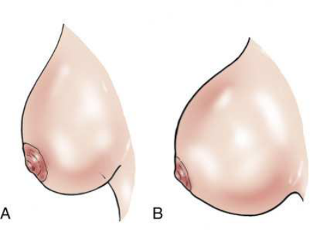
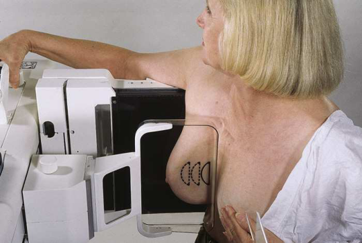
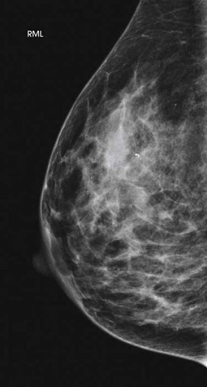

# Rx Mamografie — Profil Medio-Lateral (ML 90°) or 10 × 12 inches (24 × 30 cm). (Merrill)

  📷 Radiografie Convențională (Rx)
  <strong>Actualizat:</strong> 2026-09-16
  <strong>Autor:</strong> Referință Merrill

---

-   __1. Rezumat Clinic & Indicații__

    ---

    === "Indicații Clinice"

        - Conform reperelor anatomice standard din tratat

    === "Ghid Național IRIS"

        !!! info "Referință Primară: Ghidul Național IRIS (Ordinul MS 1342/2012)"
            - **Capitol Ghid IRIS:** *Ghidul Național IRIS*
            - **Grad de Recomandare:** **De verificat pe indicație; fără grad atribuit automat**
            - **Nivel de Iradiere Estimată:** `De verificat pentru examinarea și populația selectate`

            [:octicons-search-16: Deschide Ghidul IRIS](../../iris.md){ .md-button .md-button--primary } [:material-open-in-new: Aplicația Oficială PWA](https://radiologie-pediatrica.ro/iris/){ .md-button target="_blank" rel="noopener" }
-   __2. Poziționare & Centrare Fascicul__

    ---

    - **Poziție Pacient:** Se instruiește pacientul să stand facing receptorul de imagine sau se așază pacientul pe scaun pe adjustable stool facing unit.; se rotește C-braț assembly 90 grade, cu x-ray tube plasat pe medial side de pacientul’s Mamografie (Sân). Se instruiește pacientul să bend slightly forward de la waist. poziție superior corner de receptorul de imagine high into axilla, cu pacientul’s Cot flectat și afected braț resting behind receptorul de imagine. Se instruiește pacientul să relax afected Umăr. Pull Mamografie (Sân) tissue și pectoral muscle superiorly și anteriorly, ensuring that lateral rib margin este pressed firmly pe / sprijinit de edge de receptorul de imagine. se rotește pacient slightly laterally la help bring medial tissue forward. Gently pull medial Mamografie (Sân) tissue forward de la Stern și poziție nipple în profile. Hold pacientul’s Mamografie (Sân) up și out prin rotating Mână astfel încât base de Police și heel de Mână support Mamografie (Sân). Se informează pacienta cu privire la aplicarea compresiei pe glanda mamară. Continue la hold pacientul’s Mamografie (Sân) up și out while sliding Mână spre nipple ca compression paddle este brought into contact cu Mamografie (Sân). Do nu allow Mamografie (Sân) la droop (Fig. 18.45). Se aplică progresiv compresia până când glanda mamară este ferm fixată. Se instruiește pacientul să indicate if compression becomes too uncomfortable. Se instruiește pacientul să hold opposite Mamografie (Sân) away de la path de fascicul. Se instruiește pacientul să lift her chin la clear field de potential artifacts. When full compression este achieved, move AEC detector la appropriate poziție if necessary, și Se instruiește pacientul să stop respirație (Fig. 18.46). Se declanșează expunerea. Se decomprimă sânul imediat după efectuarea expunerii.
    - **Punct de Centrare Fascicul:** perpendicular pe base de Mamografie (Sân)
    - **Distanță Focar-Film (DFF / SID):** Nespecificat în fragmentul extras; de verificat în sursă
    - **Comandă Respiratorie:** Conform reperelor anatomice standard din tratat

-   __3. Parametri Tehnici Expunere__

    ---

    | Parametru Tehnic | Valoare Configurare Generator / Tub |
    |:-----------------|:-------------------------------------|
    | **Tensiune Tub (kV)** | DE CONFIGURAT PE APARAT |
    | **Sarcină / Produs Curent-Timp (mAs)** | DE CONFIGURAT PE APARAT |
    | **Distanță Focar-Film (DFF / SID)** | Nespecificat în fragmentul extras; de verificat în sursă |
    | **Grilă Antidifuzoare (Bucky)** | DE CONFIGURAT PE APARAT |
    | **Dimensiune Focar** | DE CONFIGURAT PE APARAT |
    | **Camere de Ionizare AEC** | DE CONFIGURAT PE APARAT |
    | **Colimare Fascicul** | Conform reperelor anatomice standard din tratat |
    | **Filtrare Tub** | DE CONFIGURAT PE APARAT |

-   __4. Criterii de Calitate & Reușită Imagine__

    ---

    - following trebuie să fie clearly vizualizat:
    - Nipple în profile
    - Open inframammary fold
    - Deep și superficial Mamografie (Sân) tissues well separated when Mamografie (Sân) este adequately maneuvered up și out de la Torace perete (Fig. 18.47)
    - Retroglandular fat well visualized la ensure inclusion de deep fibroglandular Mamografie (Sân) tissue
    - Uniform tissue expunere if compression este adecvat

-   __5. Protecție Radiologică (ALARA)__

    ---

    - Nespecificat în fragmentul extras; de verificat în sursă

!!! note "Observații Clinice & Tehnice"
    Conform reperelor anatomice standard din tratat

### 🖼️ Imagini

<figure class="protocol-image-card" markdown>

<figcaption><strong>Merrill — pagina PDF 1377, imaginea 1</strong> — Imagine din fragmentul sursă; asocierea necesită revizie.</figcaption>

</figure>

<figure class="protocol-image-card" markdown>

<figcaption><strong>Merrill — pagina PDF 1377, imaginea 2</strong> — Imagine din fragmentul sursă; asocierea necesită revizie.</figcaption>

</figure>

<figure class="protocol-image-card" markdown>

<figcaption><strong>Merrill — pagina PDF 1378, imaginea 3</strong> — Imagine din fragmentul sursă; asocierea necesită revizie.</figcaption>

</figure>

=== "Ghid Rapid de Execuție"

    1. **Identificarea și verificarea pacientului:** verificare identitate, zonă de examinat, consimțământ conform procedurii și evaluarea posibilității unei sarcini, când este relevantă.
    2. **Pregătire:** îndepărtarea oricăror obiecte radiopace (bijuterii, agrafe, fermoare, proteze, pansamente dense).
    3. **Poziționare precisă:** alinierea receptorului de imagine și a tubului la distanța prescrisă (Nespecificat în fragmentul extras; de verificat în sursă).
    4. **Colimare strictă:** adaptarea fasciculului strict la regiunea de diagnostic pentru scăderea iradierii și reducerea radiației difuze.
    5. **Radioprotecție:** verificarea [politicii RX](../radioprotectie.md), cu măsuri distincte pentru pacient, personal și însoțitor.

## Surse de documentare

- [Merrill’s Atlas, 18. Mammography, pagini PDF 1376–1378](../../assets/protocols/sources/a56d45c16829_Merrills_Atlas_of_Radiographic_Positioning__Procedures_3Vol_Set.pdf#page=1376)

## Fragmente sursă traduse (referință tehnică)

### anatomy

This incidență shows lesions pe lateral aspect de breast în superior și inferior aspects. It resolves superimposed structures seen pe
MLO incidență, localizes lesion seen pe one (sau ambele) de initial incidențe, și shows air-lichid și fat-nivele hidroaerice în breast structures
(e.g., milk de calcium, galactoceles) și în pneumocystography (rarely performed procedure involving injection de air into aspirated cyst la
imagine cyst lining pentru intracystic lesions). ML incidență este orthogonal incidență la CC și este often used la localize depth de breast
lesions.

### cr

• perpendicular pe base de breast

### criteria

following trebuie să fie clearly vizualizat:
• Nipple în profile
• Open inframammary fold
• Deep și superficial breast tissues well separated when breast este adequately maneuvered up și out de la chest perete (Fig. 18.47)
• Retroglandular fat well visualized la ensure inclusion de deep fibroglandular breast tissue
• Uniform tissue expunere if compression este adecvat

### part_pos

• se rotește C-braț assembly 90 grade, cu x-ray tube plasat pe medial side de pacientul’s breast.
• Se instruiește pacientul să bend slightly forward de la waist. poziție superior corner de receptorul de imagine high into axilla, cu pacientul’s
cot flectat și afected braț resting behind receptorul de imagine.
• Se instruiește pacientul să relax afected umăr.
• Pull breast tissue și pectoral muscle superiorly și anteriorly, ensuring that lateral rib margin este pressed firmly pe / sprijinit de
edge de receptorul de imagine.
• se rotește pacient slightly laterally la help bring medial tissue forward.
• Gently pull medial breast tissue forward de la sternum și poziție nipple în profile.
• Hold pacientul’s breast up și out prin rotating mână astfel încât base de policele și heel de mână support breast.
• Se informează pacienta cu privire la aplicarea compresiei pe glanda mamară. Continue la hold pacientul’s breast up și out while sliding mână
spre nipple ca compression paddle este brought into contact cu breast. Do nu allow breast la droop (Fig. 18.45).
• Se aplică progresiv compresia până când glanda mamară este ferm fixată.
• Se instruiește pacientul să indicate if compression becomes too uncomfortable.
• Se instruiește pacientul să hold opposite breast away de la path de fascicul.
• Se instruiește pacientul să lift her chin la clear field de potential artifacts.
• When full compression este achieved, move AEC detector la appropriate poziție if necessary, și Se instruiește pacientul să stop
respirație (Fig. 18.46).
• Se declanșează expunerea.
• Se decomprimă sânul imediat după efectuarea expunerii.

### patient_pos

• Se instruiește pacientul să stand facing receptorul de imagine sau se așază pacientul pe scaun pe adjustable stool facing unit.

