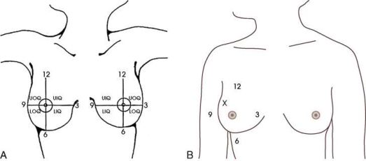
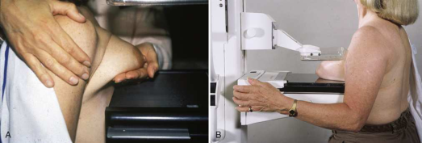
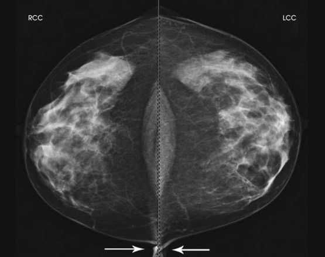

# Rx Mamografie — Cranio-Caudală (CC) or 10 × 12 inches (24 × 30 cm). (Merrill)

  📷 Radiografie Convențională (Rx)
  <strong>Actualizat:</strong> 2026-09-16
  <strong>Autor:</strong> Referință Merrill

---

-   __1. Rezumat Clinic & Indicații__

    ---

    === "Indicații Clinice"

        - Conform reperelor anatomice standard din tratat

    === "Ghid Național IRIS"

        !!! info "Referință Primară: Ghidul Național IRIS (Ordinul MS 1342/2012)"
            - **Capitol Ghid IRIS:** *Ghidul Național IRIS*
            - **Grad de Recomandare:** **De verificat pe indicație; fără grad atribuit automat**
            - **Nivel de Iradiere Estimată:** `De verificat pentru examinarea și populația selectate`

            [:octicons-search-16: Deschide Ghidul IRIS](../../iris.md){ .md-button .md-button--primary } [:material-open-in-new: Aplicația Oficială PWA](https://radiologie-pediatrica.ro/iris/){ .md-button target="_blank" rel="noopener" }
-   __2. Poziționare & Centrare Fascicul__

    ---

    - **Poziție Pacient:** Se instruiește pacientul să stand facing receptorul de imagine, cu her picioare pointing perpendicular pe Mamografie unit. If pacientul este unable la stand pentru duration de exam, Se instruiește pacientul să Poziție Șezândă pe adjustable stool facing unit.; While în ortostatism pe medial side de Mamografie (Sân) la fie imaged, elevate inframammary fold la its maximal height. se ajustează height de C-braț la level de inferior surface de pacientul’s Mamografie (Sân). Se instruiește pacientul să lean slightly forward de la waist. Use ambele mâini la pull Mamografie (Sân) gently onto receptorul de imagine surface, while instructing pacientul la press thorax pe / sprijinit de receptorul de imagine. Drape opposite Mamografie (Sân) over corner de receptorul de imagine. This maneuver improves demonstration de medial tissue. Se instruiește pacientul să hold onto grab bar cu contralateral Mână; this helps steady pacientul ca you continue positioning. Keep Mamografie (Sân) perpendicular pe Torace perete. technologist trebuie să use his sau her fingertips la pull inferior posterior tissue gently forward onto receptorul de imagine. se centrează Mamografie (Sân) over AEC detector, cu nipple în profile if possible. se imobilizează Mamografie (Sân) cu one Mână, while taking care nu la remove this Mână until compression begins. While placing your braț pe / sprijinit de pacient’s back cu your Mână pe Umăr de afected side, make certain pacientul’s Umăr este relaxat și în extern rotație. se rotește pacient’s cap away de la afected side, și se sprijină pacientul’s cap pe / sprijinit de face guard. Make certain that fără other objects such ca jewelry sau hair obstruct path de fascicul. cu your Mână pe pacientul’s Umăr, gently slide skin up over Claviculă. Using Mână that este anchoring pacientul’s Mamografie (Sân), pull lateral tissue onto receptorul de imagine fără sacrificing medial tissue. While menținerea Mamografie (Sân) în place, use that same Mână la smooth skin wrinkles anteriorly spre nipple. Inform pacientul that compression de Mamografie (Sân) will begin. Using Picior pedal compression controls, bring compression paddle into contact cu Mamografie (Sân) while sliding Mână spre nipple. Slowly apply compression manually until Mamografie (Sân) feels taut. Check medial și lateral aspects de Mamografie (Sân) pentru adecvat compression. Se instruiește pacientul să indicate whether compression becomes uncomfortable. After full compression este achieved și checked, Se instruiește pacientul să stop respirație (Fig. 18.28). Se declanșează expunerea. Se decomprimă sânul imediat după efectuarea expunerii.
    - **Punct de Centrare Fascicul:** perpendicular pe base de Mamografie (Sân)
    - **Distanță Focar-Film (DFF / SID):** Nespecificat în fragmentul extras; de verificat în sursă
    - **Comandă Respiratorie:** Conform reperelor anatomice standard din tratat

-   __3. Parametri Tehnici Expunere__

    ---

    | Parametru Tehnic | Valoare Configurare Generator / Tub |
    |:-----------------|:-------------------------------------|
    | **Tensiune Tub (kV)** | DE CONFIGURAT PE APARAT |
    | **Sarcină / Produs Curent-Timp (mAs)** | DE CONFIGURAT PE APARAT |
    | **Distanță Focar-Film (DFF / SID)** | Nespecificat în fragmentul extras; de verificat în sursă |
    | **Grilă Antidifuzoare (Bucky)** | DE CONFIGURAT PE APARAT |
    | **Dimensiune Focar** | DE CONFIGURAT PE APARAT |
    | **Camere de Ionizare AEC** | DE CONFIGURAT PE APARAT |
    | **Colimare Fascicul** | Conform reperelor anatomice standard din tratat |
    | **Filtrare Tub** | DE CONFIGURAT PE APARAT |

-   __4. Criterii de Calitate & Reușită Imagine__

    ---

    - following trebuie să fie clearly vizualizat:
    - PNL extending posteriorly la edge de imagine și measuring within ⅓ inch (1 cm) de depth de PNL pe MLO incidență (see Fig. 18.29)
    - toate medial tissue, ca vizualizat prin visualization de medial retroglandular fat și absence de fibroglandular tissue extending la posteromedial edge de imagine
    - Nipple în profile (if possible) și la midline, indicating fără exaСeration de positioning
    - pentru emphasis de medial tissue, some lateral tissue poate fie excluded.
    - Pectoral muscle seen posterior la medial retroglandular fat în about 30% de properly poziționat CC imagini
    - Slight medial skin reflection la cleavage, ensuring adecvat inclusion de posterior medial tissue
    - Uniform tissue expunere if compression este adecvat

-   __5. Protecție Radiologică (ALARA)__

    ---

    - Nespecificat în fragmentul extras; de verificat în sursă

!!! note "Observații Clinice & Tehnice"
    Conform reperelor anatomice standard din tratat

### 🖼️ Imagini

<figure class="protocol-image-card" markdown>

<figcaption><strong>Merrill — pagina PDF 1353, imaginea 1</strong> — Imagine din fragmentul sursă; asocierea necesită revizie.</figcaption>

</figure>

<figure class="protocol-image-card" markdown>

<figcaption><strong>Merrill — pagina PDF 1354, imaginea 2</strong> — Imagine din fragmentul sursă; asocierea necesită revizie.</figcaption>

</figure>

<figure class="protocol-image-card" markdown>

<figcaption><strong>Merrill — pagina PDF 1355, imaginea 3</strong> — Imagine din fragmentul sursă; asocierea necesită revizie.</figcaption>

</figure>

=== "Ghid Rapid de Execuție"

    1. **Identificarea și verificarea pacientului:** verificare identitate, zonă de examinat, consimțământ conform procedurii și evaluarea posibilității unei sarcini, când este relevantă.
    2. **Pregătire:** îndepărtarea oricăror obiecte radiopace (bijuterii, agrafe, fermoare, proteze, pansamente dense).
    3. **Poziționare precisă:** alinierea receptorului de imagine și a tubului la distanța prescrisă (Nespecificat în fragmentul extras; de verificat în sursă).
    4. **Colimare strictă:** adaptarea fasciculului strict la regiunea de diagnostic pentru scăderea iradierii și reducerea radiației difuze.
    5. **Radioprotecție:** verificarea [politicii RX](../radioprotectie.md), cu măsuri distincte pentru pacient, personal și însoțitor.

## Surse de documentare

- [Merrill’s Atlas, 18. Mammography, pagini PDF 1353–1355](../../assets/protocols/sources/a56d45c16829_Merrills_Atlas_of_Radiographic_Positioning__Procedures_3Vol_Set.pdf#page=1353)

## Fragmente sursă traduse (referință tehnică)

### anatomy

CC incidență shows central, subareolar, și medial fibroglandular breast tissue. pectoral muscle este vizualizat în approximately 30% de
toate CC imagini. 20, 21

### cr

• perpendicular pe base de breast

### criteria

following trebuie să fie clearly vizualizat:
• PNL extending posteriorly la edge de imagine și measuring within ⅓ inch (1 cm) de depth de PNL pe MLO
incidență (see Fig. 18.29)
• toate medial tissue, ca vizualizat prin visualization de medial retroglandular fat și absence de fibroglandular tissue extending la posteromedial edge de imagine
• Nipple în profile (if possible) și la midline, indicating fără exaСeration de positioning
• pentru emphasis de medial tissue, some lateral tissue poate fie excluded.
• Pectoral muscle seen posterior la medial retroglandular fat în about 30% de properly poziționat CC imagini
• Slight medial skin reflection la cleavage, ensuring adecvat inclusion de posterior medial tissue
• Uniform tissue expunere if compression este adecvat

### part_pos

• While în ortostatism pe medial side de breast la fie imaged, elevate inframammary fold la its maximal height.
• se ajustează height de C-braț la level de inferior surface de pacientul’s breast.
• Se instruiește pacientul să lean slightly forward de la waist. Use ambele mâini la pull breast gently onto receptorul de imagine surface, while instructing
pacientul la press thorax pe / sprijinit de receptorul de imagine.
• Drape opposite breast over corner de receptorul de imagine. This maneuver improves demonstration de medial tissue.
• Se instruiește pacientul să hold onto grab bar cu contralateral mână; this helps steady pacientul ca you continue positioning.
• Keep breast perpendicular pe chest perete. technologist trebuie să use his sau her fingertips la pull inferior posterior tissue
gently forward onto receptorul de imagine.
• se centrează breast over AEC detector, cu nipple în profile if possible.
• se imobilizează breast cu one mână, while taking care nu la remove this mână until compression begins.
• While placing your braț pe / sprijinit de pacient’s back cu your mână pe umăr de afected side, make certain pacientul’s
umăr este relaxat și în extern rotație.
• se rotește pacient’s cap away de la afected side, și se sprijină pacientul’s cap pe / sprijinit de face guard.
• Make certain that fără other objects such ca jewelry sau hair obstruct path de fascicul.
• cu your mână pe pacientul’s umăr, gently slide skin up over clavicle.
• Using mână that este anchoring pacientul’s breast, pull lateral tissue onto receptorul de imagine fără sacrificing medial tissue. While menținerea
breast în place, use that same mână la smooth skin wrinkles anteriorly spre nipple.
• Inform pacientul that compression de breast will begin. Using picior pedal compression controls, bring compression paddle into
contact cu breast while sliding mână spre nipple.
• Slowly apply compression manually until breast feels taut.
• Check medial și lateral aspects de breast pentru adecvat compression.
• Se instruiește pacientul să indicate whether compression becomes uncomfortable.
• After full compression este achieved și checked, Se instruiește pacientul să stop respirație (Fig. 18.28).
• Se declanșează expunerea.
• Se decomprimă sânul imediat după efectuarea expunerii.

### patient_pos

• Se instruiește pacientul să stand facing receptorul de imagine, cu her picioare pointing perpendicular pe mammography unit. If pacientul este unable la stand
pentru duration de exam, Se instruiește pacientul să așezat pe scaun pe adjustable stool facing unit.

