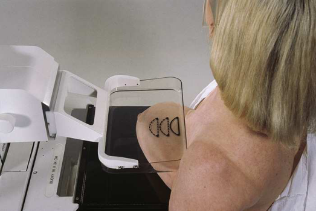
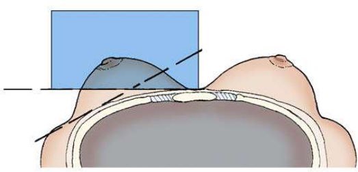
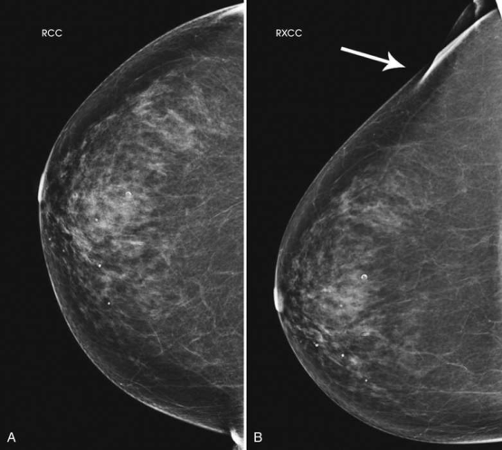
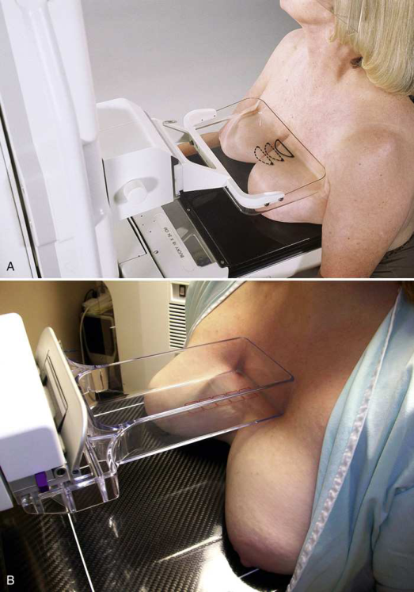
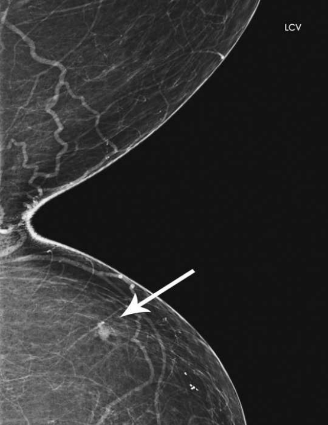
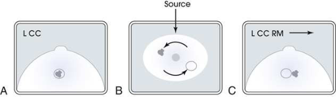
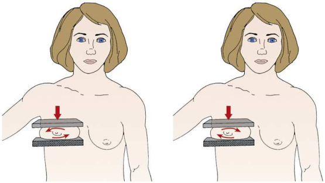
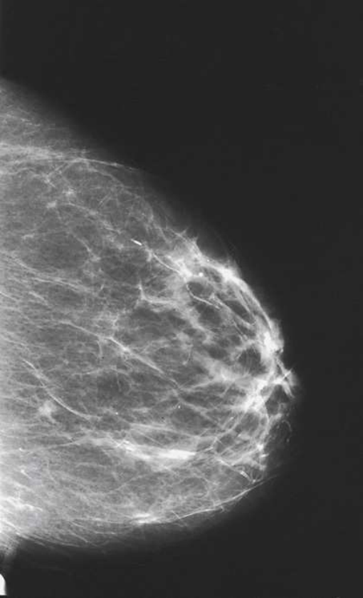

# Rx Mamografie — Cranio-Caudală Exagerată (XCCL) or 10 × 12 inches (24 × 30 cm). (Merrill)

  📷 Radiografie Convențională (Rx)
  <strong>Actualizat:</strong> 2026-09-16
  <strong>Autor:</strong> Referință Merrill

---

-   __1. Rezumat Clinic & Indicații__

    ---

    === "Indicații Clinice"

        - Conform reperelor anatomice standard din tratat

    === "Ghid Național IRIS"

        !!! info "Referință Primară: Ghidul Național IRIS (Ordinul MS 1342/2012)"
            - **Capitol Ghid IRIS:** *Ghidul Național IRIS*
            - **Grad de Recomandare:** **De verificat pe indicație; fără grad atribuit automat**
            - **Nivel de Iradiere Estimată:** `De verificat pentru examinarea și populația selectate`

            [:octicons-search-16: Deschide Ghidul IRIS](../../iris.md){ .md-button .md-button--primary } [:material-open-in-new: Aplicația Oficială PWA](https://radiologie-pediatrica.ro/iris/){ .md-button target="_blank" rel="noopener" }
-   __2. Poziționare & Centrare Fascicul__

    ---

    - **Poziție Pacient:** Se instruiește pacientul să stand facing receptorul de imagine sau se așază pacientul pe scaun pe adjustable stool facing unit. Se instruiește pacientul să stand facing receptorul de imagine sau se așază pacientul pe scaun pe adjustable stool facing unit Se instruiește pacientul să stand facing receptorul de imagine sau se așază pacientul pe scaun pe adjustable stool facing unit.; contralateral side trebuie să fie turned away de la receptorul de imagine. lateral aspect de ipsilateral Mamografie (Sân) trebuie să fie cel mai apropiat de receptorul de imagine. Elevate inframammary fold la its maximal height. se ajustează height de C-braț accordingly. Use one Mână la scoop inferior și posterior Mamografie (Sân) tissue up de la inframammary fold și place Mamografie (Sân) onto receptorul de imagine. This trebuie să fie done cu technologist’s drept Mână when stâng Mamografie (Sân) este poziționat, și cu stâng Mână when drept Mamografie (Sân) este poziționat. Use ambele mâini la pull Mamografie (Sân) gently onto receptorul de imagine while instructing pacientul la press thorax pe / sprijinit de Mamografie (Sân) tray. Slightly se rotește pacient medially la place lateral aspect de Mamografie (Sân) pe receptorul de imagine. Place braț pe / sprijinit de pacient’s back cu Mână pe Umăr de afected side, ensuring that Umăr este relaxat în extern rotație. Slightly se rotește pacient’s cap away de la afected side. Se instruiește pacientul să lean spre machine și rest capul pe / sprijinit de face guard. se rotește C-braț assembly mediolaterally approximately 5 grade, if necessary, la eliminate overlapping de cap humeral. Se informează pacienta cu privire la aplicarea compresiei pe glanda mamară. Smooth și flatten Mamografie (Sân) tissue spre nipple while bringing compression paddle into contact cu Mamografie (Sân). Se aplică progresiv compresia până când glanda mamară este ferm fixată. Se instruiește pacientul să indicate if compression becomes uncomfortable. When full compression este achieved, move AEC detector la appropriate poziție if necessary, și Se instruiește pacientul să stop respirație (Figs. 18.50 și 18.51). Se declanșează expunerea. Se decomprimă sânul imediat după efectuarea expunerii. Turn AEC off, și preselect manual technique. radiographer poate use AEC only if enough Mamografie (Sân) tissue este poziționat over AEC detector. cleavage poate fie intentionally ofset pentru this purpose. Determine corect height de Mamografie (Sân) tray prin elevating inframammary fold la its maximal height. se ajustează height de C-braț accordingly. Lift și pull ambele breasts gently forward onto receptorul de imagine while instructing pacientul la press thorax pe / sprijinit de receptorul de imagine. Pull ca much medial Mamografie (Sân) tissue ca possible onto receptorul de imagine. Slightly se rotește pacient’s cap away de la afected side. Se instruiește pacientul să lean spre machine și rest capul pe / sprijinit de face guard. Se instruiește pacientul să hold grip bars cu ambele mâini la keep în poziție pe receptorul de imagine. Raise height de receptorul de imagine slightly la loosen superior tissue. Place one Mână la nivelul pacientul’s incizură jugulară (furculiță sternală), și then slide Mână down pacientul’s Torace while pulling forward ca much deep medial tissue ca possible. Se informează pacienta cu privire la aplicarea compresiei pe glanda mamară. Bring compression paddle into contact cu breasts, și slowly apply compression until medial tissue feels taut. Using quadrant compression paddle allows better compression de cleavage area și allows more de aria de interes diagnostic la fie pulled into imaging area. If quadrant paddle este used, collimate la area de compression la better visualize detail de tissue. Se instruiește pacientul să indicate if compression becomes uncomfortable. When full compression este achieved, move AEC detector la appropriate poziție if AEC este used, și Se instruiește pacientul să stop respirație (Fig. 18.53). Se declanșează expunerea. Se decomprimă sânul imediat după efectuarea expunerii. Reposition pacientul’s Mamografie (Sân) în CC incidență. Place mâinile pe opposite surfaces de pacientul’s Mamografie (Sân) (superior/inferior), și roll surfaces în opposite directions. direction de roll este nu important ca long ca mammographer rolls superior surface în one direction și inferior surface în other direction. în sense, mammographer este very gently rotating Mamografie (Sân) approximately 10 la 15 grade (Fig. 18.55). se poziționează pacientul’s Mamografie (Sân) onto receptorul de imagine surface cu lower Mână while menținerea rolled poziție cu upper Mână. Note direction de superior surface roll (lateral [RL] sau medial [RM]) și label imagine accordingly. If superior aspect de Mamografie (Sân) este rolled medially, imagine trebuie să fie labeled RM. Se informează pacienta cu privire la aplicarea compresiei pe glanda mamară. Bring compression paddle into contact cu Mamografie (Sân), și slide Mână out while rolling Mamografie (Sân) tissue. Se aplică progresiv compresia până când glanda mamară este ferm fixată. Se instruiește pacientul să indicate if compression becomes uncomfortable. When full compression este achieved, move AEC detector la appropriate poziție if necessary și Se instruiește pacientul să stop respirație (Fig. 18.56). Se declanșează expunerea. Se decomprimă sânul imediat după efectuarea expunerii.
    - **Punct de Centrare Fascicul:** înclinat 5 grade mediolaterally la base de Mamografie (Sân), if necessary perpendicular pe aria de interes diagnostic sau centrat cleavage perpendicular pe base de Mamografie (Sân)
    - **Distanță Focar-Film (DFF / SID):** Nespecificat în fragmentul extras; de verificat în sursă
    - **Comandă Respiratorie:** Conform reperelor anatomice standard din tratat

-   __3. Parametri Tehnici Expunere__

    ---

    | Parametru Tehnic | Valoare Configurare Generator / Tub |
    |:-----------------|:-------------------------------------|
    | **Tensiune Tub (kV)** | DE CONFIGURAT PE APARAT |
    | **Sarcină / Produs Curent-Timp (mAs)** | DE CONFIGURAT PE APARAT |
    | **Distanță Focar-Film (DFF / SID)** | Nespecificat în fragmentul extras; de verificat în sursă |
    | **Grilă Antidifuzoare (Bucky)** | DE CONFIGURAT PE APARAT |
    | **Dimensiune Focar** | DE CONFIGURAT PE APARAT |
    | **Camere de Ionizare AEC** | DE CONFIGURAT PE APARAT |
    | **Colimare Fascicul** | Conform reperelor anatomice standard din tratat |
    | **Filtrare Tub** | DE CONFIGURAT PE APARAT |

-   __4. Criterii de Calitate & Reușită Imagine__

    ---

    - following trebuie să fie clearly vizualizat:
    - Retroglandular fat well visualized la ensure inclusion de deep fibroglandular Mamografie (Sân) tissue pe lateral aspect de Mamografie (Sân) și lower axillary region
    - Pectoral muscle visualized over lateral Torace perete (Fig. 18.52)
    - cap humeral projected clear de imagine cu use de a 5-grade ML angle
    - Uniform tissue expunere if compression este adecvat following trebuie să fie clearly vizualizat:
    - aria de interes diagnostic over central portion de receptorul de imagine (over AEC detector if possible) cu cleavage slightly de-centrat sau cu cleavage centrat pe receptorul de imagine și manual technique selected (Fig. 18.54)
    - Deep medial tissue de afected Mamografie (Sân)
    - toate medial tissue included, ca vizualizat prin visualization de medial retroglandular fat și absence de orice fibroglandular tissue extending la posteromedial edge de imaged breasts
    - Uniform tissue expunere. It este nu necessary la imagine toate de Mamografie (Sân) tissue pe this incidență. following trebuie să fie clearly vizualizat:
    - Suspected superimposition adequately resolved
    - Suspected lesion în superior sau inferior aspect de Mamografie (Sân)
    - toate medial tissue included, ca vizualizat prin visualization de medial retroglandular fat și absence de fibroglandular tissue extending la posteromedial edge de imagine
    - Nipple în profile și la midline, indicating fără exaСeration de positioning. nipple este used ca point de reference la distinguish location de suspected lesion, if it exists.
    - Some lateral tissue possibly excluded la emphasize medial tissue visualized
    - Slight medial skin reflection la cleavage, ensuring that posterior medial tissue este adequately included
    - Uniform tissue expunere if compression este adecvat

-   __5. Protecție Radiologică (ALARA)__

    ---

    - Nespecificat în fragmentul extras; de verificat în sursă

!!! note "Observații Clinice & Tehnice"
    Conform reperelor anatomice standard din tratat

### 🖼️ Imagini

<figure class="protocol-image-card" markdown>

<figcaption><strong>Merrill — pagina PDF 1381, imaginea 1</strong> — Imagine din fragmentul sursă; asocierea necesită revizie.</figcaption>

</figure>

<figure class="protocol-image-card" markdown>

<figcaption><strong>Merrill — pagina PDF 1381, imaginea 2</strong> — Imagine din fragmentul sursă; asocierea necesită revizie.</figcaption>

</figure>

<figure class="protocol-image-card" markdown>

<figcaption><strong>Merrill — pagina PDF 1382, imaginea 3</strong> — Imagine din fragmentul sursă; asocierea necesită revizie.</figcaption>

</figure>

<figure class="protocol-image-card" markdown>

<figcaption><strong>Merrill — pagina PDF 1383, imaginea 4</strong> — Imagine din fragmentul sursă; asocierea necesită revizie.</figcaption>

</figure>

<figure class="protocol-image-card" markdown>

<figcaption><strong>Merrill — pagina PDF 1385, imaginea 5</strong> — Imagine din fragmentul sursă; asocierea necesită revizie.</figcaption>

</figure>

<figure class="protocol-image-card" markdown>

<figcaption><strong>Merrill — pagina PDF 1386, imaginea 6</strong> — Imagine din fragmentul sursă; asocierea necesită revizie.</figcaption>

</figure>

<figure class="protocol-image-card" markdown>

<figcaption><strong>Merrill — pagina PDF 1386, imaginea 7</strong> — Imagine din fragmentul sursă; asocierea necesită revizie.</figcaption>

</figure>

<figure class="protocol-image-card" markdown>

<figcaption><strong>Merrill — pagina PDF 1388, imaginea 8</strong> — Imagine din fragmentul sursă; asocierea necesită revizie.</figcaption>

</figure>

=== "Ghid Rapid de Execuție"

    1. **Identificarea și verificarea pacientului:** verificare identitate, zonă de examinat, consimțământ conform procedurii și evaluarea posibilității unei sarcini, când este relevantă.
    2. **Pregătire:** îndepărtarea oricăror obiecte radiopace (bijuterii, agrafe, fermoare, proteze, pansamente dense).
    3. **Poziționare precisă:** alinierea receptorului de imagine și a tubului la distanța prescrisă (Nespecificat în fragmentul extras; de verificat în sursă).
    4. **Colimare strictă:** adaptarea fasciculului strict la regiunea de diagnostic pentru scăderea iradierii și reducerea radiației difuze.
    5. **Radioprotecție:** verificarea [politicii RX](../radioprotectie.md), cu măsuri distincte pentru pacient, personal și însoțitor.

## Surse de documentare

- [Merrill’s Atlas, 18. Mammography, pagini PDF 1380–1388](../../assets/protocols/sources/a56d45c16829_Merrills_Atlas_of_Radiographic_Positioning__Procedures_3Vol_Set.pdf#page=1380)

## Fragmente sursă traduse (referință tehnică)

### anatomy

This incidență shows superoinferior incidență de lateral fibroglandular breast tissue și posterior aspect de pectoral muscle. It also
shows sagittal orientation de lateral lesion located în la de breast.
This incidență shows lesions located în deep posteromedial aspect de breast.
This poziție shows separation de superimposed breast tissues (also known ca summation shadow), particularly those seen only pe CC
incidență. poziție also helps determine whether lesion este located în superior sau inferior aspect de breast (Fig. 18.57). Alternatively,
standard CC incidență poate fie performed using spot compression technique, sau cu C-braț assembly rotit 10 la 15 grade
mediolaterally sau lateromedially la eliminate superimposition de breast tissue. These methods sunt often preferred because they allow pentru easier
duplication de incidență during subsequent examinations.

### cr

• înclinat 5 grade mediolaterally la base de breast, if necessary
• perpendicular pe aria de interes diagnostic sau centrat cleavage
• perpendicular pe base de breast

### criteria

following trebuie să fie clearly vizualizat:
• Retroglandular fat well visualized la ensure inclusion de deep fibroglandular breast tissue pe lateral aspect de breast și lower axillary
region
• Pectoral muscle visualized over lateral chest perete (Fig. 18.52)
• cap humeral projected clear de imagine cu use de a 5-grade ML angle
• Uniform tissue expunere if compression este adecvat
following trebuie să fie clearly vizualizat:
• aria de interes diagnostic over central portion de receptorul de imagine (over AEC detector if possible) cu cleavage slightly de-centrat sau cu
cleavage centrat pe receptorul de imagine și manual technique selected (Fig. 18.54)
• Deep medial tissue de afected breast
• toate medial tissue included, ca vizualizat prin visualization de medial retroglandular fat și absence de orice fibroglandular tissue
extending la posteromedial edge de imaged breasts
• Uniform tissue expunere. It este nu necessary la imagine toate de breast tissue pe this incidență.
following trebuie să fie clearly vizualizat:
• Suspected superimposition adequately resolved
• Suspected lesion în superior sau inferior aspect de breast
• toate medial tissue included, ca vizualizat prin visualization de medial retroglandular fat și absence de fibroglandular tissue extending la
posteromedial edge de imagine
• Nipple în profile și la midline, indicating fără exaСeration de positioning. nipple este used ca point de reference la distinguish location de suspected lesion, if it exists.
• Some lateral tissue possibly excluded la emphasize medial tissue visualized
• Slight medial skin reflection la cleavage, ensuring that posterior medial tissue este adequately included
• Uniform tissue expunere if compression este adecvat

### part_pos

• contralateral side trebuie să fie turned away de la receptorul de imagine.
• lateral aspect de ipsilateral breast trebuie să fie cel mai apropiat de receptorul de imagine.
• Elevate inframammary fold la its maximal height.
• se ajustează height de C-braț accordingly.
• Use one mână la scoop inferior și posterior breast tissue up de la inframammary fold și place breast onto receptorul de imagine.
• This trebuie să fie done cu technologist’s drept mână when stâng breast este poziționat, și cu stâng mână when drept breast
este poziționat.
• Use ambele mâini la pull breast gently onto receptorul de imagine while instructing pacientul la press thorax pe / sprijinit de breast tray.
• Slightly se rotește pacient medially la place lateral aspect de breast pe receptorul de imagine.
• Place braț pe / sprijinit de pacient’s back cu mână pe umăr de afected side, ensuring that umăr este relaxat în
extern rotație.
• Slightly se rotește pacient’s cap away de la afected side.
• Se instruiește pacientul să lean spre machine și rest capul pe / sprijinit de face guard.
• se rotește C-braț assembly mediolaterally approximately 5 grade, if necessary, la eliminate overlapping de cap humeral.
• Se informează pacienta cu privire la aplicarea compresiei pe glanda mamară. Smooth și flatten breast tissue spre nipple while bringing
compression paddle into contact cu breast.
• Se aplică progresiv compresia până când glanda mamară este ferm fixată.
• Se instruiește pacientul să indicate if compression becomes uncomfortable.
• When full compression este achieved, move AEC detector la appropriate poziție if necessary, și Se instruiește pacientul să stop
respirație (Figs. 18.50 și 18.51).
• Se declanșează expunerea.
• Se decomprimă sânul imediat după efectuarea expunerii.
• Turn AEC off, și preselect manual technique. radiographer poate use AEC only if enough breast tissue este poziționat over AEC detector. cleavage poate fie intentionally ofset pentru this purpose.
• Determine corect height de breast tray prin elevating inframammary fold la its maximal height.
• se ajustează height de C-braț accordingly.
• Lift și pull ambele breasts gently forward onto receptorul de imagine while instructing pacientul la press thorax pe / sprijinit de receptorul de imagine.
• Pull ca much medial breast tissue ca possible onto receptorul de imagine.
• Slightly se rotește pacient’s cap away de la afected side.
• Se instruiește pacientul să lean spre machine și rest capul pe / sprijinit de face guard.
• Se instruiește pacientul să hold grip bars cu ambele mâini la keep în poziție pe receptorul de imagine.
• Raise height de receptorul de imagine slightly la loosen superior tissue.
• Place one mână la nivelul pacientul’s incizură jugulară (furculiță sternală), și then slide mână down pacientul’s chest while pulling forward ca
much deep medial tissue ca possible.
• Se informează pacienta cu privire la aplicarea compresiei pe glanda mamară. Bring compression paddle into contact cu breasts, și slowly
apply compression until medial tissue feels taut. Using quadrant compression paddle allows better compression de cleavage
area și allows more de aria de interes diagnostic la fie pulled into imaging area. If quadrant paddle este used, collimate la area de
compression la better visualize detail de tissue.
• Se instruiește pacientul să indicate if compression becomes uncomfortable.
• When full compression este achieved, move AEC detector la appropriate poziție if AEC este used, și Se instruiește pacientul să stop
respirație (Fig. 18.53).
• Se declanșează expunerea.
• Se decomprimă sânul imediat după efectuarea expunerii.
• Reposition pacientul’s breast în CC incidență.
• Place mâinile pe opposite surfaces de pacientul’s breast (superior/inferior), și roll surfaces în opposite directions. direction de roll este nu important ca long ca mammographer rolls superior surface în one direction și inferior surface
în other direction. în sense, mammographer este very gently rotating breast approximately 10 la 15 grade (Fig. 18.55).
• se poziționează pacientul’s breast onto receptorul de imagine surface cu lower mână while menținerea rolled poziție cu upper mână.
• Note direction de superior surface roll (lateral [RL] sau medial [RM]) și label imagine accordingly. If superior aspect de
breast este rolled medially, imagine trebuie să fie labeled RM.
• Se informează pacienta cu privire la aplicarea compresiei pe glanda mamară. Bring compression paddle into contact cu breast, și slide mână out while rolling breast tissue.
• Se aplică progresiv compresia până când glanda mamară este ferm fixată.
• Se instruiește pacientul să indicate if compression becomes uncomfortable.
• When full compression este achieved, move AEC detector la appropriate poziție if necessary și Se instruiește pacientul să stop
respirație (Fig. 18.56).
• Se declanșează expunerea.
• Se decomprimă sânul imediat după efectuarea expunerii.

### patient_pos

• Se instruiește pacientul să stand facing receptorul de imagine sau se așază pacientul pe scaun pe adjustable stool facing unit.
• Se instruiește pacientul să stand facing receptorul de imagine sau se așază pacientul pe scaun pe adjustable stool facing unit
• Se instruiește pacientul să stand facing receptorul de imagine sau se așază pacientul pe scaun pe adjustable stool facing unit.

