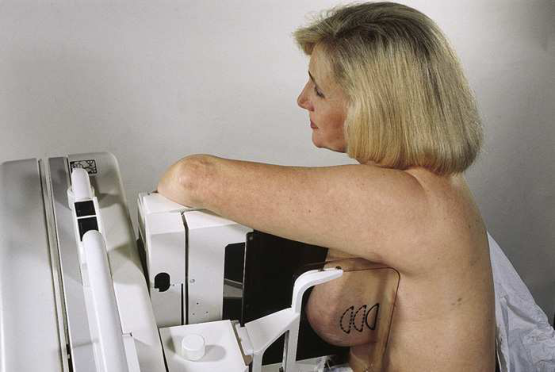
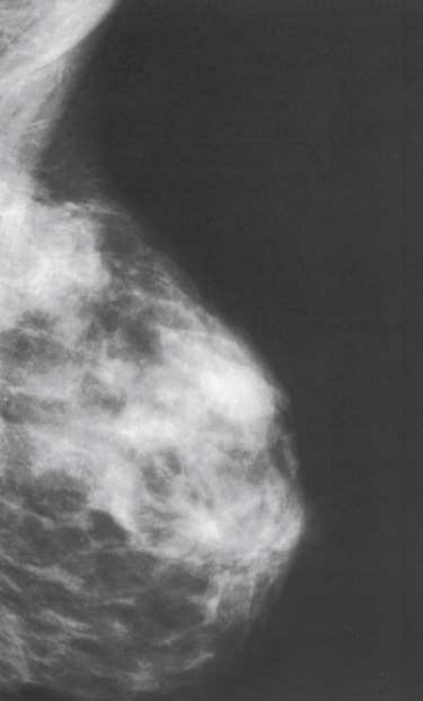

# Rx Mamografie — Oblică Latero-Medială (LMO) or 10 × 12 inches (24 × 30 cm). (Merrill)

  📷 Radiografie Convențională (Rx)
  <strong>Actualizat:</strong> 2026-09-16
  <strong>Autor:</strong> Referință Merrill

---

-   __1. Rezumat Clinic & Indicații__

    ---

    === "Indicații Clinice"

        - Conform reperelor anatomice standard din tratat

    === "Ghid Național IRIS"

        !!! info "Referință Primară: Ghidul Național IRIS (Ordinul MS 1342/2012)"
            - **Capitol Ghid IRIS:** *Ghidul Național IRIS*
            - **Grad de Recomandare:** **De verificat pe indicație; fără grad atribuit automat**
            - **Nivel de Iradiere Estimată:** `De verificat pentru examinarea și populația selectate`

            [:octicons-search-16: Deschide Ghidul IRIS](../../iris.md){ .md-button .md-button--primary } [:material-open-in-new: Aplicația Oficială PWA](https://radiologie-pediatrica.ro/iris/){ .md-button target="_blank" rel="noopener" }
-   __2. Poziționare & Centrare Fascicul__

    ---

    - **Poziție Pacient:** Se instruiește pacientul să stand facing receptorul de imagine sau se așază pacientul pe scaun pe adjustable stool facing unit.; Determine grade de obliquity de C-braț apparatus prin rotating assembly until long edge de receptorul de imagine este paralel cu upper third de pectoral muscle de afected side. raza centrală enters inferior aspect de Mamografie (Sân) de la lateral side. grade de obliquity trebuie să fie între 30 și 60 grade, depending pe corp habitus de pacientul. se ajustează height de C-braț astfel încât superior margine de receptorul de imagine este level cu incizură jugulară (furculiță sternală). Se instruiește pacientul să place opposite Mână pe C-braț. pacientul’s Cot trebuie să fie flectat. Lean pacientul spre C-braț apparatus și press Stern pe / sprijinit de edge de receptorul de imagine, which este slightly de-center spre opposite Mamografie (Sân). Se instruiește pacientul să relax afected Umăr și lean it slightly anterior. Gently pull pacientul’s Mamografie (Sân) și pectoral muscle anteriorly și medially, cu flat surface de Mână poziționat along lateral aspect de Mamografie (Sân). Scoop Mamografie (Sân) tissue up cu Mână, gently grasping Mamografie (Sân) între Degete Mână și Police. se centrează Mamografie (Sân) cu nipple în profile, if possible, și hold Mamografie (Sân) în poziție. Se informează pacienta cu privire la aplicarea compresiei pe glanda mamară. Continue la hold pacientul’s Mamografie (Sân) up și out while sliding Mână spre nipple ca compression paddle este brought into contact cu LOQ de Mamografie (Sân). Se aplică progresiv compresia până când glanda mamară este ferm fixată. Se instruiește pacientul să indicate if compression becomes uncomfortable. Pull down pe pacientul’s abdominal tissue la open inframammary fold. Se instruiește pacientul să rest afected Cot pe top edge de receptorul de imagine. When full compression este achieved, move AEC detector la appropriate poziție, și Se instruiește pacientul să stop respirație (Fig. 18.70). Se declanșează expunerea. Se decomprimă sânul imediat după efectuarea expunerii.
    - **Punct de Centrare Fascicul:** perpendicular pe receptorul de imagine (RI) C-braț apparatus este poziționat la angle determined prin slope de pacientul’s pectoral muscle (30 la 60 grade). actual angle este determined prin pacientul’s corp habitus: Tall, thin pacienți require steep angulation, whereas short, stout pacienți require shallow angulation.
    - **Distanță Focar-Film (DFF / SID):** Nespecificat în fragmentul extras; de verificat în sursă
    - **Comandă Respiratorie:** Conform reperelor anatomice standard din tratat

-   __3. Parametri Tehnici Expunere__

    ---

    | Parametru Tehnic | Valoare Configurare Generator / Tub |
    |:-----------------|:-------------------------------------|
    | **Tensiune Tub (kV)** | DE CONFIGURAT PE APARAT |
    | **Sarcină / Produs Curent-Timp (mAs)** | DE CONFIGURAT PE APARAT |
    | **Distanță Focar-Film (DFF / SID)** | Nespecificat în fragmentul extras; de verificat în sursă |
    | **Grilă Antidifuzoare (Bucky)** | DE CONFIGURAT PE APARAT |
    | **Dimensiune Focar** | DE CONFIGURAT PE APARAT |
    | **Camere de Ionizare AEC** | DE CONFIGURAT PE APARAT |
    | **Colimare Fascicul** | Conform reperelor anatomice standard din tratat |
    | **Filtrare Tub** | DE CONFIGURAT PE APARAT |

-   __4. Criterii de Calitate & Reușită Imagine__

    ---

    - following trebuie să fie clearly vizualizat:
    - medial Mamografie (Sân) tissue clearly visualized (Fig. 18.71)
    - PNL measuring within ⅓ inch (1 cm) de depth de PNL pe CC incidență. (While drawing PNL obliquely, following orientation de Mamografie (Sân) tissue spre pectoral muscle, measure its depth de la nipple la pectoral muscle sau la edge de imagine, whichever comes first.)
    - inferior aspect de pectoral muscle extending la nipple line sau below it if possible
    - Pectoral muscle cu anterior convexity la ensure relaxat Umăr și axilla
    - Nipple în profile if possible
    - Open inframammary fold
    - Deep și superficial Mamografie (Sân) tissues well separated when Mamografie (Sân) este adequately maneuvered up și out de la Torace perete
    - Retroglandular fat well visualized la ensure inclusion de deep fibroglandular Mamografie (Sân) tissue
    - Uniform tissue expunere if compression este adecvat

-   __5. Protecție Radiologică (ALARA)__

    ---

    - Nespecificat în fragmentul extras; de verificat în sursă

!!! note "Observații Clinice & Tehnice"
    Conform reperelor anatomice standard din tratat

### 🖼️ Imagini

<figure class="protocol-image-card" markdown>

<figcaption><strong>Merrill — pagina PDF 1400, imaginea 1</strong> — Imagine din fragmentul sursă; asocierea necesită revizie.</figcaption>

</figure>

<figure class="protocol-image-card" markdown>

<figcaption><strong>Merrill — pagina PDF 1401, imaginea 2</strong> — Imagine din fragmentul sursă; asocierea necesită revizie.</figcaption>

</figure>

=== "Ghid Rapid de Execuție"

    1. **Identificarea și verificarea pacientului:** verificare identitate, zonă de examinat, consimțământ conform procedurii și evaluarea posibilității unei sarcini, când este relevantă.
    2. **Pregătire:** îndepărtarea oricăror obiecte radiopace (bijuterii, agrafe, fermoare, proteze, pansamente dense).
    3. **Poziționare precisă:** alinierea receptorului de imagine și a tubului la distanța prescrisă (Nespecificat în fragmentul extras; de verificat în sursă).
    4. **Colimare strictă:** adaptarea fasciculului strict la regiunea de diagnostic pentru scăderea iradierii și reducerea radiației difuze.
    5. **Radioprotecție:** verificarea [politicii RX](../radioprotectie.md), cu măsuri distincte pentru pacient, personal și însoțitor.

## Surse de documentare

- [Merrill’s Atlas, 18. Mammography, pagini PDF 1399–1401](../../assets/protocols/sources/a56d45c16829_Merrills_Atlas_of_Radiographic_Positioning__Procedures_3Vol_Set.pdf#page=1399)

## Fragmente sursă traduse (referință tehnică)

### anatomy

This incidență shows true reverse incidență de routine MLO incidență și este typically performed la better show medial breast tissue.
It este also performed if routine MLO cannot fie completed because de one sau more de following conditions: pectus excavatum, extreme
kyphosis, post open-heart surgery, prominent pacemaker, men sau women cu prominent pectoralis muscles, sau Port-AীCath/MediPort
(Hickman catheters).

### cr

• perpendicular pe receptorul de imagine (RI)
• C-braț apparatus este poziționat la angle determined prin slope de pacientul’s pectoral muscle (30 la 60 grade). actual
angle este determined prin pacientul’s corp habitus: Tall, thin pacienți require steep angulation, whereas short, stout pacienți require
shallow angulation.

### criteria

following trebuie să fie clearly vizualizat:
• medial breast tissue clearly visualized (Fig. 18.71)
• PNL measuring within ⅓ inch (1 cm) de depth de PNL pe CC incidență. (While drawing PNL obliquely, following orientation de breast tissue spre pectoral muscle, measure its depth de la nipple la pectoral muscle sau la edge de imagine, whichever comes first.)
• inferior aspect de pectoral muscle extending la nipple line sau below it if possible
• Pectoral muscle cu anterior convexity la ensure relaxat umăr și axilla
• Nipple în profile if possible
• Open inframammary fold
• Deep și superficial breast tissues well separated when breast este adequately maneuvered up și out de la chest perete
• Retroglandular fat well visualized la ensure inclusion de deep fibroglandular breast tissue
• Uniform tissue expunere if compression este adecvat

### part_pos

• Determine grade de obliquity de C-braț apparatus prin rotating assembly until long edge de receptorul de imagine este paralel cu
upper third de pectoral muscle de afected side. raza centrală enters inferior aspect de breast de la lateral side. grade de obliquity trebuie să fie între 30 și 60 grade, depending pe corp habitus de pacientul.
• se ajustează height de C-braț astfel încât superior margine de receptorul de imagine este level cu incizură jugulară (furculiță sternală).
• Se instruiește pacientul să place opposite mână pe C-braț. pacientul’s cot trebuie să fie flectat.
• Lean pacientul spre C-braț apparatus și press sternum pe / sprijinit de edge de receptorul de imagine, which este slightly de-center spre opposite breast.
• Se instruiește pacientul să relax afected umăr și lean it slightly anterior. Gently pull pacientul’s breast și pectoral muscle anteriorly
și medially, cu flat surface de mână poziționat along lateral aspect de breast.
• Scoop breast tissue up cu mână, gently grasping breast între fingers și thumb.
• se centrează breast cu nipple în profile, if possible, și hold breast în poziție.
• Se informează pacienta cu privire la aplicarea compresiei pe glanda mamară. Continue la hold pacientul’s breast up și out while sliding mână
spre nipple ca compression paddle este brought into contact cu LOQ de breast.
• Se aplică progresiv compresia până când glanda mamară este ferm fixată.
• Se instruiește pacientul să indicate if compression becomes uncomfortable.
• Pull down pe pacientul’s abdominal tissue la open inframammary fold.
• Se instruiește pacientul să rest afected cot pe top edge de receptorul de imagine.
• When full compression este achieved, move AEC detector la appropriate poziție, și Se instruiește pacientul să stop respirație (Fig.
18.70).
• Se declanșează expunerea.
• Se decomprimă sânul imediat după efectuarea expunerii.

### patient_pos

• Se instruiește pacientul să stand facing receptorul de imagine sau se așază pacientul pe scaun pe adjustable stool facing unit.

