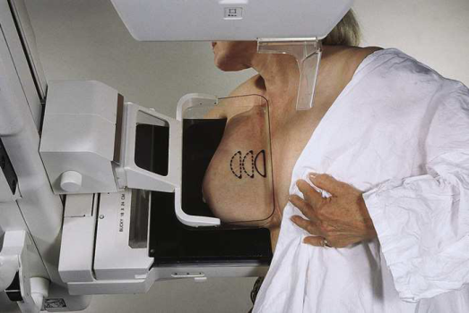
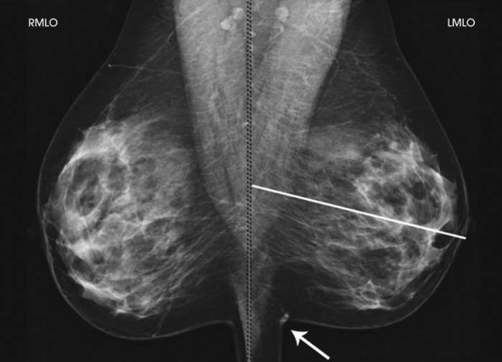

# Rx Mamografie — Oblică Medio-Laterală (MLO) or 10 × 12 inches (24 × 30 cm). (Merrill)

  📷 Radiografie Convențională (Rx)
  <strong>Actualizat:</strong> 2026-09-16
  <strong>Autor:</strong> Referință Merrill

---

-   __1. Rezumat Clinic & Indicații__

    ---

    === "Indicații Clinice"

        - Conform reperelor anatomice standard din tratat

    === "Ghid Național IRIS"

        !!! info "Referință Primară: Ghidul Național IRIS (Ordinul MS 1342/2012)"
            - **Capitol Ghid IRIS:** *Ghidul Național IRIS*
            - **Grad de Recomandare:** **De verificat pe indicație; fără grad atribuit automat**
            - **Nivel de Iradiere Estimată:** `De verificat pentru examinarea și populația selectate`

            [:octicons-search-16: Deschide Ghidul IRIS](../../iris.md){ .md-button .md-button--primary } [:material-open-in-new: Aplicația Oficială PWA](https://radiologie-pediatrica.ro/iris/){ .md-button target="_blank" rel="noopener" }
-   __2. Poziționare & Centrare Fascicul__

    ---

    - **Poziție Pacient:** Se instruiește pacientul să stand facing receptorul de imagine cu her picioare pointed forward sau se așază pacientul pe scaun pe adjustable stool facing unit.; Determine grade de obliquity de C-braț. grade de obliquity trebuie să fie approximately 45 grade but will vary de la 30 la 60 grade, depending pe pacientul’s corp habitus. Draw imaginary line de la pacient’s Umăr la midsternum și angle C- braț la paralel this line. se ajustează height de C-braț astfel încât superior margine de receptorul de imagine este level cu axilla. Se instruiește pacientul să lean slightly forward de la waist. Elevate braț de afected side over corner de receptorul de imagine și rest Mână pe adjacent handgrip. pacientul’s Cot trebuie să fie flectat și resting posterior la receptorul de imagine. Place upper corner de receptorul de imagine ca high ca possible into pacientul’s axilla între pectoral și latissimus dorsi muscles, astfel încât receptorul de imagine este behind pectoral fold. Ensure that pacientul’s afected Umăr este relaxat și leaning slightly anterior. While placing flat surface de Mână along lateral aspect de Mamografie (Sân), gently pull pacientul’s Mamografie (Sân) și pectoral muscle anteriorly și medially. menținerea Mamografie (Sân) între Police și Degete Mână, gently lift it up, out, și away de la Torace perete. se centrează Mamografie (Sân) pe receptorul de imagine cu nipple în profile, if possible, și hold Mamografie (Sân) în poziție. Hold Mamografie (Sân) up și out de la corp prin rotating Mână astfel încât base de Police și heel de Mână support Mamografie (Sân). Inform pacientul that compression de Mamografie (Sân) will begin. Continue la hold Mamografie (Sân) up și out while sliding Mână spre nipple ca compression paddle este brought into contact cu Mamografie (Sân). Loosen skin la Claviculă cu opposite Mână la ensure that posterior tissue este imaged while preventing injury la Umăr. Roll contralateral Umăr spre unit la ensure that medial tissue este visualized. Se aplică progresiv compresia până când glanda mamară este ferm fixată. corner de compression paddle trebuie să fie inferior la Claviculă. Check superior și inferior aspects de Mamografie (Sân) pentru adecvat compression. Se instruiește pacientul să indicate whether compression becomes uncomfortable. Gently pull down pe pacientul’s abdominal tissue la open inframammary fold. Se instruiește pacientul să hold opposite Mamografie (Sân) away de la path de fascicul if necessary. Se instruiește pacientul să lift her chin la clear field de potential artifacts. After full compression este achieved, Se instruiește pacientul să stop respirație (Fig. 18.30). Se declanșează expunerea. Se decomprimă sânul imediat după efectuarea expunerii.
    - **Punct de Centrare Fascicul:** perpendicular pe base de Mamografie (Sân) C-braț apparatus este poziționat la angle determined prin slope de pacientul’s pectoral muscle (30 la 60 grade). actual angle este determined prin pacientul’s corp habitus: Tall, thin pacienți require steep angulation, whereas short, stout pacienți require shallow angulation.
    - **Distanță Focar-Film (DFF / SID):** Nespecificat în fragmentul extras; de verificat în sursă
    - **Comandă Respiratorie:** Conform reperelor anatomice standard din tratat

-   __3. Parametri Tehnici Expunere__

    ---

    | Parametru Tehnic | Valoare Configurare Generator / Tub |
    |:-----------------|:-------------------------------------|
    | **Tensiune Tub (kV)** | DE CONFIGURAT PE APARAT |
    | **Sarcină / Produs Curent-Timp (mAs)** | DE CONFIGURAT PE APARAT |
    | **Distanță Focar-Film (DFF / SID)** | Nespecificat în fragmentul extras; de verificat în sursă |
    | **Grilă Antidifuzoare (Bucky)** | DE CONFIGURAT PE APARAT |
    | **Dimensiune Focar** | DE CONFIGURAT PE APARAT |
    | **Camere de Ionizare AEC** | DE CONFIGURAT PE APARAT |
    | **Colimare Fascicul** | Conform reperelor anatomice standard din tratat |
    | **Filtrare Tub** | DE CONFIGURAT PE APARAT |

-   __4. Criterii de Calitate & Reușită Imagine__

    ---

    - following trebuie să fie clearly vizualizat:
    - PNL measuring within ⅓ inch (1 cm) de depth de PNL pe CC incidență 5, 19
    - While drawing imaginary PNL obliquely following orientation de Mamografie (Sân) tissue spre pectoral muscle, use Degete Mână la measure its depth de la nipple la pectoral muscle sau la edge de imagine, whichever comes first (Fig. 18.31).
    - inferior aspect de pectoral muscle extending la PNL sau below it if possible
    - Pectoral muscle evidențiind anterior convexity la ensure relaxat Umăr și axilla
    - Nipple în profile if possible
    - Open inframammary fold
    - Deep și superficial Mamografie (Sân) tissues well separated when Mamografie (Sân) este adequately maneuvered up și out de la Torace perete
    - Retroglandular fat well visualized la ensure inclusion de deep fibroglandular Mamografie (Sân) tissue
    - Uniform tissue expunere if compression este adecvat

-   __5. Protecție Radiologică (ALARA)__

    ---

    - Nespecificat în fragmentul extras; de verificat în sursă

!!! note "Observații Clinice & Tehnice"
    Conform reperelor anatomice standard din tratat

### 🖼️ Imagini

<figure class="protocol-image-card" markdown>

<figcaption><strong>Merrill — pagina PDF 1356, imaginea 1</strong> — Imagine din fragmentul sursă; asocierea necesită revizie.</figcaption>

</figure>

<figure class="protocol-image-card" markdown>

<figcaption><strong>Merrill — pagina PDF 1357, imaginea 2</strong> — Imagine din fragmentul sursă; asocierea necesită revizie.</figcaption>

</figure>

=== "Ghid Rapid de Execuție"

    1. **Identificarea și verificarea pacientului:** verificare identitate, zonă de examinat, consimțământ conform procedurii și evaluarea posibilității unei sarcini, când este relevantă.
    2. **Pregătire:** îndepărtarea oricăror obiecte radiopace (bijuterii, agrafe, fermoare, proteze, pansamente dense).
    3. **Poziționare precisă:** alinierea receptorului de imagine și a tubului la distanța prescrisă (Nespecificat în fragmentul extras; de verificat în sursă).
    4. **Colimare strictă:** adaptarea fasciculului strict la regiunea de diagnostic pentru scăderea iradierii și reducerea radiației difuze.
    5. **Radioprotecție:** verificarea [politicii RX](../radioprotectie.md), cu măsuri distincte pentru pacient, personal și însoțitor.

## Surse de documentare

- [Merrill’s Atlas, 18. Mammography, pagini PDF 1355–1357](../../assets/protocols/sources/a56d45c16829_Merrills_Atlas_of_Radiographic_Positioning__Procedures_3Vol_Set.pdf#page=1355)

## Fragmente sursă traduse (referință tehnică)

### anatomy

MLO incidență usually shows most de breast tissue, cu emphasis pe lateral aspect și la.

### cr

• perpendicular pe base de breast
• C-braț apparatus este poziționat la angle determined prin slope de pacientul’s pectoral muscle (30 la 60 grade). actual
angle este determined prin pacientul’s corp habitus: Tall, thin pacienți require steep angulation, whereas short, stout pacienți require
shallow angulation.

### criteria

following trebuie să fie clearly vizualizat:
• PNL measuring within ⅓ inch (1 cm) de depth de PNL pe CC incidență 5, 19
• While drawing imaginary PNL obliquely following orientation de breast tissue spre pectoral muscle, use degetele la
measure its depth de la nipple la pectoral muscle sau la edge de imagine, whichever comes first (Fig. 18.31).
• inferior aspect de pectoral muscle extending la PNL sau below it if possible
• Pectoral muscle evidențiind anterior convexity la ensure relaxat umăr și axilla
• Nipple în profile if possible
• Open inframammary fold
• Deep și superficial breast tissues well separated when breast este adequately maneuvered up și out de la toracele perete
• Retroglandular fat well visualized la ensure inclusion de deep fibroglandular breast tissue
• Uniform tissue expunere if compression este adecvat

### part_pos

• Determine grade de obliquity de C-braț. grade de obliquity trebuie să fie approximately 45 grade but will vary de la 30 la 60
grade, depending pe pacientul’s corp habitus. Draw imaginary line de la pacient’s umăr la midsternum și angle C-
braț la paralel this line.
• se ajustează height de C-braț astfel încât superior margine de receptorul de imagine este level cu axilla.
• Se instruiește pacientul să lean slightly forward de la waist.
• Elevate braț de afected side over corner de receptorul de imagine și rest mână pe adjacent handgrip. pacientul’s cot trebuie să fie
flectat și resting posterior la receptorul de imagine.
• Place upper corner de receptorul de imagine ca high ca possible into pacientul’s axilla între pectoral și latissimus dorsi muscles, so that
receptorul de imagine este behind pectoral fold.
• Ensure that pacientul’s afected umăr este relaxat și leaning slightly anterior. While placing flat surface de mână along lateral aspect de breast, gently pull pacientul’s breast și pectoral muscle anteriorly și medially.
• menținerea breast între thumb și fingers, gently lift it up, out, și away de la toracele perete.
• se centrează breast pe receptorul de imagine cu nipple în profile, if possible, și hold breast în poziție.
• Hold breast up și out de la corp prin rotating mână astfel încât base de policele și heel de mână support breast.
• Inform pacientul that compression de breast will begin. Continue la hold breast up și out while sliding mână spre nipple ca compression paddle este brought into contact cu breast. Loosen skin la clavicle cu opposite mână la
ensure that posterior tissue este imaged while preventing injury la umăr. Roll contralateral umăr spre unit la
ensure that medial tissue este visualized.
• Se aplică progresiv compresia până când glanda mamară este ferm fixată. corner de compression paddle trebuie să fie inferior la clavicle.
• Check superior și inferior aspects de breast pentru adecvat compression.
• Se instruiește pacientul să indicate whether compression becomes uncomfortable.
• Gently pull down pe pacientul’s abdominal tissue la open inframammary fold.
• Se instruiește pacientul să hold opposite breast away de la path de fascicul if necessary.
• Se instruiește pacientul să lift her chin la clear field de potential artifacts.
• After full compression este achieved, Se instruiește pacientul să stop respirație (Fig. 18.30).
• Se declanșează expunerea.
• Se decomprimă sânul imediat după efectuarea expunerii.

### patient_pos

• Se instruiește pacientul să stand facing receptorul de imagine cu her picioare pointed forward sau se așază pacientul pe scaun pe adjustable stool facing unit.

