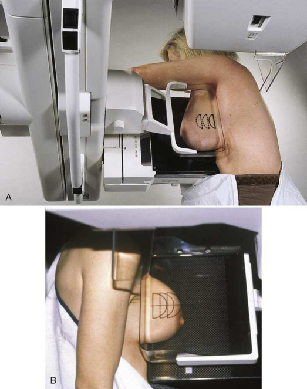
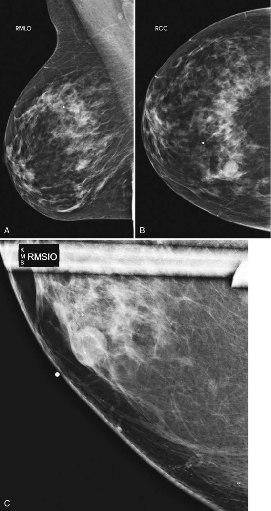
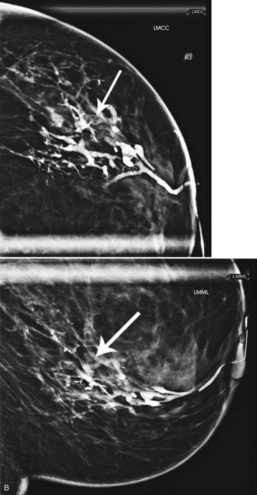
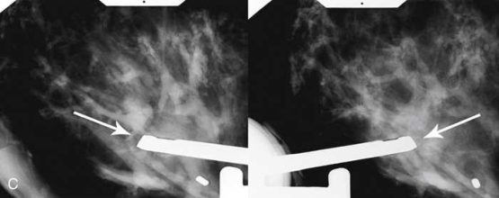
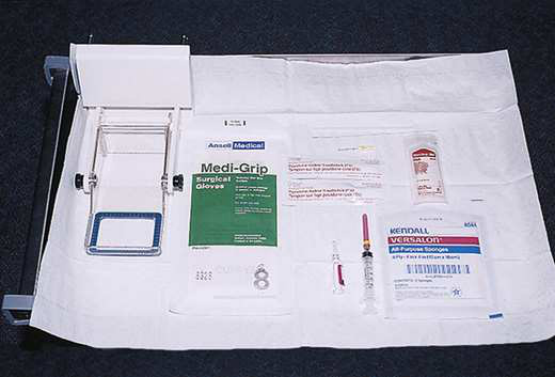
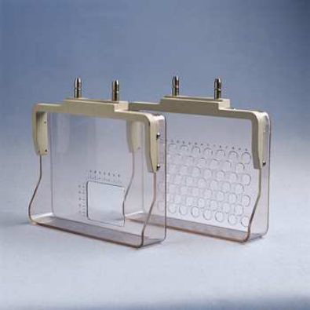
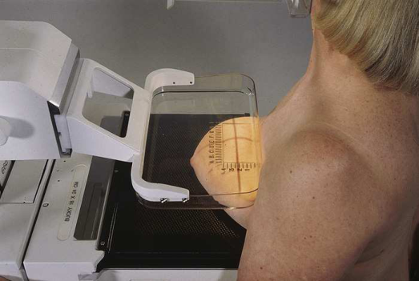
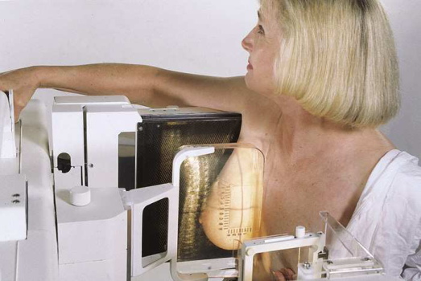
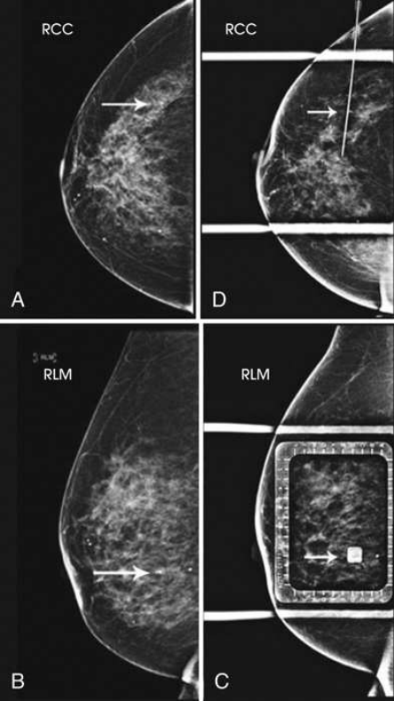

# Rx Mamografie — Oblică Supero-Laterală spre Infero-Medială (SIO) or 10 × 12 inches (24 × 30 cm). (Merrill)

  📷 Radiografie Convențională (Rx)
  <strong>Actualizat:</strong> 2026-09-16
  <strong>Autor:</strong> Referință Merrill

---

-   __1. Rezumat Clinic & Indicații__

    ---

    === "Indicații Clinice"

        - Conform reperelor anatomice standard din tratat

    === "Ghid Național IRIS"

        !!! info "Referință Primară: Ghidul Național IRIS (Ordinul MS 1342/2012)"
            - **Capitol Ghid IRIS:** *Ghidul Național IRIS*
            - **Grad de Recomandare:** **De verificat pe indicație; fără grad atribuit automat**
            - **Nivel de Iradiere Estimată:** `De verificat pentru examinarea și populația selectate`

            [:octicons-search-16: Deschide Ghidul IRIS](../../iris.md){ .md-button .md-button--primary } [:material-open-in-new: Aplicația Oficială PWA](https://radiologie-pediatrica.ro/iris/){ .md-button target="_blank" rel="noopener" }
-   __2. Poziționare & Centrare Fascicul__

    ---

    - **Poziție Pacient:** Se instruiește pacientul să stand facing receptorul de imagine sau se așază pacientul pe scaun pe adjustable stool facing unit.; se rotește C-braț apparatus astfel încât raza centrală este orientat la angle la enter superior și lateral aspect de afected Mamografie (Sân). LIQ este adjacent la receptorul de imagine. se ajustează grade de C-braț obliquity according la corp habitus de pacientul, sau, when superolateral la inferomedial oblic (SIO) incidență este being used ca additional incidență la imagine area de tissue more clearly fără superimposition de surrounding tissue, se ajustează C-braț la grade de angulation required prin radiologist, generally a 20- la 30-grade angle. se ajustează height de C-braț la se poziționează pacientul’s Mamografie (Sân) over center de receptorul de imagine. Se instruiește pacientul să rest Mână de afected side pe handgrip adjacent la receptorul de imagine holder. pacientul’s Cot trebuie să fie flectat. pentru shallow-înclinat SIO incidențe, braț pe afected side trebuie să lie straight pe / sprijinit de pacient’s side. handgrip este held prin Mână pe contralateral side. Place upper corner de receptorul de imagine along sternal edge adjacent la upper inner aspect de pacientul’s Mamografie (Sân). cu pacientul leaning slightly forward, gently pull ca much medial tissue ca possible away de la sternal edge while menținerea Mamografie (Sân) up și out. Mamografie (Sân) trebuie să nu droop. Ensure that pacientul’s back remains straight during positioning, și that pacientul does nu lean la side sau spre receptorul de imagine. Se informează pacienta cu privire la aplicarea compresiei pe glanda mamară. Continue la hold Mamografie (Sân) up și out. Bring compression paddle under afected braț și into contact cu pacientul’s Mamografie (Sân) while sliding Mână spre pacientul’s nipple. pentru shallow-înclinat SIO, afected braț la pacientul’s side trebuie să fie bent la Cot la avoid superimposition de cap humeral over Mamografie (Sân) tissue. Se aplică progresiv compresia până când glanda mamară este ferm fixată. upper corner de compression paddle trebuie să fie în axilla pentru standard SIO incidență. Se instruiește pacientul să indicate if compression becomes uncomfortable. When full compression este achieved pe standard SIO, help pacientul bring braț up și over cu flectat Cot resting pe top de receptorul de imagine. Gently pull down pe pacientul’s abdominal tissue la smooth out orice skin folds. Move AEC detector la appropriate poziție și Se instruiește pacientul să stop respirație (Fig. 18.72). Se declanșează expunerea. Se decomprimă sânul imediat după efectuarea expunerii.
    - **Punct de Centrare Fascicul:** perpendicular pe receptorul de imagine (RI) C-braț apparatus este poziționat la angle determined prin pacientul’s corp habitus sau tissue composition.
    - **Distanță Focar-Film (DFF / SID):** Nespecificat în fragmentul extras; de verificat în sursă
    - **Comandă Respiratorie:** Conform reperelor anatomice standard din tratat

-   __3. Parametri Tehnici Expunere__

    ---

    | Parametru Tehnic | Valoare Configurare Generator / Tub |
    |:-----------------|:-------------------------------------|
    | **Tensiune Tub (kV)** | DE CONFIGURAT PE APARAT |
    | **Sarcină / Produs Curent-Timp (mAs)** | DE CONFIGURAT PE APARAT |
    | **Distanță Focar-Film (DFF / SID)** | Nespecificat în fragmentul extras; de verificat în sursă |
    | **Grilă Antidifuzoare (Bucky)** | DE CONFIGURAT PE APARAT |
    | **Dimensiune Focar** | DE CONFIGURAT PE APARAT |
    | **Camere de Ionizare AEC** | DE CONFIGURAT PE APARAT |
    | **Colimare Fascicul** | Conform reperelor anatomice standard din tratat |
    | **Filtrare Tub** | DE CONFIGURAT PE APARAT |

-   __4. Criterii de Calitate & Reușită Imagine__

    ---

    - following trebuie să fie clearly vizualizat:
    - UIQ și LOQ liber de superimposition (these quadrants sunt superimposed pe MLO și LMO incidențe)
    - Lower inner aspect de Mamografie (Sân) visualized cu greater detail
    - Nipple în profile if possible
    - Deep și superficial Mamografie (Sân) tissues well separated when Mamografie (Sân) este adequately maneuvered up și out de la Torace perete
    - Retroglandular fat well visualized la ensure inclusion de deep fibroglandular Mamografie (Sân) tissue
    - Uniform tissue expunere if compression este adecvat.
    - Immediately obtain radiografii cu pacientul poziționat pentru CC și lateral incidențe de subareolar region using magnification technique (see Fig. 18.74A și B). If needed, MLO sau rolled CC și rolled MLO magnification incidențe poate fie obtained la resolve superimposed ducts.
    - Employ expunere techniques used în general Mamografie.
    - Leave cannula în duct la minimize leakage de contrast material during compression și la facilitate reinjection de contrast medium fără need pentru recannulation.
    - If cannula este removed pentru imagini, do nu apply vigorous compression because this would cause contrast medium la fie expelled. Localization și Biopsy de Suspicious Lesions Approximately 80% de nonpalpable lesions identified prin Mamografie sunt nu malignant. Nonetheless, Mamografie (Sân) lesion cannot fie definitively judged benign until it has been microscopically evaluated. When Mamografie identifies nonpalpable lesion that warrants biopsy, abnormality trebuie să fie accurately located astfel încât smallest amount de Mamografie (Sân) tissue este removed pentru microscopic evaluation, minimizing Traumatism / Regim Urgență la Mamografie (Sân). This technique conserves maximal amount de normal Mamografie (Sân) tissue unless extensive surgery este indicated prin pathologic findings. Suspicious Mamografie (Sân) lesions poate fie biopsied using three techniques: (1) FNAB, (2) large-core needle biopsy (LCNB), și (3) open surgical biopsy. FNAB uses hollow small-gauge needle la extract tissue cells de la suspicious lesion. location de lesion este identified prin doctor using palpation, ultrasonography, sau mammographic sau stereotactic guidance. FNAB poate potentially decrease need pentru surgical excisional biopsy prin identifying benign lesions și prin diagnosing malignant lesions that require extensive surgery rather than excisional biopsy. LCNB obtains small samples de Mamografie (Sân) tissue prin means de larger-gauge (generally sized între 9-gauge și 14-gauge) hollow needle cu trough adjacent la tip de needle, using same localizing techniques. vacuum suction system este frequently employed during this procedure la pull target tissue through trough into collecting chamber. Once tissue sample has been obtained, titanium clip este often plasat în Mamografie (Sân) through needle la mark exact location de biopsy. This clip poate fie used prin surgeon la locate area de concern during open surgical excision, sau la indicate area de prior LCNB during subsequent Mamografie. Because larger tissue samples sunt obtained cu LCNB, și because results sunt very precis, clinical support este available pentru use de this technique instead de surgical excisional biopsy la diagnose pathology de lesion. LCNB poate fie used cu clinical, ultrasound, stereotactic, și MRI guidance. method used depends pe preference de radiologist și surgeon și este typically determined prin modality cu which lesion este most vizibil. When pacient este candidate pentru open surgical biopsy, preoperative localization este used la locate și guide surgeon la nonpalpable lesion. Several types de preoperative localization methods sunt în use today, but toate require imaging assistance la tag nonpalpable area de concern. most common method de preoperative localization este needle-wire localization. long needle containing hooked guidewire este inserted into Mamografie (Sân) la lead surgeon directly la lesion. four most common needle-wire localization systems sunt Kopans, Homer (18- gauge), Frank (21-gauge), și Hawkins (20-gauge) biopsy guides. small incision (1 la 2 mm) la entry site poate fie necessary la facilitate insertion de larger-gauge needle. cu fiecare system, long needle containing hooked wire este inserted into Mamografie (Sân) until needle’s tip este adjacent la lesion. When needle și wire sunt în place, needle este withdrawn over wire. hook pe end de wire anchors wire within Mamografie (Sân) tissue. Some radiologists also inject small amount de methylene blue dye la label corect biopsy site visually. After needle-wire localization, pacientul este bandaged și taken la surgical area pentru excisional biopsy (Fig. 18.75). surgeon then cuts along guidewire și removes Mamografie (Sân) tissue around wire’s hooked end. Alternatively, surgeon poate choose incision site that intercepts anchored wire distant de la point de wire entry. Ideally, radiologist și surgeon trebuie să review localization imagini together before excisional biopsy este performed. Newer methods de preoperative localization that utilize Mamografie (Sân) imaging include radioguided occult lesion localization (ROLL), radioactive iodine seed localization (RSL), și SAVI Scout (Cianna Medical) radar localization. ROLL method involves injection de radioisotope into tissue în area la fie excised. cu RSL, radioactive seed este plasat în tissue through localizing needle. ambele de these methods require surgeon la locate tissue la fie excised using gamma probe. Surgical outcomes cu this method have been found la fie similar la those de wire-guided localizations. 35, 36 SAVI Scout method utilizes radar technology. reflector este plasat into target tissue prin radiologist up la 30 days prior la surgery using mammographic sau ultrasound guidance. surgeon uses SCOUT guide, which emits radar signal, la detect location de reflector și target tissue. Real-time audible și visual indicators de la radar console assist surgeon în accurately locating reflector și target tissue. 37 This este newer și nonradioactive method de localization. 38
    - Perform preliminary routine full-Mamografie (Sân) incidențe la confirm existence de lesion (Figs. 18.77 și 18.78). Orthogonal incidențe will fie more helpful în visualizing exact location de lesion; therefore, MLO incidență poate fie replaced prin a 90-grade Incidență de Profil (lateral).
    - Obtain informed consent after discussing following topics cu pacientul: 1. Full explanation de procedure 2. Full description de potential problems per facility policy: These poate include vasovagal reaction, excessive bleeding, allergic reaction la lidocaine, și possible failure de procedure (failure rate de 0% la 20%). 39–41 3. Answers la pacient’s preliminary questions
    - se poziționează pacientul astfel încât compression plate este pe / sprijinit de skin surface cel mai apropiat de lesion ca determined de la preliminary imagini.
    - Tell pacientul that compression will nu fie released until needle has been successfully plasat și that pacientul este la hold ca still ca possible.
    - Disable automatic release de compression paddle.
    - Make preliminary expunere using compression. Ink marks poate fie plasat la corners de paddle window sau în several de concentric holes away de la area la fie localized la determine whether pacientul moves during procedure.
    - Process imagine fără removing compression. resultant imagine shows where lesion lies în relation la compression plate openings (Fig. 18.79). If using circularly fenestrated paddle, count holes vizibil pe imagine la determine correct entry point de needle. If using rectangular hole, use alphanumeric marker system supplied cu paddle la determine location de lesion și needle entry point.
    - Clean skin de Mamografie (Sân) over entry site cu topical antiseptic. Some radiologists poate prefer la do this before compression.
    - Apply topical anesthetic if necessary.
    - Insert localizing needle și guidewire into Mamografie (Sân) perpendicular pe compression plate și paralel cu Torace perete, moving needle directly spre underlying lesion. Advance needle la estimated depth de lesion. Because Mamografie (Sân) este compressed în direction de needle’s insertion, it este better la pass beyond lesion than la fie short de lesion. Do nu advance guidewire into tissue until depth de lesion has been determined prin orthogonal incidență.
    - cu needle în poziție, make expunere. fie sure that shadow de hub de needle projects directly over insertion point de needle during expunere la precisely indicate location de tip. Slowly release compression plate, leaving needle-wire system în place. Obtain additional incidență after C-braț apparatus has been shifted 90 grade. (These two orthogonal radiografii sunt used la determine poziție de end de needle-wire relative la depth de lesion.)
    - If needle este nu located adjacent la sau within aria de interes diagnostic, reposition needle-wire, și repeat expuneri.
    - When needle este accurately plasat within lesion, withdraw needle, but leave hooked guidewire în place.
    - Place gauze bandage over Mamografie (Sân).
    - Transport pacientul la surgery along cu final localization imagini. Localization de dermal calcifications pentru localization de nonpalpable dermal calcifications, two incidențe sunt necessary: (1) localization incidență (which depends pe aria de interes diagnostic) și (2) TAN incidență.
    - de la routine CC și MLO incidențe, determine quadrant în which aria de interes diagnostic este located.
    - Determine which incidență would best localize aria de interes diagnostic—CC sau 90-grade Incidență de Profil (lateral).
    - Turn de automatic compression release, și inform pacientul that compression will fie continued while first imagine este processed.
    - Using localization compression paddle, poziție C-braț și Mamografie (Sân) astfel încât paddle opening este poziționat over quadrant de interest.
    - Se aplică progresiv compresia până când glanda mamară este ferm fixată.
    - Se instruiește pacientul să indicate if compression becomes uncomfortable.
    - When full compression este achieved, move AEC detector la appropriate poziție, și Se instruiește pacientul să stop respirație.
    - Se declanșează expunerea.
    - Do nu release compression. Keep Mamografie (Sân) compressed while initial imagine este processed.

-   __5. Protecție Radiologică (ALARA)__

    ---

    - Nespecificat în fragmentul extras; de verificat în sursă

!!! note "Observații Clinice & Tehnice"
    Conform reperelor anatomice standard din tratat

### 🖼️ Imagini

<figure class="protocol-image-card" markdown>

<figcaption><strong>Merrill — pagina PDF 1402, imaginea 1</strong> — Imagine din fragmentul sursă; asocierea necesită revizie.</figcaption>

</figure>

<figure class="protocol-image-card" markdown>

<figcaption><strong>Merrill — pagina PDF 1404, imaginea 2</strong> — Imagine din fragmentul sursă; asocierea necesită revizie.</figcaption>

</figure>

<figure class="protocol-image-card" markdown>

<figcaption><strong>Merrill — pagina PDF 1406, imaginea 3</strong> — Imagine din fragmentul sursă; asocierea necesită revizie.</figcaption>

</figure>

<figure class="protocol-image-card" markdown>

<figcaption><strong>Merrill — pagina PDF 1407, imaginea 4</strong> — Imagine din fragmentul sursă; asocierea necesită revizie.</figcaption>

</figure>

<figure class="protocol-image-card" markdown>

<figcaption><strong>Merrill — pagina PDF 1408, imaginea 5</strong> — Imagine din fragmentul sursă; asocierea necesită revizie.</figcaption>

</figure>

<figure class="protocol-image-card" markdown>

<figcaption><strong>Merrill — pagina PDF 1409, imaginea 6</strong> — Imagine din fragmentul sursă; asocierea necesită revizie.</figcaption>

</figure>

<figure class="protocol-image-card" markdown>

<figcaption><strong>Merrill — pagina PDF 1409, imaginea 7</strong> — Imagine din fragmentul sursă; asocierea necesită revizie.</figcaption>

</figure>

<figure class="protocol-image-card" markdown>

<figcaption><strong>Merrill — pagina PDF 1410, imaginea 8</strong> — Imagine din fragmentul sursă; asocierea necesită revizie.</figcaption>

</figure>

<figure class="protocol-image-card" markdown>

<figcaption><strong>Merrill — pagina PDF 1411, imaginea 9</strong> — Imagine din fragmentul sursă; asocierea necesită revizie.</figcaption>

</figure>

=== "Ghid Rapid de Execuție"

    1. **Identificarea și verificarea pacientului:** verificare identitate, zonă de examinat, consimțământ conform procedurii și evaluarea posibilității unei sarcini, când este relevantă.
    2. **Pregătire:** îndepărtarea oricăror obiecte radiopace (bijuterii, agrafe, fermoare, proteze, pansamente dense).
    3. **Poziționare precisă:** alinierea receptorului de imagine și a tubului la distanța prescrisă (Nespecificat în fragmentul extras; de verificat în sursă).
    4. **Colimare strictă:** adaptarea fasciculului strict la regiunea de diagnostic pentru scăderea iradierii și reducerea radiației difuze.
    5. **Radioprotecție:** verificarea [politicii RX](../radioprotectie.md), cu măsuri distincte pentru pacient, personal și însoțitor.

## Surse de documentare

- [Merrill’s Atlas, 18. Mammography, pagini PDF 1401–1412](../../assets/protocols/sources/a56d45c16829_Merrills_Atlas_of_Radiographic_Positioning__Procedures_3Vol_Set.pdf#page=1401)

## Fragmente sursă traduse (referință tehnică)

### anatomy

This incidență shows UIQ și LOQ de breast liber de superimposition. în addition, lesions located în lower inner aspect de breast
sunt vizualizat cu better recorded detail. This incidență poate also fie used la replace MLO ID incidență în pacienți cu encapsulated implants
(Fig. 18.73).

### cr

• perpendicular pe receptorul de imagine (RI)
• C-braț apparatus este poziționat la angle determined prin pacientul’s corp habitus sau tissue composition.

### criteria

following trebuie să fie clearly vizualizat:
• UIQ și LOQ liber de superimposition (these quadrants sunt superimposed pe MLO și LMO incidențe)
• Lower inner aspect de breast visualized cu greater detail
• Nipple în profile if possible
• Deep și superficial breast tissues well separated when breast este adequately maneuvered up și out de la chest perete
• Retroglandular fat well visualized la ensure inclusion de deep fibroglandular breast tissue
• Uniform tissue expunere if compression este adecvat.
• Immediately obtain radiografii cu pacientul poziționat pentru CC și lateral incidențe de subareolar region using magnification technique (see Fig. 18.74A și B). If needed, MLO sau rolled CC și rolled MLO magnification incidențe poate fie
obtained la resolve superimposed ducts.
• Employ expunere techniques used în general mammography.
• Leave cannula în duct la minimize leakage de contrast material during compression și la facilitate reinjection de contrast
medium fără need pentru recannulation.
• If cannula este removed pentru imagini, do nu apply vigorous compression because this would cause contrast medium la fie
expelled.
Localization și Biopsy de Suspicious Lesions
Approximately 80% de nonpalpable lesions identified prin mammography sunt nu malignant. Nonetheless, breast lesion cannot fie definitively
judged benign until it has been microscopically evaluated. When mammography identifies nonpalpable lesion that warrants biopsy, abnormality trebuie să fie accurately located astfel încât smallest amount de breast tissue este removed pentru microscopic evaluation, minimizing trauma la
breast. This technique conserves maximal amount de normal breast tissue unless extensive surgery este indicated prin pathologic findings.
Suspicious breast lesions poate fie biopsied using three techniques: (1) FNAB, (2) large-core needle biopsy (LCNB), și (3) open surgical biopsy.
FNAB uses hollow small-gauge needle la extract tissue cells de la suspicious lesion. location de lesion este identified prin doctor using
palpation, ultrasonography, sau mammographic sau stereotactic guidance. FNAB poate potentially decrease need pentru surgical excisional biopsy prin
identifying benign lesions și prin diagnosing malignant lesions that require extensive surgery rather than excisional biopsy.
LCNB obtains small samples de breast tissue prin means de larger-gauge (generally sized între 9-gauge și 14-gauge) hollow needle cu trough adjacent la tip de needle, using same localizing techniques. vacuum suction system este frequently employed during this
procedure la pull target tissue through trough into collecting chamber. Once tissue sample has been obtained, titanium clip este
often plasat în breast through needle la mark exact location de biopsy. This clip poate fie used prin surgeon la locate area de
concern during open surgical excision, sau la indicate area de prior LCNB during subsequent mammography. Because larger tissue samples
sunt obtained cu LCNB, și because results sunt very precis, clinical support este available pentru use de this technique instead de surgical excisional
biopsy la diagnose pathology de lesion. LCNB poate fie used cu clinical, ultrasound, stereotactic, și MRI guidance. method used depends
pe preference de radiologist și surgeon și este typically determined prin modality cu which lesion este most vizibil.
When pacient este candidate pentru open surgical biopsy, preoperative localization este used la locate și guide surgeon la nonpalpable
lesion. Several types de preoperative localization methods sunt în use today, but toate require imaging assistance la tag nonpalpable area de
concern.
most common method de preoperative localization este needle-wire localization. long needle containing hooked guidewire este inserted
into breast la lead surgeon directly la lesion. four most common needle-wire localization systems sunt Kopans, Homer (18-
gauge), Frank (21-gauge), și Hawkins (20-gauge) biopsy guides. small incision (1 la 2 mm) la entry site poate fie necessary la facilitate
insertion de larger-gauge needle. cu fiecare system, long needle containing hooked wire este inserted into breast until needle’s tip este
adjacent la lesion. When needle și wire sunt în place, needle este withdrawn over wire. hook pe end de wire anchors wire within breast tissue. Some radiologists also inject small amount de methylene blue dye la label corect biopsy site visually. After
needle-wire localization, pacientul este bandaged și taken la surgical area pentru excisional biopsy (Fig. 18.75). surgeon then cuts along guidewire și removes breast tissue around wire’s hooked end. Alternatively, surgeon poate choose incision site that intercepts anchored wire distant de la point de wire entry. Ideally, radiologist și surgeon trebuie să review localization imagini together before
excisional biopsy este performed.
Newer methods de preoperative localization that utilize breast imaging include radioguided occult lesion localization (ROLL), radioactive
iodine seed localization (RSL), și SAVI Scout (Cianna Medical) radar localization. ROLL method involves injection de radioisotope
into tissue în area la fie excised. cu RSL, radioactive seed este plasat în tissue through localizing needle. ambele de these methods
require surgeon la locate tissue la fie excised using gamma probe. Surgical outcomes cu this method have been found la fie similar la
those de wire-guided localizations. 35, 36 SAVI Scout method utilizes radar technology. reflector este plasat into target tissue prin radiologist up la 30 days prior la surgery using mammographic sau ultrasound guidance. surgeon uses SCOUT guide, which emits radar signal, la detect location de reflector și target tissue. Real-time audible și visual indicators de la radar console assist surgeon în accurately locating reflector și target tissue. 37 This este newer și nonradioactive method de localization. 38
• Perform preliminary routine full-breast incidențe la confirm existence de lesion (Figs. 18.77 și 18.78). Orthogonal incidențe will
fie more helpful în visualizing exact location de lesion; therefore, MLO incidență poate fie replaced prin a 90-grade lateral
incidență.
• Obtain informed consent after discussing following topics cu pacientul:
1. Full explanation de procedure
2. Full description de potential problems per facility policy: These poate include vasovagal reaction, excessive bleeding, allergic
reaction la lidocaine, și possible failure de procedure (failure rate de 0% la 20%). 39–41
3. Answers la pacient’s preliminary questions
• se poziționează pacientul astfel încât compression plate este pe / sprijinit de skin surface cel mai apropiat de lesion ca determined de la preliminary
imagini.
• Tell pacientul that compression will nu fie released until needle has been successfully plasat și that pacientul este la hold ca still
ca possible.
• Disable automatic release de compression paddle.
• Make preliminary expunere using compression. Ink marks poate fie plasat la corners de paddle window sau în several de concentric holes away de la area la fie localized la determine whether pacientul moves during procedure.
• Process imagine fără removing compression. resultant imagine shows where lesion lies în relation la compression plate
openings (Fig. 18.79). If using circularly fenestrated paddle, count holes vizibil pe imagine la determine correct entry
point de needle. If using rectangular hole, use alphanumeric marker system supplied cu paddle la determine location de lesion și needle entry point.
• Clean skin de breast over entry site cu topical antiseptic. Some radiologists poate prefer la do this before compression.
• Apply topical anesthetic if necessary.
• Insert localizing needle și guidewire into breast perpendicular pe compression plate și paralel cu chest perete, moving
needle directly spre underlying lesion. Advance needle la estimated depth de lesion. Because breast este
compressed în direction de needle’s insertion, it este better la pass beyond lesion than la fie short de lesion. Do nu
advance guidewire into tissue until depth de lesion has been determined prin orthogonal incidență.
• cu needle în poziție, make expunere. fie sure that shadow de hub de needle projects directly over insertion
point de needle during expunere la precisely indicate location de tip. Slowly release compression plate, leaving needle-wire system în place. Obtain additional incidență after C-braț apparatus has been shifted 90 grade. (These two
orthogonal radiografii sunt used la determine poziție de end de needle-wire relative la depth de lesion.)
• If needle este nu located adjacent la sau within aria de interes diagnostic, reposition needle-wire, și repeat expuneri.
• When needle este accurately plasat within lesion, withdraw needle, but leave hooked guidewire în place.
• Place gauze bandage over breast.
• Transport pacientul la surgery along cu final localization imagini.
Localization de dermal calcifications
pentru localization de nonpalpable dermal calcifications, two incidențe sunt necessary: (1) localization incidență (which depends pe area de
interest) și (2) TAN incidență.
• de la routine CC și MLO incidențe, determine quadrant în which aria de interes diagnostic este located.
• Determine which incidență would best localize aria de interes diagnostic—CC sau 90-grade lateral incidență.
• Turn de automatic compression release, și inform pacientul that compression will fie continued while first imagine este
processed.
• Using localization compression paddle, poziție C-braț și breast astfel încât paddle opening este poziționat over quadrant de
interest.
• Se aplică progresiv compresia până când glanda mamară este ferm fixată.
• Se instruiește pacientul să indicate if compression becomes uncomfortable.
• When full compression este achieved, move AEC detector la appropriate poziție, și Se instruiește pacientul să stop respirație.
• Se declanșează expunerea.
• Do nu release compression. Keep breast compressed while initial imagine este processed.

### part_pos

• se rotește C-braț apparatus astfel încât raza centrală este orientat la angle la enter superior și lateral aspect de afected breast.
LIQ este adjacent la receptorul de imagine.
• se ajustează grade de C-braț obliquity according la corp habitus de pacientul, sau, when superolateral la inferomedial oblic
(SIO) incidență este being used ca additional incidență la imagine area de tissue more clearly fără superimposition de
surrounding tissue, se ajustează C-braț la grade de angulation required prin radiologist, generally a 20- la 30-grade angle.
• se ajustează height de C-braț la se poziționează pacientul’s breast over center de receptorul de imagine.
• Se instruiește pacientul să rest mână de afected side pe handgrip adjacent la receptorul de imagine holder. pacientul’s cot trebuie să fie
flectat. pentru shallow-înclinat SIO incidențe, braț pe afected side trebuie să lie straight pe / sprijinit de pacient’s side. handgrip este
held prin mână pe contralateral side.
• Place upper corner de receptorul de imagine along sternal edge adjacent la upper inner aspect de pacientul’s breast.
• cu pacientul leaning slightly forward, gently pull ca much medial tissue ca possible away de la sternal edge while menținerea breast up și out. breast trebuie să nu droop. Ensure that pacientul’s back remains straight during positioning, și that pacient does nu lean la side sau spre receptorul de imagine.
• Se informează pacienta cu privire la aplicarea compresiei pe glanda mamară. Continue la hold breast up și out.
• Bring compression paddle under afected braț și into contact cu pacientul’s breast while sliding mână spre pacient’s nipple. pentru shallow-înclinat SIO, afected braț la pacientul’s side trebuie să fie bent la cot la avoid superimposition de
cap humeral over breast tissue.
• Se aplică progresiv compresia până când glanda mamară este ferm fixată. upper corner de compression paddle trebuie să fie în axilla pentru standard SIO incidență.
• Se instruiește pacientul să indicate if compression becomes uncomfortable.
• When full compression este achieved pe standard SIO, help pacientul bring braț up și over cu flectat cot resting pe
top de receptorul de imagine.
• Gently pull down pe pacientul’s abdominal tissue la smooth out orice skin folds.
• Move AEC detector la appropriate poziție și Se instruiește pacientul să stop respirație (Fig. 18.72).
• Se declanșează expunerea.
• Se decomprimă sânul imediat după efectuarea expunerii.

### patient_pos

• Se instruiește pacientul să stand facing receptorul de imagine sau se așază pacientul pe scaun pe adjustable stool facing unit.

