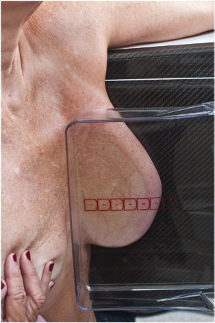
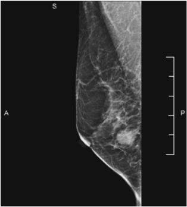

# Rx MEDIOLATERAL (ML) PROJECTION SPECIAL PROJECTIONS (ADDITIONAL VIEWS) (TRUE LATERAL Mamografie (Sân) POSITION)

  📷 Radiografie Convențională (Rx)
  <strong>Actualizat:</strong> 2026-09-15
  <strong>Autor:</strong> Departamentul de Radiologie / Referință Bontrager

---

-   __1. Rezumat Clinic & Indicații__

    ---

    === "Indicații Clinice"

        - Mamografie (Sân) pathologic conditions, especially inflammation or other pathologic changes in the lateral aspect of the Mamografie (Sân).
        - This projection may be requested by the radiologist as an optional projection to confirm an abnormality seen only on MLO.
        - Also useful for evaluating airfluid levels in structures or high concentrations of calcium within a cyst (milk of calcium).

    === "Ghid Național IRIS"

        !!! info "Referință Primară: Ghidul Național IRIS (Ordinul MS 1342/2012)"
            - **Capitol Ghid IRIS:** *Ghidul Național IRIS*
            - **Grad de Recomandare:** **De verificat pe indicație; fără grad atribuit automat**
            - **Nivel de Iradiere Estimată:** `De verificat pentru examinarea și populația selectate`

            [:octicons-search-16: Deschide Ghidul IRIS](../../iris.md){ .md-button .md-button--primary } [:material-open-in-new: Aplicația Oficială PWA](https://radiologie-pediatrica.ro/iris/){ .md-button target="_blank" rel="noopener" }
-   __2. Poziționare & Centrare Fascicul__

    ---

    - **Poziție Pacient:** Pacient: Standing; if not possible, Poziție Șezândă; Regiune anatomică: The tube and IR remain at right angles to each other as CR is angled 90° from vertical. Adjust the IR height to be centered to midbreast. With the patient facing the unit feet forward, place arm of the side being imaged forward and the Mână on the bar toward the front (Fig. 20.71). Pull the Mamografie (Sân) tissue and pectoral muscle anteriorly and medially away from the Torace wall. Push the patient slightly toward the IR until the inferolateral aspect of the Mamografie (Sân) is touching the IR. The nipple should be in profile. Apply compression slowly with the Mamografie (Sân) held away from the Torace wall and up to prevent sagging. After the paddle has passed the Stern, rotate the patient until the Mamografie (Sân) is in a true Incidență de Profil (Lateral). Wrinkles and folds on the Mamografie (Sân) should be smoothed out and compression applied until taut. Open the IMF by pulling the abdominal tissue down. If necessary, have the patient gently retract the opposite Mamografie (Sân) with the other Mână to prevent superimposition. The R or L view marker should be placed high and near the axilla. Positioning Tips For the patient with extra adipose tissue in the upper arm and back—Once the patient is positioned for an MLO, keep one Mână on the Mamografie (Sân) against the IR and take the other arm and pull back on the posterior tissue from around the back of the patient. This will reduce the likelihood of a skin fold. For the upper arm—As you are positioning the arm across the top of the IR, slightly internally roll the arm and pull the fatty tissue (wings) toward the back of the IR. In addition, while applying compression, place your free Mână over the dependent Umăr and pull up on the upper Mamografie (Sân) tissue to reduce the tissue fold that often appears there.
    - **Punct de Centrare Fascicul:** Perpendicular, centered to the base of the Mamografie (Sân), the Torace wall edge of the IR; CR not movable
    - **Distanță Focar-Film (DFF / SID):** 60 cm
    - **Comandă Respiratorie:** Suspend breathing.

-   __3. Parametri Tehnici Expunere__

    ---

    | Parametru Tehnic | Valoare Configurare Generator / Tub |
    |:-----------------|:-------------------------------------|
    | **Tensiune Tub (kV)** | DE CONFIGURAT PE APARAT |
    | **Sarcină / Produs Curent-Timp (mAs)** | DE CONFIGURAT PE APARAT |
    | **Distanță Focar-Film (DFF / SID)** | 60 cm |
    | **Grilă Antidifuzoare (Bucky)** | Cu grilă antidifuzoare Bucky |
    | **Dimensiune Focar** | Focar Mic (0.6 mm) |
    | **Camere de Ionizare AEC** | Camerele laterale (sau camera centrală funcție de regiune) |
    | **Colimare Fascicul** | and CR CR and collimation chamber are fixed and are centered correctly if Mamografie (Sân) tissue is correctly centered and visualized on IR. Exposure Dense areas are adequately penetrated, resulting in optimal contrast. Sharp tissue markings indicate no motion. R and L view markers and patient information are correctly placed at axillary side of IR. No artifacts are visible. Fig. 20.72 ML projection. |
    | **Filtrare Tub** | Totală ≥ 2.5 mm Al echivalent |

-   __4. Criterii de Calitate & Reușită Imagine__

    ---

    - Lateral view of entire Mamografie (Sân) tissue includes axillary region, pectoral muscle, and open IMF (Fig. 20.72). Position and Compression
    - Nipple is seen in profile; tissue thickness is evenly distributed on IR, indicating optimal compression.
    - Axillary Mamografie (Sân) tissue (generally including pectoral muscle) is included, indicating correct centering and IR vertical placement.

-   __5. Protecție Radiologică (ALARA)__

    ---

    - Ecranare gonadică și a organelor radiosensibile conform procedurilor locale de radioprotecție ALARA.
    - Colimare strictă la aria de interes pentru limitarea radiației difuze.
    - Verificarea posibilității unei sarcini la pacientele de vârstă fertilă înainte de expunere.

!!! note "Observații Clinice & Tehnice"
    Position AEC chamber to appropriate position to ensure adequate exposure of various tissue densities. Fig. 20.71 ML projection.

### 🖼️ Imagini

<figure class="protocol-image-card" markdown>

<figcaption><strong>Fig. 20.71 ML projection.</strong> — Poziționare pacient conform Ghidului Bontrager (Fig. 20.71 ML projection.)</figcaption>

</figure>

<figure class="protocol-image-card" markdown>

<figcaption><strong>Fig. 20.72 ML projection.</strong> — Aspect radiografic de referință conform Ghidului Bontrager (Fig. 20.72 ML projection.)</figcaption>

</figure>

=== "Ghid Rapid de Execuție"

    1. **Identificarea și verificarea pacientului:** verificare identitate, zonă de examinat, consimțământ conform procedurii și evaluarea posibilității unei sarcini, când este relevantă.
    2. **Pregătire:** îndepărtarea oricăror obiecte radiopace (bijuterii, agrafe, fermoare, proteze, pansamente dense).
    3. **Poziționare precisă:** alinierea receptorului de imagine și a tubului la distanța prescrisă (60 cm).
    4. **Colimare strictă:** adaptarea fasciculului strict la regiunea de diagnostic pentru scăderea iradierii și reducerea radiației difuze.
    5. **Radioprotecție:** verificarea [politicii RX](../radioprotectie.md), cu măsuri distincte pentru pacient, personal și însoțitor.

## Surse de documentare

- [Bontrager's Textbook of Radiographic Positioning (Ed. 9/10), Pagina 792](https://www.elsevier.com/books/textbook-of-radiographic-positioning-and-related-anatomy/lampignano/978-0-323-65367-1)
