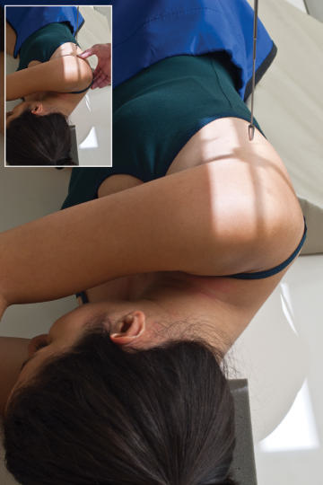
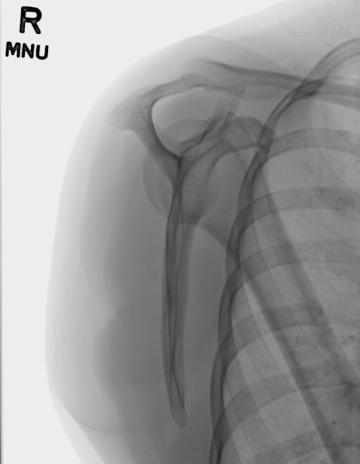

# Rx Omoplat (Scapulă) Profil (Lateral) (PATIENT Decubit)

  📷 Radiografie Convențională (Rx)
  <strong>Actualizat:</strong> 2026-09-15
  <strong>Autor:</strong> Departamentul de Radiologie / Referință Bontrager

---

-   __1. Rezumat Clinic & Indicații__

    ---

    === "Indicații Clinice"

        - suspiciune de fractură de Omoplat (Scapulă)

    === "Ghid Național IRIS"

        !!! info "Referință Primară: Ghidul Național IRIS (Ordinul MS 1342/2012)"
            - **Capitol Ghid IRIS:** *Ghidul Național IRIS*
            - **Grad de Recomandare:** **De verificat pe indicație; fără grad atribuit automat**
            - **Nivel de Iradiere Estimată:** `De verificat pentru examinarea și populația selectate`

            [:octicons-search-16: Deschide Ghidul IRIS](../../iris.md){ .md-button .md-button--primary } [:material-open-in-new: Aplicația Oficială PWA](https://radiologie-pediatrica.ro/iris/){ .md-button target="_blank" rel="noopener" }
-   __2. Poziționare & Centrare Fascicul__

    ---

    - **Poziție Pacient:** Pacient: Perform radiografie cu pacient în Decubit dorsal poziție, și place affected braț across Torace. Palpate articulații acromioclaviculare articulation și superior margine de Omoplat (Scapulă) și rotate pacient until imaginary line între these two points este perpendicular pe receptorul de imagine (RI); this elevates affected Umăr until corp de Omoplat (Scapulă) este în true Incidență de Profil (lateral). Flex Genunchi de affected side la help pacient maintain this oblic corp poziție.; Regiune anatomică: Align pacient pe tabletop so that center de midlateral (axillary) margine de Omoplat (Scapulă) este centrat pe raza centrală și receptorul de imagine (Fig. 5.106). Palpate margini de Omoplat (Scapulă) prin grasping medial și lateral margini de corp de Omoplat (Scapulă) cu Degete Mână și Police (see Fig. 5.106, inset). Carefully adjust corp rotație ca needed la bring plane de scapular corp perpendicular pe receptorul de imagine (RI).
    - **Punct de Centrare Fascicul:** la midscapula lateral margine
    - **Distanță Focar-Film (DFF / SID):** 100 cm
    - **Comandă Respiratorie:** Apnee pe durata expunerii. Omoplat (Scapulă) ROUTINE AP lateral Fig. 5.106 Decubit lateral Omoplat (Scapulă) poziție. Inset shows palpating margini de Omoplat (Scapulă).

-   __3. Parametri Tehnici Expunere__

    ---

    | Parametru Tehnic | Valoare Configurare Generator / Tub |
    |:-----------------|:-------------------------------------|
    | **Tensiune Tub (kV)** | 70-85 kV |
    | **Sarcină / Produs Curent-Timp (mAs)** | DE CONFIGURAT PE APARAT |
    | **Distanță Focar-Film (DFF / SID)** | 100 cm |
    | **Grilă Antidifuzoare (Bucky)** | Cu grilă antidifuzoare Bucky |
    | **Dimensiune Focar** | Focar Mic (0.6 mm) |
    | **Camere de Ionizare AEC** | Camerele laterale (sau camera centrală funcție de regiune) |
    | **Colimare Fascicul** | Field Size Closely collimate la area de Omoplat (Scapulă). |
    | **Filtrare Tub** | Totală ≥ 2.5 mm Al echivalent |

-   __4. Criterii de Calitate & Reușită Imagine__

    ---

    - Entire Omoplat (Scapulă) trebuie să fie visualized în Incidență de Profil (lateral). poziție:
    - True lateral este vizualizat prin direct superimposition de vertebral și lateral margini (Fig. 5.107).
    - corp de Omoplat (Scapulă) trebuie să fie seen în profile, liber de superimposition prin Coaste (Grilaj Costal).
    - ca much ca possible, Humerus trebuie să nu superimpose aria de interes diagnostic de Omoplat (Scapulă).
    - Collimation field size la aria de interes diagnostic. expunere:
    - optim expunere cu fără mișcare evidențiază net bony margini și trabecular markings.
    - Entire Omoplat (Scapulă) trebuie să fie visualized fără decreased imagine quality în area de inferior angle.
    - Bony margini de ambele acromion și coracoid processes trebuie să fie seen through capul de Humerus. Fig. 5.107 Ortostatism lateral Omoplat (Scapulă). (Courtesy Joss Wertz, DO.)

-   __5. Protecție Radiologică (ALARA)__

    ---

    - Ecranare gonadică și a organelor radiosensibile conform procedurilor locale de radioprotecție ALARA.
    - Colimare strictă la aria de interes pentru limitarea radiației difuze.
    - Verificarea posibilității unei sarcini la pacientele de vârstă fertilă înainte de expunere.

!!! note "Observații Clinice & Tehnice"
    This poziție results în magnified imagine because de increased OID.

### 🖼️ Imagini

<figure class="protocol-image-card" markdown>

<figcaption><strong>Fig. 5.106 Decubit lateral Omoplat (Scapulă) poziție. Inset shows palpating</strong> — Poziționare pacient conform Ghidului Bontrager (Fig. 5.106 Recumbent lateral scapula poziție. Inset shows palpating)</figcaption>

</figure>

<figure class="protocol-image-card" markdown>

<figcaption><strong>Fig. 5.107 Ortostatism lateral Omoplat (Scapulă). (Courtesy Joss Wertz, DO.)</strong> — Aspect radiografic de referință conform Ghidului Bontrager (Fig. 5.107 în ortostatism lateral scapula. (Courtesy Joss Wertz, DO.))</figcaption>

</figure>

=== "Ghid Rapid de Execuție"

    1. **Identificarea și verificarea pacientului:** verificare identitate, zonă de examinat, consimțământ conform procedurii și evaluarea posibilității unei sarcini, când este relevantă.
    2. **Pregătire:** îndepărtarea oricăror obiecte radiopace (bijuterii, agrafe, fermoare, proteze, pansamente dense).
    3. **Poziționare precisă:** alinierea receptorului de imagine și a tubului la distanța prescrisă (100 cm).
    4. **Colimare strictă:** adaptarea fasciculului strict la regiunea de diagnostic pentru scăderea iradierii și reducerea radiației difuze.
    5. **Radioprotecție:** verificarea [politicii RX](../radioprotectie.md), cu măsuri distincte pentru pacient, personal și însoțitor.

## Surse de documentare

- [Bontrager's Textbook of Radiographic Positioning (Ed. 9/10), Pagina 222](https://www.elsevier.com/books/textbook-of-radiographic-positioning-and-related-anatomy/lampignano/978-0-323-65367-1)
